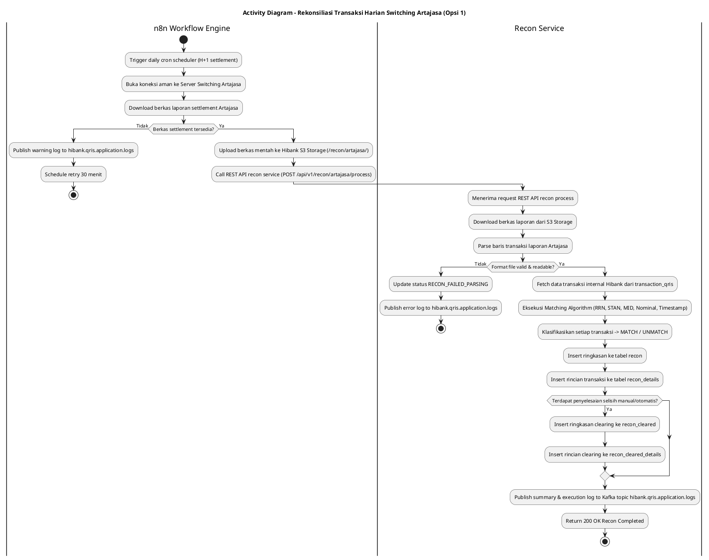
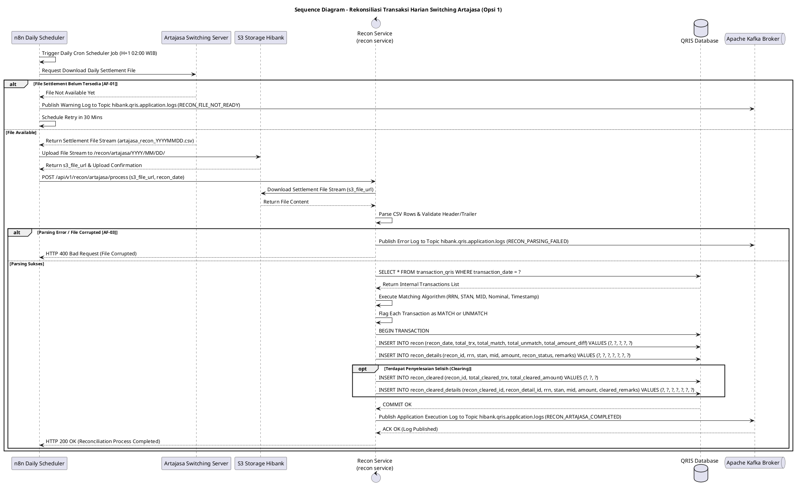

# 1 Deskripsi Use Case

**Tabel 1: Deskripsi Use Case Rekonsiliasi Transaksi Harian Switching Artajasa (Opsi 1)**

| Elemen Spesifikasi | Deskripsi Detail |
| --- | --- |
| ID Use Case | UC-BOH-008 |
| Nama Use Case | Rekonsiliasi Transaksi Harian Switching Artajasa (Opsi 1) |
| Penjelasan Singkat | Proses otomatisasi rekonsiliasi harian Opsi 1 antara Switching Artajasa dan sistem Hibank. Workflow Engine n8n mengunduh berkas settlement harian Artajasa, menyimpannya di S3 Storage, lalu memicu `recon service` untuk mencocokkan data transaksi harian dengan hasil `MATCH` atau `UNMATCH` pada tabel database `transaction_qris`, `recon`, `recon_details`, `recon_cleared`, dan `recon_cleared_details`. |
| Aktor Utama | Sistem (n8n Workflow Engine & Recon Service) |
| Aktor Pendukung | Server Switching Artajasa, Hibank S3 Object Storage, Apache Kafka Broker |
| Deskripsi Singkat | Workflow Engine n8n menjalankan job otomatisasi harian untuk mengunduh berkas laporan transaksi settlement dari server Switching Artajasa. n8n menyimpan berkas laporan tersebut ke **S3 Object Storage milik Hibank**, kemudian mengontak endpoint API **`recon service`** (Reconciliation Service). `recon service` mengunduh berkas dari S3, mengekstrak baris transaksi, dan melakukan pencocokan (*matching algorithm*) secara otomatis terhadap data transaksi QRIS internal Hibank pada tabel `transaction_qris`. `recon service` menandai status setiap transaksi menjadi **`MATCH`** (data cocok sempurna) atau **`UNMATCH`** (terdapat selisih/perbedaan nominal, RRN tidak ditemukan, atau status menggantung). Hasil akhir rekonsiliasi disimpan ke tabel `recon` dan `recon_details`. Apabila terjadi pemulihan/penyelesaian selisih transaksi (`UNMATCH` diselesaikan), data hasil *clearing* disimpan pada tabel `recon_cleared` dan `recon_cleared_details`. Log pemrosesan dipublikasikan ke Kafka Topic **`hibank.qris.application.logs`**. |
| Pre-condition | 1. Berkas laporan settlement harian transaksi QRIS telah diterbitkan oleh Switching Artajasa pada server FTP/SFTP atau API Artajasa. 2. Job scheduler n8n beroperasi aktif sesuai jadwal rekonsiliasi H+1 (misal pukul 02:00 WIB). 3. `recon service` aktif dan terhubung ke database QRIS Hibank & S3 Object Storage. |
| Post-condition | 1. Berkas laporan settlement Artajasa tersimpan aman di Hibank S3 Object Storage. 2. Data transaksi berhasil dicocokkan oleh `recon service` terhadap tabel `transaction_qris` dengan status `MATCH` atau `UNMATCH`. 3. Ringkasan dan rincian hasil rekonsiliasi tersimpan pada tabel `recon` dan `recon_details`. 4. Data transaksi selisih yang diselesaikan tercatat pada tabel `recon_cleared` dan `recon_cleared_details`. 5. Log aktivitas rekonsiliasi berhasil dipublikasikan ke Kafka Topic `hibank.qris.application.logs`. |
| Trigger | Penjadwalan harian otomatis (*daily cron scheduler*) pada n8n Workflow Engine. |
| Nama Tabel | transaction_qris, recon, recon_details, recon_cleared, recon_cleared_details |
| Integrasi | 1. **n8n Workflow Engine:** Automasi pengunduhan laporan dari Artajasa, penyimpan ke S3, dan pemicu REST API `recon service`. 2. **Server Switching Artajasa:** Penyedia berkas laporan transaksi settlement harian (Artajasa Clearing/Settlement File). 3. **Hibank S3 Storage:** Repository penyimpanan terenkripsi berkas laporan Artajasa. 4. **Recon Service (`recon service`):** Core microservice pemrosesan dan algoritma pencocokan transaksi harian. 5. **Apache Kafka Message Broker:** Centralized log destination topic `hibank.qris.application.logs`. |
| Asumsi | 1. Format berkas settlement dari Artajasa menggunakan struktur kolom baku (RRN, STAN, Terminal ID, Merchant ID, Transaction Amount, Settlement Amount, Transaction Date/Time, Response Code). 2. Transaksi yang terekam pada Switching Artajasa mencakup seluruh transaksi QRIS Inbound dan Outbound Hibank pada tabel `transaction_qris`. |
| Keterbatasan | 1. Transaksi berstatus `UNMATCH` pada tabel `recon_details` akan dialokasikan ke antrean *Reconciliation Exception Management* untuk diselesaikan dan dipindahkan ke `recon_cleared` dan `recon_cleared_details`. 2. Proses rekonsiliasi bergantung pada ketersediaan berkas laporan harian dari Switching Artajasa. |
| Aturan Bisnis/Sistem | 1. **Automated Scheduled Ingestion:** n8n mengunduh berkas laporan transaksi harian dari Switching Artajasa secara otomatis setiap harinya pada jadwal yang ditentukan (H+1 settlement cycle). 2. **S3 File Archive:** Berkas mentah dari Artajasa WAJIB disimpan terlebih dahulu di S3 Storage Hibank dengan struktur path: `/recon/artajasa/YYYY/MM/DD/artajasa_recon_YYYYMMDD.csv` sebelum proses pencocokan dimulai. 3. **Matching Criteria Standard:** `recon service` mencocokkan setiap baris transaksi Artajasa dengan transaksi internal Hibank pada tabel `transaction_qris` berdasarkan 5 parameter kunci: &nbsp;&nbsp;a. **Retrieval Reference Number (RRN)** &nbsp;&nbsp;b. **System Trace Audit Number (STAN)** &nbsp;&nbsp;c. **Merchant ID (MID)** &nbsp;&nbsp;d. **Nominal Transaksi (Transaction Amount)** &nbsp;&nbsp;e. **Tanggal & Waktu Transaksi (Transaction Timestamp)** 4. **Status & Table Storage Classification:** &nbsp;&nbsp;- **`MATCH`**: Seluruh 5 parameter kunci cocok 100% antara data Switching Artajasa dan tabel `transaction_qris`. Ringkasan disimpan di `recon` dan rincian di `recon_details`. &nbsp;&nbsp;- **`UNMATCH`**: Terdapat ketidakcocokan parameter (misal: RRN ada di Artajasa tapi tidak ada di `transaction_qris`, nominal selisih, atau status transaksi menggantung). Rincian selisih dicatat di `recon_details`. &nbsp;&nbsp;- **Cleared Settlement (`recon_cleared` & `recon_cleared_details`)**: Saat transaksi selisih `UNMATCH` berhasil diselaraskan/disetujui oleh sistem/operasional, data pencatatan penyelesaian disimpan pada tabel `recon_cleared` (summary) dan `recon_cleared_details` (itemized details). 5. **Centralized Kafka Application Logging:** `recon service` WAJIB memublikasikan seluruh aktivitas dan log eksekusi (jumlah total transaksi, total MATCH, total UNMATCH, selisih nominal, serta error aplikasi) ke Kafka Topic `hibank.qris.application.logs`. |
| Session Idle | 15 Menit |

# 2 Main Flow

**Tabel 2: Main Flow Rekonsiliasi Transaksi Harian Switching Artajasa (Opsi 1)**

| No. | Aktivitas | Deskripsi |
| ---: | --- | --- |
| 1 | Pemicu Daily Scheduler n8n | n8n Workflow Engine memicu job harian otomatis pada jadwal settlement H+1. |
| 2 | Mengunduh Laporan Switching Artajasa | n8n membuka koneksi aman ke server Switching Artajasa dan mengunduh berkas laporan settlement transaksi harian. |
| 3 | Mengunggah Berkas Laporan ke S3 Hibank | n8n mengunggah berkas laporan mentah Artajasa ke Hibank S3 Storage (`/recon/artajasa/YYYY/MM/DD/`) dan mengembalikan `s3_file_url`. |
| 4 | Memicu REST API Recon Service | n8n memanggil REST API `recon service` (`POST /api/v1/recon/artajasa/process`) membawa metadata `s3_file_url` dan `recon_date`. |
| 5 | Mengunduh & Parsing File Laporan | `recon service` mengunduh berkas laporan dari S3, memvalidasi header/trailer, dan mengekstrak seluruh baris transaksi ke memori pemrosesan. |
| 6 | Eksekusi Algoritma Matching Transaksi | `recon service` melakukan pencocokan data transaksi Artajasa dengan tabel transaksi internal Hibank (`transaction_qris`) berdasarkan RRN, STAN, MID, Nominal, dan Timestamp. |
| 7 | Mengklasifikasikan Status MATCH / UNMATCH | `recon service` menandai status rekonsiliasi setiap transaksi menjadi `MATCH` atau `UNMATCH`. |
| 8 | Menyimpan Ringkasan & Detail Rekonsiliasi | `recon service` menginsert ringkasan total transaksi ke tabel `recon` dan rincian transaksi ke `recon_details`. Apabila terdapat transaksi selisih yang berhasil di-clear, record disimpan pada `recon_cleared` dan `recon_cleared_details`. |
| 9 | Memublikasikan Log ke Kafka Broker | `recon service` memublikasikan log ringkasan hasil rekonsiliasi (Total Trx, Total MATCH, Total UNMATCH, Total Nominal Selisih) ke Kafka Topic `hibank.qris.application.logs`. |
| 10 | Use Case Selesai | `recon service` mengembalikan respon HTTP 200 OK ke n8n dan proses rekonsiliasi harian Artajasa Opsi 1 selesai. |

# 3 Alternative Flow

**Tabel 3: Alternative Flow Rekonsiliasi Transaksi Harian Switching Artajasa (Opsi 1)**

| Kode | Alternative Flow | Deskripsi |
| --- | --- | --- |
| AF-01 | Berkas Laporan Artajasa Belum Diterbitkan | Pada langkah 2, apabila berkas laporan settlement harian dari Switching Artajasa belum tersedia, n8n mencatat warning, menjadwalkan retry 30 menit kemudian, dan memublikasikan log peringatan ke `hibank.qris.application.logs`. |
| AF-02 | Gagal Upload Laporan ke S3 Storage Hibank | Pada langkah 3, apabila koneksi ke S3 Storage mengalami error/timeout, n8n membatalkan pemanggilan `recon service`, memublikasikan log error ke `hibank.qris.application.logs`, dan memicu alert operasional. |
| AF-03 | Format File Laporan Artajasa Corrupted / Invalid | Pada langkah 5, apabila `recon service` gagal melakukan parsing struktur file Artajasa, Sistem mencatat status `RECON_FAILED_PARSING`, memublikasikan error stacktrace ke `hibank.qris.application.logs`, dan menghentikan alur matching. |
| AF-04 | Ditemukan Transaksi Status UNMATCH | Pada langkah 7, apabila ditemukan transaksi berstatus `UNMATCH`, `recon service` tetap menyelesaikan transaksi lain, menyimpan detail selisih ke `recon_details`, dan menandai ringkasan `contains_unmatch = true` pada tabel `recon`. Setelah selisih berhasil di-clearing, data hasil penyelesaian disimpan ke `recon_cleared` dan `recon_cleared_details`. |

# 4 Status Front-End

**Tabel 4: Status Front-End / Service Execution Status Rekonsiliasi Artajasa (Opsi 1)**

| No. | Nama Status | Deskripsi Status Eksekusi Recon Service |
| ---: | --- | --- |
| 1 | FILE_DOWNLOADING | n8n sedang mengunduh berkas settlement harian dari Switching Artajasa. |
| 2 | S3_UPLOADING | n8n sedang mengunggah berkas mentah Artajasa ke S3 Object Storage Hibank. |
| 3 | RECON_PROCESSING | `recon service` sedang mengeksekusi algoritma matching transaksi terhadap tabel `transaction_qris`. |
| 4 | RECON_COMPLETED_MATCH | Process rekonsiliasi selesai dengan seluruh transaksi tersimpan di tabel `recon` & `recon_details` berstatus `MATCH` (100% cocok). |
| 5 | RECON_COMPLETED_UNMATCH | Process rekonsiliasi selesai namun terdapat transaksi berstatus `UNMATCH` yang memerlukan penyelesaian manual ke `recon_cleared` & `recon_cleared_details`. |
| 6 | RECON_FAILED | Process rekonsiliasi gagal akibat error file corrupted, timeout S3, atau gangguan database. |

# 5 Activity Diagram Rekonsiliasi Transaksi Harian Switching Artajasa (Opsi 1)

# 6 Sequence Diagram Rekonsiliasi Transaksi Harian Switching Artajasa (Opsi 1)

# 7 Response Code

**Tabel 5: Response Code / Recon Service Response Code**

| No. | HTTP Status | Response Code | Nama Response | Deskripsi | Respons System / n8n |
| ---: | ---: | --- | --- | --- | --- |
| 1 | 200 | 200XX00 | RECON_ARTAJASA_MATCH_ALL | Proses rekonsiliasi harian Artajasa Opsi 1 selesai, seluruh transaksi di `transaction_qris` berstatus `MATCH`, dan ringkasan tersimpan di `recon` & `recon_details`. | n8n menyelesaikan workflow rekonsiliasi harian dengan sukses. |
| 2 | 200 | 200XX01 | RECON_ARTAJASA_UNMATCH_DETECTED | Proses rekonsiliasi harian Artajasa Opsi 1 selesai, terdapat transaksi `UNMATCH` yang dicatat di `recon_details`. Data penyelesaian selisih akan dicatat ke `recon_cleared` & `recon_cleared_details`. | n8n mengakhiri workflow & memicu notifikasi selisih ke tim Finance. |
| 3 | 400 | 400XX00 | RECON_FILE_PARSING_ERROR | Berkas laporan Artajasa tidak dapat di-parse atau format header/trailer rusak. | n8n menerima error parsing file. |
| 4 | 404 | 404XX00 | S3_RECON_FILE_NOT_FOUND | File S3 laporan Artajasa pada `s3_file_url` tidak ditemukan. | n8n menerima error file S3 not found. |
| 5 | 500 | 500XX00 | RECON_SERVICE_INTERNAL_ERROR | Gangguan internal pada `recon service` saat mencocokkan data transaksi. | `recon service` memublikasikan log error ke `hibank.qris.application.logs`. |

# 8 Desain Antarmuka

**Tabel 6: Desain Antarmuka / Monitor Recon Dashboard Back Office**

| Halaman | Komponen dan State Utama |
| --- | --- |
| Dashboard Rekonsiliasi Switching Artajasa (Back Office Hibank) | - Card Summary: **Total Transaksi Artajasa**, **Total MATCH (Hijau)**, **Total UNMATCH (Merah)**, **Total Cleared (`recon_cleared`)**. - Filter: Tanggal Rekonsiliasi, Status (`ALL`, `MATCH`, `UNMATCH`). - Tabel Detail Rekonsiliasi (`recon_details` & `recon_cleared_details`): &nbsp;&nbsp;* Kolom: Tanggal, RRN, STAN, MID, Nominal Artajasa, Nominal `transaction_qris`, Status (`MATCH` / `UNMATCH`), Catatan Selisih / Clearing Status. - Badges Status: &nbsp;&nbsp;* `MATCH` (Green Badge) &nbsp;&nbsp;* `UNMATCH` (Red Badge) &nbsp;&nbsp;* `CLEARED` (Blue Badge) - Tombol Aksi **"Export Summary Excel"** & **"Tindak Lanjut Clearing Selisih (`recon_cleared`)"**. |
