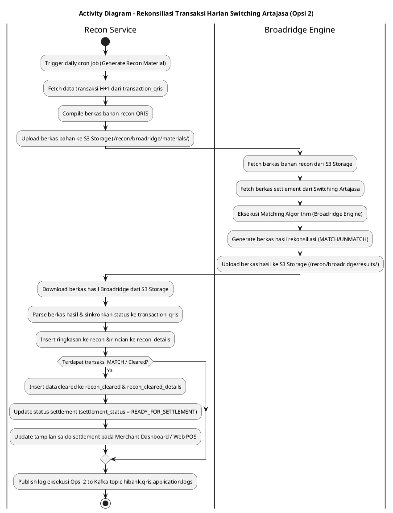
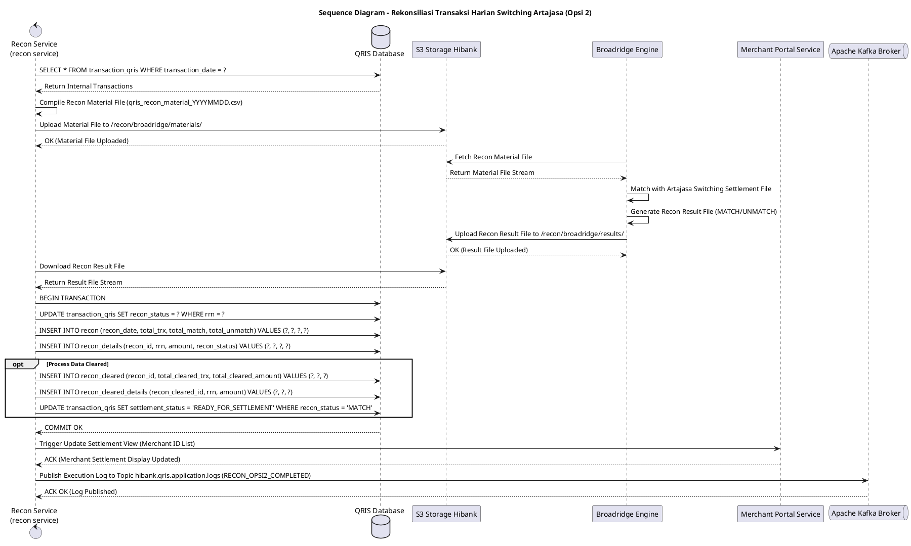

# 1 Deskripsi Use Case

**Tabel 1: Deskripsi Use Case Rekonsiliasi Transaksi Harian Switching Artajasa (Opsi 2)**

| Elemen Spesifikasi | Deskripsi Detail |
| --- | --- |
| ID Use Case | UC-BOH-009 |
| Nama Use Case | Rekonsiliasi Transaksi Harian Switching Artajasa (Opsi 2) |
| Penjelasan Singkat | Proses otomatisasi rekonsiliasi harian Opsi 2 berbasis integrasi Broadridge Hibank. `recon service` meng-generate berkas bahan rekonsiliasi dari database `transaction_qris` dan mengunggahnya ke S3 Storage. Broadridge Hibank mengambil berkas bahan tersebut, mencocokkannya dengan berkas Switching Artajasa, lalu mengunggah hasil rekonsiliasi ke S3. `recon service` mengekstrak hasil dari S3, menyinkronkan status transaksi di `transaction_qris`, mencatat data transaksi *cleared* ke `recon_cleared` & `recon_cleared_details`, serta memperbarui tampilan status settlement merchant. |
| Aktor Utama | Sistem (Recon Service & Broadridge Engine) |
| Aktor Pendukung | Switching Artajasa, Hibank S3 Object Storage, Apache Kafka Broker, Portal Merchant Service |
| Deskripsi Singkat | Onboarding/Reconciliation system menjalankan alur Opsi 2 di mana **`recon service`** (Reconciliation Service) secara otomatis mengekstrak transaksi harian dari tabel `transaction_qris`, meng-generate berkas bahan rekonsiliasi QRIS, dan mengunggahnya ke **Hibank S3 Object Storage**. Layanan **Broadridge Hibank** mengambil berkas bahan rekonsiliasi dari S3, mengunggah berkas laporan settlement dari Switching Artajasa, dan mengeksekusi algoritma rekonsiliasi eksternal. Broadridge menerbitkan berkas laporan hasil rekonsiliasi (memuat status `MATCH` dan `UNMATCH`) dan mengunggahnya kembali ke S3 Object Storage. Selanjutnya, **`recon service`** mengambil berkas hasil rekonsiliasi dari S3, mengekstrak data, dan melakukan sinkronisasi status rekonsiliasi terhadap tabel `transaction_qris` serta mencatat ringkasan pada tabel `recon` dan `recon_details`. Untuk data transaksi yang telah cocok/diselesaikan (*cleared*), `recon service` memasukkan record ke tabel **`recon_cleared`** dan **`recon_cleared_details`**, serta memperbarui status *settlement* merchant sehingga tampilan saldo/settlement pada portal merchant otomatis ter-update. Log eksekusi dipublikasikan ke Kafka Topic **`hibank.qris.application.logs`**. |
| Pre-condition | 1. Transaksi harian QRIS telah tercatat lengkap pada tabel `transaction_qris`. 2. Broadridge Hibank terintegrasi aktif dengan Hibank S3 Object Storage. 3. Berkas laporan settlement dari Switching Artajasa tersedia pada repository Broadridge/S3. |
| Post-condition | 1. Berkas bahan rekonsiliasi QRIS Hibank dan berkas hasil rekonsiliasi Broadridge tersimpan aman di S3 Storage. 2. Status rekonsiliasi pada tabel `transaction_qris` dan `recon_details` tersinkronisasi. 3. Data transaksi yang *cleared* berhasil disimpan pada tabel `recon_cleared` dan `recon_cleared_details`. 4. Tampilan status settlement merchant di Portal Merchant / Web POS ter-update secara *real-time* menjadi siap dicairkan. 5. Log aktivitas rekonsiliasi Opsi 2 berhasil dipublikasikan ke Kafka Topic `hibank.qris.application.logs`. |
| Trigger | Penjadwalan otomatis harian (*daily cron timer*) pada `recon service` atau Broadridge Engine. |
| Nama Tabel | transaction_qris, recon, recon_details, recon_cleared, recon_cleared_details, mst_merchants |
| Integrasi | 1. **Recon Service (`recon service`):** Microservice pembuat bahan recon, sinkronisasi status, dan pengkinian settlement merchant. 2. **Broadridge Hibank:** Core Reconciliation Engine penyedia matching transaksi eksternal antara Hibank dan Artajasa. 3. **Hibank S3 Storage:** Repository pertukaran berkas bahan recon dan berkas hasil recon Broadridge. 4. **Switching Artajasa:** Sumber data settlement transaksi QRIS eksternal. 5. **Apache Kafka Message Broker:** Delivery channel log aplikasi ke topic `hibank.qris.application.logs`. |
| Asumsi | 1. Broadridge Hibank menyediakan struktur berkas hasil rekonsiliasi terstandarisasi yang dapat dipetakan secara presisi ke `RRN`, `STAN`, dan `transaction_qris_id`. 2. Sinkronisasi data ke tampilan merchant langsung merefleksikan saldo settlement yang siap dipindahbukukan. |
| Keterbatasan | 1. Apabila Broadridge mengalami *downtime*, pembuatan bahan recon di S3 tetap berjalan namun proses matching tertunda hingga Broadridge aktif kembali. 2. Transaksi yang masih berstatus `UNMATCH` tidak dimigrasikan ke `recon_cleared` sampai dilakukan *clearing exception* manual. |
| Aturan Bisnis/Sistem | 1. **Recon Material File Generation:** `recon service` mengompilasi seluruh transaksi H+1 dari `transaction_qris` ke dalam berkas CSV/Excel bahan recon dan mengunggahnya ke S3 path: `/recon/broadridge/materials/YYYY/MM/DD/qris_recon_material_YYYYMMDD.csv`. 2. **Broadridge Reconciliation Ingestion:** Broadridge mengambil berkas bahan dari S3, mencocokkannya dengan berkas settlement Switching Artajasa, dan menerbitkan berkas hasil recon ke S3 path: `/recon/broadridge/results/YYYY/MM/DD/qris_recon_result_YYYYMMDD.csv`. 3. **Automatic Synchronization to `transaction_qris`:** `recon service` mengunduh berkas hasil Broadridge dari S3, meng-update status rekonsiliasi transaksi di `transaction_qris` menjadi `MATCH` atau `UNMATCH`, serta meng-insert ringkasan ke tabel `recon` dan rincian ke `recon_details`. 4. **Clearing Table Population (`recon_cleared` & `recon_cleared_details`):** Untuk seluruh transaksi berstatus `MATCH` atau transaksi selisih yang disetujui (*cleared*), `recon service` memasukkan pencatatan resmi ke tabel `recon_cleared` (summary) dan `recon_cleared_details` (itemized details). 5. **Merchant Settlement View Real-Time Update:** Setelah data tersimpan di `recon_cleared`, `recon service` memicu pembaruan status *settlement* pada tabel `transaction_qris` (`settlement_status = 'READY_FOR_SETTLEMENT'`), sehingga tampilan Dashboard Merchant / Web POS langsung menampilkan saldo dana QRIS yang siap cair. 6. **Centralized Kafka Application Logging:** `recon service` WAJIB memublikasikan log transaksi (total bahan recon, total hasil MATCH/UNMATCH Broadridge, total data *cleared*, serta status update settlement merchant) ke Kafka Topic `hibank.qris.application.logs`. |
| Session Idle | 15 Menit |

# 2 Main Flow

**Tabel 2: Main Flow Rekonsiliasi Transaksi Harian Switching Artajasa (Opsi 2)**

| No. | Aktivitas | Deskripsi |
| ---: | --- | --- |
| 1 | Pemicu Scheduler Recon Material | `recon service` memicu job harian otomatis pada jadwal H+1 (misal pukul 01:00 WIB) untuk penyiapan bahan rekonsiliasi. |
| 2 | Generating Berkas Bahan Recon | `recon service` mengekstrak data transaksi harian dari `transaction_qris`, menyusun berkas bahan recon, dan mengunggahnya ke Hibank S3 Storage (`/recon/broadridge/materials/`). |
| 3 | Broadridge Mengambil Bahan dari S3 | System Broadridge Hibank secara otomatis mengambil berkas bahan recon QRIS dari S3 Storage Hibank. |
| 4 | Eksekusi Rekonsiliasi Broadridge | Broadridge mencocokkan (*matching algorithm*) data berkas bahan Hibank dengan data laporan settlement Switching Artajasa. |
| 5 | Broadridge Mengunggah Hasil ke S3 | Broadridge menerbitkan berkas hasil rekonsiliasi (berisi flag MATCH/UNMATCH) dan mengunggahnya ke S3 Storage Hibank (`/recon/broadridge/results/`). |
| 6 | Recon Service Mengunduh Hasil Recon | `recon service` mengambil berkas hasil rekonsiliasi Broadridge dari S3 Storage Hibank. |
| 7 | Menyinkronkan Status ke `transaction_qris` | `recon service` memetakan baris hasil Broadridge dan menyinkronkan status transaksi pada tabel `transaction_qris`, serta menyimpan log pada tabel `recon` dan `recon_details`. |
| 8 | Mencatat Data Clear ke `recon_cleared` | `recon service` mengidentifikasi transaksi berstatus `MATCH` / *cleared*, lalu meng-insert record ke tabel `recon_cleared` dan `recon_cleared_details`. |
| 9 | Memperbarui Tampilan Settlement Merchant | `recon service` memperbarui status settlement transaksi (`settlement_status = 'READY_FOR_SETTLEMENT'`), sehingga saldo settlement pada tampilan Merchant Dashboard / Web POS ter-update otomatis. |
| 10 | Memublikasikan Log ke Kafka Broker | `recon service` memublikasikan log eksekusi dan ringkasan sinkronisasi settlement ke Kafka Topic `hibank.qris.application.logs`. |
| 11 | Use Case Selesai | Rekonsiliasi Opsi 2 via Broadridge dan pembaruan tampilan settlement merchant selesai sepenuhnya. |

# 3 Alternative Flow

**Tabel 3: Alternative Flow Rekonsiliasi Transaksi Harian Switching Artajasa (Opsi 2)**

| Kode | Alternative Flow | Deskripsi |
| --- | --- | --- |
| AF-01 | Gagal Upload Berkas Bahan Recon ke S3 | Pada langkah 2, apabila `recon service` mengalami timeout saat upload berkas bahan ke S3 Storage, Sistem melakukan retry 3x, memublikasikan log error ke `hibank.qris.application.logs`, dan mengiri notifikasi alert operasional. |
| AF-02 | Broadridge Belum Mengunggah Hasil Rekonsiliasi | Pada langkah 6, apabila berkas hasil rekonsiliasi dari Broadridge belum tersedia di S3 pada jadwal yang ditentukan, `recon service` menjadwalkan polling retry setiap 15 menit dan memublikasikan log warning ke `hibank.qris.application.logs`. |
| AF-03 | Format Hasil Broadridge Invalid / Corrupted | Pada langkah 7, apabila berkas hasil Broadridge mengalami kerusakan format, `recon service` menghentikan sinkronisasi, menandai status `RECON_BROADRIDGE_PARSING_FAILED`, dan memublikasikan log error ke `hibank.qris.application.logs`. |
| AF-04 | Transaksi Berstatus UNMATCH pada Hasil Broadridge | Pada langkah 7 & 8, apabila Broadridge menandai transaksi sebagai `UNMATCH`, transaksi tersebut dicatat pada `recon_details` dan TIDAK dimasukkan ke `recon_cleared` hingga dilakukan tindakan pemulihan (*clearing adjustment*). Tampilan settlement merchant untuk transaksi tersebut ditahan sementara (*on-hold*). |

# 4 Status Front-End

**Tabel 4: Status Front-End / Service Execution Status Opsi 2**

| No. | Nama Status | Deskripsi Status Eksekusi Recon Service |
| ---: | --- | --- |
| 1 | MATERIAL_GENERATING | `recon service` sedang mengompilasi data `transaction_qris` menjadi berkas bahan recon. |
| 2 | MATERIAL_S3_UPLOADED | Berkas bahan recon berhasil diunggah ke S3 Storage dan siap diambil Broadridge. |
| 3 | BROADRIDGE_PROCESSING | Broadridge sedang mengeksekusi matching dengan Switching Artajasa. |
| 4 | RESULT_S3_RECEIVED | `recon service` berhasil mengambil berkas hasil rekonsiliasi Broadridge dari S3 Storage. |
| 5 | SYNC_COMPLETED | Status transaksi pada `transaction_qris` dan `recon_details` telah disinkronkan. |
| 6 | CLEARED_SETTLED | Data transaksi *cleared* tersimpan pada `recon_cleared` & `recon_cleared_details`, dan tampilan settlement merchant ter-update. |

# 5 Activity Diagram Rekonsiliasi Transaksi Harian Switching Artajasa (Opsi 2)

# 6 Sequence Diagram Rekonsiliasi Transaksi Harian Switching Artajasa (Opsi 2)

# 7 Response Code

**Tabel 5: Response Code / Recon Service Response Code**

| No. | HTTP Status | Response Code | Nama Response | Deskripsi | Respons System / Broadridge |
| ---: | ---: | --- | --- | --- | --- |
| 1 | 200 | 200XX00 | RECON_OPSI2_SYNC_SUCCESS | `recon service` berhasil menyinkronkan hasil Broadridge, meng-update `transaction_qris`, mencatat `recon_cleared`, dan meng-update tampilan merchant. | Workflow rekonsiliasi Opsi 2 selesai sukses. |
| 2 | 200 | 200XX01 | RECON_OPSI2_PARTIAL_UNMATCH | Sinkronisasi selesai, terdapat transaksi `UNMATCH` yang ditahan dan tidak dimigrasikan ke `recon_cleared`. | Data selisih dialokasikan ke penanganan manual Back Office. |
| 3 | 404 | 404XX00 | BROADRIDGE_RESULT_NOT_FOUND | Berkas hasil rekonsiliasi Broadridge belum tersedia di S3 Storage. | `recon service` menjadwalkan polling retry. |
| 4 | 500 | 500XX00 | RECON_OPSI2_INTERNAL_ERROR | Terjadi kegagalan internal `recon service` saat sinkronisasi database atau update settlement merchant. | Worker memublikasikan log error ke `hibank.qris.application.logs`. |

# 8 Desain Antarmuka

**Tabel 6: Desain Antarmuka / Monitor Recon Dashboard & Merchant Settlement View**

| Halaman | Komponen dan State Utama |
| --- | --- |
| Dashboard Rekonsiliasi Broadridge Opsi 2 (Back Office Hibank) | - Card Summary: **Total Bahan Recon S3**, **Total Hasil Broadridge**, **Total MATCH (Hijau)**, **Total Cleared (`recon_cleared`)**, **Total UNMATCH (Merah)**. - Status Indicator: &nbsp;&nbsp;* Material S3 Upload: `SUCCESS` &nbsp;&nbsp;* Broadridge Result S3: `RECEIVED` &nbsp;&nbsp;* Settlement Sync Status: `UPDATED TO MERCHANT` - Tabel Monitoring Hasil Sync Broadridge (`recon_cleared_details`). |
| Tampilan Portal Merchant / Web POS (Merchant Side) | - Card Status Settlement Merchant: &nbsp;&nbsp;* **Saldo Siap Dicairkan (Ready for Settlement)**: Ter-update otomatis dari hasil `recon_cleared`. &nbsp;&nbsp;* **Status Pencairan**: `READY` (Hijau). &nbsp;&nbsp;* Rincian Riwayat Transaksi QRIS dengan Badge Status **"Settled & Cleared"**. |
