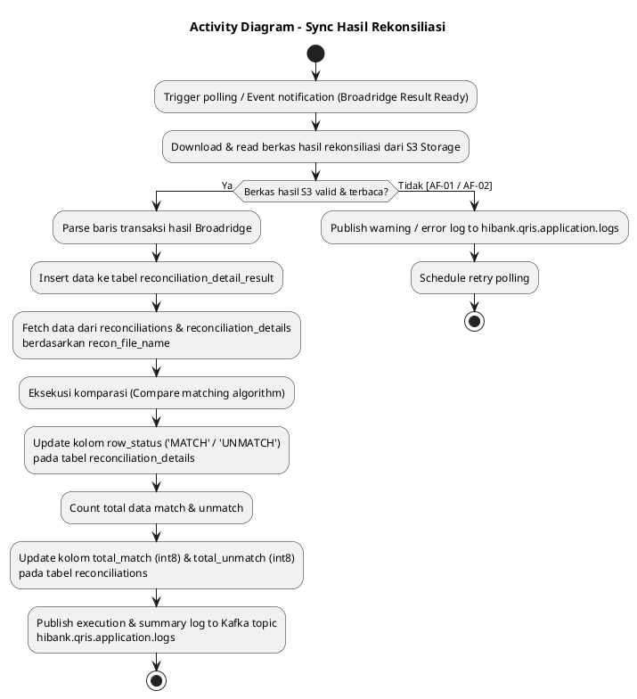
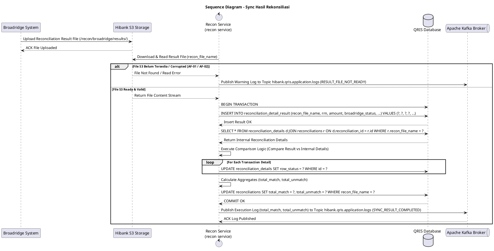

# 1 Deskripsi Use Case

**Tabel 1: Deskripsi Use Case Sync Hasil Rekonsiliasi**

| Elemen Spesifikasi | Deskripsi Detail |
| --- | --- |
| ID Use Case | UC-BOH-009 |
| Nama Use Case | Sync Hasil Rekonsiliasi |
| Penjelasan Singkat | Proses otomatisasi oleh `recon service` untuk mengunduh dan membaca berkas laporan hasil rekonsiliasi yang diunggah oleh Broadridge pada S3 Storage, menyimpan data ke tabel `reconciliation_detail_result`, membandingkan (*compare*) data terhadap tabel `reconciliations` dan `reconciliation_details` berdasarkan `recon_file_name`, memperbarui `row_status` transaksi yang cocok (*match*) / tidak cocok (*unmatch*), serta memperbarui kolom agregat `total_match` dan `total_unmatch` pada tabel `reconciliations`. |
| Aktor Utama | Sistem (`recon service` / Reconciliation Synchronization Worker) |
| Aktor Pendukung | Broadridge Hibank Engine, Hibank S3 Object Storage, QRIS Database, Apache Kafka Broker |
| Deskripsi Singkat | Sistem Broadridge menyelesaikan proses rekonsiliasi eksternal dan menyimpan berkas hasil rekonsiliasi ke Hibank S3 Object Storage. **`recon service`** mengunduh berkas hasil tersebut dan melakukan parsing baris transaksi, kemudian menyimpan seluruh data ke dalam tabel **`reconciliation_detail_result`**. Setelah seluruh data hasil tersimpan, `recon service` mengeksekusi proses komparasi (*matching process*) membandingkan record hasil pada `reconciliation_detail_result` dengan data internal pada tabel **`reconciliations`** dan **`reconciliation_details`** berbasis **`recon_file_name`**. `recon service` mencatat status hasil pencocokan dan meng-update kolom **`row_status`** pada tabel **`reconciliation_details`** (bernilai `'MATCH'` atau `'UNMATCH'`). Setelah proses komparasi seluruh baris selesai, `recon service` menghitung total transaksi dan meng-update kolom **`total_match`** (`int8`) serta **`total_unmatch`** (`int8`) pada tabel **`reconciliations`**. Seluruh aktivitas dan ringkasan sinkronisasi dipublikasikan ke Kafka Topic **`hibank.qris.application.logs`**. |
| Pre-condition | 1. Broadridge telah selesai memproses rekonsiliasi dan menerbitkan berkas hasil pada S3 Object Storage (`/recon/broadridge/results/`). 2. Berkas bahan rekonsiliasi awal (`reconciliations` & `reconciliation_details`) telah tersimpan dengan `recon_file_name` yang valid. 3. `recon service` terhubung aktif dengan S3 Object Storage, QRIS Database, dan Kafka Broker. |
| Post-condition | 1. Data hasil rekonsiliasi dari Broadridge berhasil tersimpan pada tabel `reconciliation_detail_result`. 2. Kolom `row_status` pada tabel `reconciliation_details` ter-update secara akurat dengan status `MATCH` atau `UNMATCH`. 3. Kolom `total_match` (`int8`) dan `total_unmatch` (`int8`) pada tabel `reconciliations` ter-update dengan jumlah agregat akhir. 4. Log eksekusi dan ringkasan komparasi dipublikasikan ke Kafka Topic `hibank.qris.application.logs`. |
| Trigger | Penjadwalan polling otomatis (*daily cron timer*) atau notifikasi event S3 saat berkas hasil Broadridge tersedia. |
| Nama Tabel | reconciliations, reconciliation_details, reconciliation_detail_result, transaction_qris |
| Integrasi | 1. **Broadridge Hibank:** Core engine penyedia berkas laporan hasil rekonsiliasi. 2. **Hibank S3 Storage:** Repository penyimpanan berkas hasil rekonsiliasi Broadridge (`/recon/broadridge/results/`). 3. **Recon Service (`recon service`):** Microservice pembaca file S3, pengelola simpanan `reconciliation_detail_result`, eksekutor komparasi, serta peng-update status `reconciliation_details` dan `reconciliations`. 4. **QRIS Database:** Repository utama penyimpanan tabel `reconciliations`, `reconciliation_details`, dan `reconciliation_detail_result`. 5. **Apache Kafka Message Broker:** Target pengiriman log sinkronisasi pada topic `hibank.qris.application.logs`. |
| Asumsi | 1. Berkas hasil dari Broadridge memuat `recon_file_name` atau nomor referensi unik yang presisi untuk dipetakan ke tabel `reconciliations` dan `reconciliation_details`. 2. Format kolom pada berkas hasil Broadridge bersifat terstandarisasi. |
| Keterbatasan | 1. Apabila berkas hasil Broadridge belum tersedia di S3 Storage, `recon service` akan melakukan polling retry sesuai interval yang ditentukan tanpa mengubah status database. |
| Aturan Bisnis/Sistem | 1. **S3 Result Ingestion:** `recon service` mengunduh berkas laporan hasil rekonsiliasi Broadridge dari S3 path `/recon/broadridge/results/YYYY/MM/DD/` berdasarkan pemicuan scheduler / event notification. 2. **Raw Result Storage (`reconciliation_detail_result`):** Seluruh baris transaksi dari berkas hasil Broadridge wajib dimasukkan terlebih dahulu ke tabel `reconciliation_detail_result` sebelum proses komparasi dilaksanakan. 3. **Cross-Table Comparison Criteria:** `recon service` membandingkan record transaksi antara `reconciliation_detail_result` dengan `reconciliation_details` dan `reconciliations` berdasarkan pemetaan kunci `recon_file_name` dan parameter referensi transaksi (RRN, STAN, Nominal). 4. **Detail Row Status Update (`row_status`):** `recon service` memperbarui kolom `row_status` pada tabel `reconciliation_details` menjadi `'MATCH'` jika data cocok 100%, atau `'UNMATCH'` jika terdapat selisih nominal/data tidak ditemukan. 5. **Header Summary Update (`total_match` & `total_unmatch`):** Setelah seluruh baris terproses, `recon service` menghitung akumulasi total baris cocok dan selisih, lalu meng-update kolom `total_match` (`int8`) dan `total_unmatch` (`int8`) pada record terkait di tabel `reconciliations`. 6. **Centralized Kafka Application Logging:** `recon service` WAJIB memublikasikan log ringkasan komparasi (total_match, total_unmatch, recon_file_name, timestamp) ke Kafka Topic `hibank.qris.application.logs`. |
| Session Idle | 15 Menit |

# 2 Main Flow

**Tabel 2: Main Flow Sync Hasil Rekonsiliasi**

| No. | Aktivitas | Deskripsi |
| ---: | --- | --- |
| 1 | Pemicu Polling / Event Notifikasi S3 | Broadridge selesai memproses rekonsiliasi dan menyimpan file hasil di S3. Scheduler / Event trigger memicu `recon service` untuk memulai sinkronisasi. |
| 2 | Membaca Berkas Hasil Rekonsiliasi dari S3 | `recon service` mengunduh dan membaca berkas hasil rekonsiliasi Broadridge dari Hibank S3 Storage. |
| 3 | Menyimpan Data ke `reconciliation_detail_result` | `recon service` memetakan baris data hasil dan menyimpannya ke dalam tabel `reconciliation_detail_result`. |
| 4 | Mengeksekusi Komparasi Data | `recon service` melakukan pencocokan (*compare*) data antara `reconciliation_detail_result` dengan tabel `reconciliations` dan `reconciliation_details` berbasis `recon_file_name`. |
| 5 | Mengklasifikasikan Data Match & Unmatch | `recon service` mengidentifikasi transaksi yang cocok (*match*) dan transaksi yang selisih (*unmatch*). |
| 6 | Memperbarui Status Kolom `row_status` | `recon service` meng-update kolom `row_status` pada tabel `reconciliation_details` (misal `'MATCH'` untuk data cocok dan `'UNMATCH'` untuk data selisih). |
| 7 | Meng-update Aggregat `total_match` & `total_unmatch` | `recon service` menghitung total transaksi match & unmatch, lalu meng-update kolom `total_match` (`int8`) dan `total_unmatch` (`int8`) pada tabel `reconciliations`. |
| 8 | Memublikasikan Log ke Kafka Broker | `recon service` memublikasikan log eksekusi, ringkasan `total_match`, dan `total_unmatch` ke Kafka Topic `hibank.qris.application.logs`. |
| 9 | Use Case Selesai | Proses sinkronisasi hasil rekonsiliasi Broadridge dan pengkinian tabel database selesai sepenuhnya. |

# 3 Alternative Flow

**Tabel 3: Alternative Flow Sync Hasil Rekonsiliasi**

| Kode | Alternative Flow | Deskripsi |
| --- | --- | --- |
| AF-01 | Berkas Hasil Broadridge Belum Tersedia di S3 | Pada langkah 2, apabila berkas hasil rekonsiliasi Broadridge belum ditemukan pada S3 Storage, `recon service` mencatat warning log ke `hibank.qris.application.logs` dan menjadwalkan polling retry 15 menit kemudian. |
| AF-02 | Format File Hasil Broadridge Invalid / Corrupted | Pada langkah 2 & 3, apabila berkas hasil Broadridge mengalami kerusakan format, `recon service` menghentikan proses, mengeset status `SYNC_PARSING_FAILED`, dan memublikasikan log error ke `hibank.qris.application.logs`. |
| AF-03 | Gagal Menyimpan Data ke `reconciliation_detail_result` | Pada langkah 3, apabila proses insert ke `reconciliation_detail_result` mengalami kesalahan database, `recon service` me-rollback transaksi dan memublikasikan error stacktrace ke `hibank.qris.application.logs`. |
| AF-04 | `recon_file_name` Tidak Cocok dengan Header `reconciliations` | Pada langkah 4, apabila `recon_file_name` pada berkas hasil tidak ditemukan pada tabel `reconciliations`, `recon service` menandai status `FILE_NAME_MISMATCH` dan memicu alert operasional Back Office. |
| AF-05 | Gagal Update Aggregat `total_match` / `total_unmatch` | Pada langkah 7, apabila update kolom `total_match` dan `total_unmatch` pada `reconciliations` mengalami kegagalan, `recon service` melakukan retry update hingga 3 kali sebelum memublikasikan error log ke Kafka. |

# 4 Status Front-End

**Tabel 4: Status Front-End / Service Execution Status Sync Hasil Rekonsiliasi**

| No. | Nama Status | Deskripsi Status Eksekusi Recon Service |
| ---: | --- | --- |
| 1 | RESULT_FILE_READING | `recon service` sedang mengunduh dan membaca berkas hasil Broadridge dari S3 Storage. |
| 2 | RESULT_DATA_SAVED | Data hasil rekonsiliasi berhasil disimpan ke tabel `reconciliation_detail_result`. |
| 3 | DATA_COMPARING | `recon service` sedang mengeksekusi komparasi data berdasarkan `recon_file_name`. |
| 4 | ROW_STATUS_UPDATED | Status pencocokan pada kolom `row_status` di tabel `reconciliation_details` berhasil diperbarui. |
| 5 | SYNC_COMPLETED | Penghitungan agregat selesai, kolom `total_match` & `total_unmatch` pada `reconciliations` ter-update, dan log Kafka terkirim. |

# 5 Activity Diagram Sync Hasil Rekonsiliasi

# 6 Sequence Diagram Sync Hasil Rekonsiliasi

# 7 Response Code

**Tabel 5: Response Code / Recon Service Response Code**

| No. | HTTP Status | Response Code | Nama Response | Deskripsi | Respons System / Recon Worker |
| ---: | ---: | --- | --- | --- | --- |
| 1 | 200 | 200XX00 | RECON_SYNC_SUCCESS | `recon service` berhasil membaca berkas hasil dari S3, menyimpan ke `reconciliation_detail_result`, meng-update `row_status` pada `reconciliation_details`, serta meng-update `total_match` dan `total_unmatch` pada `reconciliations`. | Process sinkronisasi hasil rekonsiliasi selesai dengan sukses. |
| 2 | 404 | 404XX00 | RECON_RESULT_FILE_NOT_FOUND | Berkas laporan hasil Broadridge pada S3 Storage tidak ditemukan. | Worker menjadwalkan polling retry. |
| 3 | 422 | 422XX00 | RECON_FILE_NAME_MISMATCH | `recon_file_name` pada berkas hasil Broadridge tidak dapat dipetakan ke record tabel `reconciliations`. | Worker mencatat error dan memicu alert operasional. |
| 4 | 500 | 500XX00 | RECON_SYNC_INTERNAL_ERROR | Terjadi kesalahan internal database saat menyimpan hasil atau memperbarui status komparasi. | `recon service` memublikasikan log error ke `hibank.qris.application.logs`. |

# 8 Desain Antarmuka

**Tabel 6: Desain Antarmuka / Monitor Recon Sync Dashboard**

| Halaman | Komponen dan State Utama |
| --- | --- |
| Dashboard Monitoring Sync Hasil Rekonsiliasi (Back Office Hibank) | - Card Summary: **Total Match (`total_match`)**, **Total Unmatch (`total_unmatch`)**, **Recon File Name**, **Status Sinkronisasi (`SYNC_COMPLETED`)**. - Status Indicator: &nbsp;&nbsp;* Broadridge S3 Result Read: `SUCCESS` &nbsp;&nbsp;* `reconciliation_detail_result`: `SAVED` &nbsp;&nbsp;* Detail `row_status` Update: `COMPLETED` &nbsp;&nbsp;* Header Summary Update: `UPDATED` - Tabel Monitoring Komparasi Hasil Rekonsiliasi (`reconciliations`, `reconciliation_details`, & `reconciliation_detail_result`): &nbsp;&nbsp;* Kolom: Recon File Name, Tanggal Recon, Total Data, Total Match, Total Unmatch, Status (`SYNC_COMPLETED`, `SYNC_PARSING_FAILED`), Tanggal Sinkronisasi. - Badges Status: &nbsp;&nbsp;* `MATCH` (Green Badge pada `row_status`) &nbsp;&nbsp;* `UNMATCH` (Red Badge pada `row_status`) &nbsp;&nbsp;* `SYNC_COMPLETED` (Blue Badge) - Action Buttons: **"Refresh Sync Status"**, **"Export Summary Match/Unmatch Excel"**, & **"View Detail Unmatch Transactions"**. |
