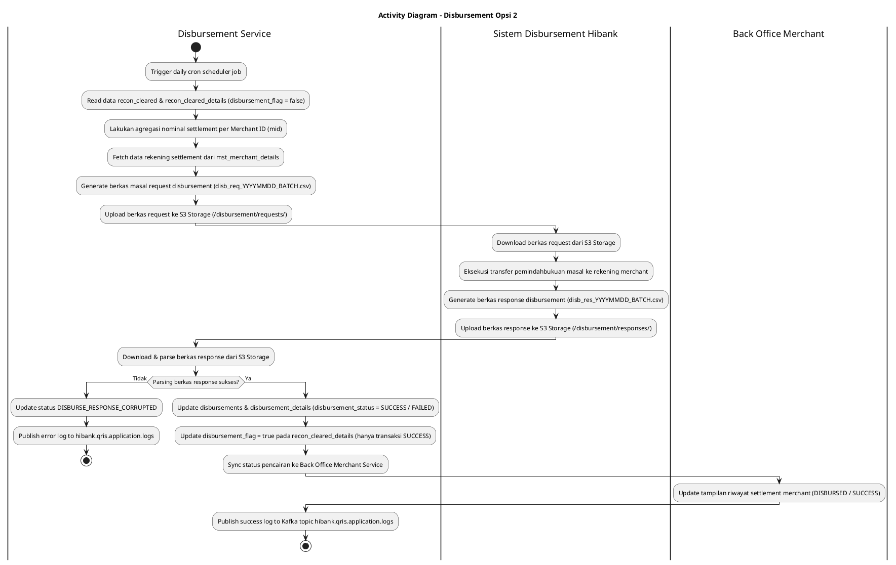
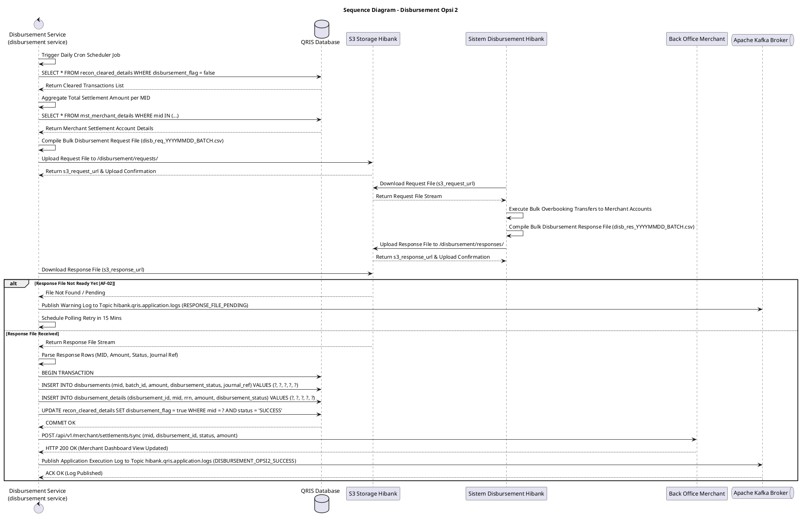

# 1 Deskripsi Use Case

**Tabel 1: Deskripsi Use Case Disbursement Opsi 2**

| Elemen Spesifikasi | Deskripsi Detail |
| --- | --- |
| ID Use Case | UC-BOH-013 |
| Nama Use Case | Disbursement Opsi 2 |
| Penjelasan Singkat | Proses otomatisasi pemindahbukuan masal (*file-based bulk disbursement*) dana settlement merchant Opsi 2. `disbursement service` secara scheduler membaca data `recon_cleared`, melakukan agregasi per merchant, meng-generate berkas instruksi pencairan ke S3 Storage, diproses oleh Sistem Disbursement Hibank, membaca berkas balasan, menyimpan status ke tabel `disbursements` dan `disbursement_details`, serta menyinkronkan status pencairan ke Back Office Merchant. |
| Aktor Utama | Sistem (Disbursement Service & Sistem Disbursement Hibank) |
| Aktor Pendukung | Hibank S3 Object Storage, Back Office Merchant Service, Apache Kafka Broker |
| Deskripsi Singkat | **`disbursement service`** (Disbursement Microservice) menjalankan job penjadwalan otomatis (*scheduler timer*) pada jadwal pencairan settlement. Service membaca transaksi *cleared* pada tabel **`recon_cleared`** dan **`recon_cleared_details`** yang belum di-disburse (`disbursement_flag = false`), melakukan **agregasi total nominal settlement** per Merchant ID (`mid`), dan mengambil data rekening settlement merchant dari **`mst_merchant_details`** dan **`mst_merchants`**. `disbursement service` meng-generate berkas masal instruksi pencairan (*bulk disbursement request file*) dan mengunggahnya ke **Hibank S3 Object Storage** (`/disbursement/requests/YYYY/MM/DD/`). **Sistem Disbursement Hibank** (Batch Core Disbursement System) mengunduh berkas instruksi dari S3, mengeksekusi transfer pemindahbukuan masal ke rekening merchant, dan mengunggah berkas respon (*disbursement response file*) kembali ke S3 Storage (`/disbursement/responses/YYYY/MM/DD/`). `disbursement service` mengunduh dan membaca berkas respon dari S3, mengekstrak status hasil pencairan per merchant, serta menyimpan rekord ke tabel **`disbursements`** (ringkasan) dan **`disbursement_details`** (rincian itemized) dengan nilai status `disbursement_status = 'SUCCESS'`, `'FAILED'`, atau `'PENDING'`. Sesaat setelah status `disbursement_status = 'SUCCESS'`, `disbursement service` memperbarui tampilan status pencairan di **Back Office Merchant** (Portal Merchant / Web POS / Mobile App) sehingga merchant dapat melihat riwayat dana settlement yang telah berhasil ditransfer. Log eksekusi dipublikasikan ke Kafka Topic **`hibank.qris.application.logs`**. |
| Pre-condition | 1. Terdapat data transaksi settlement hasil rekonsiliasi yang telah *cleared* pada tabel `recon_cleared` dan `recon_cleared_details`. 2. Sistem Disbursement Hibank aktif dan terhubung ke Hibank S3 Storage. 3. Data rekening settlement merchant pada `mst_merchant_details` terdaftar valid. |
| Post-condition | 1. Berkas request disbursement masal dan berkas response disbursement tersimpan di Hibank S3 Storage. 2. Dana settlement berhasil dipindahbukukan oleh Sistem Disbursement Hibank ke rekening merchant. 3. Record pencairan tersimpan pada tabel `disbursements` dan `disbursement_details` dengan status `disbursement_status = 'SUCCESS'` (atau `FAILED`/`PENDING`). 4. Status pencairan dana pada Dashboard Back Office Merchant / Web POS ter-update secara *real-time* menjadi `DISBURSED` / `SUCCESS`. 5. Log pemrosesan disbursement dipublikasikan ke Kafka Topic `hibank.qris.application.logs`. |
| Trigger | Penjadwalan otomatis harian (*daily cron scheduler*) pada `disbursement service`. |
| Nama Tabel | recon_cleared, recon_cleared_details, mst_merchants, mst_merchant_details, disbursements, disbursement_details, audit_logs |
| Integrasi | 1. **Disbursement Service (`disbursement service`):** Microservice pembuat berkas masal, pembaca response, dan penyinkron database. 2. **Hibank S3 Storage:** Repository pertukaran berkas request dan response disbursement masal. 3. **Sistem Disbursement Hibank:** Core Batch System pemroses transfer pemindahbukuan masal. 4. **Back Office Merchant Service:** Interface pemutakhiran tampilan riwayat pencairan pada portal merchant. 5. **Apache Kafka Message Broker:** Centralized event broker log aplikasi topic `hibank.qris.application.logs`. |
| Asumsi | 1. Format berkas request dan response disbursement antara `disbursement service` dan Sistem Disbursement Hibank menggunakan struktur CSV/Text baku yang disepakati (memuat Batch ID, MID, Rekening Tujuan, Nominal, Status Code, Journal Ref). 2. Sistem Disbursement Hibank memproses berkas request secara otomatis dalam jendela waktu *batch processing*. |
| Keterbatasan | 1. Apabila berkas response dari Sistem Disbursement Hibank belum tersedia di S3, status transaksi tetap `PENDING` sampai berkas response berhasil dibaca. 2. Transaksi yang dinyatakan gagal pada berkas response akan dicatat dengan status `disbursement_status = 'FAILED'` untuk ditindaklanjuti tim Ops Bank. |
| Aturan Bisnis/Sistem | 1. **Bulk Request File Generation:** `disbursement service` mengagregasikan nominal net per `mid` dari `recon_cleared_details` (`disbursement_flag = false`), mengompilasi menjadi berkas request `disb_req_YYYYMMDD_BATCH.csv`, dan mengunggahnya ke S3 Storage path: `/disbursement/requests/YYYY/MM/DD/`. 2. **Sistem Disbursement Execution:** Sistem Disbursement Hibank memproses berkas request S3, mengeksekusi transfer ke rekening merchant, dan menerbitkan berkas response `disb_res_YYYYMMDD_BATCH.csv` pada S3 Storage path: `/disbursement/responses/YYYY/MM/DD/`. 3. **Response Parsing & Status Update:** `disbursement service` mengunduh berkas response dari S3, mengekstrak status pencairan, lalu memperbarui tabel `disbursements` dan `disbursement_details` dengan status `disbursement_status = 'SUCCESS'`, `'FAILED'`, atau `'PENDING'`. 4. **Clearing Details Flag Update:** Setelah status `disbursement_status = 'SUCCESS'`, `disbursement service` memperbarui `disbursement_flag = true` pada tabel `recon_cleared_details`. 5. **Back Office Merchant View Real-Time Update:** Sesaat setelah status di-update `SUCCESS`, `disbursement service` memicu pembaruan tampilan pada Back Office Merchant Service sehingga merchant melihat status pencairan `DISBURSED / SUCCESS` beserta nomor referensi journal overbooking. 6. **Centralized Kafka Application Logging:** `disbursement service` WAJIB memublikasikan seluruh log eksekusi (total file request, total file response diproses, total sukses, total gagal, serta stacktrace error) ke Kafka Topic `hibank.qris.application.logs`. |
| Session Idle | 15 Menit |

# 2 Main Flow

**Tabel 2: Main Flow Disbursement Opsi 2**

| No. | Aktivitas | Deskripsi |
| ---: | --- | --- |
| 1 | Pemicu Daily Disbursement Scheduler | `disbursement service` memicu job harian otomatis pada jadwal pencairan settlement. |
| 2 | Membaca Data `recon_cleared` | `disbursement service` membaca data transaksi berstatus *cleared* dari tabel `recon_cleared` & `recon_cleared_details` yang belum di-disburse (`disbursement_flag = false`). |
| 3 | Mengagregasi Nominal per Merchant | `disbursement service` mengelompokkan data transaksi berdasarkan `mid` dan menghitung total nominal settlement agregat per merchant. |
| 4 | Mengambil Data Rekening Merchant | `disbursement service` membaca nomor rekening settlement merchant dari tabel `mst_merchant_details` dan `mst_merchants`. |
| 5 | Generating & Upload File Request S3 | `disbursement service` meng-generate berkas masal instruksi pencairan (`disb_req_YYYYMMDD_BATCH.csv`) dan mengunggahnya ke S3 Storage Hibank (`/disbursement/requests/`). |
| 6 | Pemrosesan oleh Sistem Disbursement Hibank | Sistem Disbursement Hibank mengambil berkas request dari S3, mengeksekusi transfer masal ke rekening merchant, dan menerbitkan berkas response (`disb_res_YYYYMMDD_BATCH.csv`) di S3 Storage (`/disbursement/responses/`). |
| 7 | Download & Parsing File Response S3 | `disbursement service` mengunduh berkas response dari S3 Storage dan melakukan parsing status hasil transfer per merchant. |
| 8 | Memperbarui Database `disbursements` | `disbursement service` meng-insert/update record pada tabel `disbursements` dan `disbursement_details` dengan status `disbursement_status = 'SUCCESS'`, `'FAILED'`, atau `'PENDING'`, serta meng-update `disbursement_flag = true` pada `recon_cleared_details`. |
| 9 | Menyinkronkan Tampilan Back Office Merchant | `disbursement service` memicu pembaruan status pada Back Office Merchant Service sehingga merchant melihat tampilan riwayat pencairan berstatus `SUCCESS`. |
| 10 | Memublikasikan Log ke Kafka Broker | `disbursement service` memublikasikan log eksekusi dan ringkasan pencairan file batch ke Kafka Topic `hibank.qris.application.logs`. |
| 11 | Use Case Selesai | Seluruh alur disbursement Opsi 2 via pemrosesan berkas batch selesai sepenuhnya dan dana telah ditransfer ke merchant. |

# 3 Alternative Flow

**Tabel 3: Alternative Flow Disbursement Opsi 2**

| Kode | Alternative Flow | Deskripsi |
| --- | --- | --- |
| AF-01 | Gagal Upload Berkas Request ke S3 Storage | Pada langkah 5, apabila `disbursement service` mengalami error/timeout saat mengunggah berkas request ke S3 Storage, Sistem melakukan retry 3x, memublikasikan log error ke `hibank.qris.application.logs`, dan memicu alert operasional. |
| AF-02 | Berkas Response Belum Diterbitkan Sistem Disbursement | Pada langkah 7, apabila berkas response dari Sistem Disbursement Hibank belum tersedia di S3 Storage, `disbursement service` mempertahankan status `PENDING`, menjadwalkan polling retry 15 menit kemudian, dan memublikasikan log warning ke `hibank.qris.application.logs`. |
| AF-03 | Format File Response Invalid / Corrupted | Pada langkah 7, apabila berkas response mengalami kerusakkan format, `disbursement service` menghentikan parsing, menandai status `DISBURSE_RESPONSE_CORRUPTED`, memublikasikan error stacktrace ke `hibank.qris.application.logs`, dan memicu alert ke tim Ops Bank. |

# 4 Status Front-End

**Tabel 4: Status Front-End / Service Execution Status Disbursement Opsi 2**

| No. | Nama Status | Deskripsi Status Eksekusi Disbursement Service |
| ---: | --- | --- |
| 1 | AGGREGATING | `disbursement service` sedang membaca data `recon_cleared` dan menghitung nominal total per merchant. |
| 2 | FILE_REQUEST_S3_UPLOADED | Berkas request disbursement masal berhasil diunggah ke S3 Storage dan siap diproses Sistem Disbursement Hibank. |
| 3 | DISBURSEMENT_SYSTEM_PROCESSING | Sistem Disbursement Hibank sedang mengeksekusi transfer masal ke rekening merchant. |
| 4 | FILE_RESPONSE_S3_RECEIVED | `disbursement service` berhasil mengambil berkas response pencairan dari S3 Storage. |
| 5 | DISBURSE_SUCCESS | Flag `disbursement_status = 'SUCCESS'` setelah berkas response mengonfirmasi transfer sukses dan status ter-update di Back Office Merchant. |
| 6 | DISBURSE_FAILED | Flag `disbursement_status = 'FAILED'` untuk transaksi yang dinyatakan gagal pada berkas response. |

# 5 Activity Diagram Disbursement Opsi 2

# 6 Sequence Diagram Disbursement Opsi 2

# 7 Response Code

**Tabel 5: Response Code / Disbursement Service Response Code**

| No. | HTTP Status | Response Code | Nama Response | Deskripsi | Respons System / Merchant App |
| ---: | ---: | --- | --- | --- | --- |
| 1 | 200 | 200XX00 | DISBURSEMENT_OPSI2_SUCCESS | Berkas response berhasil diproses, status `disbursements` di-update `SUCCESS`, dan tampilan Back Office Merchant ter-update. | Service menyelesaikan alur disbursement batch masal dengan sukses. |
| 2 | 200 | 200XX01 | DISBURSEMENT_OPSI2_PARTIAL_FAILED | Sebagian transaksi pada berkas response berstatus gagal transfer. | Status per merchant dicatat di `disbursements` (`SUCCESS` / `FAILED`). |
| 3 | 404 | 404XX00 | RESPONSE_FILE_NOT_FOUND | Berkas response dari Sistem Disbursement Hibank belum tersedia di S3 Storage. | Service menjadwalkan polling retry. |
| 4 | 500 | 500XX00 | RESPONSE_FILE_PARSING_ERROR | Berkas response S3 terkorupsi atau format baris tidak dapat di-parse. | Service memublikasikan log error ke `hibank.qris.application.logs`. |

# 8 Desain Antarmuka

**Tabel 6: Desain Antarmuka / Monitor Disbursement Dashboard Batch & Back Office Merchant View**

| Halaman | Komponen dan State Utama |
| --- | --- |
| Dashboard Monitoring Disbursement Batch Opsi 2 (Back Office Hibank) | - Card Summary: **Total Batch Request S3**, **Total Batch Response S3**, **Total Nominal Disbursed**, **Total Status SUCCESS (Hijau)**, **Total FAILED (Merah)**. - Status File Badges: &nbsp;&nbsp;* Request File: `S3_UPLOADED` (Blue) &nbsp;&nbsp;* Response File: `S3_RECEIVED` (Green) - Tabel Monitoring Disbursement (`disbursements` & `disbursement_details`): &nbsp;&nbsp;* Kolom: Date, Batch File Name, Merchant ID, Rekening Tujuan, Total Nominal, Status (`disbursement_status`). - Indicator Badges: `SUCCESS` (Green), `FAILED` (Red), `PENDING` (Yellow). - Tombol **"Download Response File S3"** & **"Re-trigger Batch File"**. |
| Tampilan Portal Back Office Merchant / Web POS (Merchant Side) | - Halaman **Riwayat Pencairan Dana (Disbursement History)**: &nbsp;&nbsp;* Card Total Dana Dicairkan. &nbsp;&nbsp;* Tabel Riwayat: Tanggal Pencairan, Nominal Settlement, Nomor Referensi Journal, Status (`DISBURSED / SUCCESS`). &nbsp;&nbsp;* Indicator Badges: `SUCCESS` (Hijau). |
