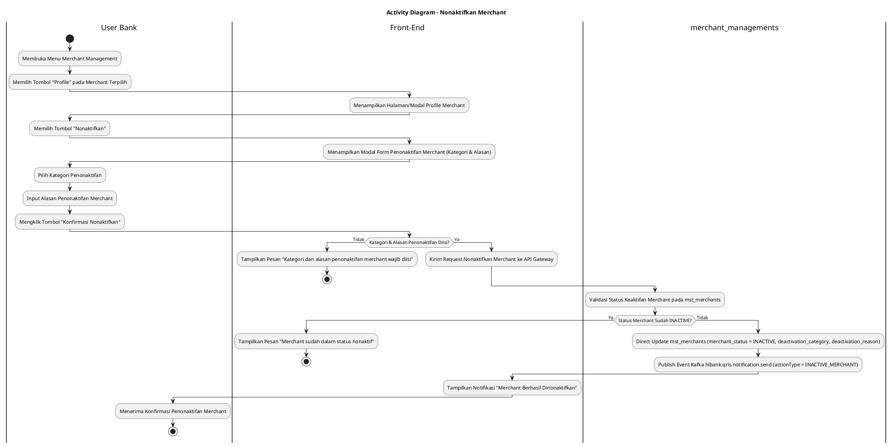
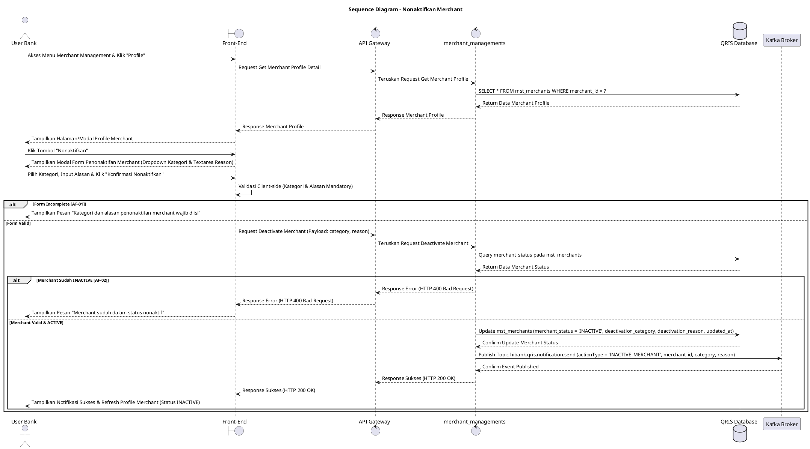

# 1 Deskripsi Use Case

**Tabel 1: Deskripsi Use Case Nonaktifkan Merchant**

| Elemen Spesifikasi | Deskripsi Detail |
| --- | --- |
| ID Use Case | UC-BOH-033 |
| Nama Use Case | Nonaktifkan Merchant |
| Penjelasan Singkat | Fitur Web Back Office Hibank yang memfasilitasi User Bank untuk menonaktifkan (*deactivate*) entitas merchant terpilih pada tabel `mst_merchants` (`merchant_status = 'INACTIVE'`) melalui service `merchant_managements`, menyimpan kategori serta alasan penonaktifan, dan menerbitkan event Kafka `hibank.qris.notification.send` (`actionType = 'INACTIVE_MERCHANT'`), sehingga transaksi pembayaran via POS dihentikan sementara namun pengelolanya tetap dapat login ke Back Office Merchant. |
| Aktor Utama | User Bank (Back Office Hibank Compliance / Risk / Operations Approver) |
| Aktor Pendukung | merchant_managements (Merchant Management Service), Kafka Message Broker, Notification Service |
| Deskripsi Singkat | User Bank melakukan otentikasi login SSO ke Web Back Office Hibank dan mengakses menu **Merchant Management**. Sistem menampilkan daftar merchant terdaftar. User Bank memilih salah satu merchant, lalu mengklik tombol **"Profile"**. Sistem menampilkan halaman/modal profil detail merchant. User Bank mengklik tombol aksi **"Nonaktifkan"**. Sistem menampilkan modal konfirmasi penonaktifan merchant yang meminta pengisian dropdown **Kategori Penonaktifan** (*deactivation category*) dan textarea **Alasan Penonaktifan** (*deactivation reason*). User Bank memilih kategori penonaktifan, memasukkan alasan detail, dan mengklik tombol **"Konfirmasi Nonaktifkan"**. Front-End mengirim request ke API Gateway. Service `merchant_managements` memvalidasi status keaktifan merchant. Setelah validasi sukses, service secara langsung memperbarui status merchant pada tabel **`mst_merchants`** menjadi **`merchant_status = 'INACTIVE'`** serta menyimpan `deactivation_category` dan `deactivation_reason`. Selanjutnya, service menerbitkan (*publish*) event ke **Kafka Message Broker** pada topik `hibank.qris.notification.send` dengan payload `actionType = 'INACTIVE_MERCHANT'` untuk memicu pengiriman notifikasi formal ke merchant. Akibat penonaktifan ini, sistem transaksi POS menolak seluruh proses transaksi QRIS/pembayaran merchant tersebut, namun pengguna merchant (Owner & Staff) tetap diizinkan login ke Portal Back Office Merchant. Front-End memperbarui tampilan profil merchant dan menampilkan konfirmasi bahwa merchant telah berhasil dinonaktifkan. |
| Pre-condition | 1. User Bank telah berhasil login SSO ke Web Back Office Hibank dan memiliki otoritas kewenangan *Merchant Compliance/Risk Officer*. 2. Entitas merchant yang akan dinonaktifkan terdaftar aktif pada tabel `mst_merchants` (`merchant_status = 'ACTIVE'`). |
| Post-condition | 1. Status entitas merchant pada tabel `mst_merchants` diperbarui secara langsung menjadi `merchant_status = 'INACTIVE'`, serta kolom `deactivation_category` dan `deactivation_reason` tersimpan. 2. Event Kafka pada topik `hibank.qris.notification.send` berhasil diterbitkan dengan `actionType = 'INACTIVE_MERCHANT'`. 3. Seluruh transaksi pembayaran/QRIS melalui Aplikasi POS / Mobile POS untuk merchant tersebut ditolak secara otomatis. 4. Pengguna merchant (Merchant Owner & Kasir) TETAP DAPAT melakukan login ke Back Office Merchant. 5. Front-End memperbarui status tampilan merchant menjadi `INACTIVE`. |
| Trigger | User Bank mengklik tombol **"Profile"** pada merchant terpilih di menu Merchant Management, mengklik tombol aksi **"Nonaktifkan"**,, memilih kategori penonaktifan, mengisi alasan, dan mengklik **"Konfirmasi Nonaktifkan"**. |
| Nama Tabel | mst_merchants, audit_logs |
| Integrasi | 1. **Web Back Office Hibank UI:** Antarmuka daftar merchant, halaman/modal profil merchant, dan dialog penonaktifan merchant. 2. **merchant_managements:** Microservice backend pengelola pembaruan status keaktifan entitas merchant secara langsung di database. 3. **Kafka Message Broker:** Broker pesan untuk menerbitkan event topik `hibank.qris.notification.send`. 4. **Payment Engine / POS Gateway:** Engine transaksi pembayaran yang memverifikasi `merchant_status = 'ACTIVE'` sebelum memproses transaksi. |
| Asumsi | 1. Penonaktifan merchant ditujukan khusus untuk penangguhan operasional transaksi pembayaran (POS) akibat evaluasi kepatuhan/risiko. 2. Pengelompokan kategori penonaktifan mempermudah klasifikasi alasan (*Fraud/Risk*, *Kepatuhan Dokumen*, *Permintaan Merchant*, dll.). 3. Layanan Kafka Broker beroperasi dengan normal untuk pengiriman event notifikasi. |
| Keterbatasan | 1. Merchant yang sudah berstatus `merchant_status = 'INACTIVE'` tidak dapat dinonaktifkan ulang. 2. Pemilihan kategori penonaktifan dan pengisian alasan bersifat mandatori. |
| Aturan Bisnis/Sistem | 1. **Direct Merchant Status Update Standard:** Service `merchant_managements` WAJIB meng-update kolom `merchant_status = 'INACTIVE'`, `deactivation_category`, dan `deactivation_reason` pada `mst_merchants` untuk `merchant_id` terpilih. 2. **Mandatory Category & Reason Input:** Pemilihan Kategori Penonaktifan dan Alasan Penonaktifan bersifat WAJIB sebelum eksekusi diproses. 3. **Kafka Event Publishing Standard:** Setelah transaksi database sukses, service WAJIB mem-publish event ke topik Kafka `hibank.qris.notification.send` dengan payload `actionType = 'INACTIVE_MERCHANT'`, `merchant_id`, `category`, `reason`, dan timestamp. 4. **POS Transaction Rejection Standard:** Engine Transaksi / POS Gateway WAJIB menolak seluruh transaksi pembayaran QRIS / settlement apabila `merchant_status` berstatus `INACTIVE`. 5. **Back Office Access Retention:** Penonaktifan status merchant TIDAK MEMBLOKIR hak akses login pengguna merchant ke Portal Back Office Merchant. 6. **Audit Trail Standard:** Setiap tindakan penonaktifan merchant mencatat `merchant_id`, `deactivated_by` (ID User Bank), kategori, alasan, dan timestamp pada `audit_logs` / `mst_merchants`. |
| Session Idle | 15 Menit |

# 2 Main Flow

**Tabel 2: Main Flow Nonaktifkan Merchant**

| No. | Aktivitas | Deskripsi |
| ---: | --- | --- |
| 1 | Membuka Menu Merchant Management | User Bank melakukan login SSO dan mengklik menu **Merchant Management**. |
| 2 | Menampilkan Daftar Merchant | Sistem menampilkan tabel daftar merchant terdaftar dari database beserta tombol aksi **"Profile"** per baris merchant. |
| 3 | Memilih Tombol Profile Merchant | User Bank mengklik tombol **"Profile"** pada salah satu baris merchant terpilih. |
| 4 | Menampilkan Profile Merchant | Sistem menampilkan halaman atau modal rincian profil merchant dari tabel `mst_merchants`. |
| 5 | Memilih Tombol Nonaktifkan | User Bank mengklik tombol aksi **"Nonaktifkan"** pada profil merchant. |
| 6 | Menampilkan Modal Penonaktifan | Sistem menampilkan modal konfirmasi penonaktifan merchant yang memuat dropdown Kategori Penonaktifan dan textarea Alasan Penonaktifan. |
| 7 | Mengisi Kategori, Alasan & Konfirmasi | User Bank memilih kategori penonaktifan, menginput alasan penonaktifan pada textarea, dan mengklik tombol **"Konfirmasi Nonaktifkan"**. |
| 8 | Memvalidasi Request Penonaktifan | Front-End memvalidasi ketersediaan kategori dan alasan, lalu mengirim request penonaktifan merchant ke API Gateway. |
| 9 | Direct Update Status Merchant | Service `merchant_managements` langsung memperbarui akun merchant pada `mst_merchants` (`merchant_status = 'INACTIVE'`, `deactivation_category`, `deactivation_reason`). |
| 10 | Publish Kafka Event Notification | Service `merchant_managements` menerbitkan (*publish*) event ke Kafka Broker pada topik `hibank.qris.notification.send` dengan payload `actionType = 'INACTIVE_MERCHANT'`. |
| 11 | Menampilkan Konfirmasi Berhasil | Front-End memperbarui halaman/modal profil merchant dan menampilkan notifikasi bahwa merchant telah berhasil dinonaktifkan. |
| 12 | Use Case Selesai | Proses penonaktifan entitas merchant selesai dilaksanakan. |

# 3 Alternative Flow

**Tabel 3: Alternative Flow Nonaktifkan Merchant**

| Kode | Alternative Flow | Deskripsi |
| --- | --- | --- |
| AF-01 | Kategori atau Alasan Penonaktifan Kosong | Pada langkah 7-8, apabila User Bank tidak memilih kategori atau mengosongkan alasan penonaktifan, Sistem menolak request dan Front-End menampilkan `Kategori dan alasan penonaktifan merchant wajib diisi`. |
| AF-02 | Merchant Sudah Berstatus Inactive | Pada langkah 9, apabila status merchant pada database sudah `merchant_status = 'INACTIVE'`, Sistem membatalkan transaksi dan Front-End menampilkan `Merchant sudah dalam status nonaktif`. |
| AF-03 | Gagal Terhubung ke Database Server | Pada langkah 9, apabila koneksi database terputus total, Sistem mengembalikan HTTP status 500 dan Front-End menampilkan `Gagal memperbarui status merchant ke database`. |
| AF-04 | Gagal Publish Event ke Kafka Broker | Pada langkah 10, apabila pengiriman pesan ke Kafka Broker gagal, Sistem mencatat error pada log audit dan Front-End memberikan notifikasi peringatan `Status merchant diperbarui namun pengiriman notifikasi event Kafka gagal`. |

# 4 Status Front-End

**Tabel 4: Status Front-End Nonaktifkan Merchant**

| No. | Nama Status | Deskripsi Tampilan Front-End |
| ---: | --- | --- |
| 1 | IDLE | Halaman/modal profil merchant menyajikan data rincian dan modal penonaktifan siap menerima masukan kategori & alasan. |
| 2 | LOADING | Indikator proses (*spinner*) ditampilkan pada tombol konfirmasi saat request penonaktifan merchant sedang diproses server. |
| 3 | SUCCESS | Modal/toast konfirmasi menampilkan pesan bahwa merchant telah berhasil dinonaktifkan (`merchant_status = 'INACTIVE'`). |
| 4 | ERROR | Pesan kesalahan ditampilkan pada UI akibat kategori/alasan kosong, status merchant tidak valid, atau gangguan server. |

# 5 Activity Diagram Nonaktifkan Merchant

# 6 Sequence Diagram Nonaktifkan Merchant

# 7 Response Code

**Tabel 5: Response Code Nonaktifkan Merchant**

| No. | HTTP Status | Response Code | Nama Response | Deskripsi | Respons Front-End |
| ---: | ---: | --- | --- | --- | --- |
| 1 | 200 | 200XX00 | SUCCESS_DEACTIVATE_MERCHANT | Status entitas merchant berhasil diubah menjadi `INACTIVE` dan event Kafka dipublish. | Menampilkan pesan notifikasi sukses dan memperbarui status merchant pada profil UI. |
| 2 | 400 | 400XX00 | INVALID_DEACTIVATION_INPUT | Kategori atau alasan penonaktifan merchant yang dimasukkan tidak valid atau kosong. | Menampilkan pesan kesalahan `Kategori dan alasan penonaktifan merchant wajib diisi`. |
| 3 | 400 | 400XX01 | MERCHANT_ALREADY_INACTIVE | Entitas merchant yang dipilih sudah dalam kondisi status nonaktif (`INACTIVE`). | Menampilkan pesan kesalahan `Merchant sudah dalam status nonaktif`. |
| 4 | 404 | 404XX00 | MERCHANT_NOT_FOUND | Data entitas merchant tidak ditemukan pada database. | Menampilkan pesan kesalahan `Data merchant tidak ditemukan`. |
| 5 | 500 | 500XX00 | SYSTEM_INTERNAL_ERROR | Terjadi kegagalan internal server saat mengeksekusi penonaktifan merchant. | Menampilkan pesan kesalahan `Terjadi kendala internal pada server`. |

# 8 Desain Antarmuka

**Tabel 6: Desain Antarmuka Nonaktifkan Merchant**

| Halaman | Komponen dan State Utama |
| --- | --- |
| Halaman/Modal Profile Merchant | 1. **Informasi Merchant:** MID, Nama Merchant, Alamat, Status (`merchant_status = 'ACTIVE'`). 2. **Tombol "Nonaktifkan":** Tombol pemicu penonaktifan entitas merchant (Warna Merah/Oranye). |
| Modal Konfirmasi Penonaktifan Merchant | 1. **Header Peringatan:** Judul konfirmasi penonaktifan merchant. 2. **Info Merchant:** Menampilkan Nama Merchant dan MID. 3. **Dropdown Kategori Penonaktifan:** Pilihan kategori (*Fraud/Risk*, *Pelanggaran Kepatuhan*, *Permintaan Merchant*, dll.). 4. **Textarea Alasan Penonaktifan:** Input wajib alasan detail penonaktifan. 5. **Tombol Aksi:** Tombol **"Konfirmasi Nonaktifkan"** (Primary Red) dan **"Batal"** (Secondary). |

