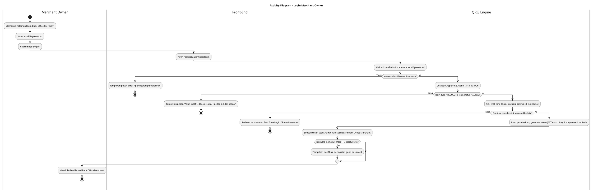
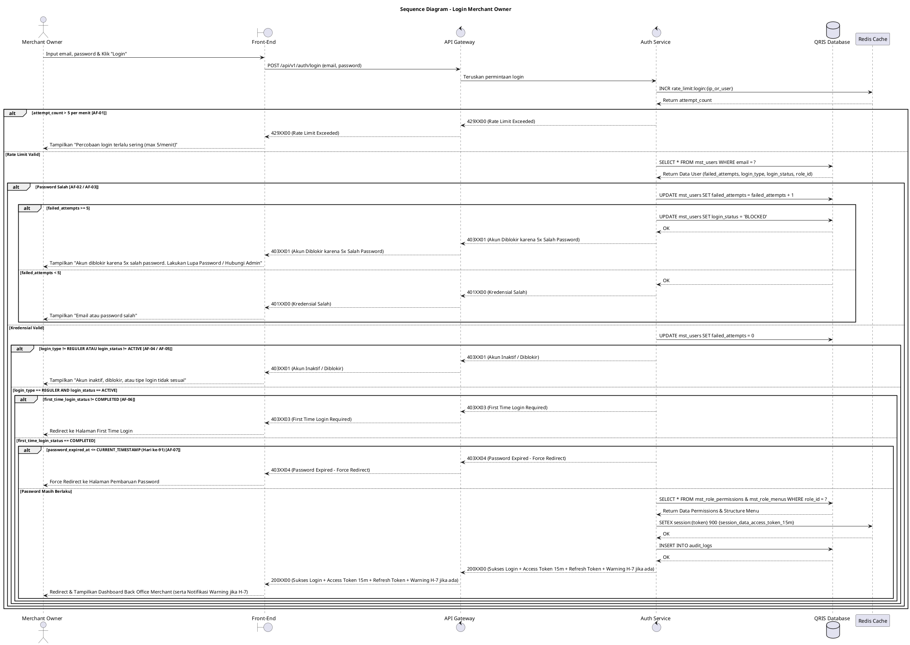

# 1 Deskripsi Use Case

**Tabel 1: Deskripsi Use Case Login Merchant Owner**

| Elemen Spesifikasi | Deskripsi Detail |
| --- | --- |
| ID Use Case | UC-BOM-001 |
| Nama Use Case | Login Merchant Owner |
| Penjelasan Singkat | Proses autentikasi standar (Normal Login) yang dilakukan oleh Merchant Owner untuk mengakses Dashboard Back Office Merchant. |
| Aktor Utama | Merchant Owner |
| Aktor Pendukung | - |
| Deskripsi Singkat | Merchant Owner menginput kredensial (email dan password) pada Halaman Login Back Office Merchant. Sistem mengecek *rate limit* login (max 5 attempt/menit), mencocokkan kredensial, memverifikasi `login_type = 'REGULER'`, `login_status = 'ACTIVE'`, `first_time_login_status = 'COMPLETED'`, serta siklus `password_expired_at` (maksimal 90 hari dengan warning H-7), lalu memuat `mst_role_permissions` dan `mst_role_menus` sebelum menyimpan sesi ke Redis Cache dan memberikan Access Token (maks 15 menit) & Refresh Token. |
| Pre-condition | 1. Merchant Owner telah terdaftar pada tabel `mst_users` dengan `login_type = 'REGULER'`. 2. Akun Merchant Owner berstatus `ACTIVE` (`login_status = 'ACTIVE'`) dan telah menyelesaikan First Time Login (`first_time_login_status = 'COMPLETED'`). 3. Password akun Merchant Owner belum kedaluwarsa (`password_expired_at` masih berlaku). |
| Post-condition | 1. Merchant Owner berhasil diautentikasi, data sesi disimpan pada Redis Cache, dan menerima Access Token (JWT 15 menit) & Refresh Token yang memuat `role_id`, hak akses, dan struktur menu. 2. Front-End menampilkan Halaman Utama (Dashboard) dan menu navigasi Back Office Merchant sesuai hak akses `role_id` Merchant Owner (serta notifikasi peringatan jika password memasuki H-7 kedaluwarsa). |
| Trigger | Merchant Owner memasukkan kredensial dan menekan tombol "Login". |
| Nama Tabel | mst_users, mst_role_permissions, mst_role_menus, audit_logs |
| Integrasi | 1. **Redis Cache:** Penyimpanan data sesi (session token, user context, permissions, menus, & rate limit counter) berbasis in-memory. |
| Asumsi | 1. Merchant Owner mengingat email dan password yang terdaftar dengan benar. 2. Layanan Redis Cache dalam kondisi aktif dan dapat diakses oleh Auth Service. 3. Peramban web Merchant Owner terhubung ke jaringan internet yang stabil. |
| Keterbatasan | 1. Login reguler hanya diperuntukkan bagi pengguna dengan atribut `login_type = 'REGULER'`. 2. Pengguna yang belum menyelesaikan First Time Login atau passwordnya kedaluwarsa tidak dapat melanjutkan ke Dashboard melalui alur ini. |
| Aturan Bisnis/Sistem | 1. **Reguler Login Verification:** Autentikasi dilakukan dengan memverifikasi kombinasi email dan hash password pada `mst_users` untuk pengguna dengan `login_type = 'REGULER'`. 2. **Kriteria & Kompleksitas Password:** &nbsp;&nbsp;- Panjang minimal 8 karakter. &nbsp;&nbsp;- Wajib memuat kombinasi minimal 3 dari 4 kriteria: Karakter Spesial (Wajib, mis: @, #, $), Huruf Besar (A-Z), Huruf Kecil (a-z), Angka (0-9). &nbsp;&nbsp;- Tidak boleh mengandung User ID, Nama Depan, atau Nama Belakang. &nbsp;&nbsp;- Riwayat Password: Sistem menyimpan 10 password terakhir. Tidak boleh menggunakan password yang sama dengan 10 riwayat tersebut. 3. **Siklus Ganti Password:** &nbsp;&nbsp;- Durasi Kedaluwarsa: Maksimal 90 hari. &nbsp;&nbsp;- Warning Notification: Notifikasi peringatan muncul saat login mulai dari H-7 sebelum kedaluwarsa. &nbsp;&nbsp;- Pemblokiran / Force Redirect: Pada hari ke-91 (`password_expired_at <= CURRENT_TIMESTAMP`), akses ditahan (*force redirect*) untuk wajib mengubah password. 4. **Penalti Login Gagal & Pemblokiran:** &nbsp;&nbsp;- Batas Percobaan: Maksimal 5 kali percobaan gagal berturut-turut. &nbsp;&nbsp;- Status Terkunci (BLOCKED): Apabila gagal 5 kali berturut-turut, sistem mengubah `login_status = 'BLOCKED'`. Pembukaan kembali akun hanya dapat dilakukan melalui fitur Lupa Password atau dipulihkan oleh Admin. 5. **Manajemen Token API:** Durasi Access Token (API) diset sangat singkat, maksimal 15 menit, dan wajib menggunakan Refresh Token untuk perpanjangan sesi. 6. **Rate Limit Login:** Permintaan pada endpoint login dibatasi maksimal 5 kali percobaan (*attempt*) per menit per IP/perangkat. 7. **In-Memory Session Storage:** Sesi pengguna disimpan dalam **Redis Cache** untuk performa transaksi cepat. 8. **Role Access & Menu Mapping:** Sistem memuat daftar hak akses (`mst_role_permissions`) dan menu navigasi (`mst_role_menus`) berdasarkan `role_id` milik Merchant Owner. |
| Session Idle | 15 Menit |

# 2 Main Flow

**Tabel 2: Main Flow Login Merchant Owner**

| No. | Aktivitas | Deskripsi |
| ---: | --- | --- |
| 1 | Membuka Halaman Login | Merchant Owner membuka halaman login Back Office Merchant pada peramban web. |
| 2 | Memasukkan Kredensial | Merchant Owner menginput email dan password pada form login. |
| 3 | Mengirim Permintaan Login | Merchant Owner menekan tombol "Login", lalu Front-End mengolah data dan mengirimkan request autentikasi ke Auth Service melalui API Gateway. |
| 4 | Memvalidasi Rate Limit | Auth Service mengecek *rate limit* endpoint login (maksimal 5 kali percobaan per menit via Redis Cache). |
| 5 | Memverifikasi Kredensial User | Auth Service mencocokkan email dan hash password pada tabel `mst_users`. Jika salah, counter kegagalan bertambah (gagal 5x berturut-turut mengubah `login_status = 'BLOCKED'`). |
| 6 | Memvalidasi Tipe Login & Status | Auth Service mengecek `login_type = 'REGULER'` dan `login_status = 'ACTIVE'` pada `mst_users`. |
| 7 | Memvalidasi First Time Login | Auth Service memverifikasi bahwa `first_time_login_status = 'COMPLETED'`. |
| 8 | Memvalidasi Siklus Password | Auth Service memverifikasi `password_expired_at`. Jika berada pada H-7 s/d H-90, sistem menyiapkan flag *warning notification*. Jika H-91/expired (`<= CURRENT_TIMESTAMP`), sistem menahan akses (*force redirect*). |
| 9 | Memuat Hak Akses & Menu Navigasi | Auth Service memuat daftar hak akses dari `mst_role_permissions` dan struktur menu dari `mst_role_menus` berdasarkan `role_id`. |
| 10 | Membuat Sesi di Redis Cache | Auth Service membuat Access Token (durasi maks 15 menit) & Refresh Token dinamis, menyimpan data sesi ke **Redis Cache**, mencatat audit log pada `audit_logs`, lalu mengembalikan respons sukses ke Front-End. |
| 11 | Use Case Selesai | Front-End menyimpan token sesi dan menampilkan Halaman Utama (Dashboard) serta menu navigasi Back Office Merchant kepada Merchant Owner (serta notifikasi peringatan ganti password jika memasuki H-7). |

# 3 Alternative Flow

**Tabel 3: Alternative Flow Login Merchant Owner**

| Kode | Alternative Flow | Deskripsi |
| --- | --- | --- |
| AF-01 | Rate Limit Login Terlampaui | Pada langkah 4, apabila percobaan login melebihi batas 5 kali per menit, Sistem menolak permintaan dan Front-End menampilkan `Percobaan login terlalu sering (maksimal 5 kali per menit). Silakan tunggu beberapa saat.`. |
| AF-02 | Kredensial Tidak Valid | Pada langkah 5, apabila email tidak ditemukan atau hash password tidak cocok, Sistem menambah counter gagal login dan Front-End menampilkan `Email atau password yang Anda masukkan salah.`. |
| AF-03 | Akun Terkunci akibat 5x Gagal Login | Pada langkah 5, apabila percobaan login gagal mencapai 5 kali berturut-turut, Sistem otomatis mengubah `login_status = 'BLOCKED'` dan Front-End menampilkan `Akun Anda diblokir karena 5 kali salah password. Silakan lakukan Lupa Password atau hubungi Admin.`. |
| AF-04 | Status Akun Inaktif atau Diblokir | Pada langkah 6, apabila `login_status` bernilai `INACTIVE` atau `BLOCKED`, Sistem menolak login dan Front-End menampilkan `Akun Anda tidak aktif atau diblokir. Hubungi Customer Support/Admin.`. |
| AF-05 | Tipe Login Tidak Sesuai | Pada langkah 6, apabila `login_type` bukan `REGULER`, Sistem menolak login dan Front-End menampilkan `Tipe login akun Anda tidak diizinkan melalui alur ini.`. |
| AF-06 | First Time Login Belum Selesai | Pada langkah 7, apabila `first_time_login_status` belum `COMPLETED`, Sistem menolak login reguler dan Front-End mengarahkan Merchant Owner ke `Halaman First Time Login`. |
| AF-07 | Password Kedaluwarsa (Hari ke-91) | Pada langkah 8, apabila `password_expired_at` telah terlampaui (`<= CURRENT_TIMESTAMP`), Sistem menolak login dan Front-End melakukan *force redirect* ke `Halaman Pembaruan Password`. |

# 4 Status Front-End

**Tabel 4: Status Front-End Login Merchant Owner**

| No. | Nama Status | Deskripsi Tampilan Front-End |
| ---: | --- | --- |
| 1 | IDLE | Tampilan default halaman login dengan form input email, password, dan tombol "Login" dalam kondisi aktif. |
| 2 | LOADING | Tampilan indikator memuat (spinner) pada tombol login saat proses verifikasi kredensial berlangsung. |
| 3 | SUCCESS | Status sukses autentikasi sebelum halaman dialihkan secara otomatis ke Dashboard Back Office Merchant (menampilkan banner notifikasi jika password memasuki H-7 kedaluwarsa). |
| 4 | ERROR | Tampilan pesan kesalahan (alert banner/toast) saat terjadi kesalahan kredensial, rate limit, akun inaktif, atau tipe login tidak sesuai. |
| 5 | BLOCKED | Tampilan blokir akses saat akun Merchant Owner terkunci (`BLOCKED`) akibat 5 kali salah password berturut-turut. |
| 6 | REDIRECT | Tampilan instruksi pengalihan halaman ketika Merchant Owner harus menyelesaikan First Time Login atau Pembaruan Password (H-91). |

# 5 Activity Diagram Login Merchant Owner

# 6 Sequence Diagram Login Merchant Owner

# 7 Response Code

**Tabel 5: Response Code Login Merchant Owner**

| No. | HTTP Status | Response Code | Nama Response | Deskripsi | Respons Front-End |
| ---: | ---: | --- | --- | --- | --- |
| 1 | 200 | 200XX00 | AUTH_LOGIN_SUCCESS | Autentikasi login reguler Merchant Owner berhasil, Access Token (15 menit) & Refresh Token dibuat dan sesi disimpan di Redis Cache. | Menyimpan token sesi JWT (dengan klaim `role_id`, permissions, & menus) dan mengarahkan User ke Dashboard (menampilkan warning jika password memasuki H-7 kedaluwarsa). |
| 2 | 400 | 400XX00 | INVALID_INPUT_FORMAT | Parameter email atau password kosong atau format tidak sesuai kriteria. | Menampilkan pesan error validasi input pada form login. |
| 3 | 401 | 401XX00 | INVALID_CREDENTIALS | Kombinasi email atau password yang dimasukkan salah. | Menampilkan pesan kredensial tidak valid dan sisa kesempatan login. |
| 4 | 403 | 403XX01 | USER_INACTIVE_OR_BLOCKED | Akun pengguna berstatus `INACTIVE` atau `BLOCKED` (termasuk akibat 5x salah password). | Menampilkan pesan akun tidak aktif/diblokir dan mengarahkan ke Lupa Password / Admin. |
| 5 | 403 | 403XX03 | FIRST_TIME_LOGIN_REQUIRED | Akun belum menyelesaikan proses First Time Login (`first_time_login_status != COMPLETED`). | Mengarahkan Merchant Owner ke Halaman First Time Login. |
| 6 | 403 | 403XX04 | PASSWORD_EXPIRED | Masa berlaku password telah habis (`password_expired_at <= CURRENT_TIMESTAMP` / Hari ke-91). | Menahan akses (*force redirect*) ke Halaman Pembaruan Password. |
| 7 | 403 | 403XX05 | INVALID_LOGIN_TYPE | Tipe login akun bukan `REGULER` (`login_type != REGULER`). | Menampilkan pesan tipe login akun tidak diizinkan. |
| 8 | 429 | 429XX00 | LOGIN_RATE_LIMIT_EXCEEDED | Percobaan login melebihi batas 5 kali per menit untuk endpoint autentikasi. | Menampilkan pesan peringatan rate limit dan meminta menunggu beberapa saat. |
| 9 | 500 | 500XX00 | INTERNAL_AUTH_ERROR | Gangguan internal pada layanan autentikasi Back Office. | Menampilkan pesan kesalahan sistem internal. |

# 8 Desain Antarmuka

**Tabel 6: Desain Antarmuka Login Merchant Owner**

| Halaman | Komponen dan State Utama |
| --- | --- |
| Halaman Login Back Office Merchant | - Form Input **Email** & **Password** (`IDLE` / `ERROR`). - Tombol **"Login"** (`IDLE` / `LOADING`). - Alert Banner Pesan Error (`ERROR` / `BLOCKED` / `RATE_LIMIT`). |
| Halaman Utama (Dashboard) | - Header Profile Merchant Owner (Menampilkan Nama, Email, & Hak Akses `role_id`). - Banner Notifikasi Peringatan (Tampil jika password memasuki H-7 s/d H-90 kedaluwarsa). - Sidebar Menu Navigasi Back Office Merchant (Dikelola berdasarkan `mst_role_menus` dan `mst_role_permissions`). |
