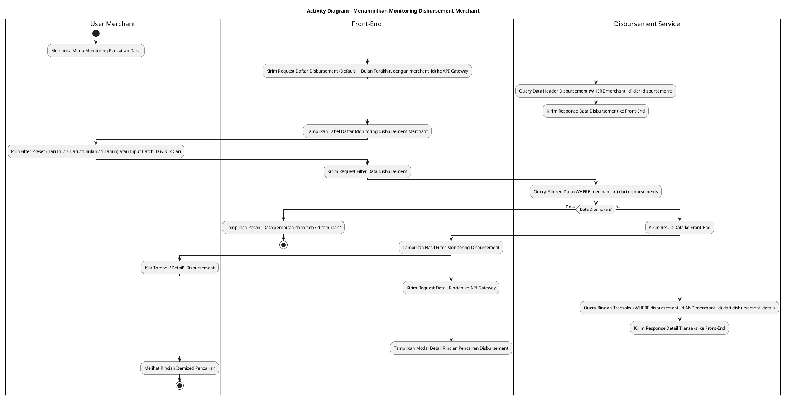
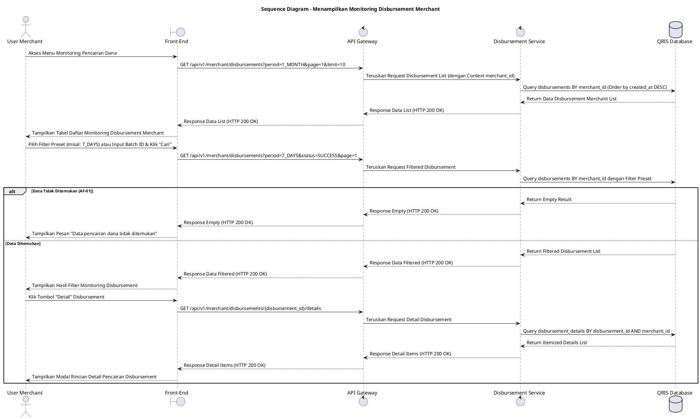

# 1 Deskripsi Use Case

**Tabel 1: Deskripsi Use Case Menampilkan Monitoring Disbursement Merchant**

| Elemen Spesifikasi | Deskripsi Detail |
| --- | --- |
| ID Use Case | UC-BOM-010 |
| Nama Use Case | Menampilkan Monitoring Disbursement Merchant |
| Penjelasan Singkat | Fitur Portal Back Office Merchant yang memungkinkan User Merchant memantau status eksekusi pencairan dana (*disbursement*) ke rekening bank merchant secara real-time dari tabel `disbursements` dan `disbursement_details` menggunakan Disbursement Service yang WAJIB difilter berdasarkan `merchant_id`. |
| Aktor Utama | User Merchant (Merchant Owner / Merchant Admin) |
| Aktor Pendukung | Disbursement Service |
| Deskripsi Singkat | User Merchant melakukan otentikasi login ke Portal Back Office Merchant dan mengakses menu **Keuangan & Settlement** -> **Monitoring Pencairan Dana (Disbursement)**. Front-End mengirimkan request ke API Gateway untuk memuat daftar pencairan dana merchant dengan filter default **1 Bulan Terakhir**. Sistem memfasilitasi Pilihan Filter Preset mencakup **Hari Ini**, **7 Hari Terakhir**, **1 Bulan Terakhir** (Periode Default), dan **1 Tahun Terakhir**, serta pencarian kustom berdasarkan Nomor Referensi / Batch ID dan Status Disbursement (`SUCCESS`, `PENDING`, `PROCESSING`, `FAILED`). Disbursement Service melakukan kueri ke tabel **`disbursements` secara WAJIB memfilter `merchant_id`** akun merchant dan mengembalikan data mencakup Batch ID, Tanggal Transfer, Rekening Bank Tujuan, Total Nominal Disbursement, Biaya Transfer, dan Status Pencairan. Front-End menampilkan data dalam tabel interaktif beserta tombol **"Detail"**. Saat User Merchant mengklik **"Detail"**, Disbursement Service melakukan kueri rincian item ke tabel **`disbursement_details`** dan Front-End menyajikan modal rincian transaksi per item secara lengkap. |
| Pre-condition | User Merchant telah berhasil login ke Portal Back Office Merchant dan memiliki sesi akun merchant yang aktif. |
| Post-condition | Front-End berhasil menyajikan tabel daftar transaksi pencairan dana merchant dan rincian itemized dari `disbursement_details` khusus untuk `merchant_id` tersebut. |
| Trigger | User Merchant mengakses menu Monitoring Pencairan Dana atau memilih opsi filter preset / pencarian data pencairan pada Portal Merchant. |
| Nama Tabel | disbursements, disbursement_details |
| Integrasi | 1. **Back Office Merchant Web UI:** Antarmuka tabel monitoring pencairan dana merchant beserta komponen filter preset dan modal detail. 2. **Disbursement Service:** Microservice backend pengelola transaksi pencairan dana ke rekening merchant. 3. **QRIS Database:** Penyimpanan data header pencairan (`disbursements`) dan rincian itemized pencairan (`disbursement_details`). |
| Asumsi | 1. Data eksekusi pencairan dana pada tabel `disbursements` dan `disbursement_details` diperbarui secara real-time oleh Disbursement Service setelah instruksi transfer diselesaikan oleh Core Banking. 2. Halaman monitoring menggunakan metode pembagian halaman (*pagination*) untuk menjaga performa muat data. |
| Keterbatasan | 1. Pemantauan disbursement pada use case ini bersifat read-only dan terisolasi khusus untuk data merchant yang bersangkutan. 2. Filter preset rentang waktu acuan membatasi kueri maksimum 1 tahun terakhir untuk menjaga performa sistem. |
| Aturan Bisnis/Sistem | 1. **Mandatory Merchant Scope Isolation:** Kueri pencarian data pencairan pada tabel `disbursements` dan `disbursement_details` **WAJIB menyertakan filter `WHERE merchant_id = :session_merchant_id`**. 2. **Preset Period Filter Standard:** Sistem WAJIB menyediakan 4 opsi filter preset acuan: &nbsp;&nbsp;- **Hari Ini:** Menampilkan data pencairan untuk hari berjalan. &nbsp;&nbsp;- **7 Hari Terakhir:** Menampilkan data pencairan 7 hari ke belakang. &nbsp;&nbsp;- **1 Bulan Terakhir:** Menampilkan data pencairan 30 hari ke belakang (periode default). &nbsp;&nbsp;- **1 Tahun Terakhir:** Menampilkan data pencairan 365 hari ke belakang. 3. **Disbursement Itemized Details Association:** Setiap baris rincian pada modal detail WAJIB mengambil data dari `disbursement_details` yang terhubung via `disbursement_id`. 4. **Pagination Standard:** Daftar pencairan dana wajib ditampilkan dengan pagination (default 10 atau 25 data per halaman). |
| Session Idle | 15 Menit |

# 2 Main Flow

**Tabel 2: Main Flow Menampilkan Monitoring Disbursement Merchant**

| No. | Aktivitas | Deskripsi |
| ---: | --- | --- |
| 1 | Membuka Menu Monitoring Disbursement | User Merchant melakukan login ke Portal Merchant dan mengklik menu **Keuangan & Settlement** -> **Monitoring Pencairan Dana**. |
| 2 | Mengirim Request Daftar Disbursement | Front-End mengirimkan request ke API Gateway untuk mengambil data pencairan dana merchant terbaru (dengan `merchant_id`) dengan filter default **1 Bulan Terakhir**. |
| 3 | Query Data Header Disbursement | Disbursement Service melakukan kueri ke tabel `disbursements` (WHERE `merchant_id`) mengambil Batch ID, Rekening Tujuan, Total Nominal, Status, dan Timestamp. |
| 4 | Menampilkan Daftar Disbursement | Front-End menyajikan tabel daftar pencairan disbursement merchant beserta komponen filter preset (**Hari Ini**, **7 Hari Terakhir**, **1 Bulan Terakhir**, **1 Tahun Terakhir**) dan tombol pagination. |
| 5 | Memilih Filter Preset / Parameter Pencarian | User Merchant memilih opsi filter preset (misal: **7 Hari Terakhir**) atau memasukkan parameter pencarian Batch ID/Status dan mengklik tombol **"Cari"**. |
| 6 | Mengirim Request Filter Data | Front-End mengirimkan request pencarian berparameter ke API Gateway. |
| 7 | Query Filtered Disbursement Data | Disbursement Service menjalankan kueri berfilter pada tabel `disbursements` (tetap memfilter `merchant_id`) dan mengembalikan data hasil pencarian. |
| 8 | Menampilkan Hasil Filter Disbursement | Front-End memperbarui tabel dengan menyajikan daftar pencairan disbursement yang cocok beserta ringkasan total nominal. |
| 9 | Membuka Detail Disbursement | User Merchant mengklik tombol **"Detail"** pada salah satu baris data pencairan. |
| 10 | Query Detail Transaksi Disbursement | Disbursement Service melakukan kueri rincian itemized ke tabel `disbursement_details` berdasarkan `disbursement_id` dan `merchant_id`. |
| 11 | Menampilkan Detail Transaksi Disbursement | Front-End menampilkan modal/halaman detail yang menyajikan rincian per transaksi yang masuk dalam paket pencairan dana tersebut. |
| 12 | Use Case Selesai | Pemantauan data disbursement merchant selesai dilaksanakan. |

# 3 Alternative Flow

**Tabel 3: Alternative Flow Menampilkan Monitoring Disbursement Merchant**

| Kode | Alternative Flow | Deskripsi |
| --- | --- | --- |
| AF-01 | Data Disbursement Tidak Ditemukan | Pada langkah 7 atau 10, apabila kriteria filter pencarian atau rincian detail tidak cocok dengan `merchant_id`, Sistem mengembalikan data kosong dan Front-End menampilkan `Data pencairan dana tidak ditemukan`. |
| AF-02 | Gangguan Koneksi Database Server | Pada langkah 3, 7, atau 10, apabila koneksi database terputus, Sistem mengembalikan HTTP status 500 dan Front-End menampilkan `Gagal memuat data monitoring pencairan dana`. |

# 4 Status Front-End

**Tabel 4: Status Front-End Menampilkan Monitoring Disbursement Merchant**

| No. | Nama Status | Deskripsi Tampilan Front-End |
| ---: | --- | --- |
| 1 | LOADING | Indikator muat data (*spinner/skeleton*) ditampilkan pada tabel atau modal detail saat data diproses dari server. |
| 2 | SUCCESS | Tabel daftar monitoring disbursement dan modal rincian detail menyajikan data pencairan dana merchant secara valid sesuai filter preset. |
| 3 | EMPTY | Tabel menyajikan tampilan *empty state* saat tidak ada data pencairan yang cocok dengan parameter filter pencarian. |
| 4 | ERROR | Pesan kesalahan disertai tombol **"Retry"** ditampilkan pada UI akibat gangguan server atau validasi filter gagal. |

# 5 Activity Diagram Menampilkan Monitoring Disbursement Merchant

# 6 Sequence Diagram Menampilkan Monitoring Disbursement Merchant

# 7 Response Code

**Tabel 5: Response Code Menampilkan Monitoring Disbursement Merchant**

| No. | HTTP Status | Response Code | Nama Response | Deskripsi | Respons Front-End |
| ---: | ---: | --- | --- | --- | --- |
| 1 | 200 | 200XX00 | SUCCESS_GET_MONITORING_DISBURSEMENT | Data daftar pencairan disbursement merchant berhasil diambil dari server sesuai filter preset. | Menampilkan tabel daftar pencairan disbursement merchant secara lengkap. |
| 2 | 400 | 400XX00 | INVALID_SEARCH_FILTER | Parameter filter pencarian atau opsi preset filter tidak valid. | Menampilkan pesan kesalahan `Filter pencarian tidak valid`. |
| 3 | 404 | 404XX00 | DISBURSEMENT_NOT_FOUND | Data pencairan disbursement atau rincian detail tidak ditemukan berdasarkan kriteria pencarian yang dimasukkan. | Menampilkan tabel dalam kondisi *empty state* dengan pesan `Data pencairan dana tidak ditemukan`. |
| 4 | 500 | 500XX00 | SYSTEM_INTERNAL_ERROR | Terjadi kegagalan internal server saat mengambil data disbursement merchant. | Menampilkan indikator error pada UI dan tombol *retry*. |
| 5 | 504 | 504XX00 | DATABASE_QUERY_TIMEOUT | Kueri ke tabel `disbursements` / `disbursement_details` mengalami batas waktu habis (timeout). | Menampilkan pesan kesalahan `Gagal memuat data monitoring disbursement akibat timeout`. |

# 8 Desain Antarmuka

**Tabel 6: Desain Antarmuka Menampilkan Monitoring Disbursement Merchant**

| Halaman | Komponen dan State Utama |
| --- | --- |
| Monitoring Disbursement Merchant | 1. **Tombol Filter Preset:** Pilihan Preset (**Hari Ini**, **7 Hari Terakhir**, **1 Bulan Terakhir** *(Default)*, **1 Tahun Terakhir**). 2. **Bilah Pencarian:** Input Batch ID / Referensi, Dropdown Status (`SUCCESS`, `PENDING`, `PROCESSING`, `FAILED`), dan Tombol **"Cari"** / **"Reset"**. 3. **Tabel Disbursement:** Kolom Batch ID, Tanggal Transfer, Rekening Tujuan, Total Nominal Transfer, Status, dan Tombol Aksi **"Detail"**. 4. **Pagination Control:** Komponen navigasi halaman (First, Prev, Page Numbers, Next, Last). 5. **State Indicator:** Tampilan LOADING (Spinner), SUCCESS, EMPTY, dan ERROR. |
| Modal Detail Disbursement Merchant | 1. **Header Ringkasan:** Batch ID, Tanggal Transfer, Total Nominal Transfer, dan Status Badge. 2. **Tabel Rincian Item (`disbursement_details`):** Kolom RRN, Tanggal Transaksi, Nominal Transaksi, Biaya MDR, Nominal Netto Disetorkan, dan Status Item. 3. **Tombol "Tutup":** Menutup modal rincian detail pencairan. |
