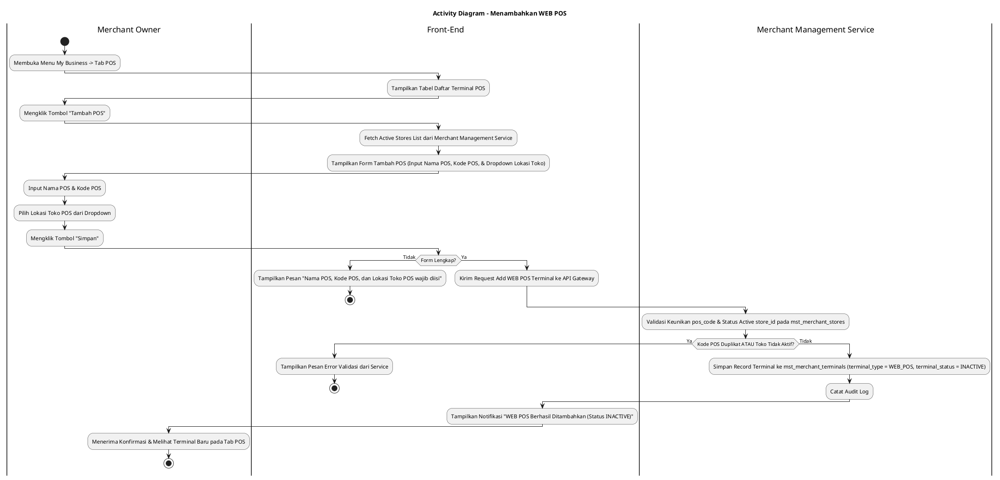
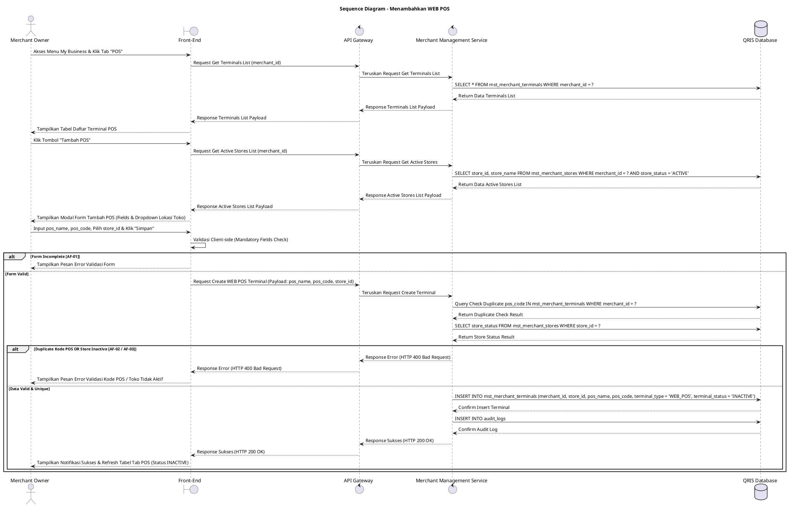

# 1 Deskripsi Use Case

**Tabel 1: Deskripsi Use Case Menambahkan WEB POS**

| Elemen Spesifikasi | Deskripsi Detail |
| --- | --- |
| ID Use Case | UC-BOM-011 |
| Nama Use Case | Menambahkan WEB POS |
| Penjelasan Singkat | Fitur Back Office Merchant pada menu My Business yang memfasilitasi Merchant Owner untuk mendaftarkan terminal WEB POS baru di bawah entitas merchant dengan menginput Nama POS, Kode POS, dan memilih Lokasi Toko POS pada tabel `mst_merchant_terminals` dan `mst_merchant_stores` melalui Merchant Management Service. |
| Aktor Utama | Merchant Owner |
| Aktor Pendukung | Merchant Management Service |
| Deskripsi Singkat | Merchant Owner melakukan otentikasi login ke Back Office Merchant dan mengakses menu **My Business**. Pada halaman My Business, Merchant Owner memilih tab **POS**. Sistem menampilkan daftar terminal POS yang sudah terdaftar beserta tombol aksi **"Tambah POS"**. Merchant Owner mengklik tombol **"Tambah POS"** sehingga sistem menampilkan modal formulir pendaftaran terminal POS baru. Merchant Owner menginput Nama POS (*pos_name*), Kode POS (*pos_code* / *terminal_code*), dan memilih Lokasi Toko POS (*store_id*) yang diambil dari relasi tabel `mst_merchant_stores`. Merchant Owner mengklik tombol **"Simpan"**. Front-End memvalidasi kelengkapan data dan mengirim request pendaftaran ke API Gateway. Merchant Management Service memvalidasi keunikan `pos_code` di bawah merchant tersebut dan memastikan status keaktifan toko pada tabel **`mst_merchant_stores`**. Setelah validasi sukses, Merchant Management Service menyimpan record terminal POS baru ke tabel **`mst_merchant_terminals`** dengan menetapkan tipe terminal secara otomatis sebagai WEB POS (`terminal_type = 'WEB_POS'`) dan status awal penambahan secara baku sebagai **`INACTIVE`** (`terminal_status = 'INACTIVE'`). Front-End memperbarui tabel daftar terminal POS pada tab POS dan menampilkan notifikasi konfirmasi sukses. |
| Pre-condition | 1. Merchant Owner telah berhasil login ke Back Office Merchant dan berstatus aktif. 2. Merchant memiliki minimal 1 (satu) toko/cabang yang terdaftar aktif pada tabel `mst_merchant_stores`. |
| Post-condition | 1. Terminal WEB POS baru berhasil tersimpan pada tabel `mst_merchant_terminals` dengan relasi `store_id` ke `mst_merchant_stores`, `terminal_type = 'WEB_POS'`, dan status awal `terminal_status = 'INACTIVE'`. 2. Terminal WEB POS memerlukan tindakan aktivasi sebelum dapat digunakan oleh kasir/staff merchant untuk transaksi. 3. Front-End menyajikan data terminal WEB POS baru pada tab POS halaman My Business. |
| Trigger | Merchant Owner mengklik menu **My Business**, memilih tab **POS**, mengklik tombol **"Tambah POS"**, mengisi Nama POS, Kode POS, memilih Lokasi Toko POS, lalu mengklik **"Simpan"**. |
| Nama Tabel | mst_merchant_terminals, mst_merchant_stores, audit_logs |
| Integrasi | 1. **Back Office Merchant UI:** Antarmuka pengelolaan bisnis merchant, tab POS, dan modal form pendaftaran terminal WEB POS. 2. **Merchant Management Service:** Microservice backend pengelola pendaftaran terminal POS, manajemen outlet/toko, serta otorisasi merchant. |
| Asumsi | 1. Setiap terminal WEB POS terikat secara eksplisit pada satu lokasi toko/cabang (`store_id`) dari `mst_merchant_stores`. 2. Kode POS (*pos_code*) merupakan pengenal unik untuk tiap terminal di dalam entitas merchant yang sama. 3. Status awal terminal yang baru dibuat diatur `INACTIVE` untuk memastikan pengujian atau penyiapan terminal sebelum dioperasikan. |
| Keterbatasan | 1. Penambahan WEB POS hanya dapat ditautkan pada lokasi toko yang berstatus aktif (`store_status = 'ACTIVE'`). 2. Kode POS (*pos_code*) tidak boleh duplikat untuk merchant yang sama pada tabel `mst_merchant_terminals`. |
| Aturan Bisnis/Sistem | 1. **Terminal Type Auto-Assignment:** Setiap terminal POS yang ditambahkan melalui pendaftaran ini WAJIB secara otomatis ditetapkan memiliki nilai `terminal_type = 'WEB_POS'` pada tabel `mst_merchant_terminals`. 2. **Default Initial Status Standard:** Setiap terminal WEB POS baru yang dibuat WAJIB ditetapkan memiliki status awal **`INACTIVE`** (`terminal_status = 'INACTIVE'`) pada tabel `mst_merchant_terminals`. 3. **Mandatory Input Fields:** Pengisian Nama POS (`pos_name`), Kode POS (`pos_code`), dan Pemilihan Lokasi Toko POS (`store_id`) bersifat WAJIB (*mandatory*). 4. **Terminal Code Uniqueness Standard:** Kode POS (`pos_code`) WAJIB unik per merchant pada tabel `mst_merchant_terminals`. 5. **Active Store Relational Integrity:** Pilihan Lokasi Toko POS WAJIB merujuk pada `store_id` yang valid dan berstatus aktif (`store_status = 'ACTIVE'`) pada tabel `mst_merchant_stores`. 6. **Audit Trail Standard:** Setiap tindakan penambahan terminal WEB POS mencatat `terminal_id`, `merchant_id`, `store_id`, `created_by` (ID Merchant Owner), dan timestamp pada `audit_logs`. |
| Session Idle | 15 Menit |

# 2 Main Flow

**Tabel 2: Main Flow Menambahkan WEB POS**

| No. | Aktivitas | Deskripsi |
| ---: | --- | --- |
| 1 | Membuka Menu My Business | Merchant Owner melakukan login dan mengklik menu **My Business** pada navigasi Back Office Merchant. |
| 2 | Memilih Tab POS | Merchant Owner mengklik tab **POS** pada halaman My Business. |
| 3 | Menampilkan Daftar Terminal POS | Sistem menampilkan halaman daftar terminal POS terdaftar dari `mst_merchant_terminals` beserta tombol aksi **"Tambah POS"**. |
| 4 | Memilih Tombol Tambah POS | Merchant Owner mengklik tombol **"Tambah POS"**. |
| 5 | Menampilkan Form Tambah POS | Sistem menampilkan modal formulir pendaftaran WEB POS yang berisi inputan Nama POS, Kode POS, dan dropdown pilihan Lokasi Toko POS dari `mst_merchant_stores`. |
| 6 | Mengisi Form WEB POS | Merchant Owner menginput Nama POS, Kode POS, dan memilih Lokasi Toko POS dari dropdown. |
| 7 | Mengklik Tombol Simpan | Merchant Owner mengklik tombol **"Simpan"**. |
| 8 | Memvalidasi Form Client-side | Front-End memvalidasi kelengkapan form dan format inputan, lalu mengirim request pembuatan terminal POS ke API Gateway. |
| 9 | Memvalidasi & Menyimpan Terminal POS | Merchant Management Service memvalidasi keunikan `pos_code` dan status keaktifan `store_id`, lalu menyimpan record terminal baru ke `mst_merchant_terminals` (`terminal_type = 'WEB_POS'`, `terminal_status = 'INACTIVE'`). |
| 10 | Menampilkan Konfirmasi Berhasil | Front-End memperbarui tabel daftar terminal POS pada tab POS (dengan status `INACTIVE`) dan menampilkan notifikasi konfirmasi bahwa WEB POS berhasil ditambahkan. |
| 11 | Use Case Selesai | Proses penambahan terminal WEB POS selesai dilaksanakan. |

# 3 Alternative Flow

**Tabel 3: Alternative Flow Menambahkan WEB POS**

| Kode | Alternative Flow | Deskripsi |
| --- | --- | --- |
| AF-01 | Nama POS, Kode POS, atau Lokasi Toko Kosong | Pada langkah 7-8, apabila Nama POS, Kode POS, atau Lokasi Toko POS dikosongkan, Sistem menolak request dan Front-End menampilkan `Nama POS, Kode POS, dan Lokasi Toko POS wajib diisi`. |
| AF-02 | Kode POS Sudah Terdaftar pada Merchant | Pada langkah 9, apabila `pos_code` yang diinput sudah ada pada tabel `mst_merchant_terminals` di bawah merchant yang sama, Merchant Management Service membatalkan transaksi dan Front-End menampilkan `Kode POS sudah digunakan`. |
| AF-03 | Lokasi Toko POS Tidak Aktif / Tidak Valid | Pada langkah 9, apabila `store_id` yang dipilih tidak ditemukan atau berstatus nonaktif pada `mst_merchant_stores`, Sistem membatalkan transaksi dan Front-End menampilkan `Lokasi Toko POS tidak valid atau dalam status nonaktif`. |
| AF-04 | Gagal Terhubung ke Database Server | Pada langkah 9, apabila koneksi database terputus total, Sistem mengembalikan HTTP status 500 dan Front-End menampilkan `Terjadi kendala internal pada server`. |

# 4 Status Front-End

**Tabel 4: Status Front-End Menambahkan WEB POS**

| No. | Nama Status | Deskripsi Tampilan Front-End |
| ---: | --- | --- |
| 1 | IDLE | Tab POS pada halaman My Business menyajikan tabel daftar terminal dan modal form pendaftaran siap menerima masukan. |
| 2 | LOADING | Indikator memuat (*spinner*) ditampilkan pada tombol Simpan saat request pendaftaran terminal WEB POS sedang diproses server. |
| 3 | SUCCESS | Modal/toast konfirmasi menampilkan pesan sukses terminal WEB POS berhasil disimpan (berstatus `INACTIVE`) dan data tabel diperbarui. |
| 4 | ERROR | Pesan kesalahan ditampilkan pada UI akibat kolom mandatory kosong, duplikasi kode POS, atau toko tidak aktif. |

# 5 Activity Diagram Menambahkan WEB POS

# 6 Sequence Diagram Menambahkan WEB POS

# 7 Response Code

**Tabel 5: Response Code Menambahkan WEB POS**

| No. | HTTP Status | Response Code | Nama Response | Deskripsi | Respons Front-End |
| ---: | ---: | --- | --- | --- | --- |
| 1 | 200 | 200XX00 | SUCCESS_CREATE_WEB_POS | Terminal WEB POS baru berhasil disimpan pada tabel `mst_merchant_terminals` dengan `terminal_status = 'INACTIVE'`. | Menampilkan pesan notifikasi sukses dan memperbarui tabel tab POS. |
| 2 | 400 | 400XX00 | INVALID_POS_INPUT | Nama POS, Kode POS, atau Lokasi Toko POS kosong. | Menampilkan pesan kesalahan validasi input. |
| 3 | 400 | 400XX01 | DUPLICATE_POS_CODE | Kode POS yang dimasukkan sudah terdaftar pada merchant yang sama. | Menampilkan pesan kesalahan `Kode POS sudah digunakan`. |
| 4 | 400 | 400XX02 | STORE_NOT_ACTIVE | Lokasi Toko POS yang dipilih tidak valid atau berstatus nonaktif pada `mst_merchant_stores`. | Menampilkan pesan kesalahan `Lokasi Toko POS tidak valid atau dalam status nonaktif`. |
| 5 | 500 | 500XX00 | SYSTEM_INTERNAL_ERROR | Terjadi kegagalan internal server saat mengeksekusi pendaftaran terminal WEB POS. | Menampilkan pesan kesalahan `Terjadi kendala internal pada server`. |

# 8 Desain Antarmuka

**Tabel 6: Desain Antarmuka Menambahkan WEB POS**

| Halaman | Komponen dan State Utama |
| --- | --- |
| Halaman My Business (Tab POS) | 1. **Navigasi Tab:** Tab Profile, Tab **POS** (Active), Tab Outlets/Stores, Tab Staff. 2. **Tabel Terminal POS:** Kolom No, Nama POS, Kode POS, Tipe (`WEB_POS`), Lokasi Toko (`mst_merchant_stores`), Status (`terminal_status`), dan Aksi. 3. **Tombol "Tambah POS":** Tombol pemicu modal pendaftaran terminal baru (Primary Button). |
| Modal Form Tambah POS | 1. **Field Nama POS (`pos_name`):** Text Input (Mandatory). 2. **Field Kode POS (`pos_code`):** Text Input (Mandatory). 3. **Dropdown Lokasi Toko POS (`store_id`):** Dropdown pilihan toko aktif yang diambil dari `mst_merchant_stores`. 4. **Tombol Aksi:** Tombol **"Simpan"** (Primary) dan **"Batal"** (Secondary). |
