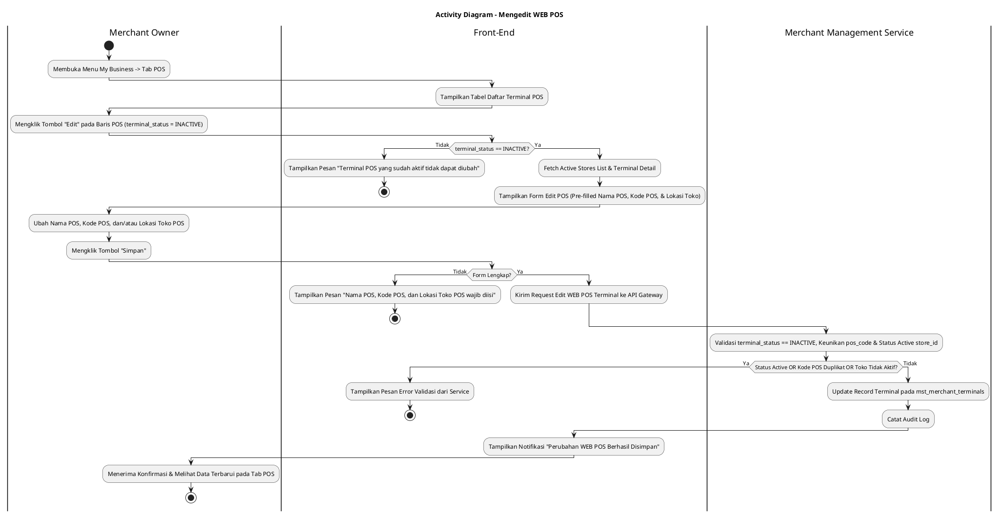
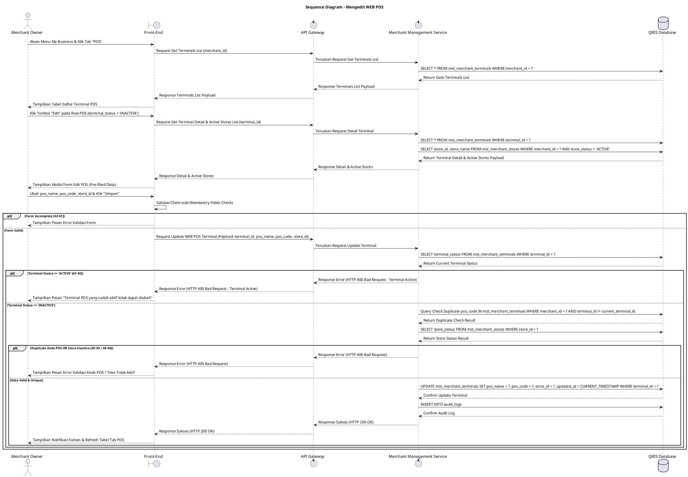

# 1 Deskripsi Use Case

**Tabel 1: Deskripsi Use Case Mengedit WEB POS**

| Elemen Spesifikasi | Deskripsi Detail |
| --- | --- |
| ID Use Case | UC-BOM-012 |
| Nama Use Case | Mengedit WEB POS |
| Penjelasan Singkat | Fitur Back Office Merchant pada menu My Business yang memfasilitasi Merchant Owner untuk mengubah informasi Nama POS, Kode POS, dan Lokasi Toko POS pada terminal WEB POS yang masih berstatus `terminal_status = 'INACTIVE'` pada tabel `mst_merchant_terminals` melalui Merchant Management Service. |
| Aktor Utama | Merchant Owner |
| Aktor Pendukung | Merchant Management Service |
| Deskripsi Singkat | Merchant Owner melakukan otentikasi login ke Back Office Merchant dan mengakses menu **My Business**. Pada halaman My Business, Merchant Owner memilih tab **POS** (atau WEB POS). Sistem menampilkan halaman daftar terminal POS yang telah terdaftar dari tabel `mst_merchant_terminals`. Merchant Owner memilih salah satu terminal WEB POS yang berstatus nonaktif (`terminal_status = 'INACTIVE'`), lalu mengklik tombol aksi **"Edit"**. Sistem menampilkan modal formulir pengeditan WEB POS yang berisi data terkini Nama POS (*pos_name*), Kode POS (*pos_code*), dan pilihan Lokasi Toko POS (*store_id*). Merchant Owner melakukan penyesuaian pada Nama POS, Kode POS, dan/atau memilih Lokasi Toko POS baru dari `mst_merchant_stores`, lalu mengklik tombol **"Simpan"**. Front-End memvalidasi kelengkapan form dan mengirim request pembaruan ke API Gateway. Merchant Management Service memvalidasi bahwa terminal tersebut benar-benar berstatus `terminal_status = 'INACTIVE'`, memverifikasi keunikan `pos_code` jika diubah, dan memastikan toko yang dipilih berstatus aktif pada **`mst_merchant_stores`**. Setelah validasi sukses, Merchant Management Service memperbarui record terminal pada tabel **`mst_merchant_terminals`**. Front-End memperbarui tabel daftar terminal POS dan menyajikan notifikasi konfirmasi bahwa perubahan data WEB POS berhasil disimpan. |
| Pre-condition | 1. Merchant Owner telah berhasil login ke Back Office Merchant dan berstatus aktif. 2. Terminal WEB POS yang akan diubah terdaftar pada tabel `mst_merchant_terminals` dengan status nonaktif (`terminal_status = 'INACTIVE'`). |
| Post-condition | 1. Data Nama POS (`pos_name`), Kode POS (`pos_code`), dan Lokasi Toko POS (`store_id`) diperbarui pada tabel `mst_merchant_terminals`. 2. Status terminal WEB POS tetap dipertahankan sebagai `terminal_status = 'INACTIVE'`. 3. Front-End menyajikan data terminal WEB POS terbaru pada tab POS halaman My Business. |
| Trigger | Merchant Owner mengklik menu **My Business**, memilih tab **POS**, mengklik tombol **"Edit"** pada baris terminal berstatus `terminal_status = 'INACTIVE'`, mengubah data, lalu mengklik **"Simpan"**. |
| Nama Tabel | mst_merchant_terminals, mst_merchant_stores, audit_logs |
| Integrasi | 1. **Back Office Merchant UI:** Antarmuka pengelolaan bisnis merchant, tab POS, dan modal form pengeditan terminal WEB POS. 2. **Merchant Management Service:** Microservice backend pengelola pembaruan data terminal POS, manajemen outlet/toko, serta otorisasi merchant. |
| Asumsi | 1. Pengeditan terminal WEB POS hanya diizinkan untuk terminal yang belum diaktivasi (`terminal_status = 'INACTIVE'`) guna mencegah disrupsi transaksi operasional. 2. Terminal WEB POS yang sudah berstatus aktif (`terminal_status = 'ACTIVE'`) dilarang diubah secara langsung demi integritas data transaksi. |
| Keterbatasan | 1. Pengeditan hanya berlaku untuk terminal WEB POS yang memiliki `terminal_status = 'INACTIVE'`. 2. Kode POS (`pos_code`) baru tidak boleh duplikat dengan terminal lain milik merchant yang sama. |
| Aturan Bisnis/Sistem | 1. **Status-Based Edit Constraint:** Pengeditan data terminal WEB POS HANYA dapat dilakukan jika `terminal_status = 'INACTIVE'` pada tabel `mst_merchant_terminals`. Apabila terminal berstatus `ACTIVE`, aksi edit wajib dinonaktifkan/ditolak. 2. **Editable Fields Standard:** Elemen yang diizinkan untuk diubah meliputi Nama POS (`pos_name`), Kode POS (`pos_code`), dan Lokasi Toko POS (`store_id`). 3. **Mandatory Fields Constraint:** Kolom Nama POS (`pos_name`), Kode POS (`pos_code`), dan Lokasi Toko POS (`store_id`) bersifat WAJIB diisi (*mandatory*). 4. **Terminal Code Uniqueness Validation:** Apabila Kode POS (`pos_code`) diubah, kode baru WAJIB unik per merchant di bawah tabel `mst_merchant_terminals`. 5. **Active Store Relational Integrity:** Pilihan Lokasi Toko POS WAJIB merujuk pada `store_id` yang valid dan berstatus aktif (`store_status = 'ACTIVE'`) pada tabel `mst_merchant_stores`. 6. **Audit Trail Standard:** Setiap tindakan pengeditan terminal WEB POS mencatat `terminal_id`, `merchant_id`, `created_by` (ID Merchant Owner), rincian perubahan data, dan timestamp pada `audit_logs`. |
| Session Idle | 15 Menit |

# 2 Main Flow

**Tabel 2: Main Flow Mengedit WEB POS**

| No. | Aktivitas | Deskripsi |
| ---: | --- | --- |
| 1 | Membuka Menu My Business | Merchant Owner melakukan login dan mengklik menu **My Business** pada navigasi Back Office Merchant. |
| 2 | Memilih Tab POS | Merchant Owner mengklik tab **POS** pada halaman My Business. |
| 3 | Menampilkan Daftar Terminal POS | Sistem menampilkan halaman daftar terminal POS terdaftar dari `mst_merchant_terminals` beserta tombol aksi **"Edit"** pada baris berstatus `terminal_status = 'INACTIVE'`. |
| 4 | Memilih Tombol Edit POS | Merchant Owner mengklik tombol **"Edit"** pada salah satu baris terminal WEB POS yang berstatus `INACTIVE`. |
| 5 | Menampilkan Form Edit POS | Sistem menampilkan modal formulir pengeditan WEB POS yang sudah terisi (*pre-filled*) dengan data terkini Nama POS, Kode POS, dan pilihan Lokasi Toko POS dari `mst_merchant_stores`. |
| 6 | Mengubah Data WEB POS | Merchant Owner menyesuaikan Nama POS, Kode POS, dan/atau memilih Lokasi Toko POS baru dari dropdown. |
| 7 | Mengklik Tombol Simpan | Merchant Owner mengklik tombol **"Simpan"**. |
| 8 | Memvalidasi Form Client-side | Front-End memvalidasi kelengkapan form dan format inputan, lalu mengirim request pembaruan terminal POS ke API Gateway. |
| 9 | Memvalidasi & Update Terminal POS | Merchant Management Service memvalidasi status `terminal_status = 'INACTIVE'`, keunikan `pos_code` (jika diubah), dan keaktifan `store_id`, lalu memperbarui record terminal pada `mst_merchant_terminals`. |
| 10 | Menampilkan Konfirmasi Berhasil | Front-End memperbarui tabel daftar terminal POS pada tab POS dan menampilkan notifikasi konfirmasi bahwa perubahan WEB POS berhasil disimpan. |
| 11 | Use Case Selesai | Proses pengeditan terminal WEB POS selesai dilaksanakan. |

# 3 Alternative Flow

**Tabel 3: Alternative Flow Mengedit WEB POS**

| Kode | Alternative Flow | Deskripsi |
| --- | --- | --- |
| AF-01 | Nama POS, Kode POS, atau Lokasi Toko Kosong | Pada langkah 7-8, apabila Nama POS, Kode POS, atau Lokasi Toko POS dikosongkan, Sistem menolak request dan Front-End menampilkan `Nama POS, Kode POS, dan Lokasi Toko POS wajib diisi`. |
| AF-02 | Terminal POS Sudah Berstatus Active | Pada langkah 4 atau 9, apabila terminal POS sudah berstatus `terminal_status = 'ACTIVE'`, Sistem menolak aksi pengeditan dan Front-End menampilkan `Terminal POS yang sudah aktif tidak dapat diubah`. |
| AF-03 | Kode POS Baru Sudah Terdaftar | Pada langkah 9, apabila `pos_code` baru yang diinput sudah digunakan oleh terminal lain pada merchant yang sama, Merchant Management Service membatalkan transaksi dan Front-End menampilkan `Kode POS sudah digunakan`. |
| AF-04 | Lokasi Toko POS Tidak Aktif / Tidak Valid | Pada langkah 9, apabila `store_id` yang dipilih berstatus nonaktif pada `mst_merchant_stores`, Sistem membatalkan transaksi dan Front-End menampilkan `Lokasi Toko POS tidak valid atau dalam status nonaktif`. |
| AF-05 | Gagal Terhubung ke Database Server | Pada langkah 9, apabila koneksi database terputus total, Sistem mengembalikan HTTP status 500 dan Front-End menampilkan `Terjadi kendala internal pada server`. |

# 4 Status Front-End

**Tabel 4: Status Front-End Mengedit WEB POS**

| No. | Nama Status | Deskripsi Tampilan Front-End |
| ---: | --- | --- |
| 1 | IDLE | Tab POS pada halaman My Business menyajikan tabel daftar terminal dan modal form edit terisi siap diubah. |
| 2 | LOADING | Indikator memuat (*spinner*) ditampilkan pada tombol Simpan saat request pembaruan terminal WEB POS sedang diproses server. |
| 3 | SUCCESS | Modal/toast konfirmasi menampilkan pesan sukses perubahan terminal WEB POS berhasil disimpan dan data tabel diperbarui. |
| 4 | ERROR | Pesan kesalahan ditampilkan pada UI akibat kolom mandatory kosong, terminal berstatus active, duplikasi kode POS, atau toko tidak aktif. |

# 5 Activity Diagram Mengedit WEB POS

# 6 Sequence Diagram Mengedit WEB POS

# 7 Response Code

**Tabel 5: Response Code Mengedit WEB POS**

| No. | HTTP Status | Response Code | Nama Response | Deskripsi | Respons Front-End |
| ---: | ---: | --- | --- | --- | --- |
| 1 | 200 | 200XX00 | SUCCESS_UPDATE_WEB_POS | Data terminal WEB POS berstatus `INACTIVE` berhasil diperbarui pada tabel `mst_merchant_terminals`. | Menampilkan pesan notifikasi sukses dan memperbarui tabel tab POS. |
| 2 | 400 | 400XX00 | INVALID_POS_UPDATE_INPUT | Nama POS, Kode POS, atau Lokasi Toko POS kosong. | Menampilkan pesan kesalahan validasi input. |
| 3 | 400 | 400XX01 | TERMINAL_ALREADY_ACTIVE | Terminal WEB POS yang akan diubah sudah berstatus `terminal_status = 'ACTIVE'`. | Menampilkan pesan kesalahan `Terminal POS yang sudah aktif tidak dapat diubah`. |
| 4 | 400 | 400XX02 | DUPLICATE_POS_CODE | Kode POS baru yang dimasukkan sudah digunakan oleh terminal lain pada merchant yang sama. | Menampilkan pesan kesalahan `Kode POS sudah digunakan`. |
| 5 | 400 | 400XX03 | STORE_NOT_ACTIVE | Lokasi Toko POS yang dipilih tidak valid atau berstatus nonaktif pada `mst_merchant_stores`. | Menampilkan pesan kesalahan `Lokasi Toko POS tidak valid atau dalam status nonaktif`. |
| 6 | 500 | 500XX00 | SYSTEM_INTERNAL_ERROR | Terjadi kegagalan internal server saat mengeksekusi pengeditan terminal WEB POS. | Menampilkan pesan kesalahan `Terjadi kendala internal pada server`. |

# 8 Desain Antarmuka

**Tabel 6: Desain Antarmuka Mengedit WEB POS**

| Halaman | Komponen dan State Utama |
| --- | --- |
| Halaman My Business (Tab POS) | 1. **Navigasi Tab:** Tab Profile, Tab **POS** (Active), Tab Outlets/Stores, Tab Staff. 2. **Tabel Terminal POS:** Kolom No, Nama POS, Kode POS, Tipe (`WEB_POS`), Lokasi Toko (`mst_merchant_stores`), Status (`terminal_status`), dan Aksi. 3. **Tombol "Edit":** Tombol aksi pengeditan yang aktif khusus pada baris terminal dengan `terminal_status = 'INACTIVE'`. |
| Modal Form Edit POS | 1. **Field Nama POS (`pos_name`):** Text Input (Editable, Mandatory). 2. **Field Kode POS (`pos_code`):** Text Input (Editable, Mandatory). 3. **Dropdown Lokasi Toko POS (`store_id`):** Dropdown pilihan toko aktif dari `mst_merchant_stores`. 4. **Tombol Aksi:** Tombol **"Simpan"** (Primary) dan **"Batal"** (Secondary). |
