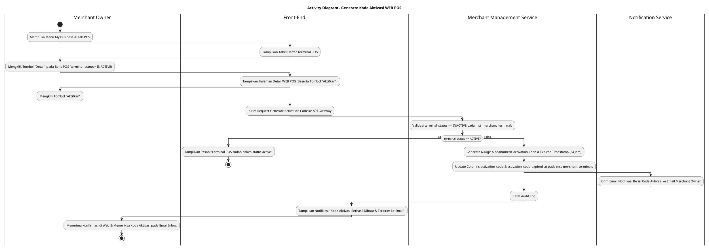
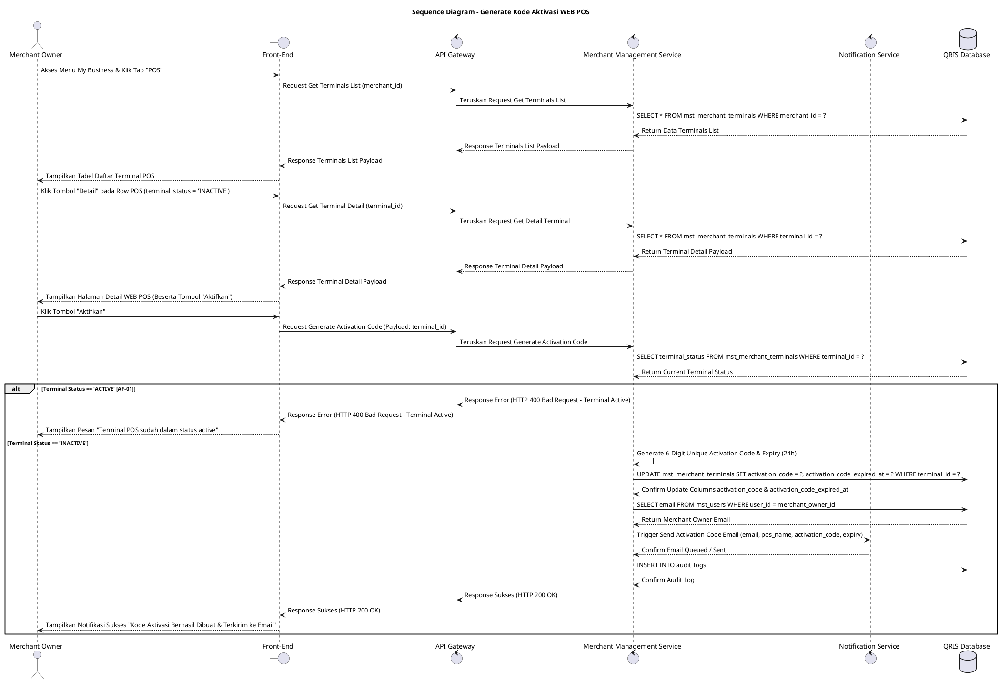

# 1 Deskripsi Use Case

**Tabel 1: Deskripsi Use Case Generate Kode Aktivasi WEB POS**

| Elemen Spesifikasi | Deskripsi Detail |
| --- | --- |
| ID Use Case | UC-BOM-013 |
| Nama Use Case | Generate Kode Aktivasi WEB POS |
| Penjelasan Singkat | Fitur Back Office Merchant pada menu My Business yang memfasilitasi Merchant Owner untuk menghasilkan kode aktivasi (*activation code*) unik bagi terminal WEB POS berstatus `terminal_status = 'INACTIVE'`, memproses update pada kolom `activation_code` dan `activation_code_expired_at` di tabel `mst_merchant_terminals`, serta mengirimkan kode aktivasi tersebut ke email Merchant Owner melalui Merchant Management Service dan Notification Service. |
| Aktor Utama | Merchant Owner |
| Aktor Pendukung | Merchant Management Service, Notification Service |
| Deskripsi Singkat | Merchant Owner melakukan otentikasi login ke Back Office Merchant dan mengakses menu **My Business**. Pada halaman My Business, Merchant Owner memilih tab **POS** (atau WEB POS). Sistem menampilkan daftar terminal POS terdaftar dari tabel `mst_merchant_terminals`. Merchant Owner memilih salah satu terminal WEB POS yang berstatus nonaktif (`terminal_status = 'INACTIVE'`), lalu mengklik tombol aksi **"Detail"**. Sistem menampilkan halaman/modal rincian detail WEB POS beserta tombol aksi **"Aktifkan"** (atau Generate Kode Aktivasi). Merchant Owner mengklik tombol **"Aktifkan"**. Front-End mengirim request pembuatan kode aktivasi ke API Gateway. Merchant Management Service memvalidasi status terminal `terminal_status = 'INACTIVE'`, menghasilkan Kode Aktivasi (*activation_code*) acak bernilai unik (alphanumeric 6 digit) yang dilengkapi durasi kedaluwarsa 24 jam, serta memproses update pada kolom **`activation_code`** dan **`activation_code_expired_at`** pada tabel **`mst_merchant_terminals`**. Selanjutnya, Merchant Management Service memicu Notification Service untuk mengirimkan email pemberitahuan berisi Kode Aktivasi WEB POS ke alamat email Merchant Owner yang terdaftar. Front-End menampilkan modal/toast konfirmasi sukses bahwa kode aktivasi berhasil di-generate dan telah dikirimkan ke email Merchant Owner. |
| Pre-condition | 1. Merchant Owner telah berhasil login ke Back Office Merchant dan berstatus aktif. 2. Terminal WEB POS yang dipilih terdaftar pada tabel `mst_merchant_terminals` dengan status `terminal_status = 'INACTIVE'`. 3. Alamat email Merchant Owner terdaftar aktif pada sistem (`mst_users`). |
| Post-condition | 1. Kolom `activation_code` dan `activation_code_expired_at` (timestamp kedaluwarsa 24 jam) berhasil diperbarui pada tabel `mst_merchant_terminals`. 2. Pesan email memuat Kode Aktivasi WEB POS berhasil dikirimkan ke email Merchant Owner. 3. Status terminal WEB POS tetap `terminal_status = 'INACTIVE'` hingga peramban WEB POS berhasil menyelesaikan alur pengikatan/aktivasi menggunakan kode tersebut. 4. Front-End menyajikan konfirmasi pengiriman kode aktivasi pada layar detail WEB POS. |
| Trigger | Merchant Owner mengklik menu **My Business**, memilih tab **POS**, mengklik tombol **"Detail"** pada terminal berstatus `INACTIVE`, lalu mengklik tombol **"Aktifkan"**. |
| Nama Tabel | mst_merchant_terminals, mst_users, audit_logs |
| Integrasi | 1. **Back Office Merchant UI:** Antarmuka pengelolaan bisnis merchant, tab POS, halaman detail terminal POS, dan dialog pengaktifan. 2. **Merchant Management Service:** Microservice backend pengelola pembaruan kolom `activation_code` & `activation_code_expired_at` serta otorisasi. 3. **Notification Service:** Service pengirim pesan email notifikasi berisi Kode Aktivasi ke email Merchant Owner. |
| Asumsi | 1. Kode aktivasi digunakan oleh kasir/staff merchant pada peramban web POS lokal untuk melakukan registrasi/binding peramban. 2. Kode aktivasi memiliki batas waktu kedaluwarsa (24 jam) demi keamanan sistem. |
| Keterbatasan | 1. Penjanaan kode aktivasi hanya diperbolehkan untuk terminal WEB POS yang berstatus `terminal_status = 'INACTIVE'`. 2. Terminal WEB POS yang sudah berstatus `terminal_status = 'ACTIVE'` tidak dapat diaktifkan ulang melalui alur ini. |
| Aturan Bisnis/Sistem | 1. **Inactive Status Activation Constraint:** Fitur generate kode aktivasi HANYA dapat diakses untuk terminal WEB POS yang berstatus `terminal_status = 'INACTIVE'`. 2. **Database Update Standard:** Eksekusi generate kode aktivasi WAJIB memperbarui kolom **`activation_code`** (alphanumeric 6 digit acak & unik) dan **`activation_code_expired_at`** (`CURRENT_TIMESTAMP + 24 Jam`) pada tabel `mst_merchant_terminals`. 3. **Email Notification Dispatch Standard:** Sistem WAJIB secara otomatis mengirimkan email notifikasi berisi informasi Nama POS, Kode POS, Lokasi Toko, Kode Aktivasi, dan Masa Berlaku Kode ke email resmi Merchant Owner. 4. **Audit Trail Standard:** Setiap tindakan penjanaan kode aktivasi mencatat `terminal_id`, `merchant_id`, `generated_by` (ID Merchant Owner), timestamp, dan email tujuan pada `audit_logs`. |
| Session Idle | 15 Menit |
| Masa Berlaku Kode Aktivasi POS | 60 Menit |

# 2 Main Flow

**Tabel 2: Main Flow Generate Kode Aktivasi WEB POS**

| No. | Aktivitas | Deskripsi |
| ---: | --- | --- |
| 1 | Membuka Menu My Business | Merchant Owner melakukan login dan mengklik menu **My Business** pada navigasi Back Office Merchant. |
| 2 | Memilih Tab POS | Merchant Owner mengklik tab **POS** pada halaman My Business. |
| 3 | Menampilkan Daftar Terminal POS | Sistem menampilkan halaman daftar terminal POS terdaftar dari `mst_merchant_terminals`. |
| 4 | Memilih Tombol Detail POS | Merchant Owner mengklik tombol **"Detail"** pada salah satu baris terminal WEB POS yang berstatus `terminal_status = 'INACTIVE'`. |
| 5 | Menampilkan Detail WEB POS | Sistem menampilkan halaman/modal detail WEB POS yang memuat informasi Nama POS, Kode POS, Lokasi Toko, Status `INACTIVE`, serta tombol **"Aktifkan"**. |
| 6 | Memilih Tombol Aktifkan | Merchant Owner mengklik tombol **"Aktifkan"**. |
| 7 | Memvalidasi & Update Kode Aktivasi | Merchant Management Service memvalidasi status `terminal_status = 'INACTIVE'`, membuat Kode Aktivasi unik beserta timestamp kedaluwarsa (24 jam), lalu meng-update kolom `activation_code` dan `activation_code_expired_at` pada tabel `mst_merchant_terminals`. |
| 8 | Mengirim Email Notifikasi | Merchant Management Service memicu Notification Service untuk mengonstruksi dan mengirimkan email berisi Kode Aktivasi ke email Merchant Owner. |
| 9 | Menampilkan Konfirmasi Berhasil | Front-End menampilkan modal/toast notifikasi konfirmasi bahwa Kode Aktivasi berhasil di-generate dan telah dikirimkan ke email Merchant Owner. |
| 10 | Use Case Selesai | Proses generate kode aktivasi WEB POS selesai dilaksanakan. |

# 3 Alternative Flow

**Tabel 3: Alternative Flow Generate Kode Aktivasi WEB POS**

| Kode | Alternative Flow | Deskripsi |
| --- | --- | --- |
| AF-01 | Terminal POS Sudah Berstatus Active | Pada langkah 4-6, apabila terminal POS sudah berstatus `terminal_status = 'ACTIVE'`, Sistem menolak aksi dan Front-End menampilkan `Terminal POS sudah dalam status active`. |
| AF-02 | Layanan Email Service Gagal / Timeout | Pada langkah 8, apabila Notification Service mengalami kegagalan pengiriman email, Sistem tetap menyimpan update `activation_code` pada database dan Front-End menampilkan `Kode aktivasi berhasil dibuat, tetapi email notifikasi gagal terkirim`. |
| AF-03 | Gagal Terhubung ke Database Server | Pada langkah 7, apabila koneksi database terputus total, Sistem mengembalikan HTTP status 500 dan Front-End menampilkan `Terjadi kendala internal pada server`. |

# 4 Status Front-End

**Tabel 4: Status Front-End Generate Kode Aktivasi WEB POS**

| No. | Nama Status | Deskripsi Tampilan Front-End |
| ---: | --- | --- |
| 1 | IDLE | Halaman detail terminal WEB POS (status `INACTIVE`) menyajikan tombol Aktifkan siap diklik. |
| 2 | LOADING | Indikator memuat (*spinner*) ditampilkan pada tombol Aktifkan saat request penjanaan kode dan pengiriman email sedang diproses server. |
| 3 | SUCCESS | Modal/toast konfirmasi menampilkan pesan sukses kode aktivasi telah berhasil dibuat dan dikirimkan ke email Merchant Owner. |
| 4 | ERROR | Pesan kesalahan ditampilkan pada UI akibat terminal sudah active atau kendala server. |

# 5 Activity Diagram Generate Kode Aktivasi WEB POS

# 6 Sequence Diagram Generate Kode Aktivasi WEB POS

# 7 Response Code

**Tabel 5: Response Code Generate Kode Aktivasi WEB POS**

| No. | HTTP Status | Response Code | Nama Response | Deskripsi | Respons Front-End |
| ---: | ---: | --- | --- | --- | --- |
| 1 | 200 | 200XX00 | SUCCESS_GENERATE_ACTIVATION_CODE | Kode aktivasi WEB POS berhasil diperbarui pada `activation_code` & `activation_code_expired_at` dan terkirim ke email Merchant Owner. | Menampilkan pesan notifikasi sukses pada layar detail WEB POS. |
| 2 | 400 | 400XX00 | TERMINAL_ALREADY_ACTIVE | Terminal WEB POS yang dipilih sudah berstatus `terminal_status = 'ACTIVE'`. | Menampilkan pesan kesalahan `Terminal POS sudah dalam status active`. |
| 3 | 404 | 404XX00 | TERMINAL_NOT_FOUND | Terminal POS tidak ditemukan pada database `mst_merchant_terminals`. | Menampilkan pesan kesalahan `Data terminal POS tidak ditemukan`. |
| 4 | 500 | 500XX00 | SYSTEM_INTERNAL_ERROR | Terjadi kegagalan internal server saat mengeksekusi pembuatan kode aktivasi. | Menampilkan pesan kesalahan `Terjadi kendala internal pada server`. |

# 8 Desain Antarmuka

**Tabel 6: Desain Antarmuka Generate Kode Aktivasi WEB POS**

| Halaman | Komponen dan State Utama |
| --- | --- |
| Halaman Detail WEB POS | 1. **Header & Informasi Terminal:** Menampilkan Nama POS, Kode POS, Lokasi Toko POS, dan Status Badge (`INACTIVE`). 2. **Tombol "Aktifkan":** Tombol pemicu pembuatan kode aktivasi (Primary Button). 3. **Tombol Kembali:** Navigasi kembali ke tabel daftar POS. |
| Modal Konfirmasi Kode Aktivasi | 1. **Header Berhasil:** Notifikasi penjanaan kode aktivasi sukses. 2. **Info Email:** Keterangan bahwa kode aktivasi 6-digit telah dikirimkan ke email Merchant Owner. 3. **Tombol Aksi:** Tombol **"Tutup"** (Primary). |
