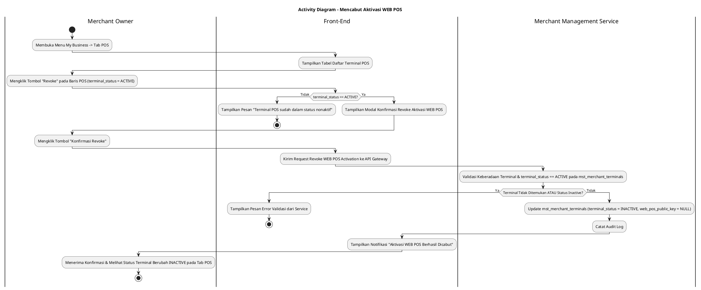
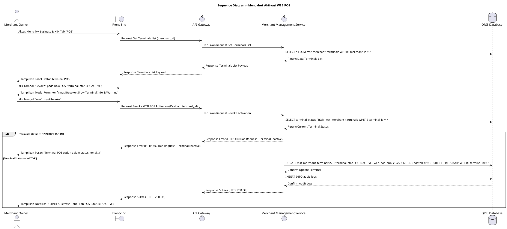

# 1 Deskripsi Use Case

**Tabel 1: Deskripsi Use Case Mencabut Aktivasi WEB POS**

| Elemen Spesifikasi | Deskripsi Detail |
| --- | --- |
| ID Use Case | UC-BOM-014 |
| Nama Use Case | Mencabut Aktivasi WEB POS |
| Penjelasan Singkat | Fitur Back Office Merchant pada menu My Business yang memfasilitasi Merchant Owner untuk mencabut status aktivasi (*revoke activation*) terminal WEB POS yang sedang berstatus aktif (`terminal_status = 'ACTIVE'`) dengan memperbarui `terminal_status = 'INACTIVE'` dan mengosongkan public key terminal (`web_pos_public_key = NULL`) pada tabel `mst_merchant_terminals` melalui Merchant Management Service. |
| Aktor Utama | Merchant Owner |
| Aktor Pendukung | Merchant Management Service |
| Deskripsi Singkat | Merchant Owner melakukan otentikasi login ke Back Office Merchant dan mengakses menu **My Business**. Pada halaman My Business, Merchant Owner memilih tab **POS** (atau WEB POS). Sistem menampilkan daftar terminal POS terdaftar dari tabel `mst_merchant_terminals`. Merchant Owner memilih terminal WEB POS yang saat ini berstatus aktif (`terminal_status = 'ACTIVE'`), lalu mengklik tombol aksi **"Revoke"** (atau Cabut Aktivasi). Sistem menampilkan modal konfirmasi pencabutan aktivasi WEB POS yang memperingatkan bahwa pencabutan ini akan menghentikan akses peramban terminal tersebut untuk melakukan transaksi penjualan. Merchant Owner mengklik tombol **"Konfirmasi Revoke"**. Front-End mengirim request pencabutan aktivasi ke API Gateway. Merchant Management Service memvalidasi keberadaan terminal dan memastikan statusnya berstatus `terminal_status = 'ACTIVE'`. Setelah validasi sukses, Merchant Management Service memperbarui record terminal pada tabel **`mst_merchant_terminals`** dengan menetapkan **`terminal_status = 'INACTIVE'`** dan mengosongkan kunci publik peramban **`web_pos_public_key = NULL`**. Front-End memperbarui tabel daftar terminal POS (menampilkan status `INACTIVE` dan status aktivasi terlepas) serta menyajikan notifikasi konfirmasi sukses. |
| Pre-condition | 1. Merchant Owner telah berhasil login ke Back Office Merchant dan akun berstatus aktif. 2. Terminal WEB POS yang akan dicabut aktivasinya terdaftar aktif pada `mst_merchant_terminals` dengan status `terminal_status = 'ACTIVE'` dan memiliki `web_pos_public_key` yang terisi. |
| Post-condition | 1. Status terminal WEB POS pada tabel `mst_merchant_terminals` diperbarui menjadi `terminal_status = 'INACTIVE'`. 2. Kolom `web_pos_public_key` diubah menjadi `NULL`, sehingga pasangan kunci kriptografi peramban dibatalkan/dihapus. 3. Peramban web POS tempat terminal sebelumnya aktif tidak lagi dapat mengeksekusi transaksi penjualan hingga dilakukan pendaftaran/aktivasi ulang. 4. Front-End menyajikan data status terminal terbarui pada tab POS halaman My Business. |
| Trigger | Merchant Owner mengklik menu **My Business**, memilih tab **POS**, mengklik tombol **"Revoke"** pada terminal berstatus `terminal_status = 'ACTIVE'`, lalu mengklik **"Konfirmasi Revoke"**. |
| Nama Tabel | mst_merchant_terminals, audit_logs |
| Integrasi | 1. **Back Office Merchant UI:** Antarmuka pengelolaan bisnis merchant, tab POS, dan dialog modal konfirmasi pencabutan aktivasi WEB POS. 2. **Merchant Management Service:** Microservice backend pengelola status terminal POS, pembatalan kunci enkripsi public key (`web_pos_public_key`), dan audit log. |
| Asumsi | 1. Pencabutan aktivasi dilakukan apabila peramban/perangkat toko diganti, mengalami masalah keamanan, atau terminal dinonaktifkan dari operasional toko. 2. Setelah revokasi dilakukan, peramban web POS yang terpengaruh otomatis kehilangan otorisasi transaksi. |
| Keterbatasan | 1. Tombol aksi Revoke hanya aktif untuk terminal WEB POS yang memiliki `terminal_status = 'ACTIVE'`. 2. Terminal WEB POS yang sudah berstatus `INACTIVE` tidak dapat di-revoke kembali. |
| Aturan Bisnis/Sistem | 1. **Active Terminal Revocation Standard:** Akses pencabutan aktivasi (*revoke*) HANYA berlaku untuk terminal WEB POS yang berstatus `terminal_status = 'ACTIVE'`. 2. **Database Reset Standard:** Eksekusi revokasi WAJIB memperbarui record pada tabel `mst_merchant_terminals` dengan menetapkan **`terminal_status = 'INACTIVE'`** dan **`web_pos_public_key = NULL`**. 3. **Immediate Access Invalidation:** Pembatalan `web_pos_public_key` secara *real-time* menolak seluruh permintaan tanda tangan digital transaksi dari peramban WEB POS lama. 4. **Audit Trail Standard:** Setiap tindakan pencabutan aktivasi WEB POS mencatat `terminal_id`, `merchant_id`, `revoked_by` (ID Merchant Owner), dan timestamp pada `audit_logs`. |
| Session Idle | 15 Menit |

# 2 Main Flow

**Tabel 2: Main Flow Mencabut Aktivasi WEB POS**

| No. | Aktivitas | Deskripsi |
| ---: | --- | --- |
| 1 | Membuka Menu My Business | Merchant Owner melakukan login dan mengklik menu **My Business** pada navigasi Back Office Merchant. |
| 2 | Memilih Tab POS | Merchant Owner mengklik tab **POS** pada halaman My Business. |
| 3 | Menampilkan Daftar Terminal POS | Sistem menampilkan halaman daftar terminal POS terdaftar dari `mst_merchant_terminals` beserta tombol aksi **"Revoke"** pada terminal berstatus `terminal_status = 'ACTIVE'`. |
| 4 | Memilih Tombol Revoke | Merchant Owner mengklik tombol aksi **"Revoke"** pada salah satu baris terminal WEB POS yang berstatus `ACTIVE`. |
| 5 | Menampilkan Modal Konfirmasi | Sistem menampilkan modal konfirmasi revokasi yang memuat Nama POS, Kode POS, Lokasi Toko, dan peringatan pencabutan aktivasi. |
| 6 | Mengklik Konfirmasi Revoke | Merchant Owner mengklik tombol **"Konfirmasi Revoke"**. |
| 7 | Memvalidasi Request Revoke | Front-End mengirim request pencabutan aktivasi WEB POS ke API Gateway. |
| 8 | Memperbarui Database & Status | Merchant Management Service memvalidasi status `terminal_status = 'ACTIVE'`, lalu memperbarui record `mst_merchant_terminals` (`terminal_status = 'INACTIVE'`, `web_pos_public_key = NULL`). |
| 9 | Menampilkan Konfirmasi Berhasil | Front-End memperbarui tabel daftar terminal POS (menampilkan status `INACTIVE`) dan menampilkan notifikasi konfirmasi bahwa aktivasi WEB POS berhasil dicabut. |
| 10 | Use Case Selesai | Proses pencabutan aktivasi WEB POS selesai dilaksanakan. |

# 3 Alternative Flow

**Tabel 3: Alternative Flow Mencabut Aktivasi WEB POS**

| Kode | Alternative Flow | Deskripsi |
| --- | --- | --- |
| AF-01 | Terminal POS Sudah Berstatus Inactive | Pada langkah 4 atau 8, apabila terminal POS sudah berstatus `terminal_status = 'INACTIVE'`, Sistem menolak request dan Front-End menampilkan `Terminal POS sudah dalam status nonaktif`. |
| AF-02 | Terminal POS Tidak Ditemukan | Pada langkah 8, apabila `terminal_id` yang akan dicabut aktivasinya tidak ditemukan pada database, Sistem membatalkan transaksi dan Front-End menampilkan `Data terminal POS tidak ditemukan`. |
| AF-03 | Gagal Terhubung ke Database Server | Pada langkah 8, apabila koneksi database terputus total, Sistem mengembalikan HTTP status 500 dan Front-End menampilkan `Terjadi kendala internal pada server`. |

# 4 Status Front-End

**Tabel 4: Status Front-End Mencabut Aktivasi WEB POS**

| No. | Nama Status | Deskripsi Tampilan Front-End |
| ---: | --- | --- |
| 1 | IDLE | Tab POS pada halaman My Business menyajikan tabel daftar terminal dan modal konfirmasi revoke siap menerima konfirmasi. |
| 2 | LOADING | Indikator memuat (*spinner*) ditampilkan pada tombol Konfirmasi Revoke saat request revokasi sedang diproses server. |
| 3 | SUCCESS | Toast konfirmasi menampilkan pesan sukses aktivasi WEB POS berhasil dicabut dan status baris tabel diperbarui menjadi `INACTIVE`. |
| 4 | ERROR | Pesan kesalahan ditampilkan pada UI akibat terminal sudah nonaktif, data tidak ditemukan, atau kendala server. |

# 5 Activity Diagram Mencabut Aktivasi WEB POS

# 6 Sequence Diagram Mencabut Aktivasi WEB POS

# 7 Response Code

**Tabel 5: Response Code Mencabut Aktivasi WEB POS**

| No. | HTTP Status | Response Code | Nama Response | Deskripsi | Respons Front-End |
| ---: | ---: | --- | --- | --- | --- |
| 1 | 200 | 200XX00 | SUCCESS_REVOKE_WEB_POS | Aktivasi WEB POS berhasil dicabut, `terminal_status = 'INACTIVE'`, dan `web_pos_public_key = NULL`. | Menampilkan pesan notifikasi sukses dan memperbarui tabel tab POS. |
| 2 | 400 | 400XX00 | TERMINAL_ALREADY_INACTIVE | Terminal WEB POS yang akan dicabut aktivasinya sudah berstatus `terminal_status = 'INACTIVE'`. | Menampilkan pesan kesalahan `Terminal POS sudah dalam status nonaktif`. |
| 3 | 404 | 404XX00 | TERMINAL_NOT_FOUND | Terminal POS tidak ditemukan pada database `mst_merchant_terminals`. | Menampilkan pesan kesalahan `Data terminal POS tidak ditemukan`. |
| 4 | 500 | 500XX00 | SYSTEM_INTERNAL_ERROR | Terjadi kegagalan internal server saat mengeksekusi pencabutan aktivasi WEB POS. | Menampilkan pesan kesalahan `Terjadi kendala internal pada server`. |

# 8 Desain Antarmuka

**Tabel 6: Desain Antarmuka Mencabut Aktivasi WEB POS**

| Halaman | Komponen dan State Utama |
| --- | --- |
| Halaman My Business (Tab POS) | 1. **Navigasi Tab:** Tab Profile, Tab **POS** (Active), Tab Outlets/Stores, Tab Staff. 2. **Tabel Terminal POS:** Kolom No, Nama POS, Kode POS, Tipe (`WEB_POS`), Lokasi Toko (`mst_merchant_stores`), Status (`terminal_status`), dan Aksi. 3. **Tombol "Revoke":** Tombol aksi pencabutan aktivasi yang aktif khusus pada baris terminal dengan `terminal_status = 'ACTIVE'`. |
| Modal Konfirmasi Revoke WEB POS | 1. **Header Peringatan:** Text peringatan pencabutan aktivasi peramban WEB POS. 2. **Info Terminal:** Menampilkan Nama POS, Kode POS, dan Lokasi Toko POS. 3. **Tombol Aksi:** Tombol **"Konfirmasi Revoke"** (Primary Red) dan **"Batal"** (Secondary). |
