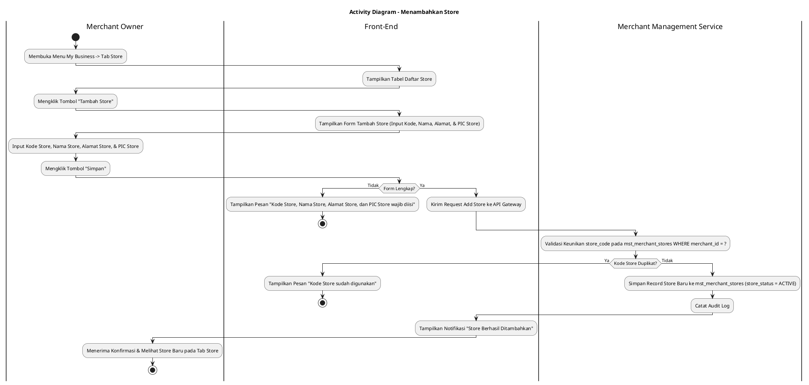
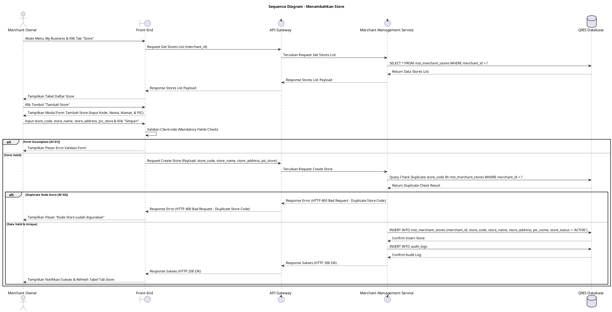

# 1 Deskripsi Use Case

**Tabel 1: Deskripsi Use Case Menambahkan Store**

| Elemen Spesifikasi | Deskripsi Detail |
| --- | --- |
| ID Use Case | UC-BOM-015 |
| Nama Use Case | Menambahkan Store |
| Penjelasan Singkat | Fitur Back Office Merchant pada menu My Business yang memfasilitasi Merchant Owner untuk mendaftarkan lokasi toko/cabang (*store*) baru di bawah entitas merchant dengan menginput Kode Store, Nama Store, Alamat Store, dan PIC Store pada tabel `mst_merchant_stores` melalui Merchant Management Service. |
| Aktor Utama | Merchant Owner |
| Aktor Pendukung | Merchant Management Service |
| Deskripsi Singkat | Merchant Owner melakukan otentikasi login ke Back Office Merchant dan mengakses menu **My Business**. Pada halaman My Business, Merchant Owner memilih tab **Store** (atau Outlets / Stores). Sistem menampilkan halaman daftar toko/cabang yang sudah terdaftar dari tabel `mst_merchant_stores` beserta tombol aksi **"Tambah Store"**. Merchant Owner mengklik tombol **"Tambah Store"** sehingga sistem menampilkan modal formulir pendaftaran store baru. Merchant Owner menginput Kode Store (*store_code*), Nama Store (*store_name*), Alamat Store (*store_address*), dan PIC Store (*pic_name* / *pic_contact*). Merchant Owner mengklik tombol **"Simpan"**. Front-End memvalidasi kelengkapan data dan mengirim request pendaftaran store ke API Gateway. Merchant Management Service memvalidasi keunikan `store_code` di bawah entitas merchant tersebut pada tabel **`mst_merchant_stores`**. Setelah validasi sukses, Merchant Management Service menyimpan record store baru ke tabel **`mst_merchant_stores`** dengan status awal keaktifan baku sebagai **`ACTIVE`** (`store_status = 'ACTIVE'`). Front-End memperbarui tabel daftar store pada tab Store dan menyajikan notifikasi konfirmasi sukses. |
| Pre-condition | 1. Merchant Owner telah berhasil login ke Back Office Merchant dan akun berstatus aktif (`login_status = 'ACTIVE'`). |
| Post-condition | 1. Data store baru berhasil tersimpan pada tabel `mst_merchant_stores` dengan `store_status = 'ACTIVE'`. 2. Store baru yang ditambahkan siap dipilih sebagai lokasi operasional terminal POS atau penugasan kasir/staff. 3. Front-End menyajikan data store baru pada tab Store halaman My Business. |
| Trigger | Merchant Owner mengklik menu **My Business**, memilih tab **Store**, mengklik tombol **"Tambah Store"**, mengisi Kode Store, Nama Store, Alamat Store, dan PIC Store, lalu mengklik **"Simpan"**. |
| Nama Tabel | mst_merchant_stores, audit_logs |
| Integrasi | 1. **Back Office Merchant UI:** Antarmuka pengelolaan bisnis merchant, tab Store, dan modal form pendaftaran toko baru. 2. **Merchant Management Service:** Microservice backend pengelola pendaftaran lokasi toko, pengelolaan terminal POS, serta otorisasi merchant. |
| Asumsi | 1. Setiap store terikat secara eksklusif pada entitas `merchant_id` milik Merchant Owner yang sedang login. 2. Kode Store (*store_code*) merupakan pengenal unik cabang/toko di dalam satu entitas merchant. |
| Keterbatasan | 1. Pendaftaran store wajib menginput seluruh atribut utama: Kode Store, Nama Store, Alamat Store, dan PIC Store. 2. Kode Store (*store_code*) tidak boleh duplikat untuk merchant yang sama pada tabel `mst_merchant_stores`. |
| Aturan Bisnis/Sistem | 1. **Mandatory Input Fields Standard:** Pengisian Kode Store (`store_code`), Nama Store (`store_name`), Alamat Store (`store_address`), dan Person in Charge / PIC Store (`pic_name` & `pic_contact`) bersifat WAJIB (*mandatory*). 2. **Store Code Uniqueness Standard:** Kode Store (`store_code`) WAJIB unik per merchant pada tabel `mst_merchant_stores`. 3. **Default Initial Store Status:** Setiap store baru yang didaftarkan secara baku langsung memiliki status aktif **`ACTIVE`** (`store_status = 'ACTIVE'`) pada tabel `mst_merchant_stores`. 4. **Audit Trail Standard:** Setiap tindakan penambahan store baru mencatat `store_id`, `merchant_id`, `created_by` (ID Merchant Owner), rincian data store, dan timestamp pada `audit_logs`. |
| Session Idle | 15 Menit |

# 2 Main Flow

**Tabel 2: Main Flow Menambahkan Store**

| No. | Aktivitas | Deskripsi |
| ---: | --- | --- |
| 1 | Membuka Menu My Business | Merchant Owner melakukan login dan mengklik menu **My Business** pada navigasi Back Office Merchant. |
| 2 | Memilih Tab Store | Merchant Owner mengklik tab **Store** pada halaman My Business. |
| 3 | Menampilkan Daftar Store | Sistem menampilkan halaman daftar store terdaftar dari `mst_merchant_stores` beserta tombol aksi **"Tambah Store"**. |
| 4 | Memilih Tombol Tambah Store | Merchant Owner mengklik tombol **"Tambah Store"**. |
| 5 | Menampilkan Form Tambah Store | Sistem menampilkan modal formulir pendaftaran store baru yang memuat inputan Kode Store, Nama Store, Alamat Store, dan PIC Store. |
| 6 | Mengisi Form Store | Merchant Owner menginput Kode Store, Nama Store, Alamat Store, dan PIC Store pada form. |
| 7 | Mengklik Tombol Simpan | Merchant Owner mengklik tombol **"Simpan"**. |
| 8 | Memvalidasi Form Client-side | Front-End memvalidasi kelengkapan form dan format inputan, lalu mengirim request pembuatan store ke API Gateway. |
| 9 | Memvalidasi & Menyimpan Store | Merchant Management Service memvalidasi keunikan `store_code` di bawah merchant tersebut, lalu menyimpan record store baru ke `mst_merchant_stores` (`store_status = 'ACTIVE'`). |
| 10 | Menampilkan Konfirmasi Berhasil | Front-End memperbarui tabel daftar store pada tab Store dan menampilkan notifikasi konfirmasi bahwa store berhasil ditambahkan. |
| 11 | Use Case Selesai | Proses penambahan store baru selesai dilaksanakan. |

# 3 Alternative Flow

**Tabel 3: Alternative Flow Menambahkan Store**

| Kode | Alternative Flow | Deskripsi |
| --- | --- | --- |
| AF-01 | Kolom Mandatory Kosong | Pada langkah 7-8, apabila Kode Store, Nama Store, Alamat Store, atau PIC Store dikosongkan, Sistem menolak request dan Front-End menampilkan `Kode Store, Nama Store, Alamat Store, dan PIC Store wajib diisi`. |
| AF-02 | Kode Store Sudah Terdaftar | Pada langkah 9, apabila `store_code` yang diinput sudah digunakan oleh store lain pada merchant yang sama, Merchant Management Service membatalkan transaksi dan Front-End menampilkan `Kode Store sudah digunakan`. |
| AF-03 | Gagal Terhubung ke Database Server | Pada langkah 9, apabila koneksi database terputus total, Sistem mengembalikan HTTP status 500 dan Front-End menampilkan `Terjadi kendala internal pada server`. |

# 4 Status Front-End

**Tabel 4: Status Front-End Menambahkan Store**

| No. | Nama Status | Deskripsi Tampilan Front-End |
| ---: | --- | --- |
| 1 | IDLE | Tab Store pada halaman My Business menyajikan tabel daftar store dan modal form pendaftaran siap menerima masukan. |
| 2 | LOADING | Indikator memuat (*spinner*) ditampilkan pada tombol Simpan saat request pendaftaran store sedang diproses server. |
| 3 | SUCCESS | Modal/toast konfirmasi menampilkan pesan sukses store berhasil disimpan dan data tabel diperbarui. |
| 4 | ERROR | Pesan kesalahan ditampilkan pada UI akibat kolom mandatory kosong, duplikasi kode store, atau kendala server. |

# 5 Activity Diagram Menambahkan Store

# 6 Sequence Diagram Menambahkan Store

# 7 Response Code

**Tabel 5: Response Code Menambahkan Store**

| No. | HTTP Status | Response Code | Nama Response | Deskripsi | Respons Front-End |
| ---: | ---: | --- | --- | --- | --- |
| 1 | 200 | 200XX00 | SUCCESS_CREATE_STORE | Store baru berhasil disimpan pada tabel `mst_merchant_stores` dengan `store_status = 'ACTIVE'`. | Menampilkan pesan notifikasi sukses dan memperbarui tabel tab Store. |
| 2 | 400 | 400XX00 | INVALID_STORE_INPUT | Kode Store, Nama Store, Alamat Store, atau PIC Store kosong. | Menampilkan pesan kesalahan validasi input. |
| 3 | 400 | 400XX01 | DUPLICATE_STORE_CODE | Kode Store yang dimasukkan sudah terdaftar pada merchant yang sama. | Menampilkan pesan kesalahan `Kode Store sudah digunakan`. |
| 4 | 500 | 500XX00 | SYSTEM_INTERNAL_ERROR | Terjadi kegagalan internal server saat mengeksekusi pendaftaran store. | Menampilkan pesan kesalahan `Terjadi kendala internal pada server`. |

# 8 Desain Antarmuka

**Tabel 6: Desain Antarmuka Menambahkan Store**

| Halaman | Komponen dan State Utama |
| --- | --- |
| Halaman My Business (Tab Store) | 1. **Navigasi Tab:** Tab Profile, Tab POS, Tab **Store** (Active), Tab Staff. 2. **Tabel Daftar Store:** Kolom No, Kode Store, Nama Store, Alamat Store, PIC Store, Status (`ACTIVE`), dan Aksi. 3. **Tombol "Tambah Store":** Tombol pemicu modal pendaftaran store baru (Primary Button). |
| Modal Form Tambah Store | 1. **Field Kode Store (`store_code`):** Text Input (Mandatory). 2. **Field Nama Store (`store_name`):** Text Input (Mandatory). 3. **Textarea Alamat Store (`store_address`):** Textarea Input (Mandatory). 4. **Field PIC Store (`pic_name` / `pic_contact`):** Text Input (Mandatory). 5. **Tombol Aksi:** Tombol **"Simpan"** (Primary) dan **"Batal"** (Secondary). |
