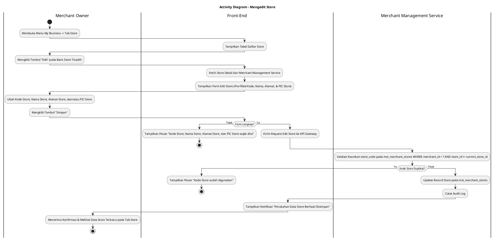
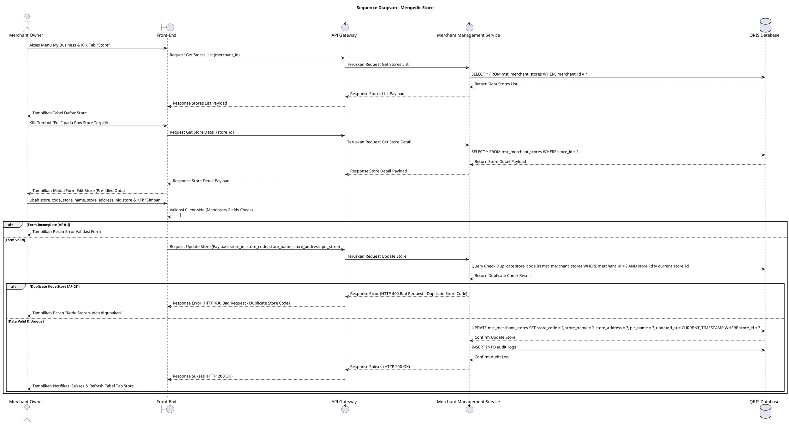

# 1 Deskripsi Use Case

**Tabel 1: Deskripsi Use Case Mengedit Store**

| Elemen Spesifikasi | Deskripsi Detail |
| --- | --- |
| ID Use Case | UC-BOM-016 |
| Nama Use Case | Mengedit Store |
| Penjelasan Singkat | Fitur Back Office Merchant pada menu My Business yang memfasilitasi Merchant Owner untuk mengubah informasi Kode Store, Nama Store, Alamat Store, dan PIC Store pada toko/cabang (*store*) terdaftar di tabel `mst_merchant_stores` melalui Merchant Management Service. |
| Aktor Utama | Merchant Owner |
| Aktor Pendukung | Merchant Management Service |
| Deskripsi Singkat | Merchant Owner melakukan otentikasi login ke Back Office Merchant dan mengakses menu **My Business**. Pada halaman My Business, Merchant Owner memilih tab **Store** (atau Outlets / Stores). Sistem menampilkan daftar store yang sudah terdaftar dari tabel `mst_merchant_stores`. Merchant Owner memilih salah satu store yang ingin diubah informasinya, lalu mengklik tombol aksi **"Edit"**. Sistem menampilkan modal formulir pengeditan store yang berisi data terkini Kode Store (*store_code*), Nama Store (*store_name*), Alamat Store (*store_address*), dan PIC Store (*pic_name* / *pic_contact*). Merchant Owner melakukan penyesuaian pada kolom yang ingin diubah, lalu mengklik tombol **"Simpan"**. Front-End memvalidasi kelengkapan form dan mengirim request pembaruan store ke API Gateway. Merchant Management Service memvalidasi keberadaan store, memverifikasi keunikan `store_code` jika diubah di bawah entitas merchant tersebut, dan memperbarui record store pada tabel **`mst_merchant_stores`**. Front-End memperbarui tabel daftar store pada tab Store dan menyajikan notifikasi konfirmasi bahwa perubahan data store berhasil disimpan. |
| Pre-condition | 1. Merchant Owner telah berhasil login ke Back Office Merchant dan akun berstatus aktif. 2. Store yang akan diubah terdaftar pada tabel `mst_merchant_stores`. |
| Post-condition | 1. Data Kode Store (`store_code`), Nama Store (`store_name`), Alamat Store (`store_address`), dan PIC Store (`pic_name` & `pic_contact`) diperbarui pada tabel `mst_merchant_stores`. 2. Keteraitan terminal POS atau kasir/staff yang ditugaskan pada store tersebut tetap terjaga. 3. Front-End menyajikan data store terbaru pada tab Store halaman My Business. |
| Trigger | Merchant Owner mengklik menu **My Business**, memilih tab **Store**, mengklik tombol **"Edit"** pada baris store terpilih, mengubah data, lalu mengklik **"Simpan"**. |
| Nama Tabel | mst_merchant_stores, audit_logs |
| Integrasi | 1. **Back Office Merchant UI:** Antarmuka pengelolaan bisnis merchant, tab Store, dan modal form pengeditan toko/cabang. 2. **Merchant Management Service:** Microservice backend pengelola pembaruan lokasi toko, pengelolaan outlet, serta otorisasi merchant. |
| Asumsi | 1. Pengeditan store diperbolehkan untuk memperbarui informasi operasional toko tanpa mengubah ID unik store (`store_id`). 2. Perubahan data store secara otomatis terefleksi pada seluruh informasi terminal POS dan kasir yang terkait dengan store tersebut. |
| Keterbatasan | 1. Pengeditan store wajib mengisi seluruh kolom utama: Kode Store, Nama Store, Alamat Store, dan PIC Store. 2. Kode Store (`store_code`) baru tidak boleh duplikat dengan store lain milik merchant yang sama pada `mst_merchant_stores`. |
| Aturan Bisnis/Sistem | 1. **Mandatory Input Fields Standard:** Pengisian Kode Store (`store_code`), Nama Store (`store_name`), Alamat Store (`store_address`), dan Person in Charge / PIC Store (`pic_name` & `pic_contact`) bersifat WAJIB (*mandatory*). 2. **Store Code Uniqueness Validation:** Apabila Kode Store (`store_code`) diubah, kode baru WAJIB unik per merchant di bawah tabel `mst_merchant_stores`. 3. **Preserve Relational Integrity:** Pengeditan data store DILARANG merusak relasi `store_id` yang sudah terikat pada terminal POS (`mst_merchant_terminals`) atau pengguna kasir/staff. 4. **Audit Trail Standard:** Setiap tindakan pengeditan store mencatat `store_id`, `merchant_id`, `created_by` (ID Merchant Owner), rincian perubahan data, dan timestamp pada `audit_logs`. |
| Session Idle | 15 Menit |

# 2 Main Flow

**Tabel 2: Main Flow Mengedit Store**

| No. | Aktivitas | Deskripsi |
| ---: | --- | --- |
| 1 | Membuka Menu My Business | Merchant Owner melakukan login dan mengklik menu **My Business** pada navigasi Back Office Merchant. |
| 2 | Memilih Tab Store | Merchant Owner mengklik tab **Store** pada halaman My Business. |
| 3 | Menampilkan Daftar Store | Sistem menampilkan halaman daftar store terdaftar dari `mst_merchant_stores` beserta tombol aksi **"Edit"** per baris store. |
| 4 | Memilih Tombol Edit Store | Merchant Owner mengklik tombol aksi **"Edit"** pada salah satu baris store yang ingin diubah. |
| 5 | Menampilkan Form Edit Store | Sistem menampilkan modal formulir pengeditan store yang sudah terisi (*pre-filled*) dengan data terkini Kode Store, Nama Store, Alamat Store, dan PIC Store. |
| 6 | Mengubah Data Store | Merchant Owner menyesuaikan Kode Store, Nama Store, Alamat Store, dan/atau PIC Store pada form. |
| 7 | Mengklik Tombol Simpan | Merchant Owner mengklik tombol **"Simpan"**. |
| 8 | Memvalidasi Form Client-side | Front-End memvalidasi kelengkapan form dan format inputan, lalu mengirim request pembaruan store ke API Gateway. |
| 9 | Memvalidasi & Update Store | Merchant Management Service memvalidasi keunikan `store_code` (jika diubah) di bawah merchant tersebut, lalu memperbarui record store pada `mst_merchant_stores`. |
| 10 | Menampilkan Konfirmasi Berhasil | Front-End memperbarui tabel daftar store pada tab Store dan menampilkan notifikasi konfirmasi bahwa perubahan data store berhasil disimpan. |
| 11 | Use Case Selesai | Proses pengeditan store selesai dilaksanakan. |

# 3 Alternative Flow

**Tabel 3: Alternative Flow Mengedit Store**

| Kode | Alternative Flow | Deskripsi |
| --- | --- | --- |
| AF-01 | Kolom Mandatory Kosong | Pada langkah 7-8, apabila Kode Store, Nama Store, Alamat Store, atau PIC Store dikosongkan, Sistem menolak request dan Front-End menampilkan `Kode Store, Nama Store, Alamat Store, dan PIC Store wajib diisi`. |
| AF-02 | Kode Store Baru Sudah Terdaftar | Pada langkah 9, apabila `store_code` baru yang diinput sudah digunakan oleh store lain pada merchant yang sama, Merchant Management Service membatalkan transaksi dan Front-End menampilkan `Kode Store sudah digunakan`. |
| AF-03 | Store Tidak Ditemukan | Pada langkah 9, apabila `store_id` yang akan diubah tidak ditemukan pada database, Sistem membatalkan transaksi dan Front-End menampilkan `Data store tidak ditemukan`. |
| AF-04 | Gagal Terhubung ke Database Server | Pada langkah 9, apabila koneksi database terputus total, Sistem mengembalikan HTTP status 500 dan Front-End menampilkan `Terjadi kendala internal pada server`. |

# 4 Status Front-End

**Tabel 4: Status Front-End Mengedit Store**

| No. | Nama Status | Deskripsi Tampilan Front-End |
| ---: | --- | --- |
| 1 | IDLE | Tab Store pada halaman My Business menyajikan tabel daftar store dan modal form edit terisi siap diubah. |
| 2 | LOADING | Indikator memuat (*spinner*) ditampilkan pada tombol Simpan saat request pembaruan store sedang diproses server. |
| 3 | SUCCESS | Modal/toast konfirmasi menampilkan pesan sukses perubahan data store berhasil disimpan dan data tabel diperbarui. |
| 4 | ERROR | Pesan kesalahan ditampilkan pada UI akibat kolom mandatory kosong, duplikasi kode store, data tidak ditemukan, atau kendala server. |

# 5 Activity Diagram Mengedit Store

# 6 Sequence Diagram Mengedit Store

# 7 Response Code

**Tabel 5: Response Code Mengedit Store**

| No. | HTTP Status | Response Code | Nama Response | Deskripsi | Respons Front-End |
| ---: | ---: | --- | --- | --- | --- |
| 1 | 200 | 200XX00 | SUCCESS_UPDATE_STORE | Data store berhasil diperbarui pada tabel `mst_merchant_stores`. | Menampilkan pesan notifikasi sukses dan memperbarui tabel tab Store. |
| 2 | 400 | 400XX00 | INVALID_STORE_UPDATE_INPUT | Kode Store, Nama Store, Alamat Store, atau PIC Store kosong. | Menampilkan pesan kesalahan validasi input. |
| 3 | 400 | 400XX01 | DUPLICATE_STORE_CODE | Kode Store baru yang dimasukkan sudah digunakan oleh store lain pada merchant yang sama. | Menampilkan pesan kesalahan `Kode Store sudah digunakan`. |
| 4 | 404 | 404XX00 | STORE_NOT_FOUND | Data store tidak ditemukan pada database `mst_merchant_stores`. | Menampilkan pesan kesalahan `Data store tidak ditemukan`. |
| 5 | 500 | 500XX00 | SYSTEM_INTERNAL_ERROR | Terjadi kegagalan internal server saat mengeksekusi pengeditan store. | Menampilkan pesan kesalahan `Terjadi kendala internal pada server`. |

# 8 Desain Antarmuka

**Tabel 6: Desain Antarmuka Mengedit Store**

| Halaman | Komponen dan State Utama |
| --- | --- |
| Halaman My Business (Tab Store) | 1. **Navigasi Tab:** Tab Profile, Tab POS, Tab **Store** (Active), Tab Staff. 2. **Tabel Daftar Store:** Kolom No, Kode Store, Nama Store, Alamat Store, PIC Store, Status (`ACTIVE`), dan Aksi. 3. **Tombol "Edit":** Tombol aksi pengeditan per baris store (Secondary Button). |
| Modal Form Edit Store | 1. **Field Kode Store (`store_code`):** Text Input (Editable, Mandatory). 2. **Field Nama Store (`store_name`):** Text Input (Editable, Mandatory). 3. **Textarea Alamat Store (`store_address`):** Textarea Input (Editable, Mandatory). 4. **Field PIC Store (`pic_name` / `pic_contact`):** Text Input (Editable, Mandatory). 5. **Tombol Aksi:** Tombol **"Simpan"** (Primary) dan **"Batal"** (Secondary). |
