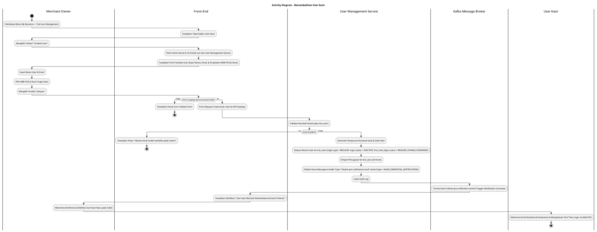
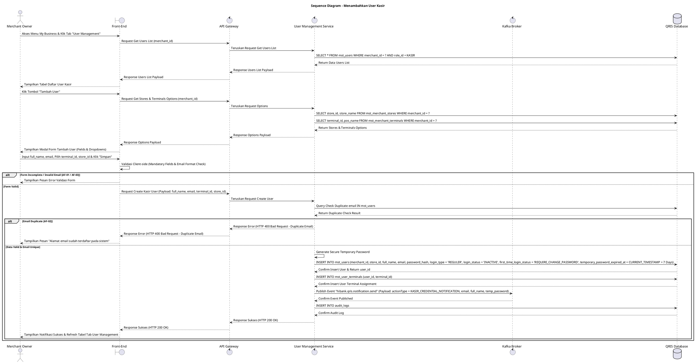

# 1 Deskripsi Use Case

**Tabel 1: Deskripsi Use Case Menambahkan User Kasir**

| Elemen Spesifikasi | Deskripsi Detail |
| --- | --- |
| ID Use Case | UC-BOM-017 |
| Nama Use Case | Menambahkan User Kasir |
| Penjelasan Singkat | Fitur Back Office Merchant pada menu My Business yang memfasilitasi Merchant Owner untuk mendaftarkan akun pengguna Kasir baru, menautkannya dengan WEB POS (`terminal_id`) dan toko/outlet (`store_id`), menyimpan data akun sementara pada `mst_users` dan `mst_user_terminals`, serta mempublikasikan event Kafka ke topic `hibank.qris.notification.send` untuk mengirimkan kredensial sementara melalui email notifikasi. |
| Aktor Utama | Merchant Owner |
| Aktor Pendukung | User Management Service, Kafka Message Broker |
| Deskripsi Singkat | Merchant Owner melakukan otentikasi login ke Back Office Merchant dan mengakses menu **My Business**. Pada halaman My Business, Merchant Owner memilih tab **User Management**. Sistem menampilkan daftar pengguna kasir dan staff terdaftar dari tabel `mst_users` beserta tombol aksi **"Tambah User"**. Merchant Owner mengklik tombol **"Tambah User"** sehingga sistem menampilkan modal formulir pendaftaran kasir baru. Merchant Owner menginput Nama User (*full_name*), Email (*email*), memilih WEB POS yang digunakan (*terminal_id* dari `mst_merchant_terminals`), dan memilih Lokasi Toko tugas kasir (*store_id* dari `mst_merchant_stores`). Merchant Owner mengklik tombol **"Simpan"**. Front-End memvalidasi kelengkapan data dan mengirim request pendaftaran kasir ke API Gateway. User Management Service memvalidasi keunikan email pada tabel `mst_users` dan memastikan status WEB POS & Toko berstatus valid/aktif. Setelah validasi sukses, User Management Service secara otomatis membuat password sementara acak yang aman (*temporary password*), menyimpan record pengguna baru ke tabel **`mst_users`** dengan `login_type = 'REGULER'`, `login_status = 'INACTIVE'`, `first_time_login_status = 'REQUIRE_CHANGE_PASSWORD'`, dan `temporary_password_expired_at = CURRENT_TIMESTAMP + 7 Hari`, menyimpan relasi terminal pada **`mst_user_terminals`**, serta mempublikasikan event ke Kafka topic **`hibank.qris.notification.send`** dengan payload `actionType = 'KASIR_CREDENTIAL_NOTIFICATION'`. Consumer Notification Service menangkap event Kafka tersebut dan mengirimkan email berisi kredensial sementara ke email Kasir baru. User Kasir nantinya WAJIB menyelesaikan alur aktivasi dan pembaruan password pada [First time login user kasir.md](file:///d:/FSD/Web%20POS/2.%20First%20time%20login%20user%20kasir.md) sebelum dapat bertransaksi pada Web POS. Front-End memperbarui tabel daftar user pada tab User Management dan menampilkan notifikasi konfirmasi sukses. |
| Pre-condition | 1. Merchant Owner telah berhasil login ke Back Office Merchant dan akun berstatus aktif (`login_status = 'ACTIVE'`). 2. Minimal 1 (satu) toko terdaftar aktif pada `mst_merchant_stores` dan minimal 1 (satu) terminal WEB POS terdaftar pada `mst_merchant_terminals`. |
| Post-condition | 1. Record kasir baru tersimpan pada `mst_users` (`login_type = 'REGULER'`, `login_status = 'INACTIVE'`, `first_time_login_status = 'REQUIRE_CHANGE_PASSWORD'`, `temporary_password_expired_at` terisi 7 hari). 2. Relasi penugasan terminal kasir tersimpan pada tabel `mst_user_terminals`. 3. Event Kafka berhasil dipublikasikan ke topic `hibank.qris.notification.send` untuk memicu pengiriman email kredensial sementara. 4. Akun Kasir siap digunakan untuk alur [First time login user kasir.md](file:///d:/FSD/Web%20POS/2.%20First%20time%20login%20user%20kasir.md). |
| Trigger | Merchant Owner mengklik menu **My Business**, memilih tab **User Management**, mengklik **"Tambah User"**, menginput Nama User, Email, memilih WEB POS & Store, lalu mengklik **"Simpan"**. |
| Nama Tabel | mst_users, mst_user_terminals, mst_merchant_terminals, mst_merchant_stores, audit_logs |
| Integrasi | 1. **Back Office Merchant UI:** Antarmuka pengelolaan bisnis merchant, tab User Management, dan modal form pendaftaran user kasir. 2. **User Management Service:** Microservice backend pengelola akun pengguna, penugasan terminal, dan publikasi event Kafka. 3. **Kafka Message Broker:** Broker pesan untuk mempublikasikan event notifikasi email (`hibank.qris.notification.send`). |
| Asumsi | 1. Setiap kasir terikat pada satu entitas merchant (`merchant_id`), satu toko utama (`store_id`), dan terminal WEB POS (`terminal_id`). 2. Email yang didaftarkan harus valid dan aktif untuk menerima kredensial sementara. 3. Pembaruan password sementara menjadi password permanen wajib dilakukan oleh Kasir via alur First Time Login Web POS. |
| Keterbatasan | 1. Email pengguna Kasir wajib unik dan belum terdaftar pada seluruh sistem (`mst_users`). 2. Pendaftaran kasir wajib menautkan WEB POS yang berstatus valid pada toko tersebut. |
| Aturan Bisnis/Sistem | 1. **Mandatory Input Fields Standard:** Pengisian Nama User (`full_name`), Email (`email`), Pemilihan WEB POS (`terminal_id`), dan Pemilihan Lokasi Toko Tugas (`store_id`) bersifat WAJIB (*mandatory*). 2. **Unique Email Constraint:** Email Kasir WAJIB unik dan belum pernah terdaftar pada tabel `mst_users`. 3. **Initial Account Status Standard:** Akun Kasir baru WAJIB diset memiliki status awal `login_type = 'REGULER'`, `login_status = 'INACTIVE'`, `first_time_login_status = 'REQUIRE_CHANGE_PASSWORD'`, dan `temporary_password_expired_at = CURRENT_TIMESTAMP + 7 Hari`. 4. **Role Assignment Standard:** Akun Kasir baru secara otomatis diberikan `role_id` yang memiliki kewenangan sebagai `KASIR`. 5. **Kafka Notification Event Standard:** Setelah pendaftaran sukses di database, sistem WAJIB mempublikasikan event Kafka ke topic **`hibank.qris.notification.send`** dengan payload `actionType = 'KASIR_CREDENTIAL_NOTIFICATION'` yang memuat email, nama kasir, dan password sementara. 6. **First Time Login Requirement:** User Kasir WAJIB menyelesaikan proses autentikasi awal dan pembuatan password permanen sesuai aturan [First time login user kasir.md](file:///d:/FSD/Web%20POS/2.%20First%20time%20login%20user%20kasir.md). 7. **Audit Trail Standard:** Setiap pendaftaran kasir mencatat `user_id`, `merchant_id`, `store_id`, `terminal_id`, `created_by` (ID Merchant Owner), dan timestamp pada `audit_logs`. |
| Session Idle | 15 Menit |

# 2 Main Flow

**Tabel 2: Main Flow Menambahkan User Kasir**

| No. | Aktivitas | Deskripsi |
| ---: | --- | --- |
| 1 | Membuka Menu My Business | Merchant Owner melakukan login dan mengklik menu **My Business** pada navigasi Back Office Merchant. |
| 2 | Memilih Tab User Management | Merchant Owner mengklik tab **User Management** pada halaman My Business. |
| 3 | Menampilkan Daftar User Kasir | Sistem menampilkan halaman daftar user terdaftar dari `mst_users` beserta tombol aksi **"Tambah User"**. |
| 4 | Memilih Tombol Tambah User | Merchant Owner mengklik tombol **"Tambah User"**. |
| 5 | Menampilkan Form Tambah User | Sistem menampilkan modal formulir pendaftaran kasir yang memuat inputan Nama User, Email, Dropdown WEB POS, dan Dropdown Store Tugas. |
| 6 | Mengisi Form User Kasir | Merchant Owner menginput Nama User, Email, memilih WEB POS yang digunakan, dan memilih Store Tugas Kasir. |
| 7 | Mengklik Tombol Simpan | Merchant Owner mengklik tombol **"Simpan"**. |
| 8 | Memvalidasi Form Client-side | Front-End memvalidasi kelengkapan form dan format email, lalu mengirim request pendaftaran kasir ke API Gateway. |
| 9 | Memvalidasi & Menyimpan Akun Kasir | User Management Service memvalidasi keunikan email pada `mst_users`, membuat password sementara acak, menyimpan record ke `mst_users` (`login_type = 'REGULER'`, `login_status = 'INACTIVE'`, `first_time_login_status = 'REQUIRE_CHANGE_PASSWORD'`, `temporary_password_expired_at = CURRENT_TIMESTAMP + 7 Hari`), serta menyimpan penugasan ke `mst_user_terminals`. |
| 10 | Publish Event Kafka Email Credential | User Management Service mempublikasikan message event ke Kafka topic `hibank.qris.notification.send` (`actionType = 'KASIR_CREDENTIAL_NOTIFICATION'`) untuk memicu pengiriman email kredensial sementara. |
| 11 | Menampilkan Konfirmasi Berhasil | Front-End memperbarui tabel daftar user pada tab User Management dan menampilkan notifikasi konfirmasi bahwa User Kasir berhasil ditambahkan dan email kredensial telah dikirim. |
| 12 | User Kasir First Time Login | User Kasir menerima email kredensial sementara dan menyelesaikan proses aktivasi akun via [First time login user kasir.md](file:///d:/FSD/Web%20POS/2.%20First%20time%20login%20user%20kasir.md). |
| 13 | Use Case Selesai | Proses penambahan user kasir selesai dilaksanakan. |

# 3 Alternative Flow

**Tabel 3: Alternative Flow Menambahkan User Kasir**

| Kode | Alternative Flow | Deskripsi |
| --- | --- | --- |
| AF-01 | Kolom Mandatory atau Email Kosong | Pada langkah 7-8, apabila Nama User, Email, WEB POS, atau Store Tugas dikosongkan, Sistem menolak request dan Front-End menampilkan `Nama User, Email, WEB POS, dan Store Tugas wajib diisi`. |
| AF-02 | Email Sudah Terdaftar di Sistem | Pada langkah 9, apabila email yang dimasukkan sudah terdaftar pada tabel `mst_users`, User Management Service membatalkan transaksi dan Front-End menampilkan `Alamat email sudah terdaftar pada sistem`. |
| AF-03 | Format Email Tidak Valid | Pada langkah 8, apabila format email yang dimasukkan tidak memenuhi standar email valid, Front-End menolak request dan menampilkan `Format alamat email tidak valid`. |
| AF-04 | Kafka Publish Event Gagal | Pada langkah 10, apabila terjadi kendala publish ke Kafka broker, Sistem tetap menyimpan data user di database, mencatat log error Kafka, dan Front-End menampilkan `User Kasir berhasil dibuat, namun antrean pengiriman email mengalami kendala`. |
| AF-05 | Gagal Terhubung ke Database Server | Pada langkah 9, apabila koneksi database terputus total, Sistem mengembalikan HTTP status 500 dan Front-End menampilkan `Terjadi kendala internal pada server`. |

# 4 Status Front-End

**Tabel 4: Status Front-End Menambahkan User Kasir**

| No. | Nama Status | Deskripsi Tampilan Front-End |
| ---: | --- | --- |
| 1 | IDLE | Tab User Management pada halaman My Business menyajikan tabel daftar user dan modal form pendaftaran siap menerima masukan. |
| 2 | LOADING | Indikator memuat (*spinner*) ditampilkan pada tombol Simpan saat request pendaftaran kasir sedang diproses server. |
| 3 | SUCCESS | Modal/toast konfirmasi menampilkan pesan sukses User Kasir berhasil ditambahkan dan data tabel diperbarui. |
| 4 | ERROR | Pesan kesalahan ditampilkan pada UI akibat kolom mandatory kosong, email duplikat, format email invalid, atau kendala server. |

# 5 Activity Diagram Menambahkan User Kasir

# 6 Sequence Diagram Menambahkan User Kasir

# 7 Response Code

**Tabel 5: Response Code Menambahkan User Kasir**

| No. | HTTP Status | Response Code | Nama Response | Deskripsi | Respons Front-End |
| ---: | ---: | --- | --- | --- | --- |
| 1 | 200 | 200XX00 | SUCCESS_CREATE_KASIR_USER | Akun user Kasir baru berhasil disimpan pada `mst_users` dan event Kafka email kredensial terpublikasi. | Menampilkan pesan notifikasi sukses dan memperbarui tabel tab User Management. |
| 2 | 400 | 400XX00 | INVALID_USER_INPUT | Nama User, Email, WEB POS, atau Store Tugas kosong / format email invalid. | Menampilkan pesan kesalahan validasi input. |
| 3 | 400 | 400XX01 | DUPLICATE_EMAIL | Alamat email yang dimasukkan sudah terdaftar pada `mst_users`. | Menampilkan pesan kesalahan `Alamat email sudah terdaftar pada sistem`. |
| 4 | 500 | 500XX00 | SYSTEM_INTERNAL_ERROR | Terjadi kegagalan internal server saat mengeksekusi pendaftaran kasir. | Menampilkan pesan kesalahan `Terjadi kendala internal pada server`. |

# 8 Desain Antarmuka

**Tabel 6: Desain Antarmuka Menambahkan User Kasir**

| Halaman | Komponen dan State Utama |
| --- | --- |
| Halaman My Business (Tab User Management) | 1. **Navigasi Tab:** Tab Profile, Tab POS, Tab Store, Tab **User Management** (Active). 2. **Tabel User Kasir:** Kolom No, Nama User, Email, WEB POS Terkait, Store Tugas, Status (`INACTIVE`), dan Aksi. 3. **Tombol "Tambah User":** Tombol pemicu modal pendaftaran user kasir baru (Primary Button). |
| Modal Form Tambah User Kasir | 1. **Field Nama User (`full_name`):** Text Input (Mandatory). 2. **Field Email (`email`):** Email Text Input (Mandatory, Unique). 3. **Dropdown WEB POS (`terminal_id`):** Dropdown pilihan terminal WEB POS dari `mst_merchant_terminals`. 4. **Dropdown Store Tugas (`store_id`):** Dropdown pilihan toko dari `mst_merchant_stores`. 5. **Tombol Aksi:** Tombol **"Simpan"** (Primary) dan **"Batal"** (Secondary). |
