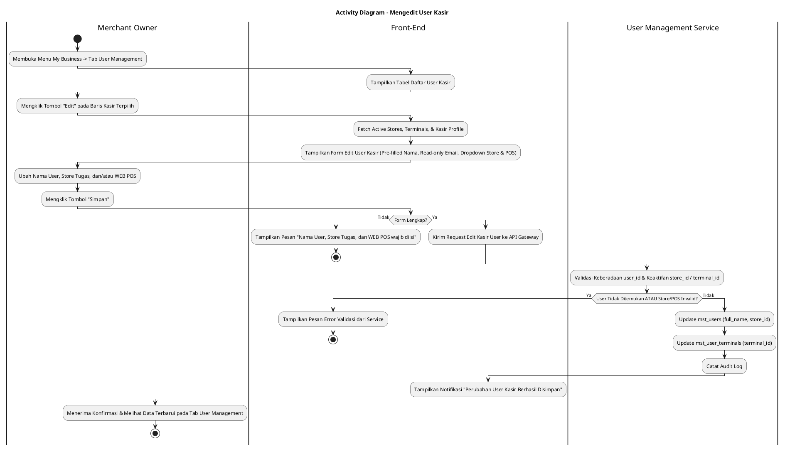
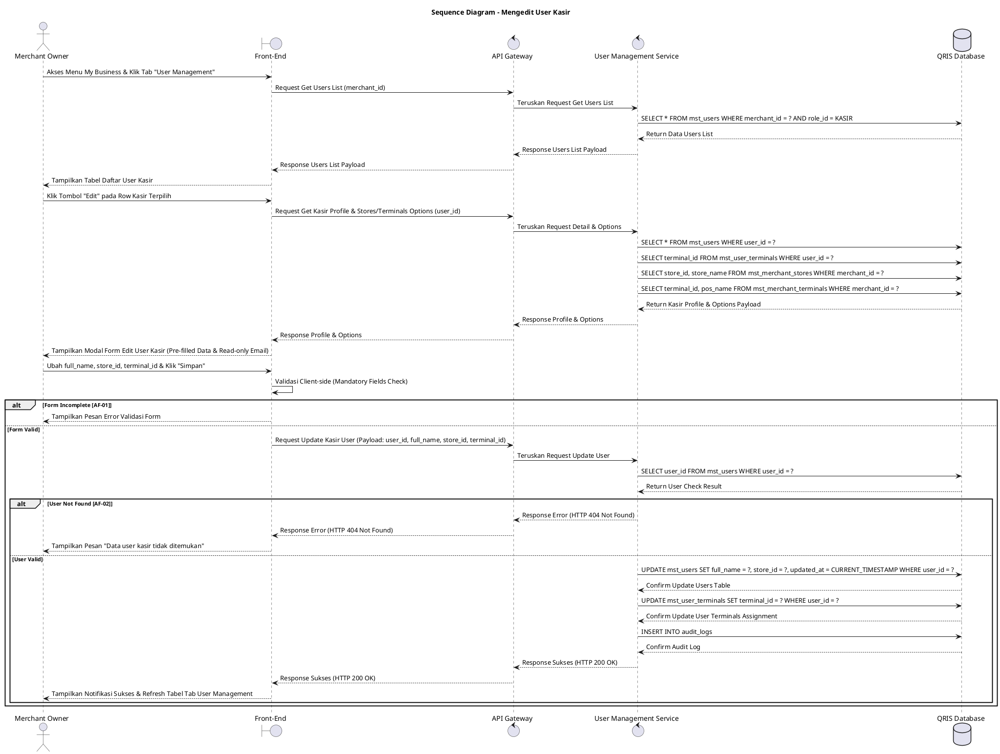

# 1 Deskripsi Use Case

**Tabel 1: Deskripsi Use Case Mengedit User Kasir**

| Elemen Spesifikasi | Deskripsi Detail |
| --- | --- |
| ID Use Case | UC-BOM-018 |
| Nama Use Case | Mengedit User Kasir |
| Penjelasan Singkat | Fitur Back Office Merchant pada menu My Business yang memfasilitasi Merchant Owner untuk mengubah informasi Nama User, Store Tugas Kasir, dan WEB POS yang digunakan pada akun pengguna Kasir terdaftar di tabel `mst_users` dan `mst_user_terminals` melalui User Management Service. |
| Aktor Utama | Merchant Owner |
| Aktor Pendukung | User Management Service |
| Deskripsi Singkat | Merchant Owner melakukan otentikasi login ke Back Office Merchant dan mengakses menu **My Business**. Pada halaman My Business, Merchant Owner memilih tab **User Management**. Sistem menampilkan halaman daftar pengguna kasir dari tabel `mst_users`. Merchant Owner memilih salah satu user kasir yang ingin diubah datanya, lalu mengklik tombol aksi **"Edit"**. Sistem menampilkan modal formulir pengeditan user kasir yang berisi data terkini Nama User (*full_name*), Email (*email* - read-only), pilihan Store Tugas Kasir (*store_id* dari `mst_merchant_stores`), dan pilihan WEB POS yang digunakan (*terminal_id* dari `mst_merchant_terminals`). Merchant Owner melakukan penyesuaian pada Nama User, Store Tugas Kasir, dan/atau WEB POS yang digunakan, lalu mengklik tombol **"Simpan"**. Front-End memvalidasi kelengkapan form dan mengirim request pembaruan data kasir ke API Gateway. User Management Service memvalidasi keberadaan akun kasir, memperbarui kolom `full_name` dan `store_id` pada tabel **`mst_users`**, serta memperbarui penugasan terminal pada tabel **`mst_user_terminals`**. Front-End memperbarui tabel daftar user pada tab User Management dan menyajikan notifikasi konfirmasi bahwa perubahan data user kasir berhasil disimpan. |
| Pre-condition | 1. Merchant Owner telah berhasil login ke Back Office Merchant dan akun berstatus aktif. 2. Akun pengguna Kasir yang akan diubah terdaftar pada tabel `mst_users` dengan peranan (role) sebagai Kasir. |
| Post-condition | 1. Data Nama User (`full_name`) dan Store Tugas (`store_id`) diperbarui pada tabel `mst_users`. 2. Relasi penugasan WEB POS (`terminal_id`) diperbarui pada tabel `mst_user_terminals`. 3. Alamat email (*email*) akun Kasir dipertahankan dan tidak dapat diubah (*read-only*) demi menjaga integritas otentikasi. 4. Front-End menyajikan data pengguna Kasir terbaru pada tab User Management halaman My Business. |
| Trigger | Merchant Owner mengklik menu **My Business**, memilih tab **User Management**, mengklik tombol **"Edit"** pada baris user kasir terpilih, mengubah data Nama, Store Tugas, atau WEB POS, lalu mengklik **"Simpan"**. |
| Nama Tabel | mst_users, mst_user_terminals, mst_merchant_stores, mst_merchant_terminals, audit_logs |
| Integrasi | 1. **Back Office Merchant UI:** Antarmuka pengelolaan bisnis merchant, tab User Management, dan modal form pengeditan user kasir. 2. **User Management Service:** Microservice backend pengelola pembaruan profil pengguna, penugasan toko/terminal kasir, serta otorisasi merchant. |
| Asumsi | 1. Alamat email kasir bersifat unik dan tidak dapat diubah (*read-only*) setelah pendaftaran untuk keamanan identitas login. 2. Pengeditan penugasan Store (`store_id`) dan WEB POS (`terminal_id`) secara otomatis memperbarui otorisasi lokasi transaksi kasir saat login ke Web POS. |
| Keterbatasan | 1. Kolom Email (*email*) bersifat terkunci/non-editable (*read-only*). 2. Pengeditan user kasir wajib memilih Store Tugas dan WEB POS yang valid dan aktif. |
| Aturan Bisnis/Sistem | 1. **Editable Fields Standard:** Elemen yang diizinkan untuk diubah HANYA meliputi Nama User (`full_name`), Store Tugas Kasir (`store_id`), dan WEB POS yang digunakan (`terminal_id`). 2. **Read-Only Email Constraint:** Alamat email (`email`) DILARANG untuk diubah (*read-only*) pada formulir pengeditan user kasir. 3. **Mandatory Input Fields Standard:** Pengisian Nama User (`full_name`), Pemilihan Store Tugas Kasir (`store_id`), dan Pemilihan WEB POS (`terminal_id`) bersifat WAJIB (*mandatory*). 4. **Active Relational Integrity:** Store Tugas Kasir (`store_id`) dan WEB POS (`terminal_id`) yang dipilih WAJIB berstatus valid/aktif pada entitas merchant terkait. 5. **Audit Trail Standard:** Setiap tindakan pengeditan user kasir mencatat `user_id`, `merchant_id`, `store_id`, `terminal_id`, `updated_by` (ID Merchant Owner), rincian perubahan data, dan timestamp pada `audit_logs`. |
| Session Idle | 15 Menit |

# 2 Main Flow

**Tabel 2: Main Flow Mengedit User Kasir**

| No. | Aktivitas | Deskripsi |
| ---: | --- | --- |
| 1 | Membuka Menu My Business | Merchant Owner melakukan login dan mengklik menu **My Business** pada navigasi Back Office Merchant. |
| 2 | Memilih Tab User Management | Merchant Owner mengklik tab **User Management** pada halaman My Business. |
| 3 | Menampilkan Daftar User Kasir | Sistem menampilkan halaman daftar user terdaftar dari `mst_users` beserta tombol aksi **"Edit"** per baris kasir. |
| 4 | Memilih Tombol Edit User | Merchant Owner mengklik tombol aksi **"Edit"** pada salah satu baris user kasir yang ingin diubah. |
| 5 | Menampilkan Form Edit User | Sistem menampilkan modal formulir pengeditan kasir yang memuat data terkini Nama User, Email (read-only), Dropdown Store Tugas, dan Dropdown WEB POS. |
| 6 | Mengubah Data User Kasir | Merchant Owner menyesuaikan Nama User, memilih Store Tugas Kasir baru, dan/atau memilih WEB POS baru dari dropdown. |
| 7 | Mengklik Tombol Simpan | Merchant Owner mengklik tombol **"Simpan"**. |
| 8 | Memvalidasi Form Client-side | Front-End memvalidasi kelengkapan form dan memastikan field mandatory terisi, lalu mengirim request pembaruan ke API Gateway. |
| 9 | Memvalidasi & Update User Kasir | User Management Service memvalidasi keberadaan `user_id`, memperbarui `full_name` & `store_id` pada `mst_users`, serta memperbarui penugasan `terminal_id` pada `mst_user_terminals`. |
| 10 | Menampilkan Konfirmasi Berhasil | Front-End memperbarui tabel daftar user pada tab User Management dan menampilkan notifikasi konfirmasi bahwa perubahan data user kasir berhasil disimpan. |
| 11 | Use Case Selesai | Proses pengeditan user kasir selesai dilaksanakan. |

# 3 Alternative Flow

**Tabel 3: Alternative Flow Mengedit User Kasir**

| Kode | Alternative Flow | Deskripsi |
| --- | --- | --- |
| AF-01 | Nama, Store, atau WEB POS Kosong | Pada langkah 7-8, apabila Nama User, Store Tugas, atau WEB POS dikosongkan, Sistem menolak request dan Front-End menampilkan `Nama User, Store Tugas, dan WEB POS wajib diisi`. |
| AF-02 | User Kasir Tidak Ditemukan | Pada langkah 9, apabila `user_id` yang akan diubah tidak ditemukan pada database, Sistem membatalkan transaksi dan Front-End menampilkan `Data user kasir tidak ditemukan`. |
| AF-03 | Store atau WEB POS Tidak Valid | Pada langkah 9, apabila `store_id` atau `terminal_id` yang dipilih berstatus nonaktif atau tidak valid, Sistem membatalkan transaksi dan Front-End menampilkan `Store Tugas atau WEB POS yang dipilih tidak valid`. |
| AF-04 | Gagal Terhubung ke Database Server | Pada langkah 9, apabila koneksi database terputus total, Sistem mengembalikan HTTP status 500 dan Front-End menampilkan `Terjadi kendala internal pada server`. |

# 4 Status Front-End

**Tabel 4: Status Front-End Mengedit User Kasir**

| No. | Nama Status | Deskripsi Tampilan Front-End |
| ---: | --- | --- |
| 1 | IDLE | Tab User Management pada halaman My Business menyajikan tabel daftar user dan modal form edit terisi siap diubah. |
| 2 | LOADING | Indikator memuat (*spinner*) ditampilkan pada tombol Simpan saat request pembaruan kasir sedang diproses server. |
| 3 | SUCCESS | Modal/toast konfirmasi menampilkan pesan sukses perubahan data user kasir berhasil disimpan dan data tabel diperbarui. |
| 4 | ERROR | Pesan kesalahan ditampilkan pada UI akibat kolom mandatory kosong, data user tidak ditemukan, atau kendala server. |

# 5 Activity Diagram Mengedit User Kasir

# 6 Sequence Diagram Mengedit User Kasir

# 7 Response Code

**Tabel 5: Response Code Mengedit User Kasir**

| No. | HTTP Status | Response Code | Nama Response | Deskripsi | Respons Front-End |
| ---: | ---: | --- | --- | --- | --- |
| 1 | 200 | 200XX00 | SUCCESS_UPDATE_KASIR_USER | Data user Kasir berhasil diperbarui pada tabel `mst_users` dan `mst_user_terminals`. | Menampilkan pesan notifikasi sukses dan memperbarui tabel tab User Management. |
| 2 | 400 | 400XX00 | INVALID_USER_UPDATE_INPUT | Nama User, Store Tugas, atau WEB POS kosong. | Menampilkan pesan kesalahan validasi input. |
| 3 | 400 | 400XX01 | INVALID_STORE_OR_TERMINAL | Store Tugas atau WEB POS yang dipilih tidak valid atau berstatus nonaktif. | Menampilkan pesan kesalahan `Store Tugas atau WEB POS yang dipilih tidak valid`. |
| 4 | 404 | 404XX00 | USER_NOT_FOUND | Data user kasir tidak ditemukan pada database `mst_users`. | Menampilkan pesan kesalahan `Data user kasir tidak ditemukan`. |
| 5 | 500 | 500XX00 | SYSTEM_INTERNAL_ERROR | Terjadi kegagalan internal server saat mengeksekusi pengeditan user kasir. | Menampilkan pesan kesalahan `Terjadi kendala internal pada server`. |

# 8 Desain Antarmuka

**Tabel 6: Desain Antarmuka Mengedit User Kasir**

| Halaman | Komponen dan State Utama |
| --- | --- |
| Halaman My Business (Tab User Management) | 1. **Navigasi Tab:** Tab Profile, Tab POS, Tab Store, Tab **User Management** (Active). 2. **Tabel User Kasir:** Kolom No, Nama User, Email, WEB POS Terkait, Store Tugas, Status, dan Aksi. 3. **Tombol "Edit":** Tombol aksi pengeditan per baris user kasir (Secondary Button). |
| Modal Form Edit User Kasir | 1. **Field Nama User (`full_name`):** Text Input (Editable, Mandatory). 2. **Field Email (`email`):** Email Text Input (Read-only / Disabled). 3. **Dropdown Store Tugas (`store_id`):** Dropdown pilihan toko dari `mst_merchant_stores`. 4. **Dropdown WEB POS (`terminal_id`):** Dropdown pilihan terminal WEB POS dari `mst_merchant_terminals`. 5. **Tombol Aksi:** Tombol **"Simpan"** (Primary) dan **"Batal"** (Secondary). |
