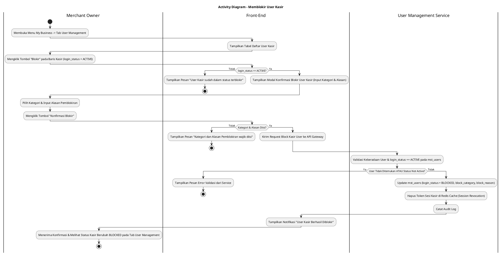
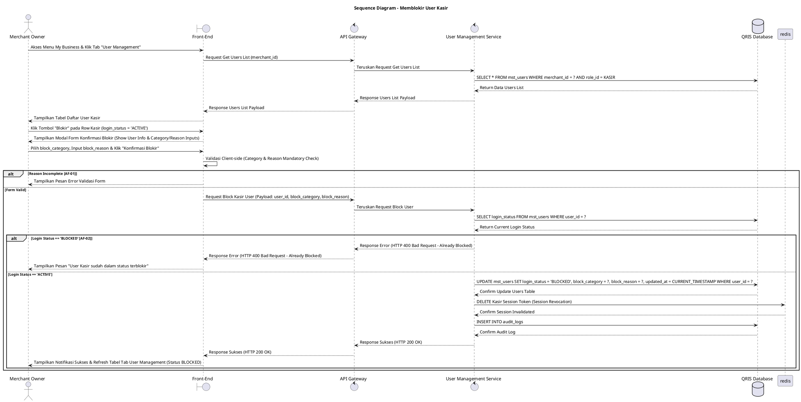

# 1 Deskripsi Use Case

**Tabel 1: Deskripsi Use Case Memblokir User Kasir**

| Elemen Spesifikasi | Deskripsi Detail |
| --- | --- |
| ID Use Case | UC-BOM-019 |
| Nama Use Case | Memblokir User Kasir |
| Penjelasan Singkat | Fitur Back Office Merchant pada menu My Business yang memfasilitasi Merchant Owner untuk memblokir akun pengguna Kasir yang sedang berstatus aktif (`login_status = 'ACTIVE'`) dengan memperbarui `login_status = 'BLOCKED'` pada tabel `mst_users` dan menghapus sesi aktif di Redis Cache melalui User Management Service. |
| Aktor Utama | Merchant Owner |
| Aktor Pendukung | User Management Service |
| Deskripsi Singkat | Merchant Owner melakukan otentikasi login ke Back Office Merchant dan mengakses menu **My Business**. Pada halaman My Business, Merchant Owner memilih tab **User Management**. Sistem menampilkan halaman daftar pengguna kasir dari tabel `mst_users`. Merchant Owner memilih salah satu user kasir yang berstatus aktif (`login_status = 'ACTIVE'`), lalu mengklik tombol aksi **"Blokir"** (atau Block User). Sistem menampilkan modal konfirmasi pemblokiran user kasir yang meminta masukan **Kategori Pemblokiran** (*block_category*) dan **Alasan Pemblokiran** (*block_reason*). Merchant Owner memilih kategori pemblokiran, menginput alasan pemblokiran, lalu mengklik tombol **"Konfirmasi Blokir"**. Front-End memvalidasi kelengkapan alasan dan mengirim request pemblokiran ke API Gateway. User Management Service memvalidasi keberadaan akun kasir dan memastikan statusnya berstatus `login_status = 'ACTIVE'`. Setelah validasi sukses, User Management Service memperbarui record pada tabel **`mst_users`** dengan menetapkan **`login_status = 'BLOCKED'`**, `block_category`, `block_reason`, serta menghapus token sesi aktif kasir tersebut pada Redis Cache (*session invalidation*). Front-End memperbarui tabel daftar user pada tab User Management (menampilkan status badge `BLOCKED`) dan menyajikan notifikasi konfirmasi sukses. |
| Pre-condition | 1. Merchant Owner telah berhasil login ke Back Office Merchant dan akun berstatus aktif. 2. Akun pengguna Kasir yang akan diblokir terdaftar pada `mst_users` dengan status `login_status = 'ACTIVE'`. |
| Post-condition | 1. Status akun pengguna Kasir diperbarui pada tabel `mst_users` menjadi `login_status = 'BLOCKED'`, serta `block_category` dan `block_reason` tersimpan. 2. Sesi aktif Kasir pada Redis Cache dihapus secara instan (*session revoked*), sehingga Kasir langsung ter-logout dan dilarang bertransaksi pada aplikasi Web POS. 3. Front-End menyajikan data status terbarui pada tab User Management halaman My Business. |
| Trigger | Merchant Owner mengklik menu **My Business**, memilih tab **User Management**, mengklik tombol **"Blokir"** pada kasir berstatus `login_status = 'ACTIVE'`, memilih kategori & mengisi alasan pemblokiran, lalu mengklik **"Konfirmasi Blokir"**. |
| Nama Tabel | mst_users, audit_logs |
| Integrasi | 1. **Back Office Merchant UI:** Antarmuka pengelolaan bisnis merchant, tab User Management, dan dialog modal konfirmasi pemblokiran user kasir. 2. **User Management Service:** Microservice backend pengelola pemblokiran status pengguna, penghapusan token sesi Redis Cache, dan pencatatan audit log. 3. **Redis Cache:** Penyimpanan sesi pengguna (*session store*) yang akan dihapus secara otomatis saat pemblokiran diproses. |
| Asumsi | 1. Pemblokiran dilakukan jika kasir terindikasi pelanggaran prosedur, pengunduran diri, atau adanya kecurigaan fraud. 2. Pemblokiran secara *real-time* memutuskan sesi login kasir yang sedang berjalan di peramban Web POS. |
| Keterbatasan | 1. Tombol aksi Blokir hanya aktif untuk akun Kasir yang berstatus `login_status = 'ACTIVE'`. 2. Pengisian Kategori dan Alasan Pemblokiran bersifat mandatori untuk kebutuhan jejak audit (*audit trail*). |
| Aturan Bisnis/Sistem | 1. **Active Account Block Standard:** Akses pemblokiran HANYA dapat diproses untuk akun Kasir yang berstatus `login_status = 'ACTIVE'`. 2. **Mandatory Category & Reason Standard:** Pengisian Kategori Pemblokiran (`block_category`) dan Alasan Pemblokiran (`block_reason`) bersifat WAJIB (*mandatory*). 3. **Real-time Session Revocation Standard:** Eksekusi pemblokiran WAJIB secara *real-time* menghapus seluruh token sesi kasir terkait pada **Redis Cache** (*force logout*), sehingga peramban Web POS langsung menolak transaksi kasir tersebut. 4. **Audit Trail Standard:** Setiap tindakan pemblokiran user kasir mencatat `user_id`, `merchant_id`, `blocked_by` (ID Merchant Owner), kategori, alasan, dan timestamp pada `audit_logs`. |
| Session Idle | 15 Menit |

# 2 Main Flow

**Tabel 2: Main Flow Memblokir User Kasir**

| No. | Aktivitas | Deskripsi |
| ---: | --- | --- |
| 1 | Membuka Menu My Business | Merchant Owner melakukan login dan mengklik menu **My Business** pada navigasi Back Office Merchant. |
| 2 | Memilih Tab User Management | Merchant Owner mengklik tab **User Management** pada halaman My Business. |
| 3 | Menampilkan Daftar User Kasir | Sistem menampilkan halaman daftar user terdaftar dari `mst_users` beserta tombol aksi **"Blokir"** pada kasir berstatus `login_status = 'ACTIVE'`. |
| 4 | Memilih Tombol Blokir User | Merchant Owner mengklik tombol aksi **"Blokir"** pada salah satu baris kasir yang berstatus `ACTIVE`. |
| 5 | Menampilkan Modal Konfirmasi | Sistem menampilkan modal konfirmasi pemblokiran user kasir yang memuat data Nama, Email, Dropdown Kategori Pemblokiran, dan Textarea Alasan Pemblokiran. |
| 6 | Mengisi Kategori & Alasan | Merchant Owner memilih Kategori Pemblokiran, menginput Alasan Pemblokiran, lalu mengklik tombol **"Konfirmasi Blokir"**. |
| 7 | Memvalidasi Form Client-side | Front-End memvalidasi kelengkapan alasan, lalu mengirim request pemblokiran ke API Gateway. |
| 8 | Memperbarui Database & Invalidate Session | User Management Service memvalidasi status `login_status = 'ACTIVE'`, memperbarui `mst_users` (`login_status = 'BLOCKED'`, `block_category`, `block_reason`), dan menghapus sesi kasir di Redis Cache. |
| 9 | Menampilkan Konfirmasi Berhasil | Front-End memperbarui tabel daftar user (menampilkan status `BLOCKED`) dan menampilkan notifikasi konfirmasi bahwa User Kasir berhasil diblokir. |
| 10 | Use Case Selesai | Proses pemblokiran user kasir selesai dilaksanakan. |

# 3 Alternative Flow

**Tabel 3: Alternative Flow Memblokir User Kasir**

| Kode | Alternative Flow | Deskripsi |
| --- | --- | --- |
| AF-01 | Kategori atau Alasan Pemblokiran Kosong | Pada langkah 6-7, apabila Kategori Pemblokiran tidak dipilih atau Alasan Pemblokiran dikosongkan, Sistem menolak request dan Front-End menampilkan `Kategori dan Alasan Pemblokiran wajib diisi`. |
| AF-02 | User Kasir Sudah Dalam Status Blocked | Pada langkah 4 atau 8, apabila user kasir sudah berstatus `login_status = 'BLOCKED'`, Sistem menolak request dan Front-End menampilkan `User Kasir sudah dalam status terblokir`. |
| AF-03 | User Kasir Tidak Ditemukan | Pada langkah 8, apabila `user_id` yang akan diblokir tidak ditemukan pada database, Sistem membatalkan transaksi dan Front-End menampilkan `Data user kasir tidak ditemukan`. |
| AF-04 | Gagal Terhubung ke Database Server | Pada langkah 8, apabila koneksi database terputus total, Sistem mengembalikan HTTP status 500 dan Front-End menampilkan `Terjadi kendala internal pada server`. |

# 4 Status Front-End

**Tabel 4: Status Front-End Memblokir User Kasir**

| No. | Nama Status | Deskripsi Tampilan Front-End |
| ---: | --- | --- |
| 1 | IDLE | Tab User Management pada halaman My Business menyajikan tabel daftar user dan modal konfirmasi pemblokiran siap menerima masukan. |
| 2 | LOADING | Indikator memuat (*spinner*) ditampilkan pada tombol Konfirmasi Blokir saat request pemblokiran sedang diproses server. |
| 3 | SUCCESS | Modal/toast konfirmasi menampilkan pesan sukses User Kasir berhasil diblokir dan status baris tabel diperbarui menjadi `BLOCKED`. |
| 4 | ERROR | Pesan kesalahan ditampilkan pada UI akibat alasan kosong, user sudah terblokir, data tidak ditemukan, atau kendala server. |

# 5 Activity Diagram Memblokir User Kasir

# 6 Sequence Diagram Memblokir User Kasir

# 7 Response Code

**Tabel 5: Response Code Memblokir User Kasir**

| No. | HTTP Status | Response Code | Nama Response | Deskripsi | Respons Front-End |
| ---: | ---: | --- | --- | --- | --- |
| 1 | 200 | 200XX00 | SUCCESS_BLOCK_KASIR_USER | Akun user Kasir berhasil diblokir (`login_status = 'BLOCKED'`) dan sesi Redis Cache dihapus. | Menampilkan pesan notifikasi sukses dan memperbarui tabel tab User Management. |
| 2 | 400 | 400XX00 | INVALID_BLOCK_INPUT | Kategori atau Alasan Pemblokiran user kasir kosong. | Menampilkan pesan kesalahan `Kategori dan Alasan Pemblokiran wajib diisi`. |
| 3 | 400 | 400XX01 | USER_ALREADY_BLOCKED | Akun user Kasir yang akan diblokir sudah berstatus `login_status = 'BLOCKED'`. | Menampilkan pesan kesalahan `User Kasir sudah dalam status terblokir`. |
| 4 | 404 | 404XX00 | USER_NOT_FOUND | Data user kasir tidak ditemukan pada database `mst_users`. | Menampilkan pesan kesalahan `Data user kasir tidak ditemukan`. |
| 5 | 500 | 500XX00 | SYSTEM_INTERNAL_ERROR | Terjadi kegagalan internal server saat mengeksekusi pemblokiran user kasir. | Menampilkan pesan kesalahan `Terjadi kendala internal pada server`. |

# 8 Desain Antarmuka

**Tabel 6: Desain Antarmuka Memblokir User Kasir**

| Halaman | Komponen dan State Utama |
| --- | --- |
| Halaman My Business (Tab User Management) | 1. **Navigasi Tab:** Tab Profile, Tab POS, Tab Store, Tab **User Management** (Active). 2. **Tabel User Kasir:** Kolom No, Nama User, Email, WEB POS Terkait, Store Tugas, Status (`login_status`), dan Aksi. 3. **Tombol "Blokir":** Tombol aksi pemblokiran yang aktif khusus pada baris kasir dengan `login_status = 'ACTIVE'`. |
| Modal Konfirmasi Blokir User Kasir | 1. **Header Peringatan:** Text konfirmasi pemblokiran akun kasir. 2. **Info User Kasir:** Menampilkan Nama User dan Email Kasir. 3. **Dropdown Kategori Pemblokiran:** Pilihan kategori alasan pemblokiran. 4. **Textarea Alasan Pemblokiran:** Input wajib alasan pemblokiran. 5. **Tombol Aksi:** Tombol **"Konfirmasi Blokir"** (Primary Red) dan **"Batal"** (Secondary). |
