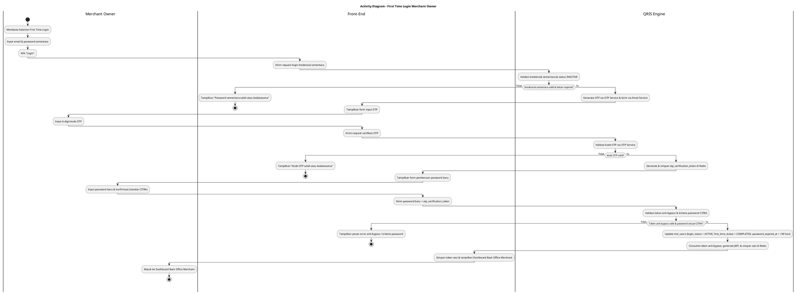
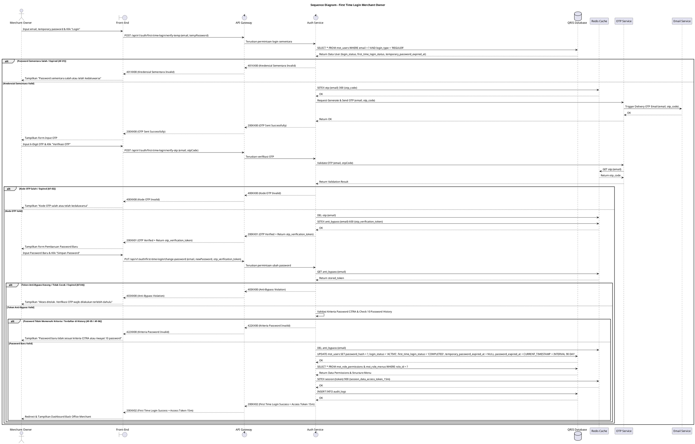

# 1 Deskripsi Use Case

**Tabel 1: Deskripsi Use Case First Time Login Merchant Owner**

| Elemen Spesifikasi | Deskripsi Detail |
| --- | --- |
| ID Use Case | UC-BOM-002 |
| Nama Use Case | First Time Login Merchant Owner |
| Penjelasan Singkat | Proses aktivasi akun Merchant Owner saat pertama kali mengakses Back Office Merchant menggunakan kredensial sementara, verifikasi OTP email via OTP Service, hingga pembaruan kata sandi sesuai kriteria standar CITRA dengan perlindungan anti-bypass. |
| Aktor Utama | Merchant Owner |
| Aktor Pendukung | OTP Service, Email Service |
| Deskripsi Singkat | Merchant Owner menginput email dan password sementara pada Halaman First Time Login. Sistem memvalidasi kredensial sementara (`login_type = 'REGULER'`, `login_status = 'INACTIVE'`, `first_time_login_status = 'REQUIRE_CHANGE_PASSWORD'`, dan `temporary_password_expired_at` masih berlaku), memicu OTP Service untuk mengirimkan kode OTP ke email terdaftar, memverifikasi OTP untuk membuat `otp_verification_token` anti-bypass di Redis Cache, serta memvalidasi password baru sesuai standar CITRA sebelum mengaktifkan akun (`login_status = 'ACTIVE'`, `first_time_login_status = 'COMPLETED'`, serta mengisi `password_expired_at = CURRENT_TIMESTAMP + 90 hari`) dan memberikan token sesi. |
| Pre-condition | 1. Merchant Owner telah didaftarkan pada tabel `mst_users` dengan `login_type = 'REGULER'` dan menerima kredensial sementara. 2. Akun Merchant Owner berstatus `INACTIVE` dan `first_time_login_status = 'REQUIRE_CHANGE_PASSWORD'`. 3. Kredensial password sementara belum kedaluwarsa (`temporary_password_expired_at > CURRENT_TIMESTAMP`). |
| Post-condition | 1. Password sementara berhasil diganti dengan password baru yang memenuhi kriteria standar CITRA. 2. Status akun Merchant Owner diperbarui pada `mst_users` menjadi `login_status = 'ACTIVE'`, `first_time_login_status = 'COMPLETED'`, `temporary_password_expired_at = NULL`, dan kolom `password_expired_at` diisi dengan masa berlaku 90 hari (`CURRENT_TIMESTAMP + 90 hari`). 3. Data sesi disimpan pada Redis Cache, dan Front-End mengarahkan Merchant Owner ke Halaman Utama (Dashboard) Back Office Merchant sesuai hak akses `role_id`. |
| Trigger | Merchant Owner memasukkan email dan password sementara lalu menekan tombol "Login". |
| Nama Tabel | mst_users, mst_role_permissions, mst_role_menus, audit_logs |
| Integrasi | 1. **Redis Cache:** Penyimpanan temporary OTP, token anti-bypass (`otp_verification_token`), rate limit counter, dan session token. 2. **OTP Service:** Layanan pembuatan, validasi, dan manajemen siklus hidup kode OTP. 3. **Email Service:** Layanan pengiriman fisik email kode OTP ke alamat email terdaftar Merchant Owner. |
| Asumsi | 1. Merchant Owner memiliki akses aktif ke alamat email yang terdaftar di sistem. 2. Layanan OTP Service, Email Service, dan Redis Cache beroperasi dengan stabil. |
| Keterbatasan | 1. Pengisian password baru tidak dapat diproses tanpa memverifikasi kode OTP dan menyertakan `otp_verification_token` anti-bypass yang valid. 2. Kredensial sementara yang telah kedaluwarsa tidak dapat digunakan dan memerlukan pengiriman ulang kredensial oleh Admin. |
| Aturan Bisnis/Sistem | 1. **Temporary Credential Verification:** Login pertama wajib memverifikasi email dan password sementara pada `mst_users` yang memiliki `login_status = 'INACTIVE'` dan `first_time_login_status = 'REQUIRE_CHANGE_PASSWORD'`. 2. **Temporary Password Validity:** Tanggal `temporary_password_expired_at` wajib lebih besar dari waktu saat ini (`> CURRENT_TIMESTAMP`). 3. **OTP Email Verification:** Setelah password sementara valid, Auth Service berintegrasi dengan **OTP Service** untuk memproduksi dan mengirimkan kode OTP dinamis (6 digit, masa berlaku 5 menit) ke email terdaftar via Email Service. 4. **OTP Rate Limit & Attempt Penalty:** Pengiriman OTP dibatasi maksimal 3 kali per menit. Percobaan verifikasi OTP salah maksimal 3 kali berturut-turut sebelum OTP dinyatakan kadaluarsa. 5. **Anti-Bypass OTP Token Mechanism:** Setelah verifikasi OTP berhasil, Auth Service menerbitkan `otp_verification_token` sekali pakai (*single-use*) yang disimpan pada **Redis Cache** (TTL 10 menit). Endpoint pembaruan password WAJIB memverifikasi dan mengonsumsi token ini. Apabila request pembaruan password dilakukan tanpa `otp_verification_token` yang sah, sistem menolak akses secara permanen (*Anti-Bypass Enforcement*). 6. **Standar Kriteria Password CITRA:** &nbsp;&nbsp;- Panjang minimal 8 karakter. &nbsp;&nbsp;- Wajib memuat kombinasi minimal 3 dari 4 kriteria: Karakter Spesial (Wajib, mis: `@, #, $`), Huruf Besar (`A-Z`), Huruf Kecil (`a-z`), dan Angka (`0-9`). &nbsp;&nbsp;- Dilarang mengandung User ID, Nama Depan, atau Nama Belakang. &nbsp;&nbsp;- Riwayat Password: Password baru tidak boleh sama dengan 10 riwayat password terakhir. 7. **Account Activation & Password Expiry Completion:** Setelah pembaruan password sukses, sistem mengubah `login_status = 'ACTIVE'`, `first_time_login_status = 'COMPLETED'`, mengosongkan `temporary_password_expired_at`, mengisi kolom `password_expired_at` dengan masa berlaku 90 hari (`CURRENT_TIMESTAMP + 90 hari`), memuat `mst_role_permissions` & `mst_role_menus`, serta membuat sesi di Redis Cache. |
| Session Idle | 15 Menit |
| Expired Sesi OTP | 5 Menit |

# 2 Main Flow

**Tabel 2: Main Flow First Time Login Merchant Owner**

| No. | Aktivitas | Deskripsi |
| ---: | --- | --- |
| 1 | Membuka Halaman Aktivasi | Merchant Owner membuka halaman First Time Login Back Office Merchant pada peramban web. |
| 2 | Memasukkan Kredensial Sementara | Merchant Owner menginput email dan password sementara yang diterima dari Admin/Sistem. |
| 3 | Mengirim Request Login | Merchant Owner menekan tombol "Login", Front-End mengirim request autentikasi awal ke Auth Service via API Gateway. |
| 4 | Memvalidasi Kredensial & Status | Auth Service memvalidasi email, hash password sementara, `login_type = 'REGULER'`, `login_status = 'INACTIVE'`, `first_time_login_status = 'REQUIRE_CHANGE_PASSWORD'`, serta `temporary_password_expired_at > CURRENT_TIMESTAMP`. |
| 5 | Pengiriman Kode OTP via OTP Service | Auth Service memicu OTP Service untuk membuat 6-digit kode OTP dinamis (disimpan di Redis Cache) dan mengirimkannya ke email Merchant Owner melalui Email Service. |
| 6 | Memasukkan Kode OTP | Merchant Owner menerima email, lalu menginput 6-digit kode OTP pada form verifikasi Front-End. |
| 7 | Verifikasi OTP & Generasi Token Anti-Bypass | Auth Service memvalidasi kode OTP melalui OTP Service. Setelah cocok, Auth Service membuat `otp_verification_token` dinamis di Redis Cache (TTL 10m) dan mengembalikannya ke Front-End. |
| 8 | Memasukkan Password Baru | Merchant Owner menginput password baru dan konfirmasi password sesuai kriteria standar CITRA. |
| 9 | Memvalidasi Password & Token Anti-Bypass | Front-End mengirimkan password baru beserta `otp_verification_token`. Auth Service memverifikasi keabsahan token anti-bypass di Redis Cache (lalu mengonsumsi/menghapusnya), serta menguji kriteria password CITRA dan riwayat 10 password terakhir. |
| 10 | Memperbarui Status Akun & Sesi | Auth Service memperbarui `mst_users` (`login_status = 'ACTIVE'`, `first_time_login_status = 'COMPLETED'`, `temporary_password_expired_at = NULL`, dan mengisi `password_expired_at = CURRENT_TIMESTAMP + 90 hari`), memuat `mst_role_permissions` & `mst_role_menus`, membuat token sesi (JWT) di Redis Cache, serta mencatat `audit_logs`. |
| 11 | Use Case Selesai | Front-End menyimpan token sesi dan mengarahkan Merchant Owner ke Halaman Utama (Dashboard) Back Office Merchant. |

# 3 Alternative Flow

**Tabel 3: Alternative Flow First Time Login Merchant Owner**

| Kode | Alternative Flow | Deskripsi |
| --- | --- | --- |
| AF-01 | Kredensial Sementara Salah / Kadaluarsa | Pada langkah 4, apabila password sementara salah atau `temporary_password_expired_at <= CURRENT_TIMESTAMP`, Sistem menolak akses dan Front-End menampilkan `Password sementara salah atau telah kedaluwarsa. Hubungi Admin.`. |
| AF-02 | Kode OTP Salah / Kadaluarsa | Pada langkah 7, apabila kode OTP yang diinput salah atau telah melewati batas 5 menit, OTP Service menolak verifikasi dan Front-End menampilkan `Kode OTP yang Anda masukkan salah atau telah kedaluwarsa.`. |
| AF-03 | Rate Limit Request OTP Terlampaui | Pada langkah 5, apabila permintaan ulang OTP melebihi 3 kali per menit, OTP Service menolak pengiriman dan Front-End menampilkan `Batas permintaan OTP terlampaui (maksimal 3 kali per menit). Silakan tunggu beberapa saat.`. |
| AF-04 | Indikasi Bypass OTP (Token Anti-Bypass Tidak Valid / Expired) | Pada langkah 9, apabila request pembaruan password dikirimkan tanpa `otp_verification_token` atau menggunakan token yang kadaluarsa/sudah terpakai, Sistem menolak permintaan dan Front-End menampilkan `Akses ditolak. Verifikasi OTP wajib dilakukan terlebih dahulu (Anti-Bypass Violation).`. |
| AF-05 | Password Baru Tidak Memenuhi Kriteria CITRA | Pada langkah 9, apabila password baru kurang dari 8 karakter, tidak memenuhi 3/4 kombinasi (karakter spesial wajib), atau mengandung nama/ID, Sistem menolak dan Front-End menampilkan `Password baru harus minimal 8 karakter dan memuat kombinasi kriteria CITRA.`. |
| AF-06 | Password Baru Sama dengan Riwayat 10 Password Terakhir | Pada langkah 9, apabila password baru pernah digunakan dalam 10 riwayat password terakhir, Sistem menolak dan Front-End menampilkan `Password baru tidak boleh sama dengan 10 riwayat password terakhir.`. |

# 4 Status Front-End

**Tabel 4: Status Front-End First Time Login Merchant Owner**

| No. | Nama Status | Deskripsi Tampilan Front-End |
| ---: | --- | --- |
| 1 | IDLE | Tampilan default form masukan email dan password sementara. |
| 2 | OTP_VERIFICATION | Tampilan modal/form masukan 6-digit kode OTP beserta tombol resend dan hitung mundur timer. |
| 3 | CHANGE_PASSWORD | Tampilan form input password baru dan konfirmasi password dilengkapi indikator kekuatan password standar CITRA. |
| 4 | LOADING | Tampilan indikator memuat (spinner) saat pemrosesan verifikasi kredensial, OTP, atau pembaruan password. |
| 5 | SUCCESS | Status sukses pembaruan password dan aktivasi akun sebelum halaman dialihkan ke Dashboard. |
| 6 | ERROR | Tampilan pesan kesalahan (alert banner/toast) saat terjadi kesalahan kredensial, OTP salah, pelanggaran anti-bypass, atau password tidak sesuai kriteria. |

# 5 Activity Diagram First Time Login Merchant Owner

# 6 Sequence Diagram First Time Login Merchant Owner

# 7 Response Code

**Tabel 5: Response Code First Time Login Merchant Owner**

| No. | HTTP Status | Response Code | Nama Response | Deskripsi | Respons Front-End |
| ---: | ---: | --- | --- | --- | --- |
| 1 | 200 | 200XX00 | OTP_SENT_SUCCESS | Kredensial sementara valid dan kode OTP berhasil dikirimkan via OTP Service. | Menampilkan form masukan 6-digit kode OTP. |
| 2 | 200 | 200XX01 | OTP_VERIFIED_SUCCESS | Verifikasi kode OTP berhasil melalui OTP Service dan token anti-bypass (`otp_verification_token`) diterbitkan. | Menampilkan form pengisian password baru. |
| 3 | 200 | 200XX02 | FIRST_TIME_LOGIN_SUCCESS | Pembaruan password baru sukses, `password_expired_at` diisi 90 hari, akun berstatus `ACTIVE`, dan token sesi dibuat di Redis Cache. | Mengarahkan Merchant Owner ke Dashboard Back Office Merchant. |
| 4 | 400 | 400XX00 | INVALID_OTP_CODE | Kode OTP yang dimasukkan tidak cocok atau masa berlaku 5 menit telah kedaluwarsa pada OTP Service. | Menampilkan pesan kesalahan OTP tidak valid. |
| 5 | 401 | 401XX00 | INVALID_TEMP_CREDENTIALS | Kombinasi email atau password sementara salah, atau `temporary_password_expired_at` telah lewat. | Menampilkan pesan error kredensial sementara tidak valid. |
| 6 | 403 | 403XX00 | ANTI_BYPASS_VIOLATION | Permintaan pembaruan password dikirim tanpa `otp_verification_token` yang sah/terverifikasi. | Menampilkan pesan akses ditolak dan mewajibkan verifikasi OTP ulang. |
| 7 | 422 | 422XX00 | PASSWORD_CRITERIA_INVALID | Password baru tidak memenuhi kriteria standar CITRA (min 8 karakter, 3/4 kombinasi dengan karakter spesial wajib, dilarang mengandung ID/nama). | Menampilkan pesan error kriteria password. |
| 8 | 422 | 422XX01 | PASSWORD_HISTORY_VIOLATION | Password baru yang dimasukkan sama dengan salah satu dari 10 riwayat password terakhir. | Menampilkan pesan error riwayat password. |
| 9 | 429 | 429XX00 | OTP_RATE_LIMIT_EXCEEDED | Permintaan pengiriman ulang OTP melebihi batas 3 kali per menit pada OTP Service. | Menampilkan pesan peringatan rate limit OTP. |
| 10 | 500 | 500XX00 | INTERNAL_AUTH_ERROR | Gangguan internal pada layanan autentikasi / OTP Service / Email Service. | Menampilkan pesan kesalahan sistem internal. |

# 8 Desain Antarmuka

**Tabel 6: Desain Antarmuka First Time Login Merchant Owner**

| Halaman | Komponen dan State Utama |
| --- | --- |
| Halaman Aktivasi / First Time Login | - Form Input **Email** & **Password Sementara** (`IDLE` / `ERROR`). - Tombol Utama **"Login"** (`IDLE` / `LOADING`). |
| Modal / Step Verifikasi OTP | - Input 6-Digit **Kode OTP** (`OTP_VERIFICATION` / `ERROR`). - Tombol **"Verifikasi OTP"** & Link **"Kirim Ulang OTP"** (dengan Countdown Timer). |
| Form Pembaruan Password Baru | - Form Input **Password Baru** & **Konfirmasi Password** (`CHANGE_PASSWORD`). - Checklist Indikator Kriteria Password Standar CITRA. - Tombol **"Simpan Password Baru"** (`IDLE` / `LOADING`). |
| Halaman Utama (Dashboard) | - Header Profile Merchant Owner (Status Akun: `ACTIVE`). - Sidebar Menu Navigasi Back Office Merchant (Dikelola berdasarkan `mst_role_menus` dan `mst_role_permissions`). |
