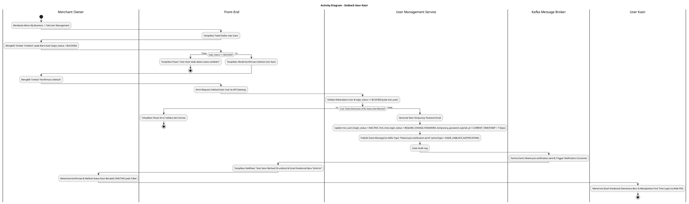
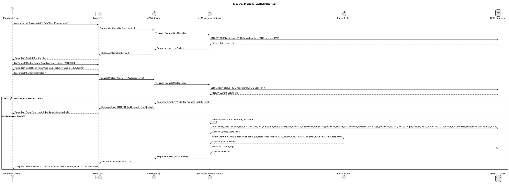

# 1 Deskripsi Use Case

**Tabel 1: Deskripsi Use Case Unblock User Kasir**

| Elemen Spesifikasi | Deskripsi Detail |
| --- | --- |
| ID Use Case | UC-BOM-020 |
| Nama Use Case | Unblock User Kasir |
| Penjelasan Singkat | Fitur Back Office Merchant pada menu My Business yang memfasilitasi Merchant Owner untuk memulihkan (*unblock*) akun pengguna Kasir yang terblokir (`login_status = 'BLOCKED'`) dengan menetapkan kredensial sementara baru pada `mst_users`, serta mempublikasikan event Kafka ke topic `hibank.qris.notification.send` untuk pengiriman email kredensial baru melalui User Management Service. |
| Aktor Utama | Merchant Owner |
| Aktor Pendukung | User Management Service, Kafka Message Broker |
| Deskripsi Singkat | Merchant Owner melakukan otentikasi login ke Back Office Merchant dan mengakses menu **My Business**. Pada halaman My Business, Merchant Owner memilih tab **User Management**. Sistem menampilkan halaman daftar pengguna kasir dari tabel `mst_users`. Merchant Owner memilih salah satu user kasir yang berstatus terblokir (`login_status = 'BLOCKED'`), lalu mengklik tombol aksi **"Unblock"** (atau Buka Blokir). Sistem menampilkan modal konfirmasi pembukaan blokir user kasir. Merchant Owner mengklik tombol **"Konfirmasi Unblock"**. Front-End mengirim request pembukaan blokir ke API Gateway. User Management Service memvalidasi keberadaan akun kasir dan memastikan statusnya berstatus `login_status = 'BLOCKED'`. Setelah validasi sukses, User Management Service secara otomatis membuat password sementara acak baru (*new temporary password*), memperbarui record pada tabel **`mst_users`** dengan menetapkan `login_status = 'INACTIVE'`, `first_time_login_status = 'REQUIRE_CHANGE_PASSWORD'`, `temporary_password_expired_at = CURRENT_TIMESTAMP + 7 Hari`, serta mengosongkan `block_category` dan `block_reason`. Selanjutnya, User Management Service mempublikasikan event ke Kafka topic **`hibank.qris.notification.send`** dengan payload `actionType = 'KASIR_UNBLOCK_NOTIFICATION'` yang memuat email, nama kasir, dan password sementara baru. Consumer Notification Service menangkap event Kafka tersebut dan mengirimkan email pemberitahuan ke Kasir. User Kasir nantinya WAJIB mengulang alur aktivasi dan pembaruan password pertama pada [First time login user kasir.md](file:///d:/FSD/Web%20POS/2.%20First%20time%20login%20user%20kasir.md) sebelum dapat kembali bertransaksi pada aplikasi Web POS. Front-End memperbarui tabel daftar user pada tab User Management (menampilkan status badge `INACTIVE`) dan menyajikan notifikasi konfirmasi sukses. |
| Pre-condition | 1. Merchant Owner telah berhasil login ke Back Office Merchant dan akun berstatus aktif. 2. Akun pengguna Kasir yang akan di-unblock terdaftar pada `mst_users` dengan status `login_status = 'BLOCKED'`. |
| Post-condition | 1. Status akun Kasir pada `mst_users` diperbarui menjadi `login_status = 'INACTIVE'`, `first_time_login_status = 'REQUIRE_CHANGE_PASSWORD'`, `temporary_password_expired_at` terisi 7 hari, dan password sementara baru tersimpan. 2. Event Kafka berhasil dipublikasikan ke topic `hibank.qris.notification.send` untuk memicu pengiriman email kredensial sementara baru. 3. Akun Kasir siap digunakan untuk alur aktivasi ulang via [First time login user kasir.md](file:///d:/FSD/Web%20POS/2.%20First%20time%20login%20user%20kasir.md). 4. Front-End menyajikan data status terbarui pada tab User Management halaman My Business. |
| Trigger | Merchant Owner mengklik menu **My Business**, memilih tab **User Management**, mengklik tombol **"Unblock"** pada kasir berstatus `login_status = 'BLOCKED'`, lalu mengklik **"Konfirmasi Unblock"**. |
| Nama Tabel | mst_users, audit_logs |
| Integrasi | 1. **Back Office Merchant UI:** Antarmuka pengelolaan bisnis merchant, tab User Management, dan dialog modal konfirmasi pembukaan blokir user kasir. 2. **User Management Service:** Microservice backend pengelola reset status pengguna, penjanaan password sementara baru, dan publikasi event Kafka. 3. **Kafka Message Broker:** Broker pesan untuk mempublikasikan event notifikasi email (`hibank.qris.notification.send`). |
| Asumsi | 1. Unblock kasir memicu kewajiban ganti password pertama (*First Time Login*) ulang guna memastikan keamanan kredensial kasir. 2. Pesan email memuat kredensial sementara baru dikirimkan secara otomatis via antrean Kafka. |
| Keterbatasan | 1. Tombol aksi Unblock hanya aktif untuk akun Kasir yang berstatus `login_status = 'BLOCKED'`. 2. User Kasir yang di-unblock tidak dapat langsung login bertransaksi di Web POS tanpa menyelesaikan alur First Time Login. |
| Aturan Bisnis/Sistem | 1. **Blocked Account Unblock Standard:** Akses pembukaan blokir HANYA dapat diproses untuk akun Kasir yang berstatus `login_status = 'BLOCKED'`. 2. **Temporary Credential Re-generation Standard:** Eksekusi unblock WAJIB membuat password sementara acak baru dan memperbarui record `mst_users` dengan menetapkan `login_status = 'INACTIVE'`, `first_time_login_status = 'REQUIRE_CHANGE_PASSWORD'`, `temporary_password_expired_at = CURRENT_TIMESTAMP + 7 Hari`, serta menghapus atribut `block_category` & `block_reason`. 3. **Kafka Notification Event Standard:** Setelah database diperbarui, sistem WAJIB mempublikasikan event Kafka ke topic **`hibank.qris.notification.send`** dengan payload `actionType = 'KASIR_UNBLOCK_NOTIFICATION'` yang memuat email, nama kasir, dan password sementara baru. 4. **Mandatory First Time Login Re-execution:** User Kasir WAJIB menyelesaikan proses autentikasi awal dan pembuatan password permanen baru sesuai aturan [First time login user kasir.md](file:///d:/FSD/Web%20POS/2.%20First%20time%20login%20user%20kasir.md). 5. **Audit Trail Standard:** Setiap tindakan unblock user kasir mencatat `user_id`, `merchant_id`, `unblocked_by` (ID Merchant Owner), dan timestamp pada `audit_logs`. |
| Session Idle | 15 Menit |

# 2 Main Flow

**Tabel 2: Main Flow Unblock User Kasir**

| No. | Aktivitas | Deskripsi |
| ---: | --- | --- |
| 1 | Membuka Menu My Business | Merchant Owner melakukan login dan mengklik menu **My Business** pada navigasi Back Office Merchant. |
| 2 | Memilih Tab User Management | Merchant Owner mengklik tab **User Management** pada halaman My Business. |
| 3 | Menampilkan Daftar User Kasir | Sistem menampilkan halaman daftar user terdaftar dari `mst_users` beserta tombol aksi **"Unblock"** pada kasir berstatus `login_status = 'BLOCKED'`. |
| 4 | Memilih Tombol Unblock User | Merchant Owner mengklik tombol aksi **"Unblock"** pada salah satu baris kasir yang berstatus `BLOCKED`. |
| 5 | Menampilkan Modal Konfirmasi | Sistem menampilkan modal konfirmasi pembukaan blokir user kasir yang memuat informasi Nama, Email, dan peringatan pemicuan password sementara baru. |
| 6 | Mengklik Konfirmasi Unblock | Merchant Owner mengklik tombol **"Konfirmasi Unblock"**. |
| 7 | Memvalidasi Request Unblock | Front-End mengirim request pembukaan blokir user kasir ke API Gateway. |
| 8 | Update Database & Generate Temp Credential | User Management Service memvalidasi status `login_status = 'BLOCKED'`, membuat password sementara acak baru, memperbarui `mst_users` (`login_status = 'INACTIVE'`, `first_time_login_status = 'REQUIRE_CHANGE_PASSWORD'`, `temporary_password_expired_at = CURRENT_TIMESTAMP + 7 Hari`), dan menghapus kolom `block_category` & `block_reason`. |
| 9 | Publish Event Kafka Email | User Management Service mempublikasikan message event ke Kafka topic `hibank.qris.notification.send` (`actionType = 'KASIR_UNBLOCK_NOTIFICATION'`) untuk memicu pengiriman email kredensial sementara baru. |
| 10 | Menampilkan Konfirmasi Berhasil | Front-End memperbarui tabel daftar user (menampilkan status `INACTIVE`) dan menampilkan notifikasi konfirmasi bahwa User Kasir berhasil di-unblock dan email kredensial baru terkirim. |
| 11 | User Kasir First Time Login | User Kasir menerima email kredensial baru dan menyelesaikan alur aktivasi via [First time login user kasir.md](file:///d:/FSD/Web%20POS/2.%20First%20time%20login%20user%20kasir.md). |
| 12 | Use Case Selesai | Proses unblock user kasir selesai dilaksanakan. |

# 3 Alternative Flow

**Tabel 3: Alternative Flow Unblock User Kasir**

| Kode | Alternative Flow | Deskripsi |
| --- | --- | --- |
| AF-01 | User Kasir Tidak Dalam Status Blocked | Pada langkah 4 atau 8, apabila user kasir tidak berstatus `login_status = 'BLOCKED'`, Sistem menolak request dan Front-End menampilkan `User Kasir tidak dalam status terblokir`. |
| AF-02 | Kafka Publish Event Gagal | Pada langkah 9, apabila terjadi kendala publish ke Kafka broker, Sistem tetap menyimpan pembaruan status di database dan Front-End menampilkan `User Kasir berhasil di-unblock, tetapi antrean pengiriman email mengalami kendala`. |
| AF-03 | User Kasir Tidak Ditemukan | Pada langkah 8, apabila `user_id` yang akan di-unblock tidak ditemukan pada database, Sistem membatalkan transaksi dan Front-End menampilkan `Data user kasir tidak ditemukan`. |
| AF-04 | Gagal Terhubung ke Database Server | Pada langkah 8, apabila koneksi database terputus total, Sistem mengembalikan HTTP status 500 dan Front-End menampilkan `Terjadi kendala internal pada server`. |

# 4 Status Front-End

**Tabel 4: Status Front-End Unblock User Kasir**

| No. | Nama Status | Deskripsi Tampilan Front-End |
| ---: | --- | --- |
| 1 | IDLE | Tab User Management pada halaman My Business menyajikan tabel daftar user dan modal konfirmasi unblock siap menerima masukan. |
| 2 | LOADING | Indikator memuat (*spinner*) ditampilkan pada tombol Konfirmasi Unblock saat request pembukaan blokir sedang diproses server. |
| 3 | SUCCESS | Modal/toast konfirmasi menampilkan pesan sukses User Kasir berhasil di-unblock dan status baris tabel diperbarui menjadi `INACTIVE`. |
| 4 | ERROR | Pesan kesalahan ditampilkan pada UI akibat user tidak terblokir, data tidak ditemukan, atau kendala server. |

# 5 Activity Diagram Unblock User Kasir

# 6 Sequence Diagram Unblock User Kasir

# 7 Response Code

**Tabel 5: Response Code Unblock User Kasir**

| No. | HTTP Status | Response Code | Nama Response | Deskripsi | Respons Front-End |
| ---: | ---: | --- | --- | --- | --- |
| 1 | 200 | 200XX00 | SUCCESS_UNBLOCK_KASIR_USER | Akun user Kasir berhasil di-unblock (`login_status = 'INACTIVE'`), kredensial sementara baru diset, dan event Kafka email terpublikasi. | Menampilkan pesan notifikasi sukses dan memperbarui tabel tab User Management. |
| 2 | 400 | 400XX00 | USER_NOT_BLOCKED | Akun user Kasir yang akan di-unblock tidak dalam status `login_status = 'BLOCKED'`. | Menampilkan pesan kesalahan `User Kasir tidak dalam status terblokir`. |
| 3 | 404 | 404XX00 | USER_NOT_FOUND | Data user kasir tidak ditemukan pada database `mst_users`. | Menampilkan pesan kesalahan `Data user kasir tidak ditemukan`. |
| 4 | 500 | 500XX00 | SYSTEM_INTERNAL_ERROR | Terjadi kegagalan internal server saat mengeksekusi pembukaan blokir user kasir. | Menampilkan pesan kesalahan `Terjadi kendala internal pada server`. |

# 8 Desain Antarmuka

**Tabel 6: Desain Antarmuka Unblock User Kasir**

| Halaman | Komponen dan State Utama |
| --- | --- |
| Halaman My Business (Tab User Management) | 1. **Navigasi Tab:** Tab Profile, Tab POS, Tab Store, Tab **User Management** (Active). 2. **Tabel User Kasir:** Kolom No, Nama User, Email, WEB POS Terkait, Store Tugas, Status (`login_status`), dan Aksi. 3. **Tombol "Unblock":** Tombol aksi pembukaan blokir yang aktif khusus pada baris kasir dengan `login_status = 'BLOCKED'`. |
| Modal Konfirmasi Unblock User Kasir | 1. **Header Peringatan:** Text konfirmasi pembukaan blokir akun kasir. 2. **Info User Kasir:** Menampilkan Nama User dan Email Kasir. 3. **Keterangan Email:** Informasi bahwa kredensial sementara baru akan dikirimkan ke email kasir. 4. **Tombol Aksi:** Tombol **"Konfirmasi Unblock"** (Primary Button) dan **"Batal"** (Secondary). |
