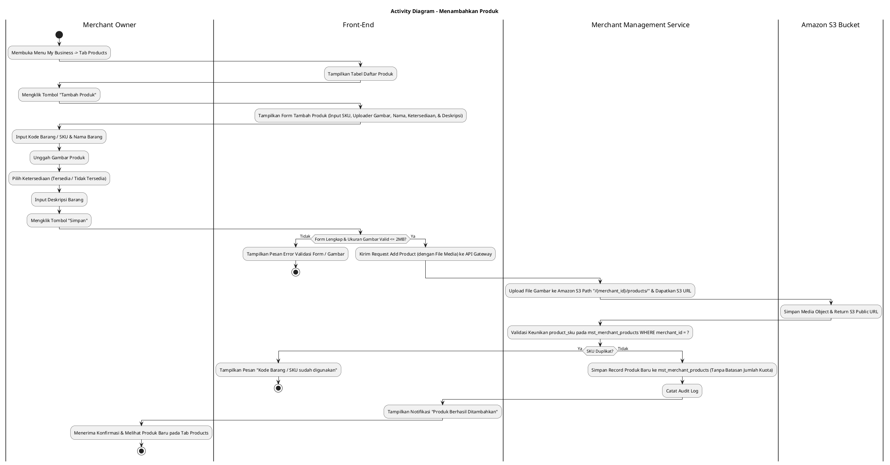
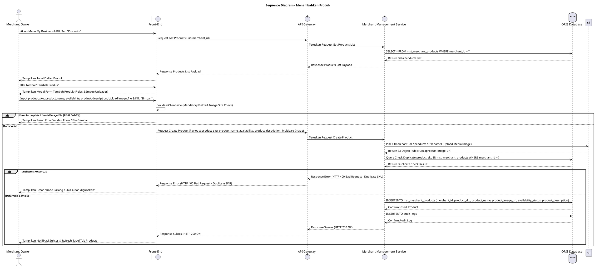

# 1 Deskripsi Use Case

**Tabel 1: Deskripsi Use Case Menambahkan Produk**

| Elemen Spesifikasi | Deskripsi Detail |
| --- | --- |
| ID Use Case | UC-BOM-021 |
| Nama Use Case | Menambahkan Produk |
| Penjelasan Singkat | Fitur Back Office Merchant pada menu My Business yang memfasilitasi Merchant Owner untuk mendaftarkan barang/produk baru di bawah entitas merchant tanpa batasan jumlah (*unlimited product quota*) dengan menginput Kode Barang/SKU, Nama Barang, Harga Barang (`product_price`), Gambar Produk (diunggah ke Amazon S3 pada folder `{merchant_id}/products`), Ketersediaan (*AVAILABLE* / *UNAVAILABLE*), dan Deskripsi Barang pada tabel `mst_merchant_products` melalui Merchant Management Service. |
| Aktor Utama | Merchant Owner |
| Aktor Pendukung | Merchant Management Service |
| Deskripsi Singkat | Merchant Owner melakukan otentikasi login ke Back Office Merchant dan mengakses menu **My Business**. Pada halaman My Business, Merchant Owner memilih tab **Products** (atau Catalog / Produk). Sistem menampilkan halaman daftar produk yang sudah terdaftar dari tabel `mst_merchant_products` beserta tombol aksi **"Tambah Produk"**. Merchant Owner mengklik tombol **"Tambah Produk"** sehingga sistem menampilkan modal formulir pendaftaran produk baru. Merchant Owner menginput Kode Barang / SKU (*product_sku*), menginput Nama Barang (*product_name*), menginput Harga Barang (*product_price* - angka bulat tanpa koma), mengunggah Gambar Produk (*product_image_url*), memilih Ketersediaan Produk (**Tersedia** / `AVAILABLE` atau **Tidak Tersedia** / `UNAVAILABLE`), dan menginput Deskripsi Barang (*product_description*). Merchant Owner mengklik tombol **"Simpan"**. Front-End memvalidasi kelengkapan form, mengunggah file gambar ke Amazon S3 bucket pada path folder **`/{merchant_id}/products/`**, lalu mengirim request pembuatan produk ke API Gateway. Merchant Management Service memvalidasi keunikan `product_sku` di bawah entitas merchant tersebut pada tabel **`mst_merchant_products`**. Tanpa adanya batasan jumlah kuota pendaftaran produk, Merchant Management Service menyimpan record produk baru ke tabel **`mst_merchant_products`**. Front-End memperbarui tabel daftar produk pada tab Products dan menyajikan notifikasi konfirmasi sukses. |
| Pre-condition | 1. Merchant Owner telah berhasil login ke Back Office Merchant dan akun berstatus aktif (`login_status = 'ACTIVE'`). |
| Post-condition | 1. Data produk baru berhasil tersimpan pada tabel `mst_merchant_products` dengan status ketersediaan `AVAILABLE` atau `UNAVAILABLE`. 2. Gambar produk berhasil terunggah dan tersimpan di Amazon S3 bucket pada path `/{merchant_id}/products/`. 3. Produk yang ditambahkan langsung tersedia pada katalog barang dan siap digunakan untuk transaksi di Web POS. 4. Front-End menyajikan data produk baru pada tab Products halaman My Business. |
| Trigger | Merchant Owner mengklik menu **My Business**, memilih tab **Products**, mengklik tombol **"Tambah Produk"**, mengisi Kode Barang/SKU, mengunggah Gambar ke S3, menginput Nama, Ketersediaan, dan Deskripsi, lalu mengklik **"Simpan"**. |
| Nama Tabel | mst_merchant_products, audit_logs |
| Integrasi | 1. **Back Office Merchant UI:** Antarmuka pengelolaan bisnis merchant, tab Products, modal form pendaftaran produk, dan uploader media gambar. 2. **Merchant Management Service:** Microservice backend pengelola katalog barang, inventarisasi produk, uploader file gambar ke Amazon S3, serta otorisasi merchant. 3. **Amazon S3 Bucket:** Layanan penyimpanan objek cloud untuk menyimpan file media gambar produk pada struktur folder `/{merchant_id}/products/`. |
| Asumsi | 1. Setiap merchant diperbolehkan menambah produk secara bebas **tanpa batasan jumlah kuota** (*unlimited product items*). 2. Kode Barang / SKU (*product_sku*) bersifat unik per entitas merchant. 3. File gambar produk yang diunggah dikonversi/disimpan pada Amazon S3 dengan struktur folder `/{merchant_id}/products/{filename}` yang menghasilkan URL publik S3 (`product_image_url`). |
| Keterbatasan | 1. Pengisian Kode Barang/SKU, Nama Barang, Harga Barang, dan Ketersediaan bersifat WAJIB (*mandatory*). 2. Format nominal Harga Barang WAJIB berupa angka bulat (integer) positif tanpa koma atau desimal (contoh: 15000). 3. Panjang karakter input dibatasi: Kode Barang/SKU (maks. 50 karakter), Nama Barang (maks. 100 karakter), dan Deskripsi Barang (maks. 500 karakter). 4. Format file gambar produk dibatasi pada ekstensi standar (`.jpg`, `.jpeg`, `.png`, `.webp`) dengan ukuran maksimum 2 MB. |
| Aturan Bisnis/Sistem | 1. **Unlimited Product Quota Standard:** Sistem DILARANG membatasi jumlah akumulasi total produk yang ditambahkan oleh merchant (**Tidak ada batasan jumlah dalam menambahkan produk**). 2. **Amazon S3 Storage Path Standard:** Seluruh file gambar produk WAJIB diunggah dan disimpan pada Amazon S3 Bucket dengan struktur path folder baku: **`/{merchant_id}/products/{unique_filename}`**. 3. **Mandatory Input Fields & Max Length Standard:** Pengisian Kode Barang / SKU (`product_sku`), Nama Barang (`product_name`), Harga Barang (`product_price`), dan Ketersediaan Produk (`availability_status`) bersifat WAJIB (*mandatory*). Batas maksimum karakter input diatur: `product_sku` (maks. 50 karakter), `product_name` (maks. 100 karakter), dan `product_description` (maks. 500 karakter). 4. **Product Price Formatting Standard:** Nominal Harga Barang (`product_price`) WAJIB diinput dalam format angka bulat (integer) tanpa desimal atau tanpa tanda koma (contoh: `15000` bukan `15000.00` atau `15.000,00`). 5. **SKU Uniqueness Standard:** Kode Barang / SKU (`product_sku`) WAJIB unik per merchant pada tabel `mst_merchant_products`. 6. **Availability Status Standard:** Pilihan Ketersediaan Produk WAJIB diset salah satu dari dua opsi: **Tersedia** (`AVAILABLE` / `true`) atau **Tidak Tersedia** (`UNAVAILABLE` / `false`). 7. **Image File Validation Standard:** Unggahan file gambar produk wajib mematuhi batas ukuran maks 2 MB dan format gambar valid (`.jpg`, `.png`, `.webp`). 8. **Audit Trail Standard:** Setiap pendaftaran produk baru mencatat `product_id`, `merchant_id`, `created_by` (ID Merchant Owner), rincian data produk, dan timestamp pada `audit_logs`. |
| Session Idle | 15 Menit |

# 2 Main Flow

**Tabel 2: Main Flow Menambahkan Produk**

| No. | Aktivitas | Deskripsi |
| ---: | --- | --- |
| 1 | Membuka Menu My Business | Merchant Owner melakukan login dan mengklik menu **My Business** pada navigasi Back Office Merchant. |
| 2 | Memilih Tab Products | Merchant Owner mengklik tab **Products** pada halaman My Business. |
| 3 | Menampilkan Daftar Produk | Sistem menampilkan halaman daftar produk terdaftar dari `mst_merchant_products` beserta tombol aksi **"Tambah Produk"**. |
| 4 | Memilih Tombol Tambah Produk | Merchant Owner mengklik tombol **"Tambah Produk"**. |
| 5 | Menampilkan Form Tambah Produk | Sistem menampilkan modal formulir pendaftaran produk baru yang memuat inputan Kode Barang/SKU, Uploader Gambar, Nama Barang, Dropdown/Radio Ketersediaan (Tersedia / Tidak Tersedia), dan Textarea Deskripsi Barang. |
| 6 | Mengisi Form Produk | Merchant Owner menginput Kode Barang/SKU, mengunggah file Gambar Produk, menginput Nama Barang, memilih Ketersediaan, dan mengisi Deskripsi Barang. |
| 7 | Mengklik Tombol Simpan | Merchant Owner mengklik tombol **"Simpan"**. |
| 8 | Memvalidasi Form Client-side | Front-End memvalidasi kelengkapan form, format gambar & ukuran file, lalu mengirim request pendaftaran produk beserta media gambar ke API Gateway. |
| 9 | Upload S3 & Menyimpan Produk | Merchant Management Service mengunggah file gambar ke Amazon S3 pada folder `/{merchant_id}/products/`, memvalidasi keunikan `product_sku` pada `mst_merchant_products`, dan menyimpan record produk baru (tanpa batasan kuota). |
| 10 | Menampilkan Konfirmasi Berhasil | Front-End memperbarui tabel daftar produk pada tab Products dan menampilkan notifikasi konfirmasi bahwa produk berhasil ditambahkan. |
| 11 | Use Case Selesai | Proses penambahan produk baru selesai dilaksanakan. |

# 3 Alternative Flow

**Tabel 3: Alternative Flow Menambahkan Produk**

| Kode | Alternative Flow | Deskripsi |
| --- | --- | --- |
| AF-01 | Kolom Mandatory Kosong | Pada langkah 7-8, apabila Kode Barang/SKU, Nama Barang, atau Ketersediaan dikosongkan, Sistem menolak request dan Front-End menampilkan `Kode Barang/SKU, Nama Barang, dan Ketersediaan wajib diisi`. |
| AF-02 | Kode Barang / SKU Sudah Terdaftar | Pada langkah 9, apabila `product_sku` yang diinput sudah digunakan oleh produk lain pada merchant yang sama, Merchant Management Service membatalkan transaksi dan Front-End menampilkan `Kode Barang / SKU sudah digunakan`. |
| AF-03 | Format / Ukuran Gambar Tidak Valid | Pada langkah 8, apabila file gambar yang diunggah melebihi 2 MB atau format bukan `.jpg/.png/.webp`, Front-End menolak request dan menampilkan `Ukuran file gambar maksimal 2MB dengan format JPG, PNG, atau WEBP`. |
| AF-04 | Gagal Upload ke Amazon S3 | Pada langkah 9, apabila layanan Amazon S3 mengalami kendala upload, Sistem membatalkan transaksi dan Front-End menampilkan `Gagal mengunggah gambar produk ke storage Amazon S3`. |
| AF-05 | Gagal Terhubung ke Database Server | Pada langkah 9, apabila koneksi database terputus total, Sistem mengembalikan HTTP status 500 dan Front-End menampilkan `Terjadi kendala internal pada server`. |

# 4 Status Front-End

**Tabel 4: Status Front-End Menambahkan Produk**

| No. | Nama Status | Deskripsi Tampilan Front-End |
| ---: | --- | --- |
| 1 | IDLE | Tab Products pada halaman My Business menyajikan tabel daftar produk dan modal form pendaftaran siap menerima masukan. |
| 2 | LOADING | Indikator memuat (*spinner*) ditampilkan pada tombol Simpan saat request uploader gambar S3 dan pendaftaran produk sedang diproses server. |
| 3 | SUCCESS | Modal/toast konfirmasi menampilkan pesan sukses produk berhasil disimpan dan data tabel diperbarui. |
| 4 | ERROR | Pesan kesalahan ditampilkan pada UI akibat kolom mandatory kosong, SKU duplikat, file gambar invalid, gagal S3 upload, atau kendala server. |

# 5 Activity Diagram Menambahkan Produk

# 6 Sequence Diagram Menambahkan Produk

# 7 Response Code

**Tabel 5: Response Code Menambahkan Produk**

| No. | HTTP Status | Response Code | Nama Response | Deskripsi | Respons Front-End |
| ---: | ---: | --- | --- | --- | --- |
| 1 | 200 | 200XX00 | SUCCESS_CREATE_PRODUCT | Produk baru berhasil disimpan pada `mst_merchant_products` dan gambar terunggah ke Amazon S3 `/{merchant_id}/products/`. | Menampilkan pesan notifikasi sukses dan memperbarui tabel tab Products. |
| 2 | 400 | 400XX00 | INVALID_PRODUCT_INPUT | Kode Barang/SKU, Nama Barang, atau Ketersediaan kosong. | Menampilkan pesan kesalahan validasi input. |
| 3 | 400 | 400XX01 | DUPLICATE_PRODUCT_SKU | Kode Barang / SKU yang dimasukkan sudah terdaftar pada merchant yang sama. | Menampilkan pesan kesalahan `Kode Barang / SKU sudah digunakan`. |
| 4 | 400 | 400XX02 | INVALID_IMAGE_FILE | Ukuran file gambar melebihi 2 MB atau format gambar tidak didukung. | Menampilkan pesan kesalahan `Ukuran file gambar maksimal 2MB dengan format JPG, PNG, atau WEBP`. |
| 5 | 500 | 500XX00 | S3_UPLOAD_ERROR | Terjadi kegagalan saat mengunggah file gambar ke Amazon S3 bucket. | Menampilkan pesan kesalahan `Gagal mengunggah gambar produk ke storage Amazon S3`. |
| 6 | 500 | 500XX01 | SYSTEM_INTERNAL_ERROR | Terjadi kegagalan internal server saat mengeksekusi pendaftaran produk. | Menampilkan pesan kesalahan `Terjadi kendala internal pada server`. |

# 8 Desain Antarmuka

**Tabel 6: Desain Antarmuka Menambahkan Produk**

| Halaman | Komponen dan State Utama |
| --- | --- |
| Halaman My Business (Tab Products) | 1. **Navigasi Tab:** Tab Profile, Tab POS, Tab Store, Tab User Management, Tab **Products** (Active). 2. **Tabel Daftar Produk:** Kolom No, Gambar (S3 URL), SKU, Nama Barang, Deskripsi, Ketersediaan (`AVAILABLE` / `UNAVAILABLE`), dan Aksi. 3. **Tombol "Tambah Produk":** Tombol pemicu modal pendaftaran produk baru (Primary Button). |
| Modal Form Tambah Produk | 1. **Field Kode Barang / SKU (`product_sku`):** Text Input (Mandatory, Max 50 karakter). 2. **Field Nama Barang (`product_name`):** Text Input (Mandatory, Max 100 karakter). 3. **Field Harga Barang (`product_price`):** Number Input (Mandatory, Integer tanpa koma/desimal, contoh: 15000). 4. **Uploader Gambar Produk (`product_image_url`):** File Uploader ke Amazon S3 path `/{merchant_id}/products/` (Max 2MB). 5. **Opsi Ketersediaan (`availability_status`):** Radio Button / Toggle (**Tersedia** / `AVAILABLE` atau **Tidak Tersedia** / `UNAVAILABLE`). 6. **Textarea Deskripsi Barang (`product_description`):** Textarea Input (Optional, Max 500 karakter). 7. **Tombol Aksi:** Tombol **"Simpan"** (Primary) dan **"Batal"** (Secondary). |
