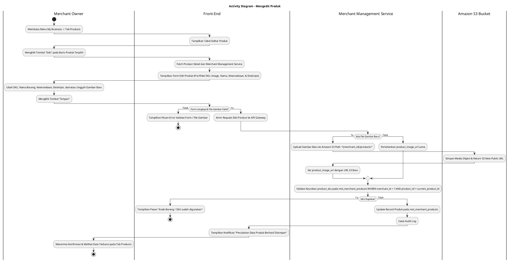
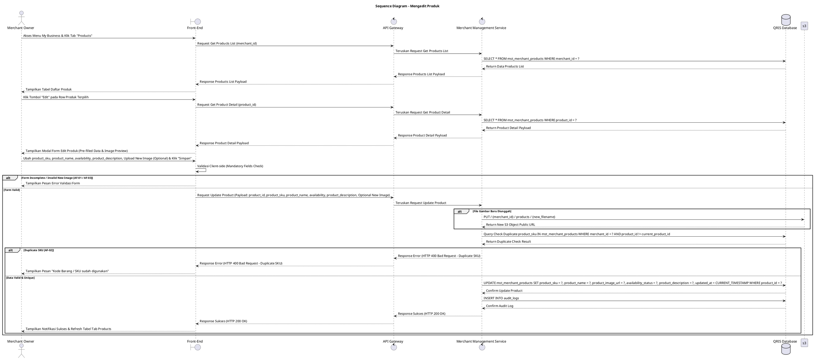

# 1 Deskripsi Use Case

**Tabel 1: Deskripsi Use Case Mengedit Produk**

| Elemen Spesifikasi | Deskripsi Detail |
| --- | --- |
| ID Use Case | UC-BOM-022 |
| Nama Use Case | Mengedit Produk |
| Penjelasan Singkat | Fitur Back Office Merchant pada menu My Business yang memfasilitasi Merchant Owner untuk mengubah informasi Gambar Produk (opsional diperbarui ke Amazon S3 pada folder `/{merchant_id}/products/`), Nama Barang, Harga Barang (`product_price`), Ketersediaan (*AVAILABLE* / *UNAVAILABLE*), dan Deskripsi Barang pada tabel `mst_merchant_products` (Kode Barang / SKU bersifat *read-only* / dikunci) melalui Merchant Management Service. |
| Aktor Utama | Merchant Owner |
| Aktor Pendukung | Merchant Management Service |
| Deskripsi Singkat | Merchant Owner melakukan otentikasi login ke Back Office Merchant dan mengakses menu **My Business**. Pada halaman My Business, Merchant Owner memilih tab **Products** (atau Catalog / Produk). Sistem menampilkan halaman daftar produk terdaftar dari tabel `mst_merchant_products`. Merchant Owner memilih salah satu produk yang ingin diubah datanya, lalu mengklik tombol aksi **"Edit"**. Sistem menampilkan modal formulir pengeditan produk yang sudah terisi (*pre-filled*) dengan data terkini Kode Barang / SKU (*product_sku* - *read-only* / dikunci), Gambar Produk (*product_image_url*), Nama Barang (*product_name*), Harga Barang (*product_price* - angka bulat tanpa koma), Ketersediaan Produk (**Tersedia** / `AVAILABLE` atau **Tidak Tersedia** / `UNAVAILABLE`), dan Deskripsi Barang (*product_description*). Merchant Owner melakukan penyesuaian pada kolom yang dapat diubah (termasuk opsional mengunggah gambar baru). Merchant Owner mengklik tombol **"Simpan"**. Front-End memvalidasi kelengkapan form. Jika gambar baru diunggah, file diunggah ke Amazon S3 pada folder `/{merchant_id}/products/`. Request pembaruan dikirim ke API Gateway. Merchant Management Service memperbarui record produk pada tabel **`mst_merchant_products`**. Front-End memperbarui tabel daftar produk dan menyajikan notifikasi konfirmasi bahwa perubahan data produk berhasil disimpan. |
| Pre-condition | 1. Merchant Owner telah berhasil login ke Back Office Merchant dan akun berstatus aktif. 2. Produk yang akan diubah terdaftar pada tabel `mst_merchant_products`. |
| Post-condition | 1. Data Kode Barang/SKU, Gambar Produk (`product_image_url`), Nama Barang, Ketersediaan (`availability_status`), dan Deskripsi Barang diperbarui pada tabel `mst_merchant_products`. 2. Jika gambar produk diperbarui, file baru tersimpan di Amazon S3 pada path `/{merchant_id}/products/`. 3. Perubahan data produk langsung ter-refleksi pada katalog barang di aplikasi Web POS. 4. Front-End menyajikan data produk terbaru pada tab Products halaman My Business. |
| Trigger | Merchant Owner mengklik menu **My Business**, memilih tab **Products**, mengklik tombol **"Edit"** pada baris produk terpilih, mengubah data, lalu mengklik **"Simpan"**. |
| Nama Tabel | mst_merchant_products, audit_logs |
| Integrasi | 1. **Back Office Merchant UI:** Antarmuka pengelolaan bisnis merchant, tab Products, dan modal form pengeditan produk. 2. **Merchant Management Service:** Microservice backend pengelola pembaruan katalog barang, uploader gambar ke Amazon S3, serta otorisasi merchant. 3. **Amazon S3 Bucket:** Cloud storage tempat menyimpan file gambar produk pada folder `/{merchant_id}/products/`. |
| Asumsi | 1. Pengeditan produk dapat dilakukan sewaktu-waktu untuk memperbarui informasi barang atau menyesuaikan ketersediaan stok. 2. Jika tidak ada gambar baru yang diunggah saat pengeditan, sistem mempertahankan URL gambar S3 lama (`product_image_url`). |
| Keterbatasan | 1. Field Kode Barang/SKU bersifat terkunci / tidak dapat diubah (*read-only / disabled*) saat pengeditan produk. 2. Pengisian Nama Barang, Harga Barang, dan Ketersediaan bersifat WAJIB (*mandatory*). 3. Format nominal Harga Barang WAJIB berupa angka bulat (integer) positif tanpa koma atau desimal (contoh: 15000). 4. Panjang karakter input dibatasi: Nama Barang (maks. 100 karakter) dan Deskripsi Barang (maks. 500 karakter). |
| Aturan Bisnis/Sistem | 1. **Immutable SKU Standard:** Field Kode Barang / SKU (`product_sku`) WAJIB dikunci (*disabled / read-only*) dan DILARANG diubah saat proses pengeditan produk. 2. **Mandatory Input Fields & Max Length Standard:** Pengisian Nama Barang (`product_name`), Harga Barang (`product_price`), dan Ketersediaan Produk (`availability_status`) bersifat WAJIB (*mandatory*). Batas maksimum karakter input diatur: `product_name` (maks. 100 karakter) dan `product_description` (maks. 500 karakter). 3. **Product Price Formatting Standard:** Nominal Harga Barang (`product_price`) WAJIB diinput dalam format angka bulat (integer) tanpa desimal atau tanpa tanda koma (contoh: `15000` bukan `15000.00` atau `15.000,00`). 4. **Amazon S3 Image Update Standard:** Apabila Merchant Owner mengunggah file gambar baru, file diunggah ke Amazon S3 bucket pada folder **`/{merchant_id}/products/{unique_filename}`**, dan `product_image_url` diperbarui dengan URL S3 baru. 5. **Availability Status Standard:** Status Ketersediaan Produk WAJIB diset salah satu dari opsi: **Tersedia** (`AVAILABLE`) atau **Tidak Tersedia** (`UNAVAILABLE`). 6. **Audit Trail Standard:** Setiap pengeditan produk mencatat `product_id`, `merchant_id`, `updated_by` (ID Merchant Owner), rincian perubahan data, dan timestamp pada `audit_logs`. |
| Session Idle | 15 Menit |

# 2 Main Flow

**Tabel 2: Main Flow Mengedit Produk**

| No. | Aktivitas | Deskripsi |
| ---: | --- | --- |
| 1 | Membuka Menu My Business | Merchant Owner melakukan login dan mengklik menu **My Business** pada navigasi Back Office Merchant. |
| 2 | Memilih Tab Products | Merchant Owner mengklik tab **Products** pada halaman My Business. |
| 3 | Menampilkan Daftar Produk | Sistem menampilkan halaman daftar produk terdaftar dari `mst_merchant_products` beserta tombol aksi **"Edit"** per baris produk. |
| 4 | Memilih Tombol Edit Produk | Merchant Owner mengklik tombol aksi **"Edit"** pada salah satu baris produk yang ingin diubah. |
| 5 | Menampilkan Form Edit Produk | Sistem menampilkan modal formulir pengeditan produk yang sudah terisi (*pre-filled*) dengan data terkini SKU, Gambar, Nama, Ketersediaan, dan Deskripsi. |
| 6 | Mengubah Data Produk | Merchant Owner menyesuaikan SKU, Nama, Ketersediaan, Deskripsi, dan/atau mengunggah Gambar Produk baru. |
| 7 | Mengklik Tombol Simpan | Merchant Owner mengklik tombol **"Simpan"**. |
| 8 | Memvalidasi Form Client-side | Front-End memvalidasi kelengkapan form & kelayakan gambar baru (jika ada), lalu mengirim request pembaruan ke API Gateway. |
| 9 | Upload S3 & Update Produk | Merchant Management Service mengunggah gambar baru ke Amazon S3 pada folder `/{merchant_id}/products/` (jika ada), memvalidasi keunikan `product_sku` (jika diubah), dan memperbarui record pada `mst_merchant_products`. |
| 10 | Menampilkan Konfirmasi Berhasil | Front-End memperbarui tabel daftar produk pada tab Products dan menampilkan notifikasi konfirmasi bahwa perubahan data produk berhasil disimpan. |
| 11 | Use Case Selesai | Proses pengeditan produk selesai dilaksanakan. |

# 3 Alternative Flow

**Tabel 3: Alternative Flow Mengedit Produk**

| Kode | Alternative Flow | Deskripsi |
| --- | --- | --- |
| AF-01 | Kolom Mandatory Kosong | Pada langkah 7-8, apabila Kode Barang/SKU, Nama Barang, atau Ketersediaan dikosongkan, Sistem menolak request dan Front-End menampilkan `Kode Barang/SKU, Nama Barang, dan Ketersediaan wajib diisi`. |
| AF-02 | Kode Barang / SKU Baru Sudah Terdaftar | Pada langkah 9, apabila `product_sku` baru yang diinput sudah digunakan oleh produk lain pada merchant yang sama, Merchant Management Service membatalkan transaksi dan Front-End menampilkan `Kode Barang / SKU sudah digunakan`. |
| AF-03 | Format / Ukuran Gambar Baru Tidak Valid | Pada langkah 8, apabila file gambar baru yang diunggah melebihi 2 MB atau format bukan `.jpg/.png/.webp`, Front-End menolak request dan menampilkan `Ukuran file gambar maksimal 2MB dengan format JPG, PNG, atau WEBP`. |
| AF-04 | Produk Tidak Ditemukan | Pada langkah 9, apabila `product_id` yang akan diubah tidak ditemukan pada database, Sistem membatalkan transaksi dan Front-End menampilkan `Data produk tidak ditemukan`. |
| AF-05 | Gagal Upload ke Amazon S3 | Pada langkah 9, apabila pengunggahan gambar baru ke Amazon S3 mengalami kendala, Sistem membatalkan transaksi dan Front-End menampilkan `Gagal mengunggah gambar produk ke storage Amazon S3`. |
| AF-06 | Gagal Terhubung ke Database Server | Pada langkah 9, apabila koneksi database terputus total, Sistem mengembalikan HTTP status 500 dan Front-End menampilkan `Terjadi kendala internal pada server`. |

# 4 Status Front-End

**Tabel 4: Status Front-End Mengedit Produk**

| No. | Nama Status | Deskripsi Tampilan Front-End |
| ---: | --- | --- |
| 1 | IDLE | Tab Products pada halaman My Business menyajikan tabel daftar produk dan modal form edit terisi siap diubah. |
| 2 | LOADING | Indikator memuat (*spinner*) ditampilkan pada tombol Simpan saat request pembaruan produk & upload S3 sedang diproses server. |
| 3 | SUCCESS | Modal/toast konfirmasi menampilkan pesan sukses perubahan data produk berhasil disimpan dan data tabel diperbarui. |
| 4 | ERROR | Pesan kesalahan ditampilkan pada UI akibat kolom mandatory kosong, SKU duplikat, file gambar invalid, atau kendala server. |

# 5 Activity Diagram Mengedit Produk

# 6 Sequence Diagram Mengedit Produk

# 7 Response Code

**Tabel 5: Response Code Mengedit Produk**

| No. | HTTP Status | Response Code | Nama Response | Deskripsi | Respons Front-End |
| ---: | ---: | --- | --- | --- | --- |
| 1 | 200 | 200XX00 | SUCCESS_UPDATE_PRODUCT | Data produk berhasil diperbarui pada tabel `mst_merchant_products`. | Menampilkan pesan notifikasi sukses dan memperbarui tabel tab Products. |
| 2 | 400 | 400XX00 | INVALID_PRODUCT_UPDATE_INPUT | Kode Barang/SKU, Nama Barang, atau Ketersediaan kosong. | Menampilkan pesan kesalahan validasi input. |
| 3 | 400 | 400XX01 | DUPLICATE_PRODUCT_SKU | Kode Barang / SKU baru yang dimasukkan sudah digunakan oleh produk lain pada merchant yang sama. | Menampilkan pesan kesalahan `Kode Barang / SKU sudah digunakan`. |
| 4 | 400 | 400XX02 | INVALID_IMAGE_FILE | Ukuran file gambar baru melebihi 2 MB atau format gambar tidak didukung. | Menampilkan pesan kesalahan `Ukuran file gambar maksimal 2MB dengan format JPG, PNG, atau WEBP`. |
| 5 | 404 | 404XX00 | PRODUCT_NOT_FOUND | Data produk tidak ditemukan pada database `mst_merchant_products`. | Menampilkan pesan kesalahan `Data produk tidak ditemukan`. |
| 6 | 500 | 500XX00 | S3_UPLOAD_ERROR | Terjadi kegagalan saat mengunggah file gambar baru ke Amazon S3 bucket. | Menampilkan pesan kesalahan `Gagal mengunggah gambar produk ke storage Amazon S3`. |
| 7 | 500 | 500XX01 | SYSTEM_INTERNAL_ERROR | Terjadi kegagalan internal server saat mengeksekusi pengeditan produk. | Menampilkan pesan kesalahan `Terjadi kendala internal pada server`. |

# 8 Desain Antarmuka

**Tabel 6: Desain Antarmuka Mengedit Produk**

| Halaman | Komponen dan State Utama |
| --- | --- |
| Halaman My Business (Tab Products) | 1. **Navigasi Tab:** Tab Profile, Tab POS, Tab Store, Tab User Management, Tab **Products** (Active). 2. **Tabel Daftar Produk:** Kolom No, Gambar, SKU, Nama Barang, Deskripsi, Ketersediaan (`AVAILABLE` / `UNAVAILABLE`), dan Aksi. 3. **Tombol "Edit":** Tombol aksi pengeditan per baris produk (Secondary Button). |
| Modal Form Edit Produk | 1. **Field Kode Barang / SKU (`product_sku`):** Text Input (Disabled / Read-Only, Locked). 2. **Field Nama Barang (`product_name`):** Text Input (Editable, Mandatory, Max 100 karakter). 3. **Field Harga Barang (`product_price`):** Number Input (Editable, Mandatory, Integer tanpa koma/desimal, contoh: 15000). 4. **Uploader Gambar Produk (`product_image_url`):** Preview gambar S3 lama & file uploader gambar baru ke Amazon S3 path `/{merchant_id}/products/` (Max 2MB). 5. **Opsi Ketersediaan (`availability_status`):** Radio Button / Toggle (**Tersedia** / `AVAILABLE` atau **Tidak Tersedia** / `UNAVAILABLE`). 6. **Textarea Deskripsi Barang (`product_description`):** Textarea Input (Editable, Optional, Max 500 karakter). 7. **Tombol Aksi:** Tombol **"Simpan"** (Primary) dan **"Batal"** (Secondary). |
