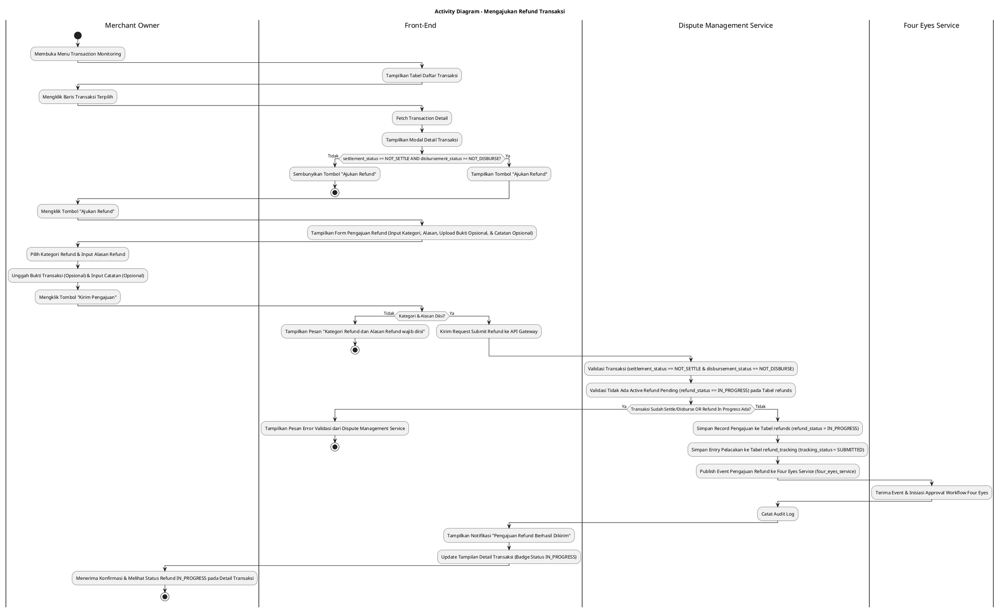
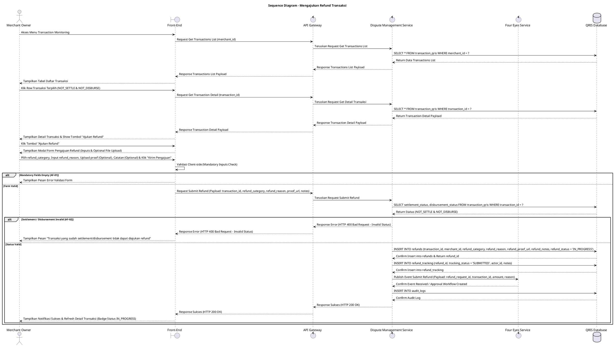

# 1 Deskripsi Use Case

**Tabel 1: Deskripsi Use Case Mengajukan Refund Transaksi**

| Elemen Spesifikasi | Deskripsi Detail |
| --- | --- |
| ID Use Case | UC-BOM-023 |
| Nama Use Case | Mengajukan Refund Transaksi |
| Penjelasan Singkat | Fitur Back Office Merchant pada menu Transaction Monitoring yang memfasilitasi Merchant Owner untuk menginisiasi pengajuan pengembalian dana (*refund request*) atas transaksi QRIS yang belum dilakukan settlement (`settlement_status = 'NOT_SETTLE'`) dan belum didisburse (`disbursement_status = 'NOT_DISBURSE'`), menginput kategori, alasan, unggahan bukti opsional, mempublikasikan event pengajuan ke Four Eyes Service (`four_eyes_service`), serta menyimpan record pengajuan pada tabel `refunds` (`refund_status = 'IN_PROGRESS'`) dan merekam riwayat pelacakan pada tabel `refund_tracking` (`tracking_status = 'SUBMITTED'`) melalui Dispute Management Service (*Dispute Management*). |
| Aktor Utama | Merchant Owner |
| Aktor Pendukung | Dispute Management Service, Four Eyes Service |
| Deskripsi Singkat | Merchant Owner melakukan otentikasi login ke Back Office Merchant dan mengakses menu **Transaction Monitoring**. Sistem menampilkan halaman daftar transaksi QRIS. Merchant Owner mengklik salah satu baris transaksi untuk melihat detail transaksi. Sistem menampilkan modal/halaman rincian detail transaksi. Apabila transaksi tersebut memenuhi kualifikasi `settlement_status = 'NOT_SETTLE'` dan `disbursement_status = 'NOT_DISBURSE'`, sistem secara otomatis menampilkan tombol aksi **"Ajukan Refund"**. Merchant Owner mengklik tombol **"Ajukan Refund"** sehingga sistem menampilkan modal formulir pengajuan refund. Merchant Owner memilih **Kategori Refund** (*refund_category*), menginput **Alasan Refund** (*refund_reason*), mengunggah **Bukti Transaksi/Pendukung** (*refund_proof_url* - opsional), dan menginput **Catatan Tambahan** (*refund_notes* - opsional). Merchant Owner mengklik tombol **"Kirim Pengajuan"**. Front-End memvalidasi kelengkapan form dan mengirim request ke API Gateway. **Dispute Management Service** memvalidasi bahwa transaksi tersebut sah milik merchant dan berstatus `settlement_status = 'NOT_SETTLE'` & `disbursement_status = 'NOT_DISBURSE'`, lalu mencatat status pengajuan refund pada database **`refunds`** dengan status awal **`refund_status = 'IN_PROGRESS'`** serta menambahkan entry riwayat baru pada tabel **`refund_tracking`** dengan status pelacakan awal **`tracking_status = 'SUBMITTED'`**. Selanjutnya, Dispute Management Service mempublikasikan event pengajuan refund ke **Four Eyes Service** (`four_eyes_service`) untuk proses verifikasi dan persetujuan bertahap (*checker/approver approval*). Front-End memperbarui halaman detail transaksi dengan menampilkan status badge "Pengajuan Refund Dalam Proses" (`IN_PROGRESS`) dan menyajikan notifikasi konfirmasi sukses. |
| Pre-condition | 1. Merchant Owner telah berhasil login ke Back Office Merchant dan akun berstatus aktif. 2. Transaksi QRIS yang dipilih berstatus `transaction_status = 'SUCCESS'`, belum di-settle (`settlement_status = 'NOT_SETTLE'`), dan belum didisburse (`disbursement_status = 'NOT_DISBURSE'`). 3. Transaksi belum memiliki pengajuan refund aktif yang sedang dalam proses (`refund_status = 'IN_PROGRESS'`) pada tabel `refunds`. |
| Post-condition | 1. Record pengajuan refund tersimpan pada tabel **`refunds`** dengan status awal **`refund_status = 'IN_PROGRESS'`**. 2. Record log riwayat pelacakan baru tersimpan pada tabel **`refund_tracking`** dengan **`tracking_status = 'SUBMITTED'`**. 3. Event pengajuan refund berhasil dipublikasikan/dikirim ke **Four Eyes Service** untuk mekanisme persetujuan bertahap (*maker-checker-approver*). 4. Tampilan detail transaksi pada Front-End menampilkan indikator status pengajuan refund aktif `IN_PROGRESS`. 5. Front-End menyajikan notifikasi konfirmasi sukses pengajuan refund. |
| Trigger | Merchant Owner mengklik menu **Transaction Monitoring**, memilih detail transaksi berstatus `settlement_status = 'NOT_SETTLE'` & `disbursement_status = 'NOT_DISBURSE'`, mengklik tombol **"Ajukan Refund"**, mengisi kategori, alasan, bukti opsional & catatan, lalu mengklik **"Kirim Pengajuan"**. |
| Nama Tabel | transaction_qris, refunds, refund_tracking, audit_logs |
| Integrasi | 1. **Back Office Merchant UI:** Antarmuka pemantauan transaksi, rincian detail transaksi, modal form pengajuan refund, dan uploader bukti. 2. **Dispute Management Service:** Microservice backend pengelola sengketa & pengajuan refund, pembuatan record pada `refunds` & `refund_tracking`, serta publikasi event. 3. **Four Eyes Service (`four_eyes_service`):** Service workflow persetujuan bertahap (*four-eyes principle / maker-checker*) untuk memverifikasi dan menyetujui pengajuan refund sebelum dana dikembalikan. |
| Asumsi | 1. Pengajuan refund hanya diperbolehkan untuk transaksi sah yang belum mengalami proses settlement dan disbursement agar pemotongan dana saldo refund dapat dieksekusi secara valid. 2. Status awal `refund_status = 'IN_PROGRESS'` pada tabel `refunds` disertai entry pelacakan awal `tracking_status = 'SUBMITTED'` pada tabel `refund_tracking`. |
| Keterbatasan | 1. Tombol "Ajukan Refund" TIDAK AKAN DITAMPILKAN jika transaksi sudah berstatus `SETTLED` (`settlement_status = 'SETTLED'`) atau sudah didisburse (`disbursement_status = 'DISBURSED'`). 2. Pengisian Kategori Refund dan Alasan Refund bersifat WAJIB (*mandatory*). |
| Aturan Bisnis/Sistem | 1. **Eligible Refund Status Standard:** Tombol Ajukan Refund HANYA muncul dan dapat diproses jika transaksi berstatus **`settlement_status = 'NOT_SETTLE'`** DAN **`disbursement_status = 'NOT_DISBURSE'`**. 2. **Initial Refund Status Standard:** Setiap pembuatan pengajuan refund baru WAJIB menetapkan status awal **`refund_status = 'IN_PROGRESS'`** pada tabel `refunds`. 3. **Refund Audit Tracking Standard:** Setiap submit pengajuan refund WAJIB menyisipkan record pelacakan baru pada tabel **`refund_tracking`** dengan status **`tracking_status = 'SUBMITTED'`** beserta `refund_id`, `actor_id`, `notes`, dan timestamp. 4. **Mandatory Input Standard:** Pengisian Kategori Refund (`refund_category`) dan Alasan Refund (`refund_reason`) bersifat WAJIB (*mandatory*), sedangkan Bukti Refund (`refund_proof_url`) dan Catatan (`refund_notes`) bersifat OPSI/PILIHAN (*optional*). 5. **Four Eyes Integration Standard:** Setiap pengajuan refund yang valid WAJIB dicatat pada tabel `refunds` & `refund_tracking` oleh Dispute Management Service dan mempublikasikan event/request persetujuan ke **Four Eyes Service** (`four_eyes_service`) guna peninjauan otorisasi bertahap (*approval workflow*). 6. **Single Active Refund Request Constraint:** Transaksi yang sedang memiliki pengajuan refund aktif berstatus `refund_status = 'IN_PROGRESS'` pada tabel `refunds` dilarang untuk diajukan refund ulang. 7. **Audit Trail Standard:** Setiap pengajuan refund mencatat `transaction_id`, `merchant_id`, `requested_by` (ID Merchant Owner), kategori, alasan, dan timestamp pada `audit_logs`. |
| Session Idle | 15 Menit |

# 2 Main Flow

**Tabel 2: Main Flow Mengajukan Refund Transaksi**

| No. | Aktivitas | Deskripsi |
| ---: | --- | --- |
| 1 | Membuka Menu Transaction Monitoring | Merchant Owner melakukan login dan mengklik menu **Transaction Monitoring** pada navigasi Back Office Merchant. |
| 2 | Menampilkan Daftar Transaksi | Sistem menampilkan halaman daftar transaksi QRIS terdaftar dari `transaction_qris`. |
| 3 | Memilih Detail Transaksi | Merchant Owner mengklik salah satu baris transaksi yang berstatus `settlement_status = 'NOT_SETTLE'` dan `disbursement_status = 'NOT_DISBURSE'`. |
| 4 | Menampilkan Detail & Tombol Refund | Sistem menampilkan halaman/modal detail transaksi dan menampilkan tombol **"Ajukan Refund"** karena status transaksi memenuhi syarat. |
| 5 | Memilih Tombol Ajukan Refund | Merchant Owner mengklik tombol **"Ajukan Refund"**. |
| 6 | Menampilkan Form Pengajuan Refund | Sistem menampilkan modal formulir pengajuan refund yang memuat rincian nominal transaksi, Dropdown Kategori Refund, Textarea Alasan Refund, Uploader Bukti (Opsional), dan Textarea Catatan (Opsional). |
| 7 | Mengisi Form Refund | Merchant Owner memilih Kategori Refund, menginput Alasan Refund, mengunggah Bukti Transaksi (jika ada), dan mengisi Catatan Tambahan (jika ada). |
| 8 | Mengklik Tombol Kirim Pengajuan | Merchant Owner mengklik tombol **"Kirim Pengajuan"**. |
| 9 | Memvalidasi Form Client-side | Front-End memvalidasi kelengkapan kolom mandatory, lalu mengirim request pengajuan refund ke API Gateway. |
| 10 | Memvalidasi Status & Save Record | Dispute Management Service memvalidasi status `settlement_status = 'NOT_SETTLE'` & `disbursement_status = 'NOT_DISBURSE'`, menyimpan record pengajuan ke tabel **`refunds`** (`refund_status = 'IN_PROGRESS'`), dan menyisipkan record pelacakan baru pada tabel **`refund_tracking`** (`tracking_status = 'SUBMITTED'`). |
| 11 | Publish Event ke Four Eyes Service | Dispute Management Service mempublikasikan event pengajuan refund ke **Four Eyes Service** (`four_eyes_service`) untuk workflow verifikasi dan persetujuan. |
| 12 | Menampilkan Konfirmasi Berhasil | Front-End memperbarui tampilan detail transaksi (menampilkan badge `IN_PROGRESS`) dan menyajikan notifikasi konfirmasi bahwa pengajuan refund berhasil dikirim. |
| 13 | Use Case Selesai | Proses pengajuan refund transaksi selesai dilaksanakan. |

# 3 Alternative Flow

**Tabel 3: Alternative Flow Mengajukan Refund Transaksi**

| Kode | Alternative Flow | Deskripsi |
| --- | --- | --- |
| AF-01 | Kategori atau Alasan Refund Kosong | Pada langkah 8-9, apabila Kategori Refund atau Alasan Refund dikosongkan, Sistem menolak request dan Front-End menampilkan `Kategori Refund dan Alasan Refund wajib diisi`. |
| AF-02 | Transaksi Sudah Settle atau Disburse | Pada langkah 4 atau 10, apabila transaksi sudah berstatus `settlement_status = 'SETTLED'` atau `disbursement_status = 'DISBURSED'`, Sistem tidak menampilkan/menolak tombol refund dan Front-End menampilkan `Transaksi yang sudah settlement/disbursement tidak dapat diajukan refund`. |
| AF-03 | Pengajuan Refund Sudah Ada | Pada langkah 10, apabila transaksi tersebut sudah memiliki record pengajuan refund berstatus `refund_status = 'IN_PROGRESS'` pada tabel `refunds`, Dispute Management Service membatalkan transaksi dan Front-End menampilkan `Pengajuan refund untuk transaksi ini sedang dalam proses verifikasi`. |
| AF-04 | Layanan Four Eyes Service Gagal / Timeout | Pada langkah 11, apabila Four Eyes Service mengalami kendala koneksi atau timeout, Dispute Management Service membatalkan transaksi dan Front-End menampilkan `Gagal mempublikasikan pengajuan refund ke Four Eyes Service`. |
| AF-05 | Gagal Terhubung ke Database Server | Pada langkah 10, apabila koneksi database terputus total, Sistem mengembalikan HTTP status 500 dan Front-End menampilkan `Terjadi kendala internal pada server`. |

# 4 Status Front-End

**Tabel 4: Status Front-End Mengajukan Refund Transaksi**

| No. | Nama Status | Deskripsi Tampilan Front-End |
| ---: | --- | --- |
| 1 | IDLE | Modal detail transaksi menyajikan informasi lengkap transaksi dan tombol Ajukan Refund siap diklik. |
| 2 | LOADING | Indikator memuat (*spinner*) ditampilkan pada tombol Kirim Pengajuan saat request pengajuan refund sedang diproses server. |
| 3 | SUCCESS | Modal/toast konfirmasi menampilkan pesan sukses pengajuan refund berhasil dikirim dan badge detail transaksi diperbarui menjadi `IN_PROGRESS`. |
| 4 | ERROR | Pesan kesalahan ditampilkan pada UI akibat kolom mandatory kosong, transaksi sudah settle/disburse, pengajuan duplikat, atau kendala server. |

# 5 Activity Diagram Mengajukan Refund Transaksi

# 6 Sequence Diagram Mengajukan Refund Transaksi

# 7 Response Code

**Tabel 5: Response Code Mengajukan Refund Transaksi**

| No. | HTTP Status | Response Code | Nama Response | Deskripsi | Respons Front-End |
| ---: | ---: | --- | --- | --- | --- |
| 1 | 200 | 200XX00 | SUCCESS_SUBMIT_REFUND | Pengajuan refund berhasil disimpan pada `refunds` (`refund_status = 'IN_PROGRESS'`), direkam pada `refund_tracking` (`tracking_status = 'SUBMITTED'`), dan terpublikasi ke `four_eyes_service`. | Menampilkan pesan notifikasi sukses dan memperbarui detail transaksi. |
| 2 | 400 | 400XX00 | INVALID_REFUND_INPUT | Kategori Refund atau Alasan Refund kosong. | Menampilkan pesan kesalahan validasi input. |
| 3 | 400 | 400XX01 | TRANSACTION_ALREADY_SETTLED_OR_DISBURSED | Transaksi yang diajukan sudah berstatus `SETTLED` atau `DISBURSED`. | Menampilkan pesan kesalahan `Transaksi yang sudah settlement/disbursement tidak dapat diajukan refund`. |
| 4 | 400 | 400XX02 | DUPLICATE_REFUND_REQUEST | Transaksi tersebut sudah memiliki pengajuan refund berstatus `IN_PROGRESS` pada tabel `refunds`. | Menampilkan pesan kesalahan `Pengajuan refund untuk transaksi ini sedang dalam proses verifikasi`. |
| 5 | 500 | 500XX00 | FOUR_EYES_SERVICE_ERROR | Terjadi kegagalan saat mempublikasikan event pengajuan refund ke Four Eyes Service. | Menampilkan pesan kesalahan `Gagal mempublikasikan pengajuan refund ke Four Eyes Service`. |
| 6 | 500 | 500XX01 | SYSTEM_INTERNAL_ERROR | Terjadi kegagalan internal server saat mengeksekusi pengajuan refund. | Menampilkan pesan kesalahan `Terjadi kendala internal pada server`. |

# 8 Desain Antarmuka

**Tabel 6: Desain Antarmuka Mengajukan Refund Transaksi**

| Halaman | Komponen dan State Utama |
| --- | --- |
| Modal Detail Transaksi QRIS | 1. **Header & Status Transaksi:** Rincian ID Transaksi, **RRN**, Nominal (setelah perhitungan **MDR** dan **pajak**), `settlement_status = NOT_SETTLE`, `disbursement_status = NOT_DISBURSE`. 2. **Tombol "Ajukan Refund":** Tombol aksi pemicu modal pengajuan refund (Primary Button / Warna Warning Orange). |
| Modal Form Pengajuan Refund | 1. **Rincian Transaksi:** Information box ID Transaksi, **RRN**, Nominal Refund (setelah perhitungan **MDR** dan **pajak**), **PPN**. 2. **Dropdown Kategori Refund (`refund_category`):** Dropdown pilihan alasan (Mandatory). 3. **Textarea Alasan Refund (`refund_reason`):** Input teks alasan detail (Mandatory). 4. **Uploader Bukti Transaksi (`refund_proof_url`):** File uploader opsional. 5. **Textarea Catatan Tambahan (`refund_notes`):** Textarea input opsional. 6. **Tombol Aksi:** Tombol **"Kirim Pengajuan"** (Primary) dan **"Batal"** (Secondary). |
