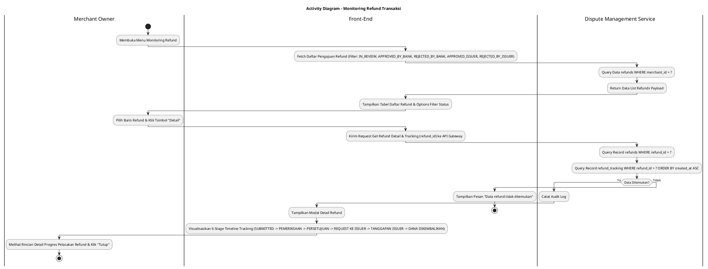
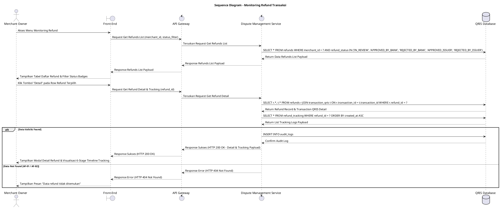

# 1 Deskripsi Use Case

**Tabel 1: Deskripsi Use Case Monitoring Refund Transaksi**

| Elemen Spesifikasi | Deskripsi Detail |
| --- | --- |
| ID Use Case | UC-BOM-024 |
| Nama Use Case | Monitoring Refund Transaksi |
| Penjelasan Singkat | Fitur Back Office Merchant pada menu Monitoring Refund yang memfasilitasi Merchant Owner untuk memantau daftar pengajuan pengembalian dana (*refund requests*), melacak status keaktifan refund (`IN_REVIEW`, `APPROVED_BY_BANK`, `REJECTED_BY_BANK`, `APPROVED_ISSUER`, `REJECTED_BY_ISSUER`), serta melihat rincian riwayat pelacakan (*refund tracking timeline*) 6 tahap (SUBMITTED, PEMERIKSAAN, PERSETUJUAN, MENGIRIMKAN REQUEST KE ISSUER, TANGGAPAN ISSUER: REJECTED/APPROVED, DANA DIKEMBALIKAN) dari tabel `refunds` dan `refund_tracking` melalui Dispute Management Service. |
| Aktor Utama | Merchant Owner |
| Aktor Pendukung | Dispute Management Service |
| Deskripsi Singkat | Merchant Owner melakukan otentikasi login ke Back Office Merchant dan mengakses menu **Monitoring Refund**. Sistem menyajikan halaman utama pemantauan refund yang menampilkan daftar pengajuan pengembalian dana dari tabel `refunds`. Halaman dilengkapi dengan fitur pencarian, filter tanggal, dan filter status (`IN_REVIEW`, `APPROVED_BY_BANK`, `REJECTED_BY_BANK`, `APPROVED_ISSUER`, `REJECTED_BY_ISSUER`). Merchant Owner dapat melihat rangkuman informasi ID Refund, ID Transaksi, Tanggal Pengajuan, Nominal Refund, dan Badge Status. Merchant Owner mengklik tombol **"Detail"** pada salah satu baris pengajuan refund. Front-End mengirim request ke API Gateway. **Dispute Management Service** mengambil detail rincian pengajuan dari tabel `refunds` serta seluruh riwayat *timeline* dari tabel `refund_tracking`. Sistem menampilkan modal/halaman rincian detail refund yang menyajikan informasi komprehensif transaksi beserta visualisasi *timeline tracking* 6 tahap pelacakan: 1. SUBMITTED, 2. PEMERIKSAAN, 3. PERSETUJUAN, 4. MENGIRIMKAN REQUEST KE ISSUER, 5. TANGGAPAN ISSUER: REJECTED/APPROVED, 6. DANA DIKEMBALIKAN. Merchant Owner membaca rincian progres pelacakan dan mengklik tombol "Tutup" untuk kembali ke tabel monitoring. |
| Pre-condition | 1. Merchant Owner telah berhasil login ke Back Office Merchant dan akun berstatus aktif. 2. Data pengajuan refund terdaftar pada tabel `refunds` dan `refund_tracking` di bawah entitas merchant terkait. |
| Post-condition | 1. Sistem menyajikan daftar lengkap pengajuan refund beserta status terkini (`IN_REVIEW`, `APPROVED_BY_BANK`, `REJECTED_BY_BANK`, `APPROVED_ISSUER`, `REJECTED_BY_ISSUER`). 2. Sistem menyajikan rincian detail pelacakan (*timeline tracking*) 6 tahap secara akurat dari tabel `refund_tracking`. |
| Trigger | Merchant Owner mengklik menu **Monitoring Refund**, menyaring/mencari data refund, lalu mengklik tombol **"Detail"** pada baris refund terpilih. |
| Nama Tabel | refunds, refund_tracking, transaction_qris, audit_logs |
| Integrasi | 1. **Back Office Merchant UI:** Antarmuka pemantauan refund, tabel filter status, dan modal rincian *timeline tracking* refund. 2. **Dispute Management Service:** Microservice backend pengelola kueri data refund, rekapitulasi status, dan histori *timeline tracking*. |
| Asumsi | 1. Setiap pengajuan refund memiliki *timeline tracking* bertahap yang diperbarui secara otomatis oleh backend Dispute Management Service seiring jalannya alur verifikasi bank dan persetujuan issuer. 2. Pengajuan refund yang ditolak pada tahap bank/issuer akan menghentikan *timeline* pada tahap tanggapan penolakan tersebut. |
| Keterbatasan | 1. Fitur ini bersifat *read-only* (hanya pemantauan dan pelacakan rincian detail). 2. Merchant Owner hanya dapat melihat data refund milik entitas merchant yang terasosiasi dengan akun login-nya (`merchant_id`). |
| Aturan Bisnis/Sistem | 1. **Supported Refund Status Standard:** Status pengajuan refund pada tabel `refunds` yang wajib didukung dan ditampilkan badge kategorinya meliputi: &nbsp;&nbsp;- **`IN_REVIEW`**: Pengajuan sedang dalam proses pemeriksaan awal bank. &nbsp;&nbsp;- **`APPROVED_BY_BANK`**: Pengajuan telah disetujui oleh internal bank hibank. &nbsp;&nbsp;- **`REJECTED_BY_BANK`**: Pengajuan ditolak oleh internal bank hibank. &nbsp;&nbsp;- **`APPROVED_ISSUER`**: Pengajuan disetujui oleh penerbit instrumen (*issuer*). &nbsp;&nbsp;- **`REJECTED_BY_ISSUER`**: Pengajuan ditolak oleh penerbit instrumen (*issuer*). 2. **6-Stage Refund Tracking Timeline Standard:** Tampilan detail pelacakan WAJIB menyajikan *timeline* progresive 6 tahap baku mengacu pada record tabel `refund_tracking` (`tracking_status`): &nbsp;&nbsp;1. **`SUBMITTED`**: Pengajuan refund telah berhasil dikirimkan oleh merchant. &nbsp;&nbsp;2. **`PEMERIKSAAN`**: Tahap pemeriksaan berkas & bukti transaksi oleh tim verifikator bank. &nbsp;&nbsp;3. **`PERSETUJUAN`**: Tahap persetujuan otorisasi bertahap (*approver*) internal bank. &nbsp;&nbsp;4. **`MENGIRIMKAN REQUEST KE ISSUER`**: Tahap transmisi request instruksi refund ke Pihak Issuer. &nbsp;&nbsp;5. **`TANGGAPAN ISSUER: REJECTED / APPROVED`**: Tahap penerimaan respons jawaban dari pihak Issuer. &nbsp;&nbsp;6. **`DANA DIKEMBALIKAN`**: Tahap penyelesaian pengembalian dana saldo/rekening pengguna. 3. **Data Access Isolation Standard:** Kueri prapemrosesan data WAJIB mengisolasi record `refunds` hanya untuk `merchant_id` yang sah. 4. **Audit Trail Standard:** Setiap pengaksesan detail monitoring refund mencatat `refund_id`, `merchant_id`, `viewed_by` (ID Merchant Owner), dan timestamp pada `audit_logs`. |
| Session Idle | 15 Menit |

# 2 Main Flow

**Tabel 2: Main Flow Monitoring Refund Transaksi**

| No. | Aktivitas | Deskripsi |
| ---: | --- | --- |
| 1 | Membuka Menu Monitoring Refund | Merchant Owner melakukan login dan mengklik menu **Monitoring Refund** pada navigasi Back Office Merchant. |
| 2 | Menampilkan Daftar Refund | Sistem menampilkan halaman daftar pengajuan refund dari tabel `refunds` beserta filter status (`IN_REVIEW`, `APPROVED_BY_BANK`, `REJECTED_BY_BANK`, `APPROVED_ISSUER`, `REJECTED_BY_ISSUER`). |
| 3 | Filter / Cari Data Refund (Opsional) | Merchant Owner memasukkan kata kunci pencarian (ID Transaksi/SKU) atau memilih filter status refund. |
| 4 | Memilih Tombol Detail | Merchant Owner mengklik tombol **"Detail"** pada salah satu baris pengajuan refund terpilih. |
| 5 | Request Detail & Tracking Data | Front-End mengirim request pencarian rincian detail refund beserta riwayat pelacakan ke API Gateway. |
| 6 | Query Database Refund & Tracking | Dispute Management Service mengambil rincian data dari tabel `refunds` dan mengambil histori urutan dari tabel `refund_tracking`. |
| 7 | Menampilkan Detail Timeline Tracking | Sistem menampilkan modal/halaman rincian detail refund yang menyajikan data transaksi, rincian refund, serta visualisasi *timeline tracking* 6 tahap (SUBMITTED, PEMERIKSAAN, PERSETUJUAN, MENGIRIMKAN REQUEST KE ISSUER, TANGGAPAN ISSUER: REJECTED/APPROVED, DANA DIKEMBALIKAN). |
| 8 | Menutup Modal Detail | Merchant Owner membaca rincian pelacakan dan mengklik tombol **"Tutup"**. |
| 9 | Use Case Selesai | Proses pemantauan dan pelacakan detail refund selesai dilaksanakan. |

# 3 Alternative Flow

**Tabel 3: Alternative Flow Monitoring Refund Transaksi**

| Kode | Alternative Flow | Deskripsi |
| --- | --- | --- |
| AF-01 | Data Refund Kosong | Pada langkah 2 atau 3, apabila merchant belum pernah mengajukan refund atau hasil filter tidak ditemukan, Sistem menampilkan pesan `Tidak ada data pengajuan refund`. |
| AF-02 | Data Tracking Tidak Ditemukan | Pada langkah 6-7, apabila detail refund ditemukan namun record `refund_tracking` kosong, Sistem menampilkan detail refund dengan keterangan `Riwayat pelacakan belum tersedia`. |
| AF-03 | Gagal Terhubung ke Database Server | Pada langkah 6, apabila koneksi database terputus total, Sistem mengembalikan HTTP status 500 dan Front-End menampilkan `Terjadi kendala internal pada server`. |

# 4 Status Front-End

**Tabel 4: Status Front-End Monitoring Refund Transaksi**

| No. | Nama Status | Deskripsi Tampilan Front-End |
| ---: | --- | --- |
| 1 | IDLE | Halaman Monitoring Refund menyajikan tabel daftar refund terfilter dan siap dipilih. |
| 2 | LOADING | Indikator memuat (*spinner*) ditampilkan saat daftar refund atau modal detail *timeline tracking* sedang diunduh dari server. |
| 3 | SUCCESS | Antarmuka menampilkan tabel daftar refund dan modal rincian *timeline tracking* 6 tahap secara lengkap. |
| 4 | ERROR | Pesan kesalahan ditampilkan pada UI akibat kendala server atau data tidak ditemukan. |

# 5 Activity Diagram Monitoring Refund Transaksi

# 6 Sequence Diagram Monitoring Refund Transaksi

# 7 Response Code

**Tabel 5: Response Code Monitoring Refund Transaksi**

| No. | HTTP Status | Response Code | Nama Response | Deskripsi | Respons Front-End |
| ---: | ---: | --- | --- | --- | --- |
| 1 | 200 | 200XX00 | SUCCESS_GET_REFUNDS_LIST | Daftar pengajuan refund merchant berhasil diambil dari `refunds`. | Menampilkan tabel daftar refund dengan filter status. |
| 2 | 200 | 200XX01 | SUCCESS_GET_REFUND_TRACKING_DETAIL | Rincian detail refund dan histori *timeline tracking* 6 tahap berhasil diambil. | Menampilkan modal detail dan visualisasi *timeline tracking*. |
| 3 | 404 | 404XX00 | REFUND_NOT_FOUND | Data refund atau riwayat pelacakan tidak ditemukan pada database. | Menampilkan pesan kesalahan `Data refund tidak ditemukan`. |
| 4 | 500 | 500XX00 | SYSTEM_INTERNAL_ERROR | Terjadi kegagalan internal server saat mengeksekusi pengambilan data refund. | Menampilkan pesan kesalahan `Terjadi kendala internal pada server`. |

# 8 Desain Antarmuka

**Tabel 6: Desain Antarmuka Monitoring Refund Transaksi**

| Halaman | Komponen dan State Utama |
| --- | --- |
| Halaman Monitoring Refund | 1. **Filter Status Badges:** Filter All, `IN_REVIEW`, `APPROVED_BY_BANK`, `REJECTED_BY_BANK`, `APPROVED_ISSUER`, `REJECTED_BY_ISSUER`. 2. **Tabel Refund:** Kolom No, ID Refund, ID Transaksi, Tanggal Pengajuan, Nominal, Status Badge, dan Tombol Aksi. 3. **Tombol "Detail":** Tombol pemicu modal rincian pelacakan refund (Secondary Button). |
| Modal Detail Tracking Refund | 1. **Header & Informasi Transaksi:** Rincian ID Refund, ID Transaksi, Nominal Refund, dan Kategori/Alasan. 2. **Visualisasi 6-Stage Timeline Tracking:** &nbsp;&nbsp;• Stage 1: **SUBMITTED** (Selesai/Hijau) &nbsp;&nbsp;• Stage 2: **PEMERIKSAAN** (Selesai/In Progress) &nbsp;&nbsp;• Stage 3: **PERSETUJUAN** (Pending/Selesai) &nbsp;&nbsp;• Stage 4: **MENGIRIMKAN REQUEST KE ISSUER** &nbsp;&nbsp;• Stage 5: **TANGGAPAN ISSUER: REJECTED / APPROVED** &nbsp;&nbsp;• Stage 6: **DANA DIKEMBALIKAN** 3. **Tombol Aksi:** Tombol **"Tutup"** (Primary Button). |
