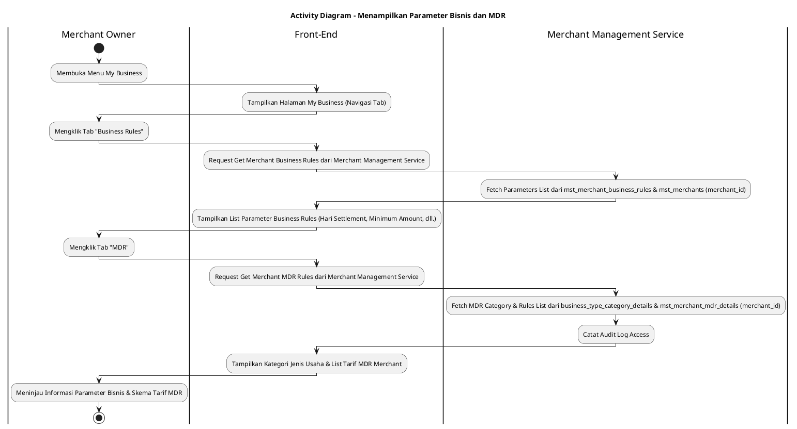
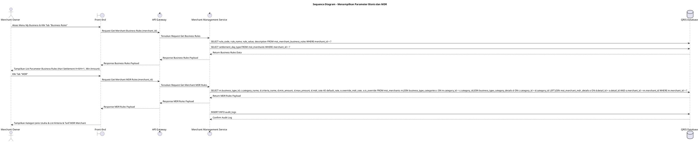

# 1 Deskripsi Use Case

**Tabel 1: Deskripsi Use Case Menampilkan Parameter Bisnis dan MDR**

| Elemen Spesifikasi | Deskripsi Detail |
| --- | --- |
| ID Use Case | UC-BOM-025 |
| Nama Use Case | Menampilkan Parameter Bisnis dan MDR |
| Penjelasan Singkat | Fitur Back Office Merchant pada menu My Business yang memfasilitasi Merchant Owner untuk melihat informasi rincian parameter aturan bisnis (seperti Hari Settlement `H+0`/`H+1`, minimum batas pencairan) serta daftar tarif MDR (*Merchant Discount Rate*) yang ditetapkan untuk entitas merchant dari tabel `mst_merchants`, `mst_merchant_business_rules`, `business_type_category_details`, dan `mst_merchant_mdr_details` melalui Merchant Management Service. |
| Aktor Utama | Merchant Owner |
| Aktor Pendukung | Merchant Management Service (`merchant_management_service`) |
| Deskripsi Singkat | Merchant Owner melakukan otentikasi login ke Back Office Merchant dan mengakses menu **My Business**. Pada halaman My Business, Merchant Owner memilih tab **Business Rules**. Sistem menampilkan daftar parameter aturan bisnis yang terikat pada merchant tersebut (seperti Siklus Hari Settlement `H+0`/`H+1`, Minimum Settlement Amount, dan Frekuensi Settlement) dari tabel `mst_merchant_business_rules` dan `mst_merchants`. Selanjutnya, Merchant Owner memilih tab **MDR**. Sistem memuat dan menampilkan rincian kategori jenis usaha merchant (misal: UMI / UKE) beserta daftar kriteria nominal transaksi dan tarif persentase MDR yang berlaku bagi merchant tersebut dari tabel `business_type_category_details` dan `mst_merchant_mdr_details` (termasuk indikasi apabila tarif MDR tersebut menggunakan tarif khusus *override*). Front-End menyajikan data rincian konfigurasi bisnis dan tarif MDR dalam antarmuka yang bersih dan *read-only*. |
| Pre-condition | 1. Merchant Owner telah berhasil login ke Back Office Merchant dan berstatus aktif. 2. Entitas merchant terdaftar aktif pada tabel `mst_merchants` beserta konfigurasi aturan bisnis dan tarif MDR. |
| Post-condition | 1. Sistem menyajikan informasi lengkap parameter aturan bisnis (seperti Hari Settlement) pada tab Business Rules. 2. Sistem menyajikan rincian skema dan persentase tarif MDR yang berlaku pada tab MDR. 3. Tidak ada perubahan data yang dilakukan pada database (proses murni *read-only*). |
| Trigger | Merchant Owner mengklik menu **My Business**, memilih tab **Business Rules** untuk melihat parameter bisnis, lalu memilih tab **MDR** untuk melihat daftar skema tarif MDR merchant. |
| Nama Tabel | mst_merchants, mst_merchant_business_rules, business_type_category_details, mst_merchant_mdr_details, audit_logs |
| Integrasi | 1. **Back Office Merchant UI:** Antarmuka pengelolaan bisnis merchant (halaman My Business), tab navigasi Business Rules, dan tab navigasi MDR. 2. **Merchant Management Service (`merchant_management_service`):** Microservice backend penyedia data parameter bisnis, pengambil skema MDR merchant, dan otorisasi. |
| Asumsi | 1. Tampilan informasi parameter bisnis dan MDR pada Back Office Merchant bersifat *read-only* bagi Merchant Owner. 2. Penyesuaian nilai parameter bisnis dan tarif MDR khusus hanya dapat dikonfigurasi melalui portal Back Office Bank oleh User Bank. |
| Keterbatasan | 1. Merchant Owner hanya dapat melihat data parameter bisnis dan skema MDR yang terikat pada `merchant_id` milik sendiri. 2. Merchant Owner tidak memiliki akses untuk mengubah nilai parameter bisnis atau tarif MDR dari halaman ini. |
| Aturan Bisnis/Sistem | 1. **Merchant Scope Filtering Constraint:** Data parameter bisnis dan skema MDR yang disajikan WAJIB difilter secara eksplisit hanya untuk `merchant_id` dari sesi Merchant Owner yang sedang login. 2. **MDR Rate Determination Logic:** Tampilan tarif MDR pada tab MDR WAJIB menampilkan tarif khusus dari `mst_merchant_mdr_details` jika berstatus aktif (`is_override = true`), atau menggunakan tarif default dari `business_type_category_details` jika tidak ada *override*. 3. **Read-only Presentation Standard:** Seluruh elemen informasi pada tab Business Rules dan tab MDR disajikan secara *read-only* tanpa kontrol pengeditan. 4. **Audit Trail Standard:** Setiap aktivitas pengaksesan halaman parameter bisnis dan MDR merchant mencatat `merchant_id`, `accessed_by` (ID Merchant Owner), dan timestamp pada `audit_logs`. |
| Session Idle | 15 Menit |

# 2 Main Flow

**Tabel 2: Main Flow Menampilkan Parameter Bisnis dan MDR**

| No. | Aktivitas | Deskripsi |
| ---: | --- | --- |
| 1 | Membuka Menu My Business | Merchant Owner melakukan login dan mengklik menu **My Business** pada navigasi Back Office Merchant. |
| 2 | Memilih Tab Business Rules | Merchant Owner mengklik tab **Business Rules** pada halaman My Business. |
| 3 | Menampilkan List Business Rules | Sistem memuat dan menampilkan daftar parameter aturan bisnis merchant (seperti Hari Settlement `H+0`/`H+1`, Minimum Settlement Amount, Frekuensi Settlement) dari `mst_merchant_business_rules` dan `mst_merchants`. |
| 4 | Memilih Tab MDR | Merchant Owner mengklik tab **MDR**. |
| 5 | Menampilkan List MDR Merchant | Sistem memuat dan menampilkan kategori jenis usaha merchant (misal: **UMI** / **UKE**) beserta daftar kriteria nominal transaksi dan tarif persentase MDR yang berlaku dari `business_type_category_details` dan `mst_merchant_mdr_details`. |
| 6 | Meninjau Informasi Parameter & MDR | Merchant Owner meninjau seluruh rincian konfigurasi parameter bisnis dan skema tarif MDR yang diterapkan pada merchant miliknya. |
| 7 | Use Case Selesai | Proses menampilkan parameter bisnis dan MDR merchant selesai dilaksanakan. |

# 3 Alternative Flow

**Tabel 3: Alternative Flow Menampilkan Parameter Bisnis dan MDR**

| Kode | Alternative Flow | Deskripsi |
| --- | --- | --- |
| AF-01 | Parameter Bisnis Belum Dikonfigurasi | Pada langkah 3, apabila data parameter bisnis merchant belum diinisialisasi di database, Sistem menyajikan state kosong (*empty state*) dengan pesan `Parameter aturan bisnis merchant belum dikonfigurasi`. |
| AF-02 | Skema MDR Merchant Belum Ditemukan | Pada langkah 5, apabila skema tarif MDR untuk kategori usaha merchant belum ditemukan pada `business_type_category_details`, Sistem menampilkan `Skema tarif MDR merchant belum dikonfigurasi`. |
| AF-03 | Gagal Terhubung ke Database Server | Pada langkah 3 atau 5, apabila koneksi database terputus total, Sistem mengembalikan HTTP status 500 dan Front-End menampilkan `Terjadi kendala internal pada server`. |

# 4 Status Front-End

**Tabel 4: Status Front-End Menampilkan Parameter Bisnis dan MDR**

| No. | Nama Status | Deskripsi Tampilan Front-End |
| ---: | --- | --- |
| 1 | IDLE | Tab Business Rules dan Tab MDR pada halaman My Business menampilkan rincian parameter bisnis dan tabel skema tarif MDR secara lengkap. |
| 2 | LOADING | Indikator memuat (*spinner*) ditampilkan saat data parameter bisnis dan skema MDR sedang diambil dari backend service. |
| 3 | EMPTY | Tampilan *empty state* disajikan jika parameter bisnis atau skema MDR merchant belum dikonfigurasi. |
| 4 | ERROR | Pesan kesalahan ditampilkan pada UI akibat gangguan koneksi server atau otorisasi merchant invalid. |

# 5 Activity Diagram Menampilkan Parameter Bisnis dan MDR

# 6 Sequence Diagram Menampilkan Parameter Bisnis dan MDR

# 7 Response Code

**Tabel 5: Response Code Menampilkan Parameter Bisnis dan MDR**

| No. | HTTP Status | Response Code | Nama Response | Deskripsi | Respons Front-End |
| ---: | ---: | --- | --- | --- | --- |
| 1 | 200 | 200XX00 | SUCCESS_GET_MERCHANT_BUSINESS_RULES | Data parameter bisnis dan skema tarif MDR merchant berhasil dimuat dari database. | Menampilkan list parameter bisnis dan tabel tarif MDR pada antarmuka My Business. |
| 2 | 404 | 404XX00 | MERCHANT_BUSINESS_RULES_NOT_FOUND | Parameter bisnis atau skema MDR merchant belum dikonfigurasi pada database. | Menampilkan tampilan *empty state* pada tab yang dipilih. |
| 3 | 500 | 500XX00 | SYSTEM_INTERNAL_ERROR | Terjadi kegagalan internal server saat memuat data parameter bisnis dan MDR merchant. | Menampilkan pesan kesalahan `Terjadi kendala internal pada server`. |

# 8 Desain Antarmuka

**Tabel 6: Desain Antarmuka Menampilkan Parameter Bisnis dan MDR**

| Halaman | Komponen dan State Utama |
| --- | --- |
| Halaman My Business (Tab Business Rules) | 1. **Navigasi Tab:** Tab Profile, Tab POS, Tab Outlets, Tab Staff, Tab **Business Rules** (Active), Tab **MDR**. 2. **Tabel Parameter Bisnis Merchant:** Kolom No, Nama Parameter (misal: Hari Settlement, Minimum Nominal Settlement), Nilai Parameter (misal: `H+1`, `Rp 50.000,00`), dan Keterangan. 3. **Catatan Informasi:** Teks informasi "Parameter bisnis ini diatur oleh Bank Hibank dan berlaku untuk siklus pencairan merchant Anda." |
| Halaman My Business (Tab MDR) | 1. **Navigasi Tab:** Tab Profile, Tab POS, Tab Outlets, Tab Staff, Tab Business Rules, Tab **MDR** (Active). 2. **Header Informasi Jenis Usaha:** Kategori usaha merchant (misal: **UMI - Usaha Mikro** / **UKE - Usaha Kecil**). 3. **Tabel Skema Tarif MDR Merchant:** Kolom No, Nama Kriteria Nominal Transaksi (misal: `≤ Rp 500.000,00`, `> Rp 500.000,00`), Batas Nominal, Persentase Tarif MDR (%), dan Status Skema (Default / Tarif Khusus). 4. **Catatan Informasi:** Teks informasi "Tarif MDR di atas merupakan skema resmi yang diterapkan pada transaksi QRIS merchant Anda." |
