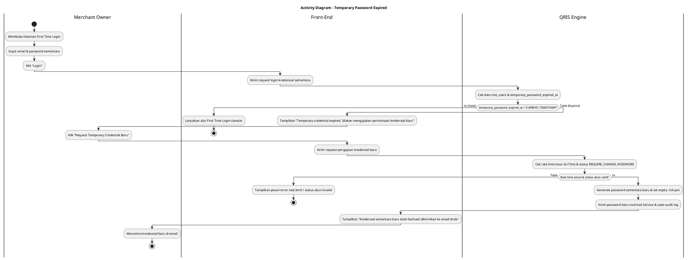
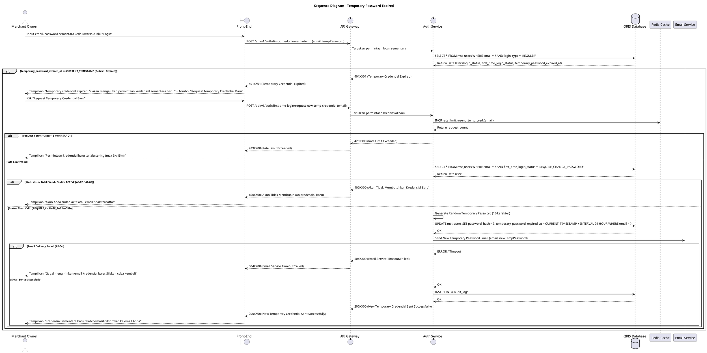

# 1 Deskripsi Use Case

**Tabel 1: Deskripsi Use Case Temporary Password Expired**

| Elemen Spesifikasi | Deskripsi Detail |
| --- | --- |
| ID Use Case | UC-BOM-003 |
| Nama Use Case | Temporary Password Expired |
| Penjelasan Singkat | Penanganan kondisi saat Merchant Owner mencoba mengakses Back Office Merchant menggunakan kredensial sementara yang telah kedaluwarsa, menampilkan notifikasi penolakan, serta memfasilitasi pengajuan pengiriman kredensial sementara baru ke email terdaftar. |
| Aktor Utama | Merchant Owner |
| Aktor Pendukung | Email Service |
| Deskripsi Singkat | Merchant Owner menginput email dan password sementara pada Halaman First Time Login. Auth Service mendeteksi bahwa kredensial sementara telah kedaluwarsa (`temporary_password_expired_at <= CURRENT_TIMESTAMP`), lalu menolak autentikasi dan menampilkan notifikasi kesalahan. Merchant Owner memilih opsi "Request Temporary Credential Baru", lalu Auth Service memverifikasi email pada `mst_users` (`login_type = 'REGULER'`, `login_status = 'INACTIVE'`, `first_time_login_status = 'REQUIRE_CHANGE_PASSWORD'`), meng-generate password sementara baru yang terenkripsi beserta masa berlaku baru (`temporary_password_expired_at = CURRENT_TIMESTAMP + 24 Jam`), memicu Email Service untuk mengirimi Merchant Owner kredensial baru, dan menampilkan notifikasi sukses. |
| Pre-condition | 1. Merchant Owner telah didaftarkan pada tabel `mst_users` dengan `login_type = 'REGULER'`, `login_status = 'INACTIVE'`, dan `first_time_login_status = 'REQUIRE_CHANGE_PASSWORD'`. 2. Masa berlaku kredensial password sementara Merchant Owner telah terlampaui (`temporary_password_expired_at <= CURRENT_TIMESTAMP`). |
| Post-condition | 1. Password sementara baru yang acak dan aman berhasil di-generate dan disimpan dalam bentuk hash pada tabel `mst_users`. 2. Tanggal `temporary_password_expired_at` diperbarui dengan masa berlaku baru (24 jam dari waktu pengajuan). 3. Kredensial sementara baru terkirim ke alamat email terdaftar Merchant Owner melalui Email Service. 4. Front-End menampilkan notifikasi konfirmasi bahwa kredensial baru telah dikirimkan. |
| Trigger | Merchant Owner memasukkan email dan password sementara lalu menekan tombol "Login", atau menekan tombol "Request Temporary Credential Baru". |
| Nama Tabel | mst_users, audit_logs |
| Integrasi | 1. **Email Service:** Layanan pengiriman email otomatis berisi informasi password sementara baru ke Merchant Owner. 2. **Redis Cache:** Penyimpanan counter rate limit untuk pengajuan resend kredensial sementara. |
| Asumsi | 1. Merchant Owner memiliki akses aktif ke alamat email yang terdaftar pada `mst_users`. 2. Layanan pengiriman email Email Service dan Redis Cache beroperasi dengan stabil. |
| Keterbatasan | 1. Permintaan kredensial sementara baru hanya dapat diajukan bagi pengguna yang memiliki atribut `first_time_login_status = 'REQUIRE_CHANGE_PASSWORD'`. 2. Pengajuan ulang kredensial dibatasi oleh *rate limit* untuk mencegah spam atau penyalahgunaan API. |
| Aturan Bisnis/Sistem | 1. **Expiration Detection:** Auth Service wajib mengecek tanggal `temporary_password_expired_at` pada `mst_users`. Apabila `<= CURRENT_TIMESTAMP`, akses First Time Login langsung ditolak. 2. **Expiration Error Notification:** Ketika kredensial kedaluwarsa terdeteksi, Front-End wajib menampilkan pesan notifikasi tegas: `Temporary credential expired. Silakan mengajukan permintaan kredensial sementara baru.`. 3. **Request New Credential Eligibility:** Pengajuan password sementara baru hanya berlaku untuk akun dengan `login_type = 'REGULER'`, `login_status = 'INACTIVE'`, dan `first_time_login_status = 'REQUIRE_CHANGE_PASSWORD'`. 4. **Secure Temporary Password Generation:** Password sementara baru di-generate secara otomatis oleh sistem dengan panjang minimal 10 karakter acak (kombinasi huruf besar, huruf kecil, angka, dan karakter spesial), lalu disimpan sebagai password hash pada `mst_users`. 5. **New Temporary Expiry Window:** Masa berlaku `temporary_password_expired_at` yang baru ditetapkan selama **24 jam** dari waktu pengajuan (`CURRENT_TIMESTAMP + 24 Jam`). 6. **Email Delivery:** Kredensial sementara baru dikirim secara langsung ke email terdaftar pengguna via Email Service. 7. **Rate Limiting:** Pengajuan *request temporary credential* baru dibatasi maksimal 3 kali per 15 menit per alamat email (`rate_limit:resend_temp_cred:{email}`). |
| Session Idle | 15 Menit |

# 2 Main Flow

**Tabel 2: Main Flow Temporary Password Expired**

| No. | Aktivitas | Deskripsi |
| ---: | --- | --- |
| 1 | Membuka Halaman Aktivasi | Merchant Owner membuka halaman First Time Login Back Office Merchant pada peramban web. |
| 2 | Memasukkan Kredensial Kedaluwarsa | Merchant Owner menginput email dan password sementara yang telah kedaluwarsa. |
| 3 | Mengirim Permintaan Login | Merchant Owner menekan tombol "Login", Front-End mengirimkan request ke Auth Service via API Gateway. |
| 4 | Memvalidasi Expired Credential | Auth Service mengecek data akun pada `mst_users` dan menemukan `temporary_password_expired_at <= CURRENT_TIMESTAMP`. |
| 5 | Menampilkan Notifikasi Kedaluwarsa | Auth Service mengembalikan error respons kedaluwarsa, dan Front-End menampilkan notifikasi `Temporary credential expired. Silakan mengajukan permintaan kredensial sementara baru.` beserta tombol "Request Temporary Credential Baru". |
| 6 | Mengajukan Request Kredensial Baru | Merchant Owner menekan tombol "Request Temporary Credential Baru". |
| 7 | Memvalidasi Rate Limit & Status Akun | Auth Service mengecek *rate limit* pengajuan via Redis Cache (max 3x/15 menit) dan memverifikasi bahwa akun berstatus `login_status = 'INACTIVE'` serta `first_time_login_status = 'REQUIRE_CHANGE_PASSWORD'`. |
| 8 | Generasi Kredensial Sementara Baru | Auth Service memproduksi password sementara acak yang baru, meng-hash password tersebut, dan memperbarui `mst_users` (`password_hash = hash_baru`, `temporary_password_expired_at = CURRENT_TIMESTAMP + 24 Jam`). |
| 9 | Pengiriman Email Kredensial Baru | Auth Service memicu Email Service untuk mengirimkan email berisi password sementara baru ke email terdaftar Merchant Owner, serta mencatat `audit_logs`. |
| 10 | Use Case Selesai | Auth Service mengembalikan respons sukses, dan Front-End menampilkan notifikasi `Kredensial sementara baru telah berhasil dikirimkan ke email Anda. Silakan cek kotak masuk email Anda untuk melakukan login.` dan mengembalikan status form ke kondisi IDLE. |

# 3 Alternative Flow

**Tabel 3: Alternative Flow Temporary Password Expired**

| Kode | Alternative Flow | Deskripsi |
| --- | --- | --- |
| AF-01 | Rate Limit Pengajuan Kredensial Terlampaui | Pada langkah 7, apabila permintaan kredensial baru melebihi 3 kali dalam 15 menit, Sistem menolak pengajuan dan Front-End menampilkan `Permintaan kredensial baru terlalu sering. Silakan tunggu 15 menit sebelum mencoba kembali.`. |
| AF-02 | User Sudah Aktif / Tidak Membutuhkan Kredensial Sementara | Pada langkah 7, apabila akun `mst_users` sudah berstatus `login_status = 'ACTIVE'` atau `first_time_login_status = 'COMPLETED'`, Sistem menolak pengajuan dan Front-End menampilkan `Akun Anda sudah aktif. Silakan lakukan login standar menggunakan password Anda.`. |
| AF-03 | Email Tidak Terdaftar | Pada langkah 7, apabila email yang dimasukkan tidak ditemukan di `mst_users`, Sistem menolak pengajuan dan Front-End menampilkan `Alamat email tidak terdaftar dalam sistem.`. |
| AF-04 | Kegagalan Pengiriman Email Service | Pada langkah 9, apabila layanan Email Service mengalami kendala saat mengirim email, Sistem melakukan pembatalan transaksi (*rollback*) dan Front-End menampilkan `Gagal mengirimkan email kredensial baru. Silakan coba beberapa saat lagi.`. |

# 4 Status Front-End

**Tabel 4: Status Front-End Temporary Password Expired**

| No. | Nama Status | Deskripsi Tampilan Front-End |
| ---: | --- | --- |
| 1 | IDLE | Form masukan email & password sementara dalam kondisi default. |
| 2 | EXPIRED_BANNER | Banner/modal peringatan dengan pesan "Temporary credential expired. Silakan mengajukan permintaan kredensial sementara baru." dan tombol aksi "Request Temporary Credential Baru". |
| 3 | LOADING | Indikator memuat (spinner) saat memproses login atau pengajuan kredensial baru. |
| 4 | SUCCESS_SENT | Banner notifikasi sukses berwarna hijau memberitahukan bahwa kredensial sementara baru telah terkirim ke email. |
| 5 | ERROR | Tampilan pesan kesalahan saat terjadi rate limit terlampaui, email tidak terdaftar, atau gangguan server. |

# 5 Activity Diagram Temporary Password Expired

# 6 Sequence Diagram Temporary Password Expired

# 7 Response Code

**Tabel 5: Response Code Temporary Password Expired**

| No. | HTTP Status | Response Code | Nama Response | Deskripsi | Respons Front-End |
| ---: | ---: | --- | --- | --- | --- |
| 1 | 200 | 200XX00 | NEW_TEMP_CREDENTIAL_SENT | Kredensial sementara baru berhasil dibuat dan terkirim ke email Merchant Owner. | Menampilkan pesan sukses dan mengarahkan pengguna mengecek inbox email. |
| 2 | 400 | 400XX00 | INVALID_REQUEST_CONTEXT | Akun sudah aktif (`login_status = 'ACTIVE'`) atau `first_time_login_status != 'REQUIRE_CHANGE_PASSWORD'`. | Menampilkan pesan bahwa akun sudah aktif dan meminta login reguler. |
| 3 | 401 | 401XX01 | TEMPORARY_CREDENTIAL_EXPIRED | Password sementara yang digunakan telah melewati batas `temporary_password_expired_at`. | Menampilkan pesan "Temporary credential expired" dan menyediakan tombol pengajuan baru. |
| 4 | 404 | 404XX00 | EMAIL_NOT_FOUND | Alamat email yang diajukan tidak ditemukan pada `mst_users`. | Menampilkan pesan email tidak terdaftar. |
| 5 | 429 | 429XX00 | RESEND_RATE_LIMIT_EXCEEDED | Pengajuan kredensial sementara baru melebihi 3 kali per 15 menit. | Menampilkan pesan peringatan rate limit dan waktu tunggu. |
| 6 | 500 | 500XX00 | INTERNAL_AUTH_ERROR | Gangguan internal pada sistem autentikasi Back Office. | Menampilkan pesan kesalahan internal sistem. |
| 7 | 504 | 504XX00 | EMAIL_SERVICE_TIMEOUT | Koneksi pengiriman ke Email Service mengalami batas waktu (timeout). | Menampilkan pesan gagal mengirim email kredensial baru. |

# 8 Desain Antarmuka

**Tabel 6: Desain Antarmuka Temporary Password Expired**

| Halaman | Komponen dan State Utama |
| --- | --- |
| Halaman First Time Login | - Form Input **Email** & **Password Sementara** (`IDLE` / `ERROR`). - Tombol Utama **"Login"** (`IDLE` / `LOADING`). - Alert Banner Red (`EXPIRED_BANNER`): Pesan **"Temporary credential expired. Silakan mengajukan permintaan kredensial sementara baru."**. - Tombol **"Request Temporary Credential Baru"** (`IDLE` / `LOADING`). |
| Banner Konfirmasi Pengiriman Email | - Banner Notification Green (`SUCCESS_SENT`): Pesan **"Kredensial sementara baru telah berhasil dikirimkan ke email Anda. Silakan cek inbox untuk melakukan login."**. - Form Input Email & Password Sementara (Reset State). |
