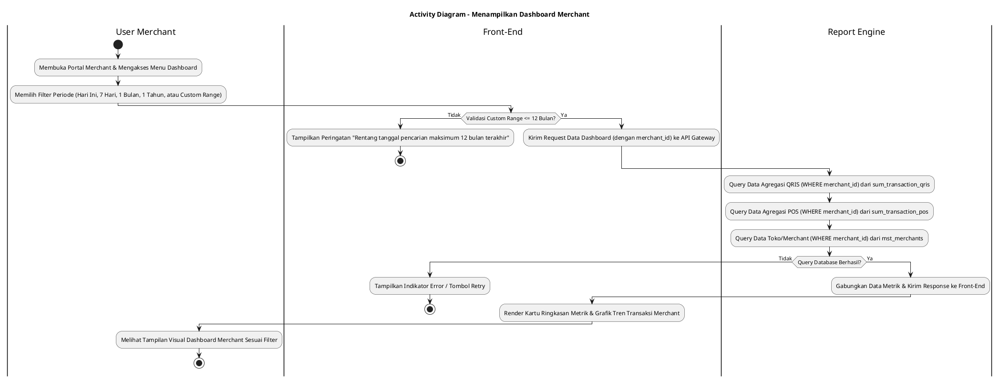
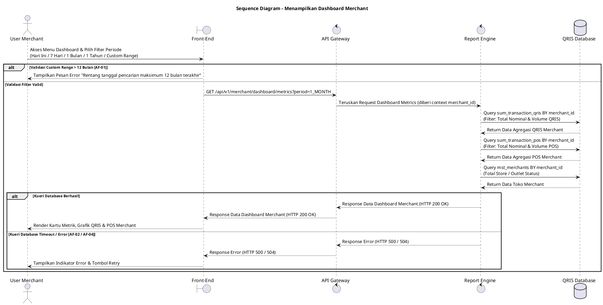

# 1 Deskripsi Use Case

**Tabel 1: Deskripsi Use Case Menampilkan Dashboard Merchant**

| Elemen Spesifikasi | Deskripsi Detail |
| --- | --- |
| ID Use Case | UC-BOM-007 |
| Nama Use Case | Menampilkan Dashboard Merchant |
| Penjelasan Singkat | Fitur Portal Back Office Merchant yang menyajikan grafik dan ringkasan metrik statistik transaksi QRIS, transaksi POS, serta statistik keaktifan toko merchant melalui Report Engine yang WAJIB difilter berdasarkan `merchant_id` akun merchant yang sedang login. |
| Aktor Utama | User Merchant (Merchant Owner / Merchant Admin) |
| Aktor Pendukung | Report Engine |
| Deskripsi Singkat | User Merchant melakukan otentikasi login ke Portal Back Office Merchant dan mengklik menu **Dashboard**. Sistem memfasilitasi pilihan filter periode berupa preset **Hari Ini**, **7 Hari Terakhir**, **1 Bulan Terakhir** (Periode Default), dan **1 Tahun Terakhir**, serta pilihan **Custom Range Date** dengan batasan rentang tanggal maksimum 12 bulan terakhir. Front-End mengirimkan permintaan data metrik dashboard ke Report Engine melalui API Gateway berdasarkan `merchant_id` akun merchant. Report Engine melakukan kueri agregasi ke tabel **`sum_transaction_qris`** (total nominal dan volume transaksi QRIS), ke tabel **`sum_transaction_pos`** (total nominal dan volume transaksi POS), serta ke tabel **`mst_merchants`** / data toko merchant untuk menghitung total outlet/toko aktif. Setelah seluruh metrik terhimpun, Report Engine mengembalikan data ke Front-End. Front-End menampilkan dashboard visual yang terdiri dari ringkasan kartu metrik (*summary cards*), grafik tren transaksi harian/bulanan, dan perbandingan penjualan toko. |
| Pre-condition | User Merchant telah berhasil melakukan otentikasi login dan memiliki sesi akun merchant yang aktif pada Portal Back Office Merchant. |
| Post-condition | Front-End berhasil menyajikan seluruh widget statistik transaksi QRIS, transaksi POS, serta grafik penjualan merchant secara lengkap dan terisolasi untuk `merchant_id` tersebut. |
| Trigger | User Merchant berhasil melakukan login atau mengklik menu **Dashboard** pada Portal Back Office Merchant. |
| Nama Tabel | sum_transaction_qris, sum_transaction_pos, mst_merchants |
| Integrasi | 1. **Back Office Merchant Web UI:** Antarmuka visualisasi dashboard merchant yang memuat widget metrik, grafik, dan filter periode. 2. **Report Engine:** Microservice backend penyaji data pelaporan dan agregasi statistik merchant. 3. **QRIS Database:** Sumber data agregasi transaksi QRIS, POS, dan data master merchant. |
| Asumsi | 1. Seluruh kueri data dashboard WAJIB difilter menggunakan `merchant_id` dari sesi User Merchant yang aktif. 2. Periode default dashboard yang ditampilkan saat awal muat halaman adalah **1 Bulan Terakhir**. |
| Keterbatasan | 1. Dashboard menyajikan data agregasi ringkasan khusus untuk merchant yang bersangkutan dan tidak dapat melihat data merchant lain. 2. Pemilihan tanggal pada *Custom Range Date* dibatasi maksimum rentang pencarian 12 bulan (1 tahun) terakhir. |
| Aturan Bisnis/Sistem | 1. **Mandatory Merchant Scope Filter:** Kueri agregasi ke tabel `sum_transaction_qris`, `sum_transaction_pos`, dan `mst_merchants` WAJIB menyertakan klausul `WHERE merchant_id = :session_merchant_id`. 2. **Preset Period Filter Standard:** Sistem WAJIB menyediakan 4 opsi filter preset acuan: &nbsp;&nbsp;- **Hari Ini:** Menampilkan transaksi dan statistik untuk hari berjalan. &nbsp;&nbsp;- **7 Hari Terakhir:** Menampilkan akumulasi 7 hari ke belakang. &nbsp;&nbsp;- **1 Bulan Terakhir:** Menampilkan akumulasi 30 hari ke belakang (periode default). &nbsp;&nbsp;- **1 Tahun Terakhir:** Menampilkan akumulasi 365 hari ke belakang. 3. **Custom Date Range Limit:** Apabila User Merchant memilih opsi *Custom Range Date*, selisih rentang tanggal mulai (*start date*) dan tanggal akhir (*end date*) WAJIB MAKSIMUM 12 BULAN (365 HARI) ke belakang dari tanggal hari ini. 4. **Data Aggregation Standard:** Data metrik transaksi wajib disajikan dari tabel agregasi ringkasan `sum_transaction_qris` dan `sum_transaction_pos` untuk mengoptimalkan kecepatan muat halaman dashboard. |
| Session Idle | 15 Menit |

# 2 Main Flow

**Tabel 2: Main Flow Menampilkan Dashboard Merchant**

| No. | Aktivitas | Deskripsi |
| ---: | --- | --- |
| 1 | Membuka Portal Merchant | User Merchant melakukan otentikasi login dan mengakses Portal Back Office Merchant. |
| 2 | Mengakses Menu Dashboard | User Merchant mengklik menu **Dashboard** pada bilah navigasi utama. |
| 3 | Memilih Filter Periode | User Merchant memilih salah satu preset filter (**Hari Ini**, **7 Hari Terakhir**, **1 Bulan Terakhir**, **1 Tahun Terakhir**) atau memilih **Custom Range Date** (maksimal rentang 12 bulan). |
| 4 | Mengirim Request Data Dashboard | Front-End memvalidasi rentang tanggal dan mengirimkan request pengambil data metrik dashboard (menyertakan `merchant_id`) ke API Gateway. |
| 5 | Query Ringkasan Transaksi QRIS | Report Engine melakukan kueri agregasi data transaksi QRIS dari tabel `sum_transaction_qris` berdasarkan `merchant_id` dan periode filter. |
| 6 | Query Ringkasan Transaksi POS | Report Engine melakukan kueri agregasi data transaksi POS dari tabel `sum_transaction_pos` berdasarkan `merchant_id` dan periode filter. |
| 7 | Query Statistik Toko/Outlet | Report Engine melakukan kueri statistik toko dan outlet aktif dari tabel `mst_merchants` berdasarkan `merchant_id`. |
| 8 | Mengembalikan Data Metrik | Report Engine menggabungkan seluruh hasil kueri ke dalam objek response data terpadu dan mengembalikannya ke Front-End melalui API Gateway. |
| 9 | Menampilkan Widget Dashboard Visual | Front-End menyajikan data dalam bentuk ringkasan kartu metrik (*summary cards*), grafik tren transaksi QRIS & POS, serta perbandingan penjualan outlet toko. |
| 10 | Use Case Selesai | Halaman dashboard merchant berhasil ditampilkan sesuai periode filter terpilih dan siap dipantau. |

# 3 Alternative Flow

**Tabel 3: Alternative Flow Menampilkan Dashboard Merchant**

| Kode | Alternative Flow | Deskripsi |
| --- | --- | --- |
| AF-01 | Custom Date Range Melebihi 12 Bulan | Pada langkah 3-4, apabila User Merchant memilih *Custom Range Date* dengan selisih rentang tanggal melebihi 12 bulan terakhir, Sistem menolak request dan Front-End menampilkan pesan `Rentang tanggal pencarian maksimum 12 bulan terakhir`. |
| AF-02 | Gagal Memuat Data Agregasi Transaksi | Pada langkah 5 atau 6, apabila kueri ke `sum_transaction_qris` atau `sum_transaction_pos` mengalami timeout/gangguan, Sistem menyajikan nilai 0 pada widget transaksi yang bersangkutan dan Front-End menampilkan pesan `Gagal memuat ringkasan data transaksi`. |
| AF-03 | Filter Periode Tidak Memiliki Catatan Data | Pada langkah 5-7, apabila periode filter yang dipilih tidak memiliki catatan transaksi, Sistem mengembalikan data bernilai 0 dan Front-End menampilkan tampilan *empty state* pada grafik transaksi. |
| AF-04 | Gangguan Koneksi Database Server | Pada langkah 5-7, apabila koneksi database terputus total, Sistem mengembalikan HTTP status 500 dan Front-End menampilkan pesan `Terjadi gangguan sistem saat memuat dashboard. Silakan coba beberapa saat lagi`. |

# 4 Status Front-End

**Tabel 4: Status Front-End Menampilkan Dashboard Merchant**

| No. | Nama Status | Deskripsi Tampilan Front-End |
| ---: | --- | --- |
| 1 | LOADING | Indikator muat data (*skeleton loader*) ditampilkan pada seluruh widget kartu metrik dan area grafik saat filter diubah. |
| 2 | SUCCESS | Seluruh kartu metrik statistik transaksi QRIS, POS, dan grafik penjualan merchant tersaji secara lengkap sesuai filter periode. |
| 3 | EMPTY | Widget grafik menyajikan indikator *no data* untuk rentang periode filter pencarian yang belum memiliki transaksi. |
| 4 | ERROR | Tampilan widget menyajikan indikator kesalahan disertai tombol **"Retry"** akibat gangguan server, database, atau validasi filter gagal. |

# 5 Activity Diagram Menampilkan Dashboard Merchant

# 6 Sequence Diagram Menampilkan Dashboard Merchant

# 7 Response Code

**Tabel 5: Response Code Menampilkan Dashboard Merchant**

| No. | HTTP Status | Response Code | Nama Response | Deskripsi | Respons Front-End |
| ---: | ---: | --- | --- | --- | --- |
| 1 | 200 | 200XX00 | SUCCESS_GET_MERCHANT_DASHBOARD | Data metrik transaksi QRIS, POS, dan data toko merchant berhasil diambil sesuai filter. | Menampilkan seluruh widget metrik dan grafik dashboard merchant secara visual. |
| 2 | 400 | 400XX00 | INVALID_DATE_RANGE_FILTER | Filter rentang tanggal yang dimasukkan pada Custom Range melebihi batas 12 bulan (1 tahun). | Menampilkan pesan kesalahan `Rentang tanggal pencarian maksimum 12 bulan terakhir`. |
| 3 | 404 | 404XX00 | DASHBOARD_DATA_NOT_FOUND | Tidak ada data agregasi yang ditemukan untuk merchant pada periode yang dipilih. | Menampilkan widget dalam kondisi *empty state*. |
| 4 | 500 | 500XX00 | SYSTEM_INTERNAL_ERROR | Terjadi kegagalan internal pada server saat mengagregasi data dashboard merchant. | Menampilkan indikator error pada widget dashboard dan tombol *retry*. |
| 5 | 504 | 504XX00 | DATABASE_QUERY_TIMEOUT | Kueri agregasi ke database mengalami batas waktu habis (timeout). | Menampilkan pesan kesalahan `Gagal memuat ringkasan data transaksi akibat timeout`. |

# 8 Desain Antarmuka

**Tabel 6: Desain Antarmuka Menampilkan Dashboard Merchant**

| Halaman | Komponen dan State Utama |
| --- | --- |
| Dashboard Utama Merchant | 1. **Filter Periode Preset:** Tombol Pilihan Preset (**Hari Ini**, **7 Hari Terakhir**, **1 Bulan Terakhir**, **1 Tahun Terakhir**). 2. **Filter Custom Range Date:** Picker rentang tanggal mulai dan tanggal akhir (*Custom Date Range*) dengan batasan maksimum 12 bulan terakhir. 3. **Kartu Metrik QRIS (`sum_transaction_qris`):** Menampilkan total nominal dan volume transaksi QRIS merchant. 4. **Kartu Metrik POS (`sum_transaction_pos`):** Menampilkan total nominal dan volume transaksi POS merchant. 5. **Kartu Metrik Toko (`mst_merchants`):** Menampilkan total outlet/toko aktif merchant. 6. **Grafik Penjualan:** Line chart tren nominal transaksi QRIS vs POS per hari/bulan. 7. **State Indicator:** Mengubah tampilan antara LOADING (Skeleton), SUCCESS, EMPTY, dan ERROR. |
