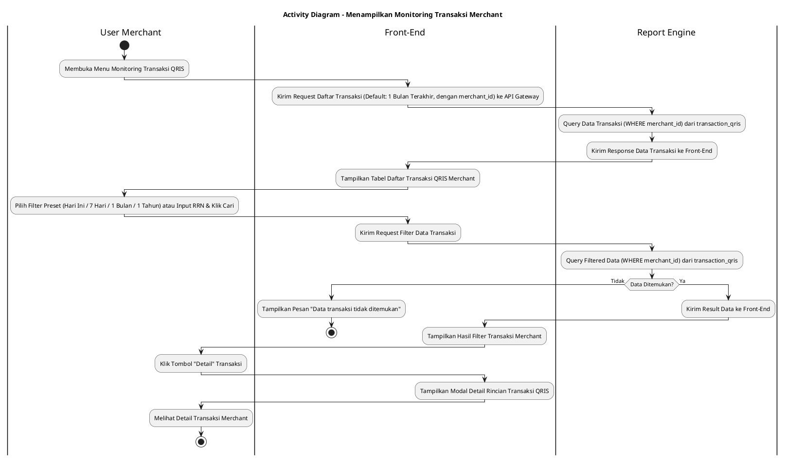
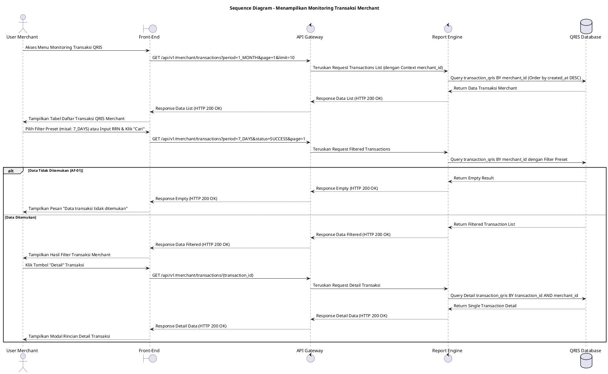

# 1 Deskripsi Use Case

**Tabel 1: Deskripsi Use Case Menampilkan Monitoring Transaksi Merchant**

| Elemen Spesifikasi | Deskripsi Detail |
| --- | --- |
| ID Use Case | UC-BOM-008 |
| Nama Use Case | Menampilkan Monitoring Transaksi Merchant |
| Penjelasan Singkat | Fitur Portal Back Office Merchant yang memungkinkan User Merchant memantau, memfilter, dan meninjau daftar serta rincian transaksi QRIS secara real-time dari tabel `transaction_qris` menggunakan Report Engine yang WAJIB difilter berdasarkan `merchant_id` akun merchant. |
| Aktor Utama | User Merchant (Merchant Owner / Merchant Admin) |
| Aktor Pendukung | Report Engine |
| Deskripsi Singkat | User Merchant melakukan otentikasi login ke Portal Back Office Merchant dan mengakses menu **Monitoring Transaksi** -> **Transaksi QRIS**. Front-End mengirimkan request ke API Gateway untuk memuat daftar transaksi QRIS toko dengan filter default **1 Bulan Terakhir**. Sistem memfasilitasi Pilihan Filter Preset mencakup **Hari Ini**, **7 Hari Terakhir**, **1 Bulan Terakhir** (Periode Default), dan **1 Tahun Terakhir**, serta pencarian kustom berdasarkan RRN/STAN dan Status Transaksi (`SUCCESS`, `PENDING`, `FAILED`, `SETTLED`). Report Engine melakukan kueri ke tabel **`transaction_qris` secara WAJIB memfilter `merchant_id`** akun merchant dan mengembalikan data transaksi mencakup Retrieval Reference Number (RRN), System Trace Audit Number (STAN), Outlet/Toko, Nominal Transaksi, Biaya MDR, Nominal Netto, Status Transaksi, serta Waktu Transaksi. Front-End menampilkan data dalam tabel interaktif beserta tombol **"Detail"** untuk melihat rincian informasi transaksi secara lengkap. |
| Pre-condition | User Merchant telah berhasil login ke Portal Back Office Merchant dan memiliki sesi akun merchant yang aktif. |
| Post-condition | Front-End berhasil menyajikan tabel daftar transaksi QRIS dan informasi rincian detail transaksi sesuai kriteria filter preset yang dipilih khusus untuk `merchant_id` tersebut. |
| Trigger | User Merchant mengakses menu Monitoring Transaksi QRIS atau memilih opsi filter preset / pencarian kriteria data transaksi pada Portal Merchant. |
| Nama Tabel | transaction_qris |
| Integrasi | 1. **Back Office Merchant Web UI:** Antarmuka tabel monitoring transaksi QRIS merchant beserta komponen filter preset dan pencarian. 2. **Report Engine:** Microservice penyaji data transaksi monitoring dan pelaporan. 3. **QRIS Database:** Penyimpanan data historis dan real-time log transaksi QRIS (`transaction_qris`). |
| Asumsi | 1. Data transaksi pada tabel `transaction_qris` ter-update secara real-time saat transaksi diproses oleh QRIS Engine. 2. Halaman monitoring menggunakan metode pembagian halaman (*pagination*) untuk menjaga performa muat data. |
| Keterbatasan | 1. Pemantauan transaksi pada use case ini bersifat read-only dan terisolasi khusus untuk data merchant yang bersangkutan. 2. Filter preset rentang waktu acuan membatasi kueri maksimum 1 tahun terakhir untuk menjaga performa sistem. |
| Aturan Bisnis/Sistem | 1. **Mandatory Merchant Scope Isolation:** Kueri pencarian data transaksi pada tabel `transaction_qris` **WAJIB menyertakan filter `WHERE merchant_id = :session_merchant_id`**. 2. **Preset Period Filter Standard:** Sistem WAJIB menyediakan 4 opsi filter preset acuan: &nbsp;&nbsp;- **Hari Ini:** Menampilkan transaksi untuk hari berjalan. &nbsp;&nbsp;- **7 Hari Terakhir:** Menampilkan transaksi 7 hari ke belakang. &nbsp;&nbsp;- **1 Bulan Terakhir:** Menampilkan transaksi 30 hari ke belakang (periode default). &nbsp;&nbsp;- **1 Tahun Terakhir:** Menampilkan transaksi 365 hari ke belakang. 3. **Pagination Standard:** Daftar transaksi wajib ditampilkan dengan pagination (default 10 atau 25 data per halaman). 4. **Real-time Status Display:** Status transaksi yang ditampilkan diselaraskan dengan enum status resmi (`SUCCESS`, `PENDING`, `FAILED`, `EXPIRED`, `SETTLED`, `REFUNDED`). 5. **Security & Data Masking Standard:** Informasi sensitif kartu/sumber dana konsumen wajib disamarkan (*masked*) pada tampilan detail. |
| Session Idle | 15 Menit |

# 2 Main Flow

**Tabel 2: Main Flow Menampilkan Monitoring Transaksi Merchant**

| No. | Aktivitas | Deskripsi |
| ---: | --- | --- |
| 1 | Membuka Menu Monitoring Transaksi | User Merchant melakukan login ke Portal Merchant dan mengklik menu **Monitoring Transaksi** -> **Transaksi QRIS**. |
| 2 | Mengirim Request Daftar Transaksi | Front-End mengirimkan request ke API Gateway untuk mengambil data transaksi QRIS terbaru (dengan `merchant_id`) dengan filter default **1 Bulan Terakhir**. |
| 3 | Query Data Transaksi Merchant | Report Engine melakukan kueri ke tabel `transaction_qris` (WHERE `merchant_id`) mengambil data RRN, STAN, Outlet, Nominal, Status, dan Timestamp. |
| 4 | Menampilkan Daftar Transaksi QRIS | Front-End menyajikan tabel daftar transaksi QRIS merchant beserta komponen filter preset (**Hari Ini**, **7 Hari Terakhir**, **1 Bulan Terakhir**, **1 Tahun Terakhir**) dan tombol pagination. |
| 5 | Memilih Filter Preset / Parameter Pencarian | User Merchant memilih opsi filter preset (misal: **7 Hari Terakhir**) atau memasukkan parameter pencarian RRN/Status dan mengklik tombol **"Cari"**. |
| 6 | Mengirim Request Filter Data | Front-End mengirimkan request pencarian berparameter ke API Gateway. |
| 7 | Query Filtered Transactions | Report Engine menjalankan kueri berfilter pada tabel `transaction_qris` (tetap memfilter `merchant_id`) dan mengembalikan data hasil pencarian. |
| 8 | Menampilkan Hasil Filter Transaksi | Front-End memperbarui tabel dengan menyajikan daftar transaksi merchant yang cocok beserta ringkasan total nominal. |
| 9 | Membuka Detail Transaksi | User Merchant mengklik tombol **"Detail"** pada salah satu baris data transaksi. |
| 10 | Menampilkan Detail Transaksi | Front-End menampilkan modal/halaman detail yang menyajikan rincian lengkap transaksi QRIS merchant. |
| 11 | Use Case Selesai | Pemantauan data transaksi QRIS merchant selesai dilaksanakan. |

# 3 Alternative Flow

**Tabel 3: Alternative Flow Menampilkan Monitoring Transaksi Merchant**

| Kode | Alternative Flow | Deskripsi |
| --- | --- | --- |
| AF-01 | Data Transaksi Tidak Ditemukan | Pada langkah 7, apabila kriteria filter pencarian (RRN/Preset Filter) tidak cocok dengan data merchant pada `transaction_qris`, Sistem mengembalikan data kosong dan Front-End menampilkan `Data transaksi tidak ditemukan`. |
| AF-02 | Gangguan Koneksi Database Server | Pada langkah 3 atau 7, apabila koneksi database terputus, Sistem mengembalikan HTTP status 500 dan Front-End menampilkan `Gagal memuat data monitoring transaksi`. |

# 4 Status Front-End

**Tabel 4: Status Front-End Menampilkan Monitoring Transaksi Merchant**

| No. | Nama Status | Deskripsi Tampilan Front-End |
| ---: | --- | --- |
| 1 | LOADING | Indikator muat data (*spinner/skeleton*) ditampilkan pada tabel atau modal detail saat data diproses dari server. |
| 2 | SUCCESS | Tabel daftar monitoring transaksi dan modal rincian detail menyajikan data transaksi QRIS merchant secara valid sesuai filter preset. |
| 3 | EMPTY | Tabel menyajikan tampilan *empty state* saat tidak ada data transaksi yang cocok dengan parameter filter pencarian. |
| 4 | ERROR | Pesan kesalahan disertai tombol **"Retry"** ditampilkan pada UI akibat gangguan server atau validasi filter gagal. |

# 5 Activity Diagram Menampilkan Monitoring Transaksi Merchant

# 6 Sequence Diagram Menampilkan Monitoring Transaksi Merchant

# 7 Response Code

**Tabel 5: Response Code Menampilkan Monitoring Transaksi Merchant**

| No. | HTTP Status | Response Code | Nama Response | Deskripsi | Respons Front-End |
| ---: | ---: | --- | --- | --- | --- |
| 1 | 200 | 200XX00 | SUCCESS_GET_MONITORING_TRANSACTIONS | Data daftar monitoring transaksi QRIS merchant berhasil diambil dari server sesuai filter preset. | Menampilkan tabel daftar transaksi QRIS merchant secara lengkap. |
| 2 | 400 | 400XX00 | INVALID_SEARCH_FILTER | Parameter filter pencarian atau opsi preset filter tidak valid. | Menampilkan pesan kesalahan `Filter pencarian tidak valid`. |
| 3 | 404 | 404XX00 | TRANSACTION_NOT_FOUND | Data transaksi tidak ditemukan berdasarkan kriteria pencarian RRN/Preset yang dipilih. | Menampilkan tabel dalam kondisi *empty state* dengan pesan `Data transaksi tidak ditemukan`. |
| 4 | 500 | 500XX00 | SYSTEM_INTERNAL_ERROR | Terjadi kegagalan internal server saat mengambil data transaksi merchant. | Menampilkan indikator error pada UI dan tombol *retry*. |
| 5 | 504 | 504XX00 | DATABASE_QUERY_TIMEOUT | Kueri ke tabel `transaction_qris` mengalami batas waktu habis (timeout). | Menampilkan pesan kesalahan `Gagal memuat data monitoring transaksi akibat timeout`. |

# 8 Desain Antarmuka

**Tabel 6: Desain Antarmuka Menampilkan Monitoring Transaksi Merchant**

| Halaman | Komponen dan State Utama |
| --- | --- |
| Monitoring Transaksi QRIS Merchant | 1. **Tombol Filter Preset:** Pilihan Preset (**Hari Ini**, **7 Hari Terakhir**, **1 Bulan Terakhir** *(Default)*, **1 Tahun Terakhir**). 2. **Bilah Pencarian:** Input RRN/STAN, Dropdown Toko/Outlet, Dropdown Status (`SUCCESS`, `PENDING`, `FAILED`, `SETTLED`), dan Tombol **"Cari"** / **"Reset"**. 3. **Tabel Transaksi:** Kolom RRN, Tanggal/Waktu, Outlet/Toko, Nominal, MDR, Netto, Status, dan Tombol Aksi **"Detail"**. 4. **Pagination Control:** Komponen navigasi halaman (First, Prev, Page Numbers, Next, Last). 5. **State Indicator:** Tampilan LOADING (Spinner), SUCCESS, EMPTY, dan ERROR. |
| Modal Detail Transaksi QRIS Merchant | 1. **Header Info:** Transaction ID, RRN, STAN, dan Status Badge. 2. **Rincian Toko:** Nama Toko/Outlet, MPAN, dan Terminal ID. 3. **Rincian Pembayaran:** Nominal Transaksi, Biaya MDR, Nominal Netto, Tipe QRIS (Static/Dynamic), dan Issuer Bank. 4. **Tombol "Tutup":** Menutup modal rincian transaksi. |
