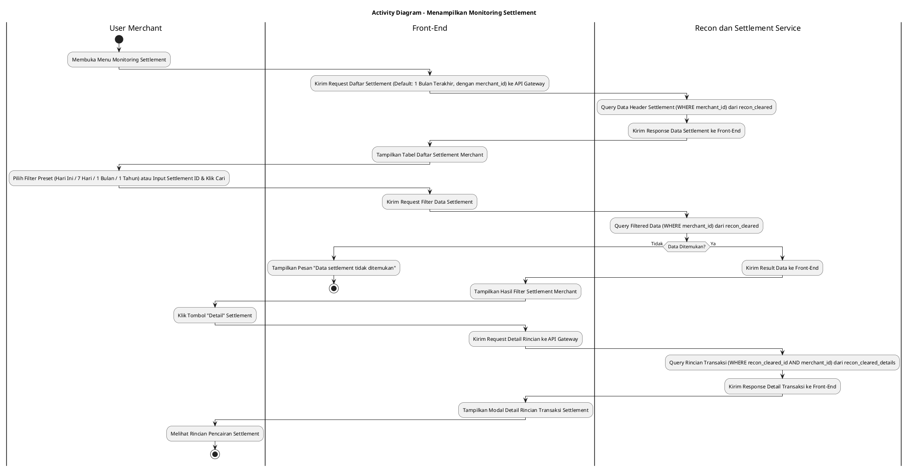
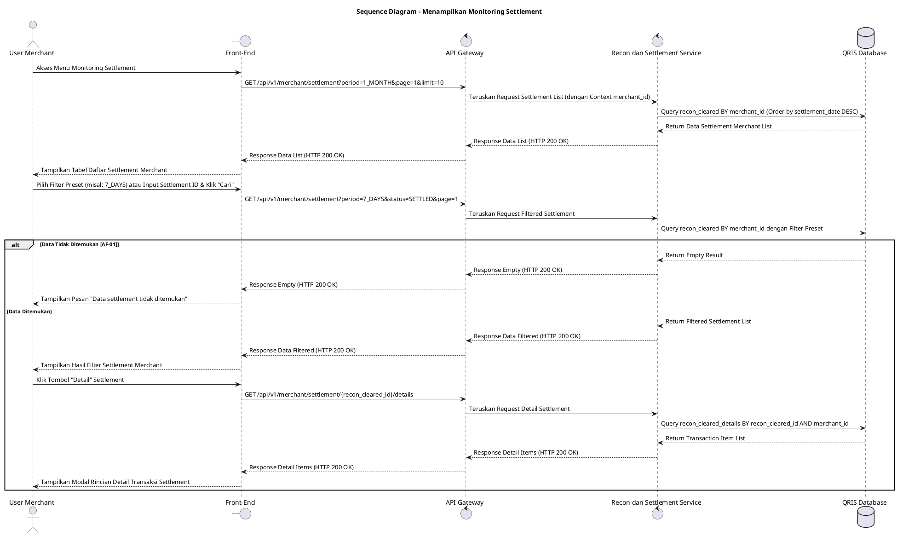

# 1 Deskripsi Use Case

**Tabel 1: Deskripsi Use Case Menampilkan Monitoring Settlement**

| Elemen Spesifikasi | Deskripsi Detail |
| --- | --- |
| ID Use Case | UC-BOM-009 |
| Nama Use Case | Menampilkan Monitoring Settlement |
| Penjelasan Singkat | Fitur Portal Back Office Merchant yang memungkinkan User Merchant memantau status pencairan dana (*settlement*) transaksi merchant secara real-time dari tabel `recon_cleared` dan `recon_cleared_details` menggunakan Recon dan Settlement Service yang WAJIB difilter berdasarkan `merchant_id`. |
| Aktor Utama | User Merchant (Merchant Owner / Merchant Admin) |
| Aktor Pendukung | Recon dan Settlement Service |
| Deskripsi Singkat | User Merchant melakukan otentikasi login ke Portal Back Office Merchant dan mengakses menu **Keuangan & Settlement** -> **Monitoring Settlement**. Front-End mengirimkan request ke API Gateway untuk memuat daftar pencairan dana settlement dengan filter default **1 Bulan Terakhir**. Sistem memfasilitasi Pilihan Filter Preset mencakup **Hari Ini**, **7 Hari Terakhir**, **1 Bulan Terakhir** (Periode Default), dan **1 Tahun Terakhir**, serta pencarian kustom berdasarkan Settlement ID / Batch ID dan Status Settlement (`SETTLED`, `PENDING`, `PROCESSING`, `FAILED`). Recon dan Settlement Service melakukan kueri ke tabel **`recon_cleared` secara WAJIB memfilter `merchant_id`** akun merchant dan mengembalikan data mencakup Settlement ID, Tanggal Clearing/Settlement, Total Nominal Kotor, Biaya MDR, Nominal Netto Disetorkan, Rekening Tujuan, dan Status Settlement. Front-End menampilkan data dalam tabel interaktif beserta tombol **"Detail"**. Saat User Merchant mengklik **"Detail"**, Recon dan Settlement Service melakukan kueri rincian transaksi pencairan ke tabel **`recon_cleared_details`** dan Front-End menyajikan modal detail transaksi per item secara lengkap. |
| Pre-condition | User Merchant telah berhasil login ke Portal Back Office Merchant dan memiliki sesi akun merchant yang aktif. |
| Post-condition | Front-End berhasil menyajikan tabel daftar pencairan settlement dan rincian transaksi per item dari `recon_cleared_details` khusus untuk `merchant_id` tersebut. |
| Trigger | User Merchant mengakses menu Monitoring Settlement atau memilih opsi filter preset / pencarian kriteria data pencairan dana pada Portal Merchant. |
| Nama Tabel | recon_cleared, recon_cleared_details |
| Integrasi | 1. **Back Office Merchant Web UI:** Antarmuka tabel monitoring settlement merchant beserta komponen filter preset dan modal detail. 2. **Recon dan Settlement Service:** Microservice penyaji data hasil kliring dan pencairan dana settlement merchant. 3. **QRIS Database:** Penyimpanan data header settlement (`recon_cleared`) dan rincian detail settlement (`recon_cleared_details`). |
| Asumsi | 1. Data pencairan dana pada tabel `recon_cleared` dan `recon_cleared_details` dibentuk secara otomatis oleh Recon dan Settlement Service setelah proses rekonsiliasi harian selesai. 2. Halaman monitoring menggunakan metode pembagian halaman (*pagination*) untuk menjaga performa muat data. |
| Keterbatasan | 1. Pemantauan settlement pada use case ini bersifat read-only dan terisolasi khusus untuk data merchant yang bersangkutan. 2. Filter preset rentang waktu acuan membatasi kueri maksimum 1 tahun terakhir untuk menjaga performa sistem. |
| Aturan Bisnis/Sistem | 1. **Mandatory Merchant Scope Isolation:** Kueri pencarian data settlement pada tabel `recon_cleared` dan `recon_cleared_details` **WAJIB menyertakan filter `WHERE merchant_id = :session_merchant_id`**. 2. **Preset Period Filter Standard:** Sistem WAJIB menyediakan 4 opsi filter preset acuan: &nbsp;&nbsp;- **Hari Ini:** Menampilkan data settlement untuk hari berjalan. &nbsp;&nbsp;- **7 Hari Terakhir:** Menampilkan data settlement 7 hari ke belakang. &nbsp;&nbsp;- **1 Bulan Terakhir:** Menampilkan data settlement 30 hari ke belakang (periode default). &nbsp;&nbsp;- **1 Tahun Terakhir:** Menampilkan data settlement 365 hari ke belakang. 3. **Clearing Details Association:** Setiap baris rincian pada modal detail WAJIB mengambil data dari `recon_cleared_details` yang terhubung via `recon_cleared_id`. 4. **Pagination Standard:** Daftar settlement wajib ditampilkan dengan pagination (default 10 atau 25 data per halaman). |
| Session Idle | 15 Menit |

# 2 Main Flow

**Tabel 2: Main Flow Menampilkan Monitoring Settlement**

| No. | Aktivitas | Deskripsi |
| ---: | --- | --- |
| 1 | Membuka Menu Monitoring Settlement | User Merchant melakukan login ke Portal Merchant dan mengklik menu **Keuangan & Settlement** -> **Monitoring Settlement**. |
| 2 | Mengirim Request Daftar Settlement | Front-End mengirimkan request ke API Gateway untuk mengambil data settlement merchant terbaru (dengan `merchant_id`) dengan filter default **1 Bulan Terakhir**. |
| 3 | Query Data Header Settlement | Recon dan Settlement Service melakukan kueri ke tabel `recon_cleared` (WHERE `merchant_id`) mengambil Settlement ID, Nominal Brutal, MDR, Nominal Netto, Status, dan Tanggal. |
| 4 | Menampilkan Daftar Settlement | Front-End menyajikan tabel daftar pencairan settlement merchant beserta komponen filter preset (**Hari Ini**, **7 Hari Terakhir**, **1 Bulan Terakhir**, **1 Tahun Terakhir**) dan tombol pagination. |
| 5 | Memilih Filter Preset / Parameter Pencarian | User Merchant memilih opsi filter preset (misal: **7 Hari Terakhir**) atau memasukkan parameter pencarian Settlement ID/Status dan mengklik tombol **"Cari"**. |
| 6 | Mengirim Request Filter Data | Front-End mengirimkan request pencarian berparameter ke API Gateway. |
| 7 | Query Filtered Settlement Data | Recon dan Settlement Service menjalankan kueri berfilter pada tabel `recon_cleared` (tetap memfilter `merchant_id`) dan mengembalikan data hasil pencarian. |
| 8 | Menampilkan Hasil Filter Settlement | Front-End memperbarui tabel dengan menyajikan daftar pencairan settlement merchant yang cocok beserta ringkasan total nominal netto. |
| 9 | Membuka Detail Settlement | User Merchant mengklik tombol **"Detail"** pada salah satu baris data settlement. |
| 10 | Query Detail Transaksi Cleared | Recon dan Settlement Service melakukan kueri rincian transaksi ke tabel `recon_cleared_details` berdasarkan `recon_cleared_id` dan `merchant_id`. |
| 11 | Menampilkan Detail Transaksi Settlement | Front-End menampilkan modal/halaman detail yang menyajikan rincian per transaksi QRIS yang masuk dalam pencairan settlement tersebut. |
| 12 | Use Case Selesai | Pemantauan data settlement merchant selesai dilaksanakan. |

# 3 Alternative Flow

**Tabel 3: Alternative Flow Menampilkan Monitoring Settlement**

| Kode | Alternative Flow | Deskripsi |
| --- | --- | --- |
| AF-01 | Data Settlement Tidak Ditemukan | Pada langkah 7 atau 10, apabila kriteria filter pencarian atau rincian detail tidak cocok dengan `merchant_id`, Sistem mengembalikan data kosong dan Front-End menampilkan `Data settlement tidak ditemukan`. |
| AF-02 | Gangguan Koneksi Database Server | Pada langkah 3, 7, atau 10, apabila koneksi database terputus, Sistem mengembalikan HTTP status 500 dan Front-End menampilkan `Gagal memuat data monitoring settlement`. |

# 4 Status Front-End

**Tabel 4: Status Front-End Menampilkan Monitoring Settlement**

| No. | Nama Status | Deskripsi Tampilan Front-End |
| ---: | --- | --- |
| 1 | LOADING | Indikator muat data (*spinner/skeleton*) ditampilkan pada tabel atau modal detail saat data diproses dari server. |
| 2 | SUCCESS | Tabel daftar monitoring settlement dan modal rincian detail menyajikan data pencairan dana merchant secara valid sesuai filter preset. |
| 3 | EMPTY | Tabel menyajikan tampilan *empty state* saat tidak ada data settlement yang cocok dengan parameter filter pencarian. |
| 4 | ERROR | Pesan kesalahan disertai tombol **"Retry"** ditampilkan pada UI akibat gangguan server atau validasi filter gagal. |

# 5 Activity Diagram Menampilkan Monitoring Settlement

# 6 Sequence Diagram Menampilkan Monitoring Settlement

# 7 Response Code

**Tabel 5: Response Code Menampilkan Monitoring Settlement**

| No. | HTTP Status | Response Code | Nama Response | Deskripsi | Respons Front-End |
| ---: | ---: | --- | --- | --- | --- |
| 1 | 200 | 200XX00 | SUCCESS_GET_MONITORING_SETTLEMENT | Data daftar pencairan settlement merchant berhasil diambil dari server sesuai filter preset. | Menampilkan tabel daftar pencairan settlement merchant secara lengkap. |
| 2 | 400 | 400XX00 | INVALID_SEARCH_FILTER | Parameter filter pencarian atau opsi preset filter tidak valid. | Menampilkan pesan kesalahan `Filter pencarian tidak valid`. |
| 3 | 404 | 404XX00 | SETTLEMENT_NOT_FOUND | Data settlement atau rincian detail tidak ditemukan berdasarkan kriteria pencarian yang dimasukkan. | Menampilkan tabel dalam kondisi *empty state* dengan pesan `Data settlement tidak ditemukan`. |
| 4 | 500 | 500XX00 | SYSTEM_INTERNAL_ERROR | Terjadi kegagalan internal server saat mengambil data settlement merchant. | Menampilkan indikator error pada UI dan tombol *retry*. |
| 5 | 504 | 504XX00 | DATABASE_QUERY_TIMEOUT | Kueri ke tabel `recon_cleared` / `recon_cleared_details` mengalami batas waktu habis (timeout). | Menampilkan pesan kesalahan `Gagal memuat data monitoring settlement akibat timeout`. |

# 8 Desain Antarmuka

**Tabel 6: Desain Antarmuka Menampilkan Monitoring Settlement**

| Halaman | Komponen dan State Utama |
| --- | --- |
| Monitoring Settlement Merchant | 1. **Tombol Filter Preset:** Pilihan Preset (**Hari Ini**, **7 Hari Terakhir**, **1 Bulan Terakhir** *(Default)*, **1 Tahun Terakhir**). 2. **Bilah Pencarian:** Input Settlement ID, Dropdown Status (`SETTLED`, `PENDING`, `PROCESSING`, `FAILED`), dan Tombol **"Cari"** / **"Reset"**. 3. **Tabel Settlement:** Kolom Settlement ID, Tanggal Clearing, Nominal Gross, MDR, Nominal Netto, Rekening Bank Tujuan, Status, dan Tombol Aksi **"Detail"**. 4. **Pagination Control:** Komponen navigasi halaman (First, Prev, Page Numbers, Next, Last). 5. **State Indicator:** Tampilan LOADING (Spinner), SUCCESS, EMPTY, dan ERROR. |
| Modal Detail Settlement Merchant | 1. **Header Ringkasan:** Settlement ID, Tanggal Clearing, Total Transaksi, Netto Disetorkan, dan Status Badge. 2. **Tabel Rincian Item (`recon_cleared_details`):** Kolom RRN, Tanggal Transaksi, Merchant Outlet, Nominal Transaksi, MDR, Netto, dan Status Cleared. 3. **Tombol "Tutup":** Menutup modal rincian detail settlement. |
