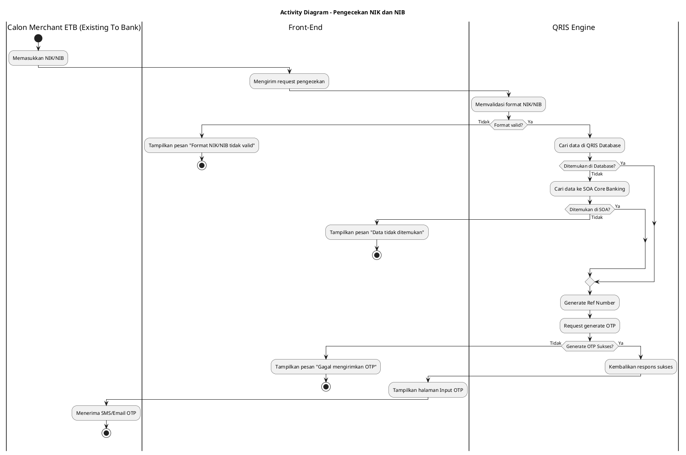
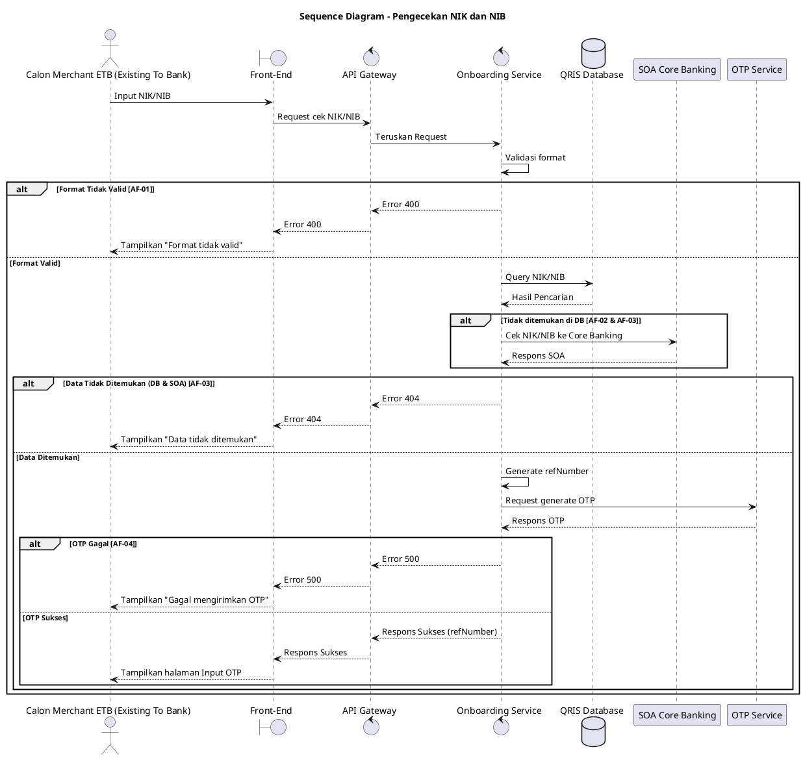

## 3.1 Deskripsi Use Case

**Tabel 1: Deskripsi Use Case Pengecekan NIK dan NIB**

| Elemen Spesifikasi | Deskripsi Detail |
| --- | --- |
| ID Use Case | UC-ONB-003 |
| Nama Use Case | Pengecekan NIK dan NIB |
| Penjelasan Singkat | Validasi data NIK atau NIB Calon Merchant ETB (Existing To Bank) ke database internal dan Core Banking, serta pengiriman OTP. |
| Aktor Utama | Calon Merchant ETB (Existing To Bank) |
| Aktor Pendukung | Onboarding Service, SOA Core Banking, OTP Service |
| Deskripsi Singkat | Calon Merchant ETB (Existing To Bank) memasukkan NIK atau NIB. Sistem memvalidasi data tersebut ke QRIS Database atau SOA Core Banking. Jika ditemukan, sistem melakukan generate reference number dan OTP yang akan dikirimkan ke nomor HP yang terdaftar pada sistem Core Banking dan database, lalu Front-End menampilkan halaman input OTP. |
| Pre-condition | 1. Calon Merchant ETB (Existing To Bank) berada pada halaman awal registrasi. 2. Calon Merchant ETB (Existing To Bank) telah memilih jenis registrasi (Individu atau Badan Usaha). |
| Post-condition | 1. Kode OTP berhasil dikirimkan ke Calon Merchant ETB (Existing To Bank). 2. Front-End menampilkan halaman input OTP beserta Reference Number. |
| Trigger | Calon Merchant ETB (Existing To Bank) memasukkan NIK/NIB dan menekan tombol Lanjut. |
| Nama Tabel | qris_customer |
| Integrasi | 1. **SOA Core Banking:** Mengecek eksistensi NIK/NIB jika tidak ditemukan di sistem lokal. 2. **OTP Service:** Melakukan generate dan pengiriman OTP ke Calon Merchant ETB (Existing To Bank). |
| Asumsi | 1. SOA Core Banking dan OTP Service dalam keadaan aktif dan dapat diakses. |
| Keterbatasan | 1. Pengecekan data NIK dan NIB bergantung pada ketersediaan dan latensi dari layanan SOA Core Banking, sehingga timeout integrasi dapat terjadi jika SOA tidak merespons dalam waktu standar. |
| Aturan Bisnis/Sistem | 1. **Kewajiban Parameter:** NIK diwajibkan untuk jenis registrasi Individu, sedangkan NIB diwajibkan untuk Badan Usaha. |

## 3.2 Main Flow

**Tabel 2: Main Flow Pengecekan NIK dan NIB**

| No. | Aktivitas | Deskripsi |
| ---: | --- | --- |
| 1 | Memasukkan Data | Calon Merchant ETB (Existing To Bank) memasukkan NIK (Individu) atau NIB (Badan Usaha) dan menekan tombol verifikasi. |
| 2 | Mengirimkan Request | Front-End mengirimkan request pengecekan data ke Onboarding Service via API Gateway. |
| 3 | Memvalidasi Format | Onboarding Service memvalidasi format NIK/NIB. |
| 4 | Mencari Data Lokal | Onboarding Service melakukan pengecekan data pada QRIS Database. |
| 5 | Mengonfirmasi Data | Onboarding Service menemukan data pada QRIS Database. |
| 6 | Men-generate Reference | Onboarding Service men-generate `refNumber` unik untuk sesi registrasi. |
| 7 | Mengirim Request OTP | Onboarding Service mengirimkan instruksi generate OTP ke OTP Service. |
| 8 | Men-generate OTP | OTP Service berhasil men-generate OTP dan mengirimkannya ke nomor HP Calon Merchant ETB (Existing To Bank) yang terdaftar pada sistem Core Banking dan database, lalu mengembalikan respons sukses. |
| 9 | Mengembalikan Respons | Onboarding Service mengembalikan respons sukses beserta `refNumber` ke Front-End. |
| 10 | Use Case Selesai | Front-End menampilkan halaman input OTP kepada Calon Merchant ETB (Existing To Bank). |

## 3.3 Alternative Flow

**Tabel 3: Alternative Flow Pengecekan NIK dan NIB**

| Kode | Alternative Flow | Deskripsi |
| --- | --- | --- |
| AF-01 | Format Tidak Valid | Pada langkah 3, apabila format NIK/NIB tidak sesuai, Onboarding Service mengembalikan error dan Front-End menampilkan pesan `Format NIK/NIB tidak valid`. |
| AF-02 | Data Tidak Ada di DB Lokal | Pada langkah 4, apabila Onboarding Service tidak menemukan data di QRIS Database, Onboarding Service meneruskan request ke SOA Core Banking. Jika SOA merespons data ditemukan, alur berlanjut ke langkah 6. |
| AF-03 | Data Tidak Ditemukan | Pada langkah 4 (dalam AF-02), apabila SOA Core Banking merespons data tidak ditemukan, Onboarding Service mengembalikan error dan Front-End menampilkan pesan `Data NIK/NIB tidak ditemukan`. |
| AF-04 | Gagal Generate OTP | Pada langkah 8, apabila OTP Service merespons gagal atau timeout, Onboarding Service mengembalikan error dan Front-End menampilkan pesan `Gagal mengirimkan OTP`. |

## 3.4 Status Frontend

**Tabel 4: Status Frontend Pengecekan NIK dan NIB**

| No. | Nama Status | Deskripsi Tampilan Front-End |
| ---: | --- | --- |
| 1 | LOADING | Ditampilkan saat Front-End menunggu respons pengecekan NIK/NIB dari sistem. |
| 2 | ERROR | Ditampilkan saat format tidak valid, data tidak ditemukan, atau gagal memuat OTP. |
| 3 | SUCCESS | Ditampilkan saat pengecekan berhasil dan Front-End beralih ke halaman input OTP. |

## 3.5 Activity Diagram Pengecekan NIK dan NIB

## 3.6 Sequence Diagram Pengecekan NIK dan NIB

## 3.7 Response Code

**Tabel 5: Response Code Pengecekan NIK dan NIB**

| No. | HTTP Status | Response Code | Nama Response | Deskripsi | Respons Front-End |
| ---: | ---: | --- | --- | --- | --- |
| 1 | 200 | 200XX00 | SUCCESS | Pengecekan berhasil dan OTP dikirim | Berpindah ke halaman input OTP |
| 2 | 400 | 400XX00 | BAD_REQUEST | Format NIK/NIB tidak sesuai | Menampilkan pesan error format |
| 3 | 404 | 404XX00 | NOT_FOUND | Data NIK/NIB tidak ditemukan | Menampilkan pesan data tidak ditemukan |
| 4 | 500 | 500XX00 | INTERNAL_ERROR | Gangguan pada OTP Service | Menampilkan pesan gagal kirim OTP |

## 3.8 Desain Antarmuka

**Tabel 6: Desain Antarmuka Pengecekan NIK dan NIB**

| Halaman | Komponen dan State Utama |
| --- | --- |
| Halaman Registrasi Awal | Field Input NIK/NIB, Tombol Lanjut (State: LOADING, ERROR) |
| Halaman Input OTP | Field Input 6-digit OTP, Label Reference Number |
