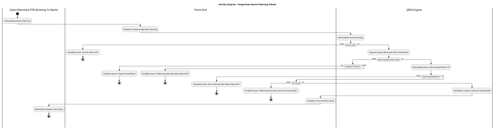
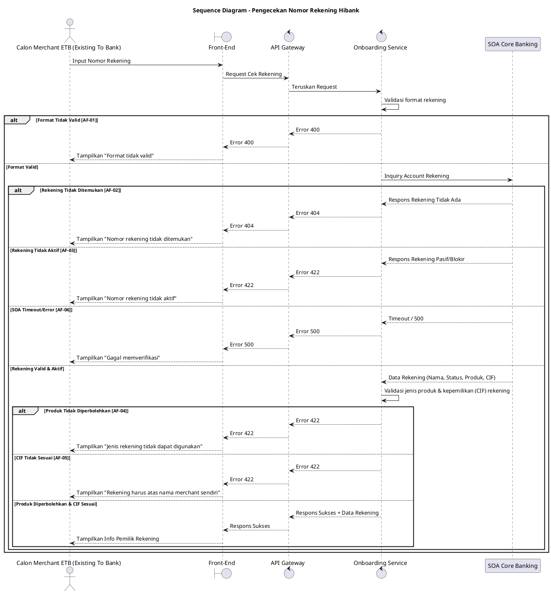

## 5.1 Deskripsi Use Case

**Tabel 1: Deskripsi Use Case Pengecekan Nomor Rekening Hibank**

| Elemen Spesifikasi | Deskripsi Detail |
| --- | --- |
| ID Use Case | UC-ONB-005 |
| Nama Use Case | Pengecekan Nomor Rekening Hibank |
| Penjelasan Singkat | Validasi nomor rekening hibank yang diinputkan Calon Merchant ETB (Existing To Bank) ke Core Banking untuk memastikan rekening valid, aktif, jenis produknya diperbolehkan, dan milik CIF merchant itu sendiri. |
| Aktor Utama | Calon Merchant ETB (Existing To Bank) |
| Aktor Pendukung | Onboarding Service, SOA Core Banking |
| Deskripsi Singkat | Calon Merchant ETB (Existing To Bank) memasukkan nomor rekening hibank ke dalam Front-End. Front-End mengirimkan request ke Onboarding Service via API Gateway. Onboarding Service kemudian melakukan *account inquiry* ke SOA Core Banking. Jika rekening ditemukan dan berstatus aktif, sistem akan memvalidasi apakah jenis produk rekening tersebut diperbolehkan sebagai rekening settlement serta memverifikasi bahwa rekening tersebut terdaftar atas CIF merchant yang mendaftar. Jika semua sesuai, sistem akan mengembalikan nama pemilik rekening (dan data lainnya jika relevan) ke Front-End. |
| Pre-condition | 1. Calon Merchant ETB (Existing To Bank) telah menyelesaikan validasi OTP. 2. Calon Merchant ETB (Existing To Bank) berada pada halaman input data rekening. |
| Post-condition | 1. Nomor rekening terverifikasi sebagai rekening hibank yang valid, aktif, jenis produknya diperbolehkan, dan terdaftar atas CIF merchant itu sendiri. 2. Front-End menampilkan informasi nama pemilik rekening atau tahapan onboarding selanjutnya. |
| Trigger | Calon Merchant ETB (Existing To Bank) memasukkan nomor rekening dan menekan tombol verifikasi. |
| Nama Tabel | - |
| Integrasi | 1. **SOA Core Banking:** Melakukan inquiry untuk memeriksa keabsahan, status, kepemilikan (CIF), dan jenis produk rekening hibank. |
| Asumsi | 1. Layanan SOA Core Banking dalam keadaan aktif dan dapat diakses. |
| Keterbatasan | 1. Validasi ini sangat bergantung pada performa SOA Core Banking. Jika layanan timeout, proses validasi tidak dapat diselesaikan. |
| Aturan Bisnis/Sistem | 1. Rekening yang dimasukkan harus merupakan rekening bank tujuan yang valid (hibank) dan berstatus aktif. 2. **Validasi Produk Rekening:** Hanya nomor rekening dengan jenis produk tertentu (whitelist produk) yang diperbolehkan untuk digunakan sebagai nomor rekening settlement. 3. **Validasi Kepemilikan (CIF):** Rekening yang didaftarkan harus memiliki CIF yang sama dengan CIF Calon Merchant ETB (Existing To Bank) yang sedang mendaftar. Penggunaan rekening milik CIF lain tidak diperbolehkan. |

## 5.2 Main Flow

**Tabel 2: Main Flow Pengecekan Nomor Rekening Hibank**

| No. | Aktivitas | Deskripsi |
| ---: | --- | --- |
| 1 | Memasukkan Rekening | Calon Merchant ETB (Existing To Bank) memasukkan nomor rekening hibank ke form Front-End dan menekan tombol verifikasi. |
| 2 | Mengirimkan Request | Front-End mengirimkan request pengecekan rekening ke Onboarding Service via API Gateway. |
| 3 | Memvalidasi Format | Onboarding Service memvalidasi format dan kelengkapan nomor rekening. |
| 4 | Meneruskan Pengecekan | Onboarding Service melakukan pemanggilan API (Account Inquiry) ke SOA Core Banking. |
| 5 | Merespons Validasi | SOA Core Banking memvalidasi rekening dan mengembalikan data rekening (seperti nama pemilik, status aktif, dan jenis produk) ke Onboarding Service. |
| 6 | Memvalidasi Jenis Produk & CIF | Onboarding Service memvalidasi kesesuaian jenis produk rekening yang dikembalikan SOA terhadap daftar produk yang diperbolehkan (whitelist) untuk settlement, serta memastikan CIF rekening sesuai dengan CIF merchant. |
| 7 | Mengembalikan Respons | Onboarding Service mengembalikan respons sukses beserta data rekening ke Front-End. |
| 8 | Use Case Selesai | Front-End menampilkan nama pemilik rekening atau pesan sukses kepada Calon Merchant ETB (Existing To Bank). |

## 5.3 Alternative Flow

**Tabel 3: Alternative Flow Pengecekan Nomor Rekening Hibank**

| Kode | Alternative Flow | Deskripsi |
| --- | --- | --- |
| AF-01 | Format Tidak Valid | Pada langkah 3, apabila format nomor rekening tidak sesuai (misal: kurang digit atau mengandung huruf), Onboarding Service mengembalikan error dan Front-End menampilkan pesan `Format rekening tidak valid`. |
| AF-02 | Rekening Tidak Ditemukan | Pada langkah 5, apabila SOA Core Banking merespons rekening tidak ditemukan, Onboarding Service mengembalikan error dan Front-End menampilkan pesan `Nomor rekening tidak ditemukan`. |
| AF-03 | Rekening Tidak Aktif | Pada langkah 5, apabila SOA Core Banking merespons rekening berstatus tidak aktif/blokir, Onboarding Service mengembalikan error dan Front-End menampilkan pesan `Nomor rekening tidak aktif`. |
| AF-04 | Produk Rekening Tidak Diperbolehkan | Pada langkah 6, apabila jenis produk rekening tidak termasuk dalam daftar produk yang diperbolehkan untuk settlement, Onboarding Service mengembalikan error dan Front-End menampilkan pesan `Jenis rekening tidak dapat digunakan sebagai rekening settlement`. |
| AF-05 | Kepemilikan Rekening (CIF) Tidak Sesuai | Pada langkah 6, apabila CIF rekening yang dikembalikan SOA tidak cocok dengan CIF merchant, Onboarding Service mengembalikan error dan Front-End menampilkan pesan `Rekening yang digunakan harus atas nama merchant sendiri`. |
| AF-06 | Gangguan Integrasi SOA | Pada langkah 5, apabila SOA Core Banking mengalami timeout atau gangguan, Onboarding Service mengembalikan error dan Front-End menampilkan pesan `Gagal memverifikasi rekening, silakan coba lagi`. |

## 5.4 Status Frontend

**Tabel 4: Status Frontend Pengecekan Nomor Rekening Hibank**

| No. | Nama Status | Deskripsi Tampilan Front-End |
| ---: | --- | --- |
| 1 | LOADING | Ditampilkan saat Front-End menunggu respons pengecekan rekening dari sistem. |
| 2 | ERROR | Ditampilkan saat rekening tidak valid, tidak ditemukan, tidak aktif, jenis produk tidak didukung, CIF tidak sesuai, atau terjadi gangguan. |
| 3 | SUCCESS | Ditampilkan saat rekening valid dan sistem berhasil menampilkan nama pemilik rekening (opsional lanjut otomatis). |

## 5.5 Activity Diagram Pengecekan Nomor Rekening Hibank

## 5.6 Sequence Diagram Pengecekan Nomor Rekening Hibank

## 5.7 Response Code

**Tabel 5: Response Code Pengecekan Nomor Rekening Hibank**

| No. | HTTP Status | Response Code | Nama Response | Deskripsi | Respons Front-End |
| ---: | ---: | --- | --- | --- | --- |
| 1 | 200 | 200XX00 | SUCCESS | Pengecekan rekening berhasil | Menampilkan nama pemilik rekening / halaman selanjutnya |
| 2 | 400 | 400XX00 | INVALID_FORMAT | Format rekening tidak valid | Menampilkan pesan format tidak sesuai |
| 3 | 404 | 404XX00 | ACCOUNT_NOT_FOUND | Rekening tidak ditemukan di Core Banking | Menampilkan pesan rekening tidak ditemukan |
| 4 | 422 | 422XX00 | ACCOUNT_INACTIVE | Rekening dalam kondisi pasif atau blokir | Menampilkan pesan rekening tidak aktif |
| 5 | 422 | 422XX01 | INVALID_PRODUCT | Jenis produk rekening tidak termasuk whitelist settlement | Menampilkan pesan jenis rekening tidak dapat digunakan |
| 6 | 422 | 422XX02 | INVALID_CIF_OWNERSHIP | CIF rekening tidak sesuai dengan CIF merchant | Menampilkan pesan rekening harus atas nama merchant sendiri |
| 7 | 500 | 500XX00 | INTEGRATION_ERROR | Gangguan saat memanggil SOA Core Banking | Menampilkan pesan gagal verifikasi |

## 5.8 Desain Antarmuka

**Tabel 6: Desain Antarmuka Pengecekan Nomor Rekening Hibank**

| Halaman | Komponen dan State Utama |
| --- | --- |
| Halaman Cek Rekening | Field Input Nomor Rekening, Tombol Cek/Verifikasi (State: LOADING, ERROR), Label Nama Pemilik (muncul saat sukses). |
