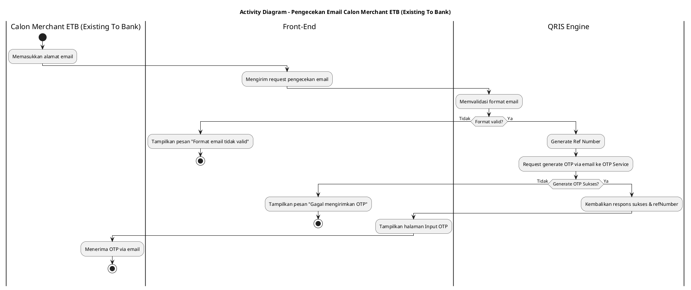
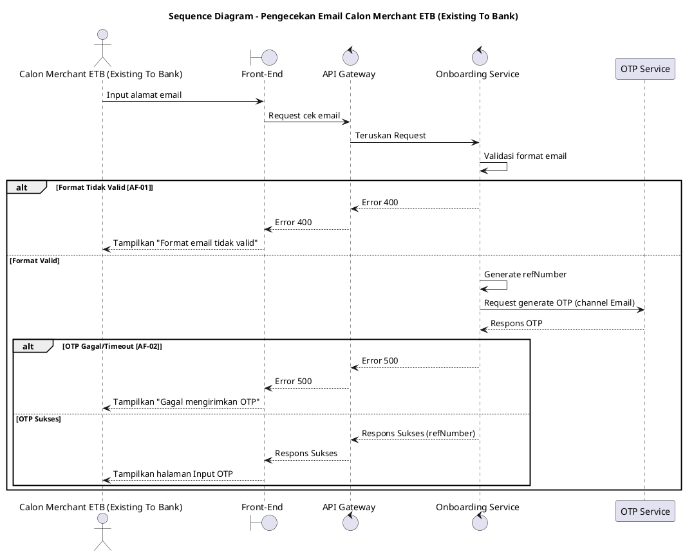

## 6.1 Deskripsi Use Case

**Tabel 1: Deskripsi Use Case Pengecekan Email Calon Merchant ETB (Existing To Bank)**

| Elemen Spesifikasi | Deskripsi Detail |
| --- | --- |
| ID Use Case | UC-ONB-006 |
| Nama Use Case | Pengecekan Email Calon Merchant ETB (Existing To Bank) |
| Penjelasan Singkat | Pengecekan dan validasi alamat email Calon Merchant ETB (Existing To Bank) dilanjutkan dengan pengiriman OTP ke email tersebut. |
| Aktor Utama | Calon Merchant ETB (Existing To Bank) |
| Aktor Pendukung | Onboarding Service, OTP Service |
| Deskripsi Singkat | Calon Merchant ETB (Existing To Bank) memasukkan alamat email pada Front-End. Sistem melakukan validasi format email. Jika valid, Onboarding Service men-generate reference number dan mengirimkan request pembuatan OTP ke OTP Service. Setelah OTP berhasil dikirim ke email, Front-End mengarahkan merchant ke halaman input OTP. |
| Pre-condition | 1. Calon Merchant ETB (Existing To Bank) berada pada form pengisian email. |
| Post-condition | 1. Kode OTP berhasil dikirimkan ke email Calon Merchant ETB (Existing To Bank). 2. Front-End menampilkan halaman input OTP beserta Reference Number. |
| Trigger | Calon Merchant ETB (Existing To Bank) memasukkan alamat email dan menekan tombol verifikasi. |
| Nama Tabel | - |
| Integrasi | 1. **OTP Service:** Melakukan generate dan pengiriman OTP melalui channel email. |
| Asumsi | 1. OTP Service dalam keadaan aktif dan dapat mengirim email dengan lancar. |
| Keterbatasan | 1. Pengiriman email dapat mengalami keterlambatan (delay) tergantung dari provider email tujuan. |
| Aturan Bisnis/Sistem | 1. **Format:** Email harus memiliki format yang valid sesuai standar (misal mengandung `@` dan `.`). 2. **Reference Number:** Sistem wajib men-generate `refNumber` baru setiap kali request OTP berhasil dibuat. |

## 6.2 Main Flow

**Tabel 2: Main Flow Pengecekan Email Calon Merchant ETB (Existing To Bank)**

| No. | Aktivitas | Deskripsi |
| ---: | --- | --- |
| 1 | Memasukkan Email | Calon Merchant ETB (Existing To Bank) memasukkan alamat email dan menekan tombol verifikasi. |
| 2 | Mengirimkan Request | Front-End mengirimkan request pengecekan email ke Onboarding Service via API Gateway. |
| 3 | Memvalidasi Format | Onboarding Service memvalidasi format email yang dimasukkan. |
| 4 | Men-generate Reference | Onboarding Service men-generate `refNumber` unik untuk keperluan validasi OTP. |
| 5 | Mengirim Request OTP | Onboarding Service mengirimkan instruksi generate OTP (channel email) ke OTP Service. |
| 6 | Men-generate OTP | OTP Service men-generate OTP dan mengirimkannya ke alamat email Calon Merchant ETB (Existing To Bank), lalu mengembalikan respons sukses ke Onboarding Service. |
| 7 | Mengembalikan Respons | Onboarding Service mengembalikan respons sukses beserta `refNumber` ke Front-End. |
| 8 | Use Case Selesai | Front-End beralih ke halaman input OTP untuk memasukkan kode yang dikirim ke email. |

## 6.3 Alternative Flow

**Tabel 3: Alternative Flow Pengecekan Email Calon Merchant ETB (Existing To Bank)**

| Kode | Alternative Flow | Deskripsi |
| --- | --- | --- |
| AF-01 | Format Tidak Valid | Pada langkah 3, apabila format email tidak sesuai standar, Onboarding Service mengembalikan error dan Front-End menampilkan pesan `Format email tidak valid`. |
| AF-02 | Gagal Generate OTP | Pada langkah 6, apabila OTP Service merespons gagal atau timeout saat mencoba mengirim email, Onboarding Service mengembalikan error dan Front-End menampilkan pesan `Gagal mengirimkan kode OTP ke email, silakan coba lagi`. |

## 6.4 Status Frontend

**Tabel 4: Status Frontend Pengecekan Email Calon Merchant ETB (Existing To Bank)**

| No. | Nama Status | Deskripsi Tampilan Front-End |
| ---: | --- | --- |
| 1 | LOADING | Ditampilkan saat Front-End menunggu respons pengecekan dan pengiriman email dari sistem. |
| 2 | ERROR | Ditampilkan saat format email tidak valid atau sistem gagal mengirimkan OTP. |
| 3 | SUCCESS | Ditampilkan saat proses sukses dan sistem berpindah ke halaman input OTP. |

## 6.5 Activity Diagram Pengecekan Email Calon Merchant ETB (Existing To Bank)

## 6.6 Sequence Diagram Pengecekan Email Calon Merchant ETB (Existing To Bank)

## 6.7 Response Code

**Tabel 5: Response Code Pengecekan Email Calon Merchant ETB (Existing To Bank)**

| No. | HTTP Status | Response Code | Nama Response | Deskripsi | Respons Front-End |
| ---: | ---: | --- | --- | --- | --- |
| 1 | 200 | 200XX00 | SUCCESS | Pengecekan berhasil dan OTP dikirim ke email | Berpindah ke halaman input OTP email |
| 2 | 400 | 400XX00 | BAD_REQUEST | Format email tidak sesuai | Menampilkan pesan error format tidak valid |
| 3 | 500 | 500XX00 | INTERNAL_ERROR | Gangguan pada OTP Service | Menampilkan pesan gagal kirim OTP |

## 6.8 Desain Antarmuka

**Tabel 6: Desain Antarmuka Pengecekan Email Calon Merchant ETB (Existing To Bank)**

| Halaman | Komponen dan State Utama |
| --- | --- |
| Halaman Input Email | Field Input Email, Tombol Verifikasi/Lanjut (State: LOADING, ERROR) |
| Halaman Input OTP | Field Input OTP Email, Label Reference Number |
