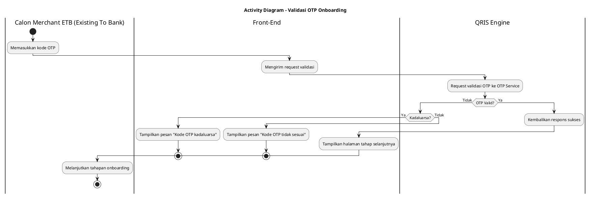
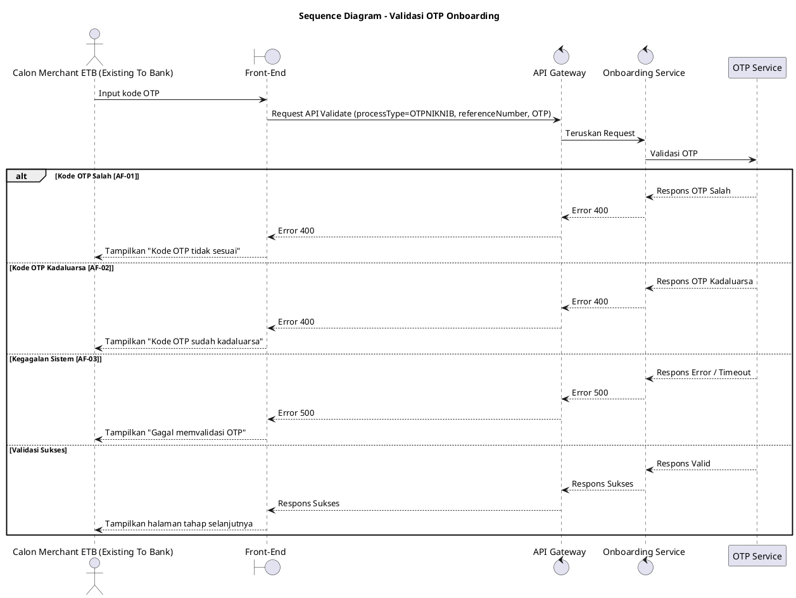

## 4.1 Deskripsi Use Case

**Tabel 1: Deskripsi Use Case Validasi OTP Onboarding**

| Elemen Spesifikasi | Deskripsi Detail |
| --- | --- |
| ID Use Case | UC-ONB-004 |
| Nama Use Case | Validasi OTP Onboarding |
| Penjelasan Singkat | Validasi kode OTP yang diinputkan Calon Merchant ETB (Existing To Bank) ke sistem backend (OTP Service) berdasarkan reference number. |
| Aktor Utama | Calon Merchant ETB (Existing To Bank) |
| Aktor Pendukung | Onboarding Service, OTP Service |
| Deskripsi Singkat | Calon Merchant ETB (Existing To Bank) menerima kode OTP via nomor HP dan memasukkannya ke Front-End. Front-End mengirimkan request ke Onboarding Service via API Gateway dengan menyertakan `processType=OTPNIKNIB`, `referenceNumber`, dan kode OTP. Sistem memvalidasi kode OTP tersebut melalui API validate ke OTP Service. Jika valid, sistem mencatat status dan mengarahkan Calon Merchant ETB (Existing To Bank) ke halaman selanjutnya. |
| Pre-condition | 1. Calon Merchant ETB (Existing To Bank) telah menerima kode OTP via nomor HP. 2. Calon Merchant ETB (Existing To Bank) berada pada halaman input OTP. |
| Post-condition | 1. Kode OTP berhasil divalidasi. 2. Front-End menampilkan halaman tahapan onboarding berikutnya. |
| Trigger | Calon Merchant ETB (Existing To Bank) memasukkan kode OTP dan menekan tombol verifikasi. |
| Nama Tabel | - |
| Integrasi | 1. **OTP Service:** Memvalidasi kode OTP yang dimasukkan berdasarkan reference number yang ada. |
| Asumsi | 1. OTP Service dalam keadaan aktif dan dapat diakses. |
| Keterbatasan | 1. Proses validasi OTP bergantung pada ketersediaan OTP Service, jika layanan timeout atau gangguan maka proses onboarding akan tertahan. |
| Aturan Bisnis/Sistem | 1. **Kewajiban Parameter:** Request validasi wajib mengirimkan `processType=OTPNIKNIB`, `referenceNumber`, dan kode OTP. |

## 4.2 Main Flow

**Tabel 2: Main Flow Validasi OTP Onboarding**

| No. | Aktivitas | Deskripsi |
| ---: | --- | --- |
| 1 | Memasukkan OTP | Calon Merchant ETB (Existing To Bank) memasukkan kode OTP ke form dan menekan tombol verifikasi. |
| 2 | Mengirimkan Request | Front-End mengirimkan request validasi OTP dengan `processType=OTPNIKNIB`, `referenceNumber`, dan kode OTP ke Onboarding Service via API Gateway. |
| 3 | Meneruskan Request Validasi | Onboarding Service meneruskan request validasi OTP ke OTP Service. |
| 4 | Memvalidasi OTP | OTP Service melakukan pengecekan kesesuaian kode OTP terhadap `referenceNumber` dan `processType`. |
| 5 | Mengonfirmasi Validasi | OTP Service mengonfirmasi bahwa kode OTP valid dan mengembalikan respons sukses ke Onboarding Service. |
| 6 | Mengembalikan Respons | Onboarding Service mengembalikan respons sukses ke Front-End. |
| 7 | Use Case Selesai | Front-End menampilkan pesan sukses dan beralih ke halaman tahapan onboarding selanjutnya kepada Calon Merchant ETB (Existing To Bank). |

## 4.3 Alternative Flow

**Tabel 3: Alternative Flow Validasi OTP Onboarding**

| Kode | Alternative Flow | Deskripsi |
| --- | --- | --- |
| AF-01 | Kode OTP Tidak Sesuai | Pada langkah 4, apabila OTP Service merespons kode OTP tidak sesuai, Onboarding Service mengembalikan error dan Front-End menampilkan pesan `Kode OTP tidak sesuai`. |
| AF-02 | Kode OTP Kadaluarsa | Pada langkah 4, apabila OTP Service merespons kode OTP telah melewati batas waktu (kadaluarsa), Onboarding Service mengembalikan error dan Front-End menampilkan pesan `Kode OTP sudah kadaluarsa`. |
| AF-03 | Gagal Validasi OTP | Pada langkah 4, apabila OTP Service merespons gagal atau timeout, Onboarding Service mengembalikan error dan Front-End menampilkan pesan `Gagal memvalidasi OTP`. |

## 4.4 Status Frontend

**Tabel 4: Status Frontend Validasi OTP Onboarding**

| No. | Nama Status | Deskripsi Tampilan Front-End |
| ---: | --- | --- |
| 1 | LOADING | Ditampilkan saat Front-End menunggu respons validasi OTP dari sistem. |
| 2 | ERROR | Ditampilkan saat kode OTP salah, kadaluarsa, atau gangguan pada sistem validasi. |
| 3 | SUCCESS | Ditampilkan saat validasi berhasil dan Front-End beralih ke halaman tahapan onboarding selanjutnya. |

## 4.5 Activity Diagram Validasi OTP Onboarding

## 4.6 Sequence Diagram Validasi OTP Onboarding

## 4.7 Response Code

**Tabel 5: Response Code Validasi OTP Onboarding**

| No. | HTTP Status | Response Code | Nama Response | Deskripsi | Respons Front-End |
| ---: | ---: | --- | --- | --- | --- |
| 1 | 200 | 200XX00 | SUCCESS | Validasi OTP berhasil | Berpindah ke halaman tahap selanjutnya |
| 2 | 400 | 400XX01 | INVALID_OTP | Kode OTP tidak sesuai | Menampilkan pesan error OTP tidak sesuai |
| 3 | 400 | 400XX02 | EXPIRED_OTP | Kode OTP kadaluarsa | Menampilkan pesan error OTP kadaluarsa |
| 4 | 500 | 500XX00 | INTERNAL_ERROR | Gangguan pada OTP Service | Menampilkan pesan gagal validasi OTP |

## 4.8 Desain Antarmuka

**Tabel 6: Desain Antarmuka Validasi OTP Onboarding**

| Halaman | Komponen dan State Utama |
| --- | --- |
| Halaman Input OTP | Field Input 6-digit OTP, Label Reference Number, Tombol Verifikasi (State: LOADING, ERROR) |
