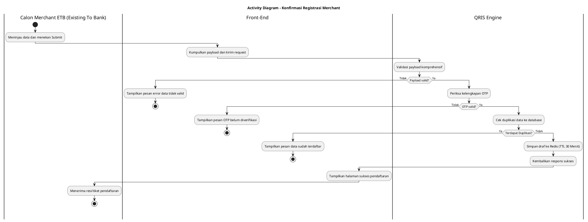
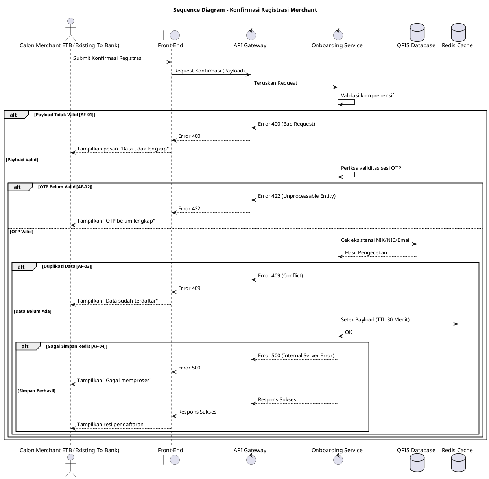

## 7.1 Deskripsi Use Case

**Tabel 1: Deskripsi Use Case Konfirmasi Registrasi Merchant**

| Elemen Spesifikasi | Deskripsi Detail |
| --- | --- |
| ID Use Case | UC-ONB-007 |
| Nama Use Case | Konfirmasi Registrasi Merchant |
| Penjelasan Singkat | Proses konfirmasi (inquiry) draf permohonan registrasi, validasi payload secara komprehensif, pengecekan duplikasi, dan penyimpanan sementara ke Redis. |
| Aktor Utama | Calon Merchant ETB (Existing To Bank) |
| Aktor Pendukung | Onboarding Service, Redis |
| Deskripsi Singkat | Calon Merchant ETB (Existing To Bank) meninjau seluruh data registrasi di Web Portal Onboarding dan melakukan konfirmasi pendaftaran. Sistem akan memvalidasi payload secara komprehensif, memeriksa kelengkapan status OTP, dan mengecek duplikasi data (seperti NIK/NIB) ke database. Jika valid, sistem menyimpan data tersebut ke dalam Redis secara sementara (selama 30 menit) guna mencegah manipulasi (*data injection*) sebelum persetujuan akhir atau pengiriman ke database utama. |
| Pre-condition | 1. Calon Merchant ETB (Existing To Bank) telah melengkapi seluruh tahapan pengisian data dan verifikasi. 2. Calon Merchant ETB (Existing To Bank) berada di halaman ringkasan/konfirmasi pendaftaran. |
| Post-condition | 1. Payload draf registrasi tervalidasi dengan sukses. 2. Data registrasi terkunci dan tersimpan sementara di Redis (TTL 30 menit). 3. Front-End menampilkan tiket atau halaman status berhasil dikirim. |
| Trigger | Calon Merchant ETB (Existing To Bank) menekan tombol submit pada halaman konfirmasi registrasi. |
| Nama Tabel | Redis Cache |
| Integrasi | 1. **Redis:** Digunakan untuk menyimpan payload bersih registrasi dengan masa kedaluwarsa 30 menit. |
| Asumsi | 1. Layanan Redis aktif dan dapat diakses dengan cepat. |
| Keterbatasan | 1. Sesi draf pada Redis hanya bertahan 30 menit; jika sistem tidak segera melanjutkan ke tahap *submission* akhir dalam jeda tersebut, maka data registrasi akan hangus. |
| Aturan Bisnis/Sistem | 1. **Validasi Komprehensif:** Sistem wajib memeriksa seluruh parameter (mandatory field, panjang string, format) dari payload registrasi. 2. **Verifikasi OTP:** Sistem memastikan bahwa OTP (HP dan Email) telah tervalidasi sebelumnya. 3. **Anti Duplikasi:** Tidak diperbolehkan mendaftarkan NIK atau NIB yang sama apabila sudah terdaftar berstatus aktif di database. 4. **Anti Injection:** Data yang telah diverifikasi ini tidak langsung disimpan ke database utama, melainkan ke Redis untuk membekukan *state* pendaftaran. |

## 7.2 Main Flow

**Tabel 2: Main Flow Konfirmasi Registrasi Merchant**

| No. | Aktivitas | Deskripsi |
| ---: | --- | --- |
| 1 | Menekan Submit | Calon Merchant ETB (Existing To Bank) menekan tombol konfirmasi/submit pendaftaran setelah meninjau ringkasan data di Web Portal. |
| 2 | Mengirimkan Payload | Web Portal (Front-End) mengirimkan request berisi seluruh payload registrasi ke Onboarding Service via API Gateway. |
| 3 | Memvalidasi Payload | Onboarding Service melakukan validasi komprehensif terhadap format dan kelengkapan data. |
| 4 | Memeriksa Status OTP | Onboarding Service memverifikasi apakah status konfirmasi OTP pada sesi ini sudah sah/lengkap. |
| 5 | Mengecek Duplikasi | Onboarding Service memeriksa eksistensi NIK/NIB atau data unik lainnya ke *QRIS Database*. |
| 6 | Menyimpan ke Redis | Onboarding Service menyimpan payload yang tervalidasi tersebut ke dalam Redis dengan masa kedaluwarsa (TTL) 30 menit. |
| 7 | Mengembalikan Respons | Onboarding Service mengembalikan respons sukses ke Web Portal. |
| 8 | Use Case Selesai | Web Portal menampilkan halaman pemberitahuan sukses pendaftaran kepada Calon Merchant ETB (Existing To Bank). |

## 7.3 Alternative Flow

**Tabel 3: Alternative Flow Konfirmasi Registrasi Merchant**

| Kode | Alternative Flow | Deskripsi |
| --- | --- | --- |
| AF-01 | Payload Tidak Valid | Pada langkah 3, apabila terdapat parameter wajib yang kosong atau format tidak sesuai aturan, Onboarding Service mengembalikan error dan Front-End menampilkan pesan `Data registrasi tidak lengkap atau salah format`. |
| AF-02 | Verifikasi OTP Belum Lengkap | Pada langkah 4, apabila status OTP belum terverifikasi secara sempurna, Onboarding Service mengembalikan error dan Front-End menampilkan pesan `Silakan selesaikan tahapan verifikasi OTP terlebih dahulu`. |
| AF-03 | Ditemukan Duplikasi Data | Pada langkah 5, apabila sistem mendeteksi NIK/NIB sudah terdaftar pada database, Onboarding Service mengembalikan error dan Front-End menampilkan pesan `Data merchant (NIK/NIB) sudah terdaftar sebelumnya`. |
| AF-04 | Gagal Menyimpan ke Redis | Pada langkah 6, apabila koneksi atau proses penyimpanan ke Redis gagal, Onboarding Service mengembalikan error dan Front-End menampilkan pesan `Terjadi gangguan sistem saat memproses data, silakan coba beberapa saat lagi`. |

## 7.4 Status Frontend

**Tabel 4: Status Frontend Konfirmasi Registrasi Merchant**

| No. | Nama Status | Deskripsi Tampilan Front-End |
| ---: | --- | --- |
| 1 | LOADING | Ditampilkan saat Front-End mengirim dan menunggu hasil validasi payload dari sistem. |
| 2 | ERROR | Ditampilkan saat validasi gagal (format salah, duplikasi, belum OTP, atau kendala Redis). |
| 3 | SUCCESS | Ditampilkan saat sistem berhasil mengunci data di Redis dan pindah ke halaman resi pendaftaran. |

## 7.5 Activity Diagram Konfirmasi Registrasi Merchant

## 7.6 Sequence Diagram Konfirmasi Registrasi Merchant

## 7.7 Response Code

**Tabel 5: Response Code Konfirmasi Registrasi Merchant**

| No. | HTTP Status | Response Code | Nama Response | Deskripsi | Respons Front-End |
| ---: | ---: | --- | --- | --- | --- |
| 1 | 200 | 200XX00 | SUCCESS | Validasi sukses dan draf disimpan ke Redis | Menampilkan halaman konfirmasi sukses |
| 2 | 400 | 400XX00 | BAD_REQUEST | Payload data tidak lengkap atau format salah | Menampilkan pesan error validasi data |
| 3 | 409 | 409XX00 | CONFLICT | NIK/NIB/Email Calon Merchant ETB (Existing To Bank) sudah terdaftar | Menampilkan pesan error data sudah ada |
| 4 | 422 | 422XX00 | UNPROCESSABLE | OTP belum terverifikasi dengan lengkap | Menampilkan pesan lengkapi verifikasi OTP |
| 5 | 500 | 500XX00 | INTERNAL_ERROR | Gagal menyimpan sesi pendaftaran ke Redis | Menampilkan pesan error gangguan sistem |

## 7.8 Desain Antarmuka

**Tabel 6: Desain Antarmuka Konfirmasi Registrasi Merchant**

| Halaman | Komponen dan State Utama |
| --- | --- |
| Halaman Ringkasan Data | List data yang telah diinput, Checkbox persetujuan, Tombol Submit/Konfirmasi (State: LOADING, ERROR) |
| Halaman Sukses | Tiket pendaftaran, Nomor Referensi, Pesan sukses menunggu persetujuan |
