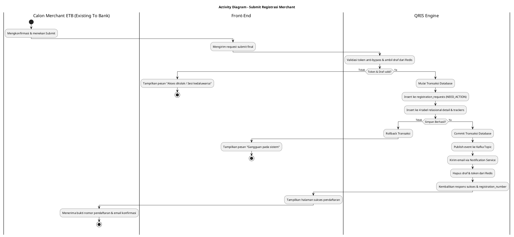
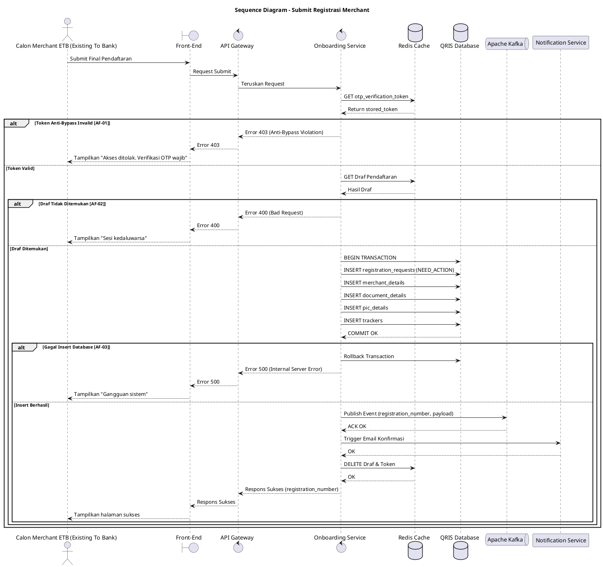

## 8.1 Deskripsi Use Case

**Tabel 1: Deskripsi Use Case Submit Registrasi Merchant**

| Elemen Spesifikasi | Deskripsi Detail |
| --- | --- |
| ID Use Case | UC-ONB-008 |
| Nama Use Case | Submit Registrasi Merchant |
| Penjelasan Singkat | Proses pengiriman (submit) final data pendaftaran merchant yang memvalidasi token anti-bypass, memindahkan draf dari Redis ke database utama, memublikasikan event Kafka, dan mengirim notifikasi email. |
| Aktor Utama | Calon Merchant ETB (Existing To Bank) |
| Aktor Pendukung | Onboarding Service, Redis, Apache Kafka, Notification Service |
| Deskripsi Singkat | Calon Merchant ETB (Existing To Bank) telah mengkonfirmasi pada halaman akhir, lalu menekan tombol submit final. Front-End mengirimkan request ke Onboarding Service beserta token anti-bypass. Sistem memverifikasi token tersebut di Redis, lalu mengambil draf pendaftaran. Setelah itu, sistem secara transaksional menyimpan data ke dalam 4 tabel utama dengan status `NEED_ACTION`. Jika berhasil, sistem memublikasikan event ke Kafka, memicu Notification Service untuk mengirim email berisi `registration_number`, lalu menghapus draf dan token di Redis. |
| Pre-condition | 1. Calon Merchant ETB (Existing To Bank) telah memiliki draf pendaftaran yang terkunci dan tersimpan di Redis. 2. Sistem memiliki `otp_verification_token` yang valid di Redis. |
| Post-condition | 1. Data registrasi merchant secara permanen tersimpan di database utama dengan status `NEED_ACTION`. 2. Event pendaftaran dipublikasikan ke Kafka Topic `hibank.qris.merchant.onboarding.submitted`. 3. Email konfirmasi pendaftaran dikirimkan via Notification Service. 4. Draf sementara dan token di Redis telah dihapus. 5. Front-End menampilkan layar kesuksesan dengan `registration_number`. |
| Trigger | Calon Merchant ETB (Existing To Bank) telah mengkonfirmasi dan menekan tombol submit. |
| Nama Tabel | `registration_requests`, `registration_request_merchant_details`, `registration_request_merchant_document_details`, `registration_request_merchant_pic_details`, `registration_request_trackers` |
| Integrasi | 1. **Redis:** Validasi `otp_verification_token` dan mengambil payload draf. 2. **Apache Kafka:** Publikasi event registrasi sukses. 3. **Notification Service:** Mengirimkan email konfirmasi pendaftaran. |
| Asumsi | 1. Struktur draf di Redis valid dan koneksi ke layanan Kafka serta Notification Service beroperasi normal. |
| Keterbatasan | 1. Proses penyimpanan ke database bergantung pada ketersediaan sistem. Jika ada kegagalan, transaksi akan dibatalkan. |
| Aturan Bisnis/Sistem | 1. **Anti-Bypass OTP Token:** Endpoint submit WAJIB memvalidasi dan mengonsumsi `otp_verification_token`. Request tanpa token sah ditolak secara permanen. 2. **Transaksi Atomik & Status Awal:** Penyimpanan data wajib dilakukan secara atomis ke tabel utama dan relasinya dengan memasukkan status awal `registration_status = 'NEED_ACTION'`. Apabila ada insert gagal, seluruh proses di-*rollback*. 3. **Kafka Event Publication:** Setelah transaksi database dikomit, Onboarding Service WAJIB memublikasikan event payload ke Kafka Topic `hibank.qris.merchant.onboarding.submitted`. 4. **Notification Service:** Sistem wajib memicu Notification Service untuk mengirimkan email konfirmasi berisi `registration_number` ke Calon Merchant ETB (Existing To Bank). 5. **Pembersihan Sesi:** Sistem menghapus draf dan token di Redis setelah proses registrasi berhasil selesai. |

## 8.2 Main Flow

**Tabel 2: Main Flow Submit Registrasi Merchant**

| No. | Aktivitas | Deskripsi |
| ---: | --- | --- |
| 1 | Mengkonfirmasi | Calon Merchant ETB (Existing To Bank) telah mengkonfirmasi dan menekan tombol submit akhir di Front-End. |
| 2 | Mengirimkan Request | Front-End mengirimkan request submit pendaftaran ke Onboarding Service via API Gateway beserta token anti-bypass. |
| 3 | Memvalidasi Token & Mengambil Draf | Onboarding Service memverifikasi keabsahan `otp_verification_token` dan menarik draf registrasi dari Redis berdasarkan identifier sesi. |
| 4 | Menyimpan Data Utama | Onboarding Service memulai transaksi database dan menyimpan data utama ke tabel `registration_requests` dengan status `NEED_ACTION`. |
| 5 | Menyimpan Data Relasional | Onboarding Service menyimpan detail informasi ke tabel `registration_request_merchant_details`, `registration_request_merchant_document_details`, `registration_request_merchant_pic_details`, dan jejak status ke `registration_request_trackers`. |
| 6 | Memublikasikan Event | Onboarding Service memublikasikan event pendaftaran ke Kafka Topic `hibank.qris.merchant.onboarding.submitted` secara asinkron. |
| 7 | Mengirim Notifikasi Email | Onboarding Service memicu Notification Service untuk mengirimkan email konfirmasi pendaftaran berisi `registration_number`. |
| 8 | Menghapus Data Redis | Setelah berhasil, Onboarding Service menghapus (invalidate) data draf dan token anti-bypass dari Redis. |
| 9 | Mengembalikan Respons | Onboarding Service mengembalikan respons sukses beserta `registration_number` ke Front-End. |
| 10 | Use Case Selesai | Front-End menampilkan halaman status selesai pendaftaran kepada Calon Merchant ETB (Existing To Bank). |

## 8.3 Alternative Flow

**Tabel 3: Alternative Flow Submit Registrasi Merchant**

| Kode | Alternative Flow | Deskripsi |
| --- | --- | --- |
| AF-01 | Indikasi Bypass OTP | Pada langkah 3, apabila token anti-bypass tidak valid, tidak disertakan, atau sudah kedaluwarsa, Onboarding Service menolak akses dan Front-End menampilkan pesan `Akses ditolak. Verifikasi OTP wajib dilakukan sebelum mendaftar`. |
| AF-02 | Draf Tidak Ditemukan | Pada langkah 3, apabila draf pendaftaran di Redis tidak ditemukan, Onboarding Service mengembalikan error dan Front-End menampilkan pesan `Sesi pendaftaran telah kedaluwarsa, silakan ulangi proses dari awal`. |
| AF-03 | Gagal Simpan Database | Pada langkah 4 atau 5, apabila terjadi kegagalan saat menyimpan (insert) ke tabel, Onboarding Service melakukan *rollback* transaksi, mengembalikan error, dan Front-End menampilkan pesan `Terjadi gangguan pada sistem, silakan coba beberapa saat lagi`. |
| AF-04 | Timeout Integrasi Kafka / Notifikasi | Pada langkah 6 atau 7, apabila koneksi ke Kafka atau Notification Service mengalami gangguan, sistem mencatat kegagalan di log namun (opsional) tetap mengembalikan sukses pendaftaran atau menampilkan pesan peringatan. |

## 8.4 Status Frontend

**Tabel 4: Status Frontend Submit Registrasi Merchant**

| No. | Nama Status | Deskripsi Tampilan Front-End |
| ---: | --- | --- |
| 1 | LOADING | Ditampilkan saat Front-End mengirim instruksi submit dan menunggu proses penyimpanan, Kafka, dan notifikasi. |
| 2 | ERROR | Ditampilkan jika terjadi indikasi bypass OTP, draf kedaluwarsa, atau gangguan database. |
| 3 | SUCCESS | Ditampilkan ketika pendaftaran sudah terekam sempurna dan menampilkan nomor pendaftaran (`registration_number`). |

## 8.5 Activity Diagram Submit Registrasi Merchant

## 8.6 Sequence Diagram Submit Registrasi Merchant

## 8.7 Response Code

**Tabel 5: Response Code Submit Registrasi Merchant**

| No. | HTTP Status | Response Code | Nama Response | Deskripsi | Respons Front-End |
| ---: | ---: | --- | --- | --- | --- |
| 1 | 200 | 200XX00 | SUCCESS | Submit registrasi sukses, memublikasikan event, & kirim notifikasi | Menampilkan halaman akhir bukti pendaftaran |
| 2 | 400 | 400XX00 | DRAFT_NOT_FOUND | Sesi pendaftaran tidak ditemukan atau kedaluwarsa di Redis | Menampilkan pesan error sesi habis |
| 3 | 403 | 403XX00 | ANTI_BYPASS_VIOLATION | Permintaan dikirim tanpa `otp_verification_token` yang sah | Menampilkan pesan akses ditolak |
| 4 | 500 | 500XX00 | DATABASE_ERROR | Gagal transaksi penyisipan data ke DB | Menampilkan pesan gangguan saat menyimpan |

## 8.8 Desain Antarmuka

**Tabel 6: Desain Antarmuka Submit Registrasi Merchant**

| Halaman | Komponen dan State Utama |
| --- | --- |
| Halaman Persetujuan | Tombol Submit Akhir (State: LOADING, ERROR) |
| Halaman Sukses Final | Teks ucapan terima kasih, Nomor Pendaftaran (`registration_number`), Banner Informasi Pengiriman Email |
