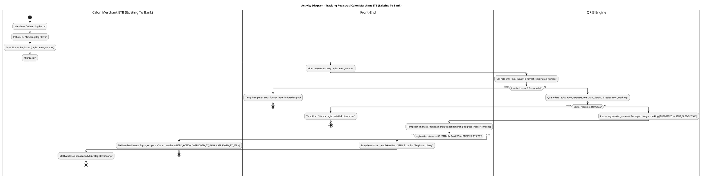
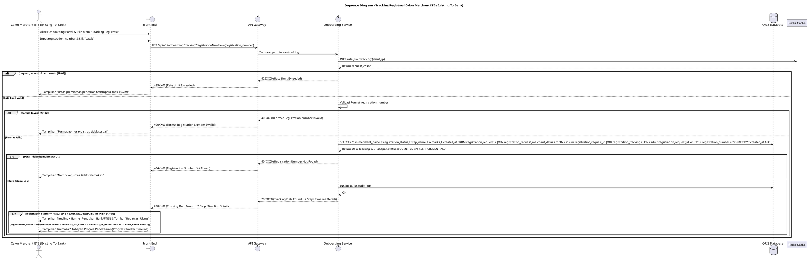

# 1 Deskripsi Use Case

**Tabel 1: Deskripsi Use Case Tracking Registrasi Calon Merchant ETB (Existing To Bank)**

| Elemen Spesifikasi | Deskripsi Detail |
| --- | --- |
| ID Use Case | UC-ONB-002 |
| Nama Use Case | Tracking Registrasi Calon Merchant ETB (Existing To Bank) |
| Penjelasan Singkat | Proses pelacakan status dan detail linimasa (*progress tracker timeline*) pengajuan registrasi merchant oleh Calon Merchant ETB (Existing To Bank) pada Onboarding Portal dengan memasukkan nomor registrasi resmi. |
| Aktor Utama | Calon Merchant ETB (Existing To Bank) |
| Aktor Pendukung | - |
| Deskripsi Singkat | Calon Merchant ETB (Existing To Bank) membuka Onboarding Portal, memilih menu "Tracking Registrasi", dan menginputkan Nomor Registrasi (`registration_number`). Calon Merchant ETB (Existing To Bank) menekan tombol "Lacak", lalu Onboarding Service memverifikasi keberadaan data pada tabel `registration_requests`, `registration_request_merchant_details`, serta `registration_trackings`. Apabila ditemukan, sistem mengembalikan rincian linimasa riwayat status dari tabel `registration_trackings` (`SUBMITTED`, `CHECKING_BY_BANK`, `APPROVAL_BY_BANK`, `SEND_TO_PTEN`, `RESPONSE_FROM_PTEN (APPROVED/REJECTED)`, `SUCCESS`, hingga `SENT_CREDENTIALS`), status pengajuan terkini dari kolom `registration_status` (`NEED_ACTION`, `APPROVED_BY_BANK`, `REJECTED_BY_BANK`, `APPROVED_BY_PTEN`, atau `REJECTED_BY_PTEN`), serta catatan verifikasi/alasan penolakan. Apabila pendaftaran ditolak oleh Bank atau PTEN, tidak ada alur revisi dan Calon Merchant ETB (Existing To Bank) diarahkan untuk melakukan registrasi ulang dari awal. Front-End Onboarding Portal menampilkan linimasa (*progress tracker timeline*) status pendaftaran secara informatif. |
| Pre-condition | 1. Calon Merchant ETB (Existing To Bank) telah menyelesaikan alur pengajuan pendaftaran merchant dan memiliki Nomor Registrasi (`registration_number`). 2. Calon Merchant ETB (Existing To Bank) mengakses URL resmi Onboarding Portal pada peramban web. |
| Post-condition | 1. Sistem berhasil menampilkan detail status pendaftaran terkini dari kolom `registration_status` beserta linimasa progres verifikasi 7 tahap dari tabel `registration_trackings`. 2. Apabila berstatus ditolak (`REJECTED_BY_BANK` / `REJECTED_BY_PTEN`), sistem menampilkan alasan penolakan resmi dan menyediakan tombol/link untuk melakukan registrasi ulang. 3. Pencarian dicatat pada `audit_logs` untuk kebutuhan audit trail. |
| Trigger | Calon Merchant ETB (Existing To Bank) memasukkan nomor registrasi dan menekan tombol "Lacak". |
| Nama Tabel | registration_requests, registration_request_merchant_details, registration_trackings, audit_logs |
| Integrasi | 1. **Redis Cache:** Penyimpanan temporary cache status registrasi untuk mempercepat pencarian ulang (*read optimization*). |
| Asumsi | 1. Calon Merchant ETB (Existing To Bank) memiliki Nomor Registrasi (`registration_number`) yang sah dari bukti pendaftaran atau email konfirmasi. 2. Peramban web Calon Merchant ETB (Existing To Bank) terhubung ke jaringan internet yang stabil. |
| Keterbatasan | 1. Pelacakan hanya dapat dilakukan menggunakan Nomor Registrasi yang sesuai dengan format standar sistem. 2. Tidak ada mekanisme revisi perbaikan berkas (*no revision flow*). Pendaftaran yang tidak memenuhi syarat akan langsung ditolak (`REJECTED_BY_BANK` atau `REJECTED_BY_PTEN`) dan Calon Merchant ETB (Existing To Bank) harus melakukan registrasi ulang dari awal. |
| Aturan Bisnis/Sistem | 1. **Registration Number Format Validation:** Nomor registrasi yang diinput wajib memenuhi format baku sistem (misalnya: `REG-YYYYMMDD-XXXXX`). 2. **Detailed Progress Tracker Timeline:** Data linimasa progres verifikasi diambil secara kronologis dari rekam jejak status pada tabel `registration_trackings` yang mencakup 7 tahapan detail: &nbsp;&nbsp;1. `SUBMITTED`: Pengajuan pendaftaran berhasil dikirim dan diterima oleh Onboarding Portal. &nbsp;&nbsp;2. `CHECKING_BY_BANK`: Pendaftaran berstatus `NEED_ACTION` dan sedang dalam proses verifikasi data dan dokumen oleh tim Bank / Back Office. &nbsp;&nbsp;3. `APPROVAL_BY_BANK`: Hasil verifikasi Bank (disetujui oleh Bank `APPROVED_BY_BANK` atau ditolak `REJECTED_BY_BANK`). &nbsp;&nbsp;4. `SEND_TO_PTEN`: Berkas pendaftaran dikirimkan ke PTEN untuk alokasi NMID/QRIS. &nbsp;&nbsp;5. `RESPONSE_FROM_PTEN (APPROVED/REJECTED)`: Hasil respons dari PTEN (NMID disetujui `APPROVED_BY_PTEN` atau ditolak `REJECTED_BY_PTEN`). &nbsp;&nbsp;6. `SUCCESS`: Seluruh alur pendaftaran telah selesai dan disetujui secara penuh. &nbsp;&nbsp;7. `SENT_CREDENTIALS`: Kredensial sementara Merchant Owner (email & temporary password) telah dikirimkan ke email terdaftar merchant. 3. **Direct Rejection Policy:** Sistem tidak menyediakan alur revisi data. Pendaftaran yang tidak lolos verifikasi Bank atau PTEN langsung berstatus `REJECTED_BY_BANK` atau `REJECTED_BY_PTEN`. 4. **Sensitive Endpoint Rate Limiting:** Endpoint pencarian tracking dibatasi maksimal **10 kali per menit** per alamat IP untuk mencegah pemindaian masal (*brute-force scanning*). |

# 2 Main Flow

**Tabel 2: Main Flow Tracking Registrasi Calon Merchant ETB (Existing To Bank)**

| No. | Aktivitas | Deskripsi |
| ---: | --- | --- |
| 1 | Membuka Onboarding Portal | Calon Merchant ETB (Existing To Bank) membuka halaman Onboarding Portal pada peramban web. |
| 2 | Memilih Menu Tracking Registrasi | Calon Merchant ETB (Existing To Bank) mengklik menu/opsi "Tracking Registrasi" pada bilah navigasi utama. |
| 3 | Memasukkan Nomor Registrasi | Calon Merchant ETB (Existing To Bank) menginput Nomor Registrasi (`registration_number`) pada kolom pencarian. |
| 4 | Mengirim Permintaan Lacak | Calon Merchant ETB (Existing To Bank) menekan tombol "Lacak", Front-End mengirim request pencarian ke Onboarding Service via API Gateway. |
| 5 | Memvalidasi Rate Limit & Format | Onboarding Service memverifikasi rate limit pencarian via Redis Cache (max 10x/menit) dan memvalidasi format `registration_number`. |
| 6 | Mengambil Data Status & Trackings | Onboarding Service mengeksekusi *query* ke database `registration_requests`, `registration_request_merchant_details`, dan `registration_trackings` berdasarkan `registration_number` untuk mengambil nilai `registration_status` terkini dan riwayat rekam jejak 7 tahapan tracking. |
| 7 | Mengembalikan Data Tracking Detail | Onboarding Service mengembalikan `registration_status` terkini (`NEED_ACTION`, `APPROVED_BY_BANK`, `REJECTED_BY_BANK`, `APPROVED_BY_PTEN`, `REJECTED_BY_PTEN`), rincian linimasa 7 tahapan tracking dari `registration_trackings` (`SUBMITTED` -> `CHECKING_BY_BANK` -> `APPROVAL_BY_BANK` -> `SEND_TO_PTEN` -> `RESPONSE_FROM_PTEN` -> `SUCCESS` -> `SENT_CREDENTIALS`), dan alasan penolakan (apabila berstatus ditolak) ke Front-End, serta mencatat `audit_logs`. |
| 8 | Use Case Selesai | Front-End Onboarding Portal menampilkan linimasa progres pendaftaran (*progress tracker timeline*) 7 tahapan secara visual kepada Calon Merchant ETB (Existing To Bank). Jika status `REJECTED_BY_BANK` atau `REJECTED_BY_PTEN`, Front-End menampilkan alasan penolakan dan tombol "Registrasi Ulang". |

# 3 Alternative Flow

**Tabel 3: Alternative Flow Tracking Registrasi Calon Merchant ETB (Existing To Bank)**

| Kode | Alternative Flow | Deskripsi |
| --- | --- | --- |
| AF-01 | Nomor Registrasi Tidak Ditemukan | Pada langkah 6, apabila `registration_number` tidak ditemukan di database `registration_requests`, Sistem menolak pencarian dan Front-End menampilkan `Nomor registrasi tidak ditemukan. Silakan periksa kembali nomor pendaftaran Anda.`. |
| AF-02 | Format Nomor Registrasi Tidak Valid | Pada langkah 5, apabila `registration_number` yang diinput tidak sesuai format baku, Sistem menolak request dan Front-End menampilkan `Format nomor registrasi tidak sesuai standar baku.`. |
| AF-03 | Rate Limit Pencarian Terlampaui | Pada langkah 5, apabila pencarian dari IP yang sama melebihi 10 kali dalam 1 menit, Sistem menolak request dan Front-End menampilkan `Batas permintaan pencarian terlampaui. Silakan tunggu beberapa saat sebelum mencoba kembali.`. |
| AF-04 | Status Pendaftaran Ditolak oleh Bank atau PTEN (REJECTED_BY_BANK / REJECTED_BY_PTEN) | Pada langkah 7, apabila `registration_status` bernilai `REJECTED_BY_BANK` atau `REJECTED_BY_PTEN`, Front-End menampilkan pesan notifikasi penolakan beserta alasan resmi dari Bank/PTEN dan menyediakan tombol "Registrasi Ulang" untuk mengarahkan Calon Merchant ETB (Existing To Bank) membuat pendaftaran baru. |

# 4 Status Front-End

**Tabel 4: Status Front-End Tracking Registrasi Calon Merchant ETB (Existing To Bank)**

| No. | Nama Status | Deskripsi Tampilan Front-End |
| ---: | --- | --- |
| 1 | IDLE | Form pencarian nomor registrasi dalam kondisi default. |
| 2 | LOADING | Indikator memuat (spinner) saat proses pencarian status pendaftaran. |
| 3 | TRACKING_RESULT | Tampilan linimasa progres pendaftaran (*progress tracker timeline*) 7 tahapan (`SUBMITTED`, `CHECKING_BY_BANK`, `APPROVAL_BY_BANK`, `SEND_TO_PTEN`, `RESPONSE_FROM_PTEN`, `SUCCESS`, `SENT_CREDENTIALS`) dari tabel `registration_trackings` berdasarkan `registration_status` (`NEED_ACTION`, `APPROVED_BY_BANK`, `APPROVED_BY_PTEN`). |
| 4 | REJECTED_NOTICE | Tampilan khusus informasi penolakan pendaftaran (`REJECTED_BY_BANK` / `REJECTED_BY_PTEN`) dilengkapi alasan resmi dan tombol "Registrasi Ulang". |
| 5 | ERROR | Tampilan pesan kesalahan (alert banner/toast) saat nomor registrasi tidak ditemukan, format invalid, atau rate limit terlampaui. |

# 5 Activity Diagram Tracking Registrasi Calon Merchant ETB (Existing To Bank)

# 6 Sequence Diagram Tracking Registrasi Calon Merchant ETB (Existing To Bank)

# 7 Response Code

**Tabel 5: Response Code Tracking Registrasi Calon Merchant ETB (Existing To Bank)**

| No. | HTTP Status | Response Code | Nama Response | Deskripsi | Respons Front-End |
| ---: | ---: | --- | --- | --- | --- |
| 1 | 200 | 200XX00 | ONB_TRACKING_SUCCESS | Data tracking pendaftaran ditemukan dan riwayat 7 tahapan status dari `registration_trackings` berhasil diambil dari database. | Menampilkan linimasa progres pendaftaran 7 tahapan (*progress tracker timeline*). |
| 2 | 400 | 400XX00 | INVALID_REGISTRATION_FORMAT | Format `registration_number` yang diinput tidak sesuai standar baku sistem. | Menampilkan pesan error format tidak valid. |
| 3 | 404 | 404XX00 | REGISTRATION_NOT_FOUND | Data pendaftaran dengan `registration_number` tersebut tidak ditemukan pada database. | Menampilkan pesan error nomor registrasi tidak ditemukan. |
| 4 | 429 | 429XX00 | TRACKING_RATE_LIMIT_EXCEEDED | Pencarian tracking melebihi batas 10 kali per menit per alamat IP. | Menampilkan pesan peringatan rate limit pencarian. |
| 5 | 500 | 500XX00 | INTERNAL_ONBOARDING_ERROR | Gangguan internal pada layanan autentikasi / Onboarding Service. | Menampilkan pesan kesalahan sistem internal. |

# 8 Desain Antarmuka

**Tabel 6: Desain Antarmuka Tracking Registrasi Calon Merchant ETB (Existing To Bank)**

| Halaman | Komponen dan State Utama |
| --- | --- |
| Halaman Tracking Registrasi | - Form Input **Nomor Registrasi** (`IDLE` / `ERROR`). - Tombol Utama **"Lacak"** (`IDLE` / `LOADING`). |
| Tampilan Hasil Tracking (Progress Tracker) | - Card Header Informasi Merchant (Nama Merchant, `registration_number`, & Tanggal Pengajuan). - Component **Progress Tracker Timeline (7 Tahapan)**: &nbsp;&nbsp;1. **SUBMITTED**: Pendaftaran Diterima. &nbsp;&nbsp;2. **CHECKING_BY_BANK**: Verifikasi Berkas oleh Bank (`NEED_ACTION`). &nbsp;&nbsp;3. **APPROVAL_BY_BANK**: Persetujuan oleh Bank (`APPROVED_BY_BANK` / `REJECTED_BY_BANK`). &nbsp;&nbsp;4. **SEND_TO_PTEN**: Pengiriman Berkas ke PTEN. &nbsp;&nbsp;5. **RESPONSE_FROM_PTEN**: Respons PTEN (`APPROVED` / `REJECTED`). &nbsp;&nbsp;6. **SUCCESS**: Pendaftaran Selesai & QRIS Aktif. &nbsp;&nbsp;7. **SENT_CREDENTIALS**: Kredensial Terkirim ke Email Merchant. - Status Badge Color Code: &nbsp;&nbsp;* In Progress / Approved Steps (Hijau / Biru) &nbsp;&nbsp;* `REJECTED_BY_BANK` / `REJECTED_BY_PTEN` (Merah) - Box Catatan Alasan Penolakan (hanya muncul saat status `REJECTED_BY_BANK` / `REJECTED_BY_PTEN`). - Tombol Aksi **"Registrasi Ulang"** (hanya muncul saat status `REJECTED_BY_BANK` / `REJECTED_BY_PTEN` untuk mengarahkan ke form pendaftaran baru). |
