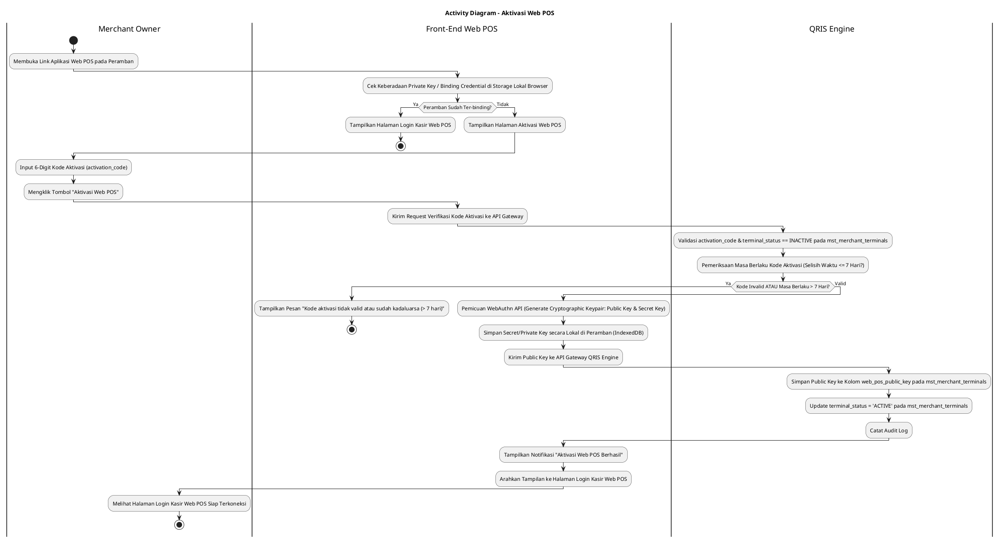
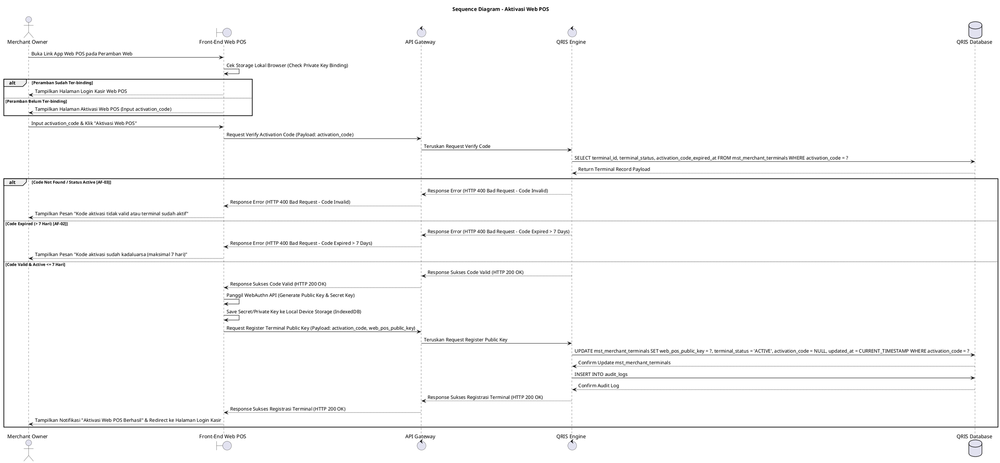

# 1 Deskripsi Use Case

**Tabel 1: Deskripsi Use Case Aktivasi Web POS**

| Elemen Spesifikasi | Deskripsi Detail |
| --- | --- |
| ID Use Case | UC-WPOS-001 |
| Nama Use Case | Aktivasi Web POS |
| Penjelasan Singkat | Proses pendaftaran dan pengikatan (*device binding*) peramban web POS baru pada perangkat merchant menggunakan Kode Aktivasi, pembuatan kunci kriptografi (Public Key & Private/Secret Key) via standar API WebAuthn di peramban, penyimpanan Private Key secara lokal di perangkat peramban, dan pemutakhiran `web_pos_public_key` serta `terminal_status = 'ACTIVE'` pada tabel `mst_merchant_terminals` melalui QRIS Engine. |
| Aktor Utama | Merchant Owner |
| Aktor Pendukung | QRIS Engine, Merchant Management Service |
| Deskripsi Singkat | Merchant Owner mengakses tautan (*link*) aplikasi Web POS pada peramban web (*web browser*) perangkat terminal merchant. Aplikasi Web POS secara otomatis memeriksa keberadaan Kunci Privat / Kredensial Binding peramban pada media penyimpanan lokal (*IndexedDB / LocalStorage*). Apabila sistem mendeteksi peramban Web POS belum ter-binding (*unbound device*), sistem secara otomatis mengarahkan peramban ke Halaman Aktivasi Web POS. Merchant Owner menginput Kode Aktivasi (*activation_code*) 6-digit yang diperoleh dari Back Office Merchant / Email Notifikasi. Merchant Owner mengklik tombol **"Aktivasi Web POS"**. Front-End Web POS memvalidasi format kode dan mengirimkan request verifikasi kode aktivasi ke API Gateway. **QRIS Engine** memvalidasi keberadaan `activation_code`, memastikan status terminal berstatus `terminal_status = 'INACTIVE'`, dan memeriksa masa berlaku kode aktivasi (**Masa berlaku kode aktivasi maksimal 7 hari** dari `activation_code_expired_at`). Setelah kode terverifikasi valid dan belum kadaluarsa, Front-End Web POS mengeksekusi modul WebAuthn (*Web Authentication API*) untuk me-generate pasangan kunci kriptografi (Public Key & Private/Secret Key) secara aman pada peramban. Private Key disimpan secara terisolasi pada peramban lokal perangkat merchant, sedangkan Public Key dikirimkan ke QRIS Engine. QRIS Engine menyimpan Public Key tersebut pada kolom **`web_pos_public_key`** dan memperbarui status terminal menjadi **`terminal_status = 'ACTIVE'`** pada tabel **`mst_merchant_terminals`**. Front-End menyajikan notifikasi sukses aktivasi peramban dan menampilkan Halaman Login Kasir Web POS. |
| Pre-condition | 1. Terminal WEB POS telah dibuat pada Back Office Merchant dengan status awal `terminal_status = 'INACTIVE'`. 2. Merchant Owner telah memiliki Kode Aktivasi (`activation_code`) 6-digit aktif yang dihasilkan dari Back Office Merchant. 3. Perangkat peramban Web POS terhubung ke jaringan internet dan mendukung standar WebAuthn API / Cryptographic Key Generation. |
| Post-condition | 1. Kunci Privat / Secret Key tersimpan secara aman dan terenkripsi pada *Secure Hardware Module / Local Device Storage* peramban perangkat merchant. 2. Public Key peramban berhasil dikirim dan tersimpan pada kolom `web_pos_public_key` di tabel `mst_merchant_terminals`. 3. Status terminal POS pada tabel `mst_merchant_terminals` diperbarui menjadi `terminal_status = 'ACTIVE'`. 4. Perangkat peramban Web POS ter-binding secara sah dan siap digunakan oleh Kasir untuk alur login bertransaksi. |
| Trigger | Merchant Owner membuka link aplikasi Web POS pada peramban yang belum ter-binding, menginput Kode Aktivasi valid, lalu mengklik tombol **"Aktivasi Web POS"**. |
| Nama Tabel | mst_merchant_terminals, mst_merchant_stores, audit_logs |
| Integrasi | 1. **Web POS Front-End App:** Antarmuka web aplikasi kasir POS, modul deteksi binding peramban, dan generator kunci kriptografi WebAuthn API. 2. **QRIS Engine:** Core Engine backend pengelola autentikasi terminal POS, validasi kode aktivasi, serta registrasi `web_pos_public_key`. 3. **Merchant Management Service:** Microservice penyedia data pendukung merchant & outlet store. |
| Asumsi | 1. Kunci privat (Secret Key) yang dihasilkan oleh WebAuthn API tersimpan di dalam *Secure Enclave / TPM / Hardware Storage* lokal perangkat merchant, bersifat non-exportable, dan tidak pernah dikirimkan keluar dari perangkat. 2. Setiap request transaksi kasir dari Web POS nantinya ditandatangani secara kriptografis menggunakan Secret Key tersebut dan diverifikasi di server menggunakan Public Key. |
| Keterbatasan | 1. Aktivasi Web POS DILARANG jika Kode Aktivasi sudah melewati masa berlaku 7 hari (`CURRENT_TIMESTAMP > activation_code_expired_at`). 2. Kode Aktivasi hanya dapat digunakan 1 (satu) kali untuk 1 (satu) peramban perangkat Web POS. |
| Masa Berlaku Kode Aktivasi POS | 60 Menit |
| Aturan Bisnis/Sistem | 1. **Unbound Device Detection Standard:** Setiap kali tautan aplikasi Web POS dibuka, sistem WAJIB secara otomatis memeriksa keberadaan kunci registrasi peramban lokal. Jika tidak ditemukan, sistem WAJIB mengarahkan antarmuka ke Halaman Aktivasi Web POS. 2. **Activation Code 7-Day Expiry Constraint:** Kode Aktivasi (`activation_code`) yang diinput WAJIB divalidasi masa berlakunya. Apabila selisih waktu pembuatan dengan saat aktivasi telah melebihi **7 Hari** (`activation_code_expired_at`), sistem WAJIB menolak aktivasi (*Activation Code Expired*). 3. **WebAuthn Cryptographic Key Generation Standard:** Front-End Web POS WAJIB memanfaatkan standar **WebAuthn API** (atau `window.crypto.subtle`) untuk me-generate pasangan kunci kriptografi (Public Key & Private/Secret Key) yang aman. 4. **Key Storage Security Standard:** &nbsp;&nbsp;- **Private / Secret Key**: WAJIB disimpan secara aman dan terenkripsi pada media penyimpan perangkat lokal (*Hardware-backed Secure Storage / TPM / IndexedDB*) dan DILARANG dikirimkan ke server. &nbsp;&nbsp;- **Public Key**: WAJIB dikirimkan ke backend QRIS Engine untuk disimpan pada kolom **`web_pos_public_key`** tabel `mst_merchant_terminals`. 5. **Terminal Status Activation Standard:** Setelah registrasi Public Key sukses, QRIS Engine WAJIB meng-update kolom **`terminal_status = 'ACTIVE'`** pada tabel `mst_merchant_terminals`. 6. **Audit Trail Standard:** Setiap eksekusi aktivasi Web POS mencatat `terminal_id`, `merchant_id`, `store_id`, `public_key_fingerprint`, dan timestamp pada `audit_logs`. |

# 2 Main Flow

**Tabel 2: Main Flow Aktivasi Web POS**

| No. | Aktivitas | Deskripsi |
| ---: | --- | --- |
| 1 | Membuka Link Aplikasi Web POS | Merchant Owner membuka alamat URL aplikasi Web POS pada peramban web (*web browser*) perangkat merchant. |
| 2 | Mendeteksi Status Binding Peramban | Front-End Web POS memeriksa keberadaan Private Key / Kredensial Binding pada media penyimpanan lokal peramban. |
| 3 | Menampilkan Halaman Aktivasi | Karena peramban belum ter-binding, sistem mengarahkan tampilan ke Halaman Aktivasi Web POS. |
| 4 | Menginput Kode Aktivasi | Merchant Owner menginput 6-digit Kode Aktivasi (`activation_code`) yang valid. |
| 5 | Mengklik Tombol Aktivasi Web POS | Merchant Owner mengklik tombol **"Aktivasi Web POS"**. |
| 6 | Memvalidasi Kode Aktivasi & Masa Berlaku | QRIS Engine memvalidasi keberadaan `activation_code`, memastikan status `terminal_status = 'INACTIVE'`, dan memeriksa masa berlaku kode (**maksimal 7 hari** dari `activation_code_expired_at`). |
| 7 | Generate Keypair via WebAuthn API | Setelah kode valid, Front-End Web POS memicu **WebAuthn API** untuk me-generate pasangan kunci kriptografi (Public Key & Private/Secret Key). |
| 8 | Menyimpan Secret Key di Local Device | Front-End Web POS menyimpan Private/Secret Key secara aman pada media penyimpanan lokal peramban (*IndexedDB*). |
| 9 | Mengirim Public Key ke QRIS Engine | Front-End Web POS mengirimkan Public Key hasil generasi WebAuthn ke API Gateway QRIS Engine. |
| 10 | Update Public Key & Status Active | QRIS Engine menyimpan Public Key ke kolom `web_pos_public_key` dan memperbarui `terminal_status = 'ACTIVE'` pada tabel `mst_merchant_terminals`. |
| 11 | Menampilkan Halaman Login Kasir | Front-End menyajikan notifikasi sukses aktivasi peramban dan menampilkan Halaman Login Kasir Web POS. |
| 12 | Use Case Selesai | Proses aktivasi dan pengikatan peramban Web POS selesai dilaksanakan. |

# 3 Alternative Flow

**Tabel 3: Alternative Flow Aktivasi Web POS**

| Kode | Alternative Flow | Deskripsi |
| --- | --- | --- |
| AF-01 | Kode Aktivasi Kosong / Invalid | Pada langkah 4-6, apabila Kode Aktivasi dikosongkan atau format tidak valid, Front-End menolak request dan menampilkan `Kode Aktivasi wajib diisi dengan 6 karakter valid`. |
| AF-02 | Kode Aktivasi Kadaluarsa (> 7 Hari) | Pada langkah 6, apabila Kode Aktivasi sudah melewati masa berlaku 7 hari (`CURRENT_TIMESTAMP > activation_code_expired_at`), QRIS Engine menolak aktivasi dan Front-End menampilkan `Kode aktivasi sudah kadaluarsa (maksimal 7 hari). Silakan generate kode baru dari Back Office Merchant`. |
| AF-03 | Kode Aktivasi Tidak Ditemukan / Sudah Digunakan | Pada langkah 6, apabila `activation_code` tidak cocok atau terminal sudah berstatus `terminal_status = 'ACTIVE'`, QRIS Engine menolak request dan Front-End menampilkan `Kode aktivasi tidak valid atau terminal sudah aktif`. |
| AF-04 | Peramban Tidak Mendukung WebAuthn | Pada langkah 7, apabila perangkat peramban web merchant tidak mendukung API WebAuthn / Cryptographic Key Generation, Front-End menampilkan `Peramban web Anda tidak mendukung fitur keamanan WebAuthn. Gunakan peramban versi terbaru`. |
| AF-05 | Gagal Terhubung ke Database Server | Pada langkah 6 atau 10, apabila koneksi database terputus total, Sistem mengembalikan HTTP status 500 dan Front-End menampilkan `Terjadi kendala internal pada server`. |

# 4 Status Front-End

**Tabel 4: Status Front-End Aktivasi Web POS**

| No. | Nama Status | Deskripsi Tampilan Front-End |
| ---: | --- | --- |
| 1 | UNBOUND_IDLE | Halaman Aktivasi Web POS menyajikan formulir masukan Kode Aktivasi siap diisi. |
| 2 | GENERATING_KEYS | Indikator memuat (*spinner*) ditampilkan saat WebAuthn API sedang me-generate pasangan kunci kriptografi di peramban. |
| 3 | ACTIVATING_SERVER | Indikator memuat (*spinner*) ditampilkan saat Public Key sedang dikirim dan didaftarkan pada server QRIS Engine. |
| 4 | SUCCESS_ACTIVATED | Modal/toast konfirmasi menampilkan pesan sukses aktivasi peramban dan mengarahkan tampilan ke Halaman Login Kasir Web POS. |
| 5 | ERROR | Pesan kesalahan ditampilkan pada UI akibat kode aktivasi kadaluarsa (> 7 hari), kode invalid, peramban tidak kompatibel, atau kendala server. |

# 5 Activity Diagram Aktivasi Web POS

# 6 Sequence Diagram Aktivasi Web POS

# 7 Response Code

**Tabel 5: Response Code Aktivasi Web POS**

| No. | HTTP Status | Response Code | Nama Response | Deskripsi | Respons Front-End |
| ---: | ---: | --- | --- | --- | --- |
| 1 | 200 | 200XX00 | SUCCESS_ACTIVATE_WEB_POS | Terminal WEB POS berhasil di-binding, `web_pos_public_key` tersimpan, dan `terminal_status` menjadi `ACTIVE`. | Menampilkan notifikasi sukses dan mengarahkan ke Halaman Login Kasir. |
| 2 | 400 | 400XX00 | INVALID_ACTIVATION_CODE | Kode Aktivasi tidak valid, tidak terdaftar, atau format salah. | Menampilkan pesan kesalahan `Kode aktivasi tidak valid`. |
| 3 | 400 | 400XX01 | ACTIVATION_CODE_EXPIRED | Kode Aktivasi telah melewati batas masa berlaku 7 hari. | Menampilkan pesan kesalahan `Kode aktivasi sudah kadaluarsa (maksimal 7 hari)`. |
| 4 | 400 | 400XX02 | TERMINAL_ALREADY_ACTIVE | Terminal WEB POS sudah berstatus `terminal_status = 'ACTIVE'`. | Menampilkan pesan kesalahan `Terminal WEB POS sudah aktif`. |
| 5 | 500 | 500XX00 | SYSTEM_INTERNAL_ERROR | Terjadi kegagalan internal server saat mengeksekusi aktivasi terminal. | Menampilkan pesan kesalahan `Terjadi kendala internal pada server`. |

# 8 Desain Antarmuka

**Tabel 6: Desain Antarmuka Aktivasi Web POS**

| Halaman | Komponen dan State Utama |
| --- | --- |
| Halaman Aktivasi Web POS | 1. **Header & Logo:** Branding Web POS & Judul Halaman "Aktivasi Peramban Web POS". 2. **Field Kode Aktivasi (`activation_code`):** Text Input 6-digit karakter Alphanumeric (Mandatory). 3. **Tombol "Aktivasi Web POS":** Tombol pemicu verifikasi & WebAuthn Keypair Generation (Primary Button). 4. **Peringatan Masa Berlaku:** Keterangan teks bahwa kode aktivasi berlaku maks 7 hari. |
