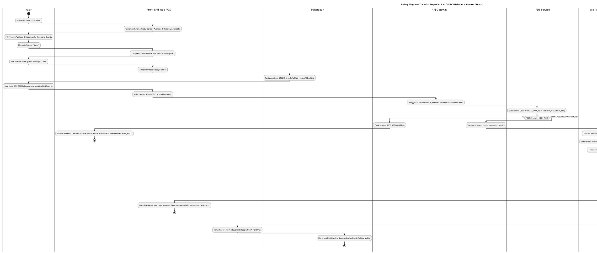
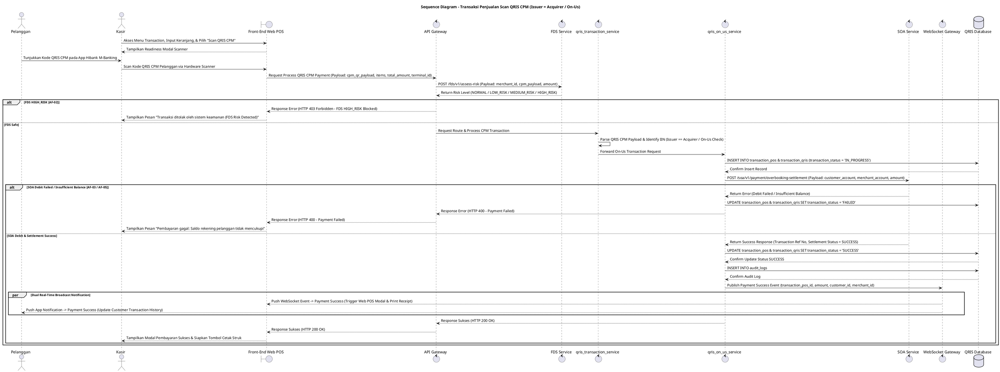

# 1 Deskripsi Use Case

**Tabel 1: Deskripsi Use Case Transaksi Penjualan Scan QRIS CPM (Issuer = Acquirer / On-Us)**

| Elemen Spesifikasi | Deskripsi Detail |
| --- | --- |
| ID Use Case | UC-WPOS-010 |
| Nama Use Case | Transaksi Penjualan Scan QRIS CPM (Issuer = Acquirer / On-Us) |
| Penjelasan Singkat | Fitur Aplikasi Web POS yang memfasilitasi Kasir untuk mengeksekusi transaksi penjualan dengan metode QRIS CPM (*Customer Presented Mode*), di mana Kasir memindai (*scan*) kode QRIS CPM pada perangkat ponsel pelanggan, lalu `qris_transaction_service` mengidentifikasi bahwa transaksi bersifat **On-Us** (Issuer sama dengan Acquirer / Bank Hibank), meneruskan routing ke `qris_on_us_service`, mengeksekusi pemindahbukuan dana (*overbooking*) dan penyelesaian saldo (*real-time settlement*) via SOA (*Service-Oriented Architecture*), serta mengirimkan notifikasi transaksi berhasil secara *real-time* ke Web POS dan aplikasi pelanggan. |
| Aktor Utama | Kasir |
| Aktor Pendukung | Pelanggan (*Customer*), API Gateway, FDS Service (`fds_service`), QRIS Transaction Service (`qris_transaction_service`), QRIS On-Us Service (`qris_on_us_service`), SOA Core Banking System (`soa_service`), WebSocket Notification Gateway |
| Deskripsi Singkat | Kasir melakukan otentikasi login ke Aplikasi Web POS dan mengakses menu **Transaction**. Sistem menampilkan katalog produk terdaftar dari `mst_merchant_products`. Kasir memilih satu atau beberapa produk berstatus `product_availability = 'AVAILABLE'`, menentukan kuantitas beli, dan memasukkannya ke keranjang belanja. Kasir mengklik tombol **"Bayar"**. Sistem menampilkan pop-up modal pilihan metode pembayaran. Kasir memilih metode **Scan QRIS CPM**. Pelanggan menunjukkan Kode QRIS CPM dinamis pada aplikasi *m-banking/e-wallet* miliknya. Kasir memindai Kode QRIS CPM tersebut menggunakan perangkat pemindai (*scanner*) Web POS. Front-End memvalidasi isi keranjang dan mengirimkan payload scan QRIS CPM ke **API Gateway**. API Gateway melakukan penilaian risiko keamanan ke **FDS Service** (`fds_service`). Apabila *risk level* aman (`NORMAL`, `LOW_RISK`, `MEDIUM_RISK`), API Gateway meneruskan request ke **`qris_transaction_service`**. `qris_transaction_service` memuat routing engine yang menganalisis IIN (*Issuer Identification Number*) / Payload QRIS. Karena Issuer sama dengan Acquirer (Bank Hibank / **On-Us**), `qris_transaction_service` mengarahkan routing ke **`qris_on_us_service`**. `qris_on_us_service` menyimpan record ke tabel `transaction_pos` dan `transaction_qris` dengan status awal `transaction_status = 'IN_PROGRESS'`, lalu mengirimkan request instruksi pembayaran ke **SOA Service** (`soa_service`). SOA Service mengeksekusi pendebitan saldo rekening pelanggan (*overbooking*) dan pemindahbukuan ke rekening penampung/merchant (*real-time settlement*). Setelah eksekusi sukses, SOA Service mengembalikan respons notifikasi sukses. `qris_on_us_service` memperbarui status transaksi menjadi **`transaction_status = 'SUCCESS'`** pada `transaction_pos` dan `transaction_qris`, serta mempublikasikan notifikasi sukses pembayaran secara *real-time* via WebSocket Notification Gateway ke antarmuka Web POS Kasir dan aplikasi peramban/ponsel pelanggan. |
| Pre-condition | 1. Perangkat Web POS telah ter-binding aktif dan terhubung dengan alat pemindai (*scanner*) barcode/QR Code. 2. Kasir telah berhasil login ke Aplikasi Web POS. 3. Pelanggan memiliki saldo rekening yang mencukupi dan menampilkan Kode QRIS CPM aktif dari aplikasi Hibank M-Banking. |
| Post-condition | 1. `qris_transaction_service` sukses mengidentifikasi transaksi bersifat On-Us (Issuer = Acquirer). 2. SOA Service sukses melakukan pemindahbukuan dana (*overbooking*) dari saldo pelanggan dan penyelesaian instan (*real-time settlement*). 3. Status transaksi pada tabel `transaction_pos` dan `transaction_qris` diperbarui menjadi `transaction_status = 'SUCCESS'`. 4. Notifikasi transaksi berhasil diterima secara *real-time* oleh antarmuka Web POS Kasir dan aplikasi mobile pelanggan. |
| Trigger | Kasir memilih produk ke keranjang pada menu Transaction, memilih metode **Scan QRIS CPM**, dan memindai kode QRIS pelanggan. |
| Nama Tabel | transaction_pos, transaction_pos_details, transaction_qris, mst_merchant_products, audit_logs |
| Integrasi | 1. **Web POS Front-End App & Scanner:** Antarmuka Web POS dan alat pemindai kode QRIS CPM pelanggan. 2. **API Gateway & FDS Service:** Gateway otorisasi dan modul penilaian risiko kecurangan 4 status FDS (`NORMAL`, `LOW_RISK`, `MEDIUM_RISK`, `HIGH_RISK`). 3. **QRIS Transaction Service (`qris_transaction_service`):** Core routing engine penyaring jenis transaksi On-Us (Issuer = Acquirer) vs Off-Us. 4. **QRIS On-Us Service (`qris_on_us_service`):** Microservice backend pemroses transaksi internal bank On-Us QRIS. 5. **SOA Service (`soa_service`):** Core Banking SOA engine pengeksekusi pendebitan saldo (*overbooking*) dan *real-time settlement*. 6. **WebSocket Notification Gateway:** Server push notification penerus sinyal sukses bayar ke Web POS & Customer App. |
| Asumsi | 1. Kode QRIS CPM yang ditunjukkan pelanggan merupakan kode QRIS standar ASPI yang diterbitkan oleh Bank Hibank sendiri (Issuer = Acquirer / On-Us). 2. Pendebitan saldo rekening pelanggan dan kredit ke rekening merchant dieksekusi secara instan (*real-time settlement*) oleh SOA Core Banking Service tanpa melalui jaringan switching eksternal. |
| Keterbatasan | 1. Apabila saldo rekening pelanggan tidak mencukupi, SOA Service akan mengembalikan respons kegagalan pendebitan (*Insufficient Funds*). 2. Transaksi berstatus `HIGH_RISK` pada FDS Service akan langsung ditolak oleh API Gateway. |
| Aturan Bisnis/Sistem | 1. **Routing On-Us Standard:** `qris_transaction_service` WAJIB memeriksa IIN/Issuer Code pada payload QRIS CPM. Apabila kode mengidentifikasi Bank Hibank sendiri (Issuer = Acquirer), request WAJIB diroutingkan ke **`qris_on_us_service`**. 2. **Product Availability Standard (No Inventory Quantity Management):** Transaksi HANYA mengevaluasi ketersediaan produk pada `mst_merchant_products` (`product_availability = 'AVAILABLE'`). Produk `UNAVAILABLE` DILARANG ditransaksikan. 3. **SOA Overbooking & Real-Time Settlement Standard:** `qris_on_us_service` WAJIB menginstruksikan **SOA Service** (`soa_service`) untuk mengeksekusi pendebitan saldo pelanggan (*overbooking*) dan *real-time settlement* dalam 1 (satu) atomic transaction. 4. **Dual Real-Time Notification Standard:** Setelah pembayaran sukses diselesaikan oleh SOA Service, sistem WAJIB mempublikasikan event notifikasi pembayar-an sukses secara *real-time* (WebSocket/Push Notification) **KE DUA PIHAK**: yaitu antarmuka Web POS Kasir (untuk cetak struk) DAN aplikasi mobile pelanggan. 5. **Success Status Standard:** Setelah konfirmasi sukses dari SOA Service, status transaksi pada tabel **`transaction_pos`** DAN **`transaction_qris`** WAJIB diperbarui menjadi **`transaction_status = 'SUCCESS'`**. 6. **Audit Trail Standard:** Setiap transaksi QRIS CPM On-Us mencatat `transaction_pos_id`, `qris_id`, `merchant_id`, `customer_account`, nominal, IIN Issuer, FDS Risk Level, dan timestamp pada `audit_logs`. 10. **Web POS Request Signature Verification Standard:** Selain permintaan Aktivasi (UC-WPOS-001), seluruh permintaan API yang dikirimkan oleh peramban Web POS WAJIB ditandatangani secara digital (*digital signature* - header X-Signature) menggunakan Private Key yang tersimpan pada *Local Device Storage* peramban (*IndexedDB / Hardware TPM*). API Gateway WAJIB memverifikasi signature tersebut menggunakan web_pos_public_key yang tersimpan pada tabel mst_merchant_terminals (atau Redis Cache). Apabila signature tidak valid, kedaluwarsa, atau missing, API Gateway WAJIB menolak request secara langsung (HTTP Status 401 INVALID_DEVICE_SIGNATURE).  |

# 2 Main Flow

**Tabel 2: Main Flow Transaksi Penjualan Scan QRIS CPM (Issuer = Acquirer / On-Us)**

| No. | Aktivitas | Deskripsi |
| ---: | --- | --- |
| 1 | Membuka Menu Transaction | Kasir melakukan login dan mengklik menu **Transaction** pada navigasi Web POS. |
| 2 | Menampilkan Katalog Produk | Sistem menampilkan halaman katalog produk dari `mst_merchant_products` (Produk `AVAILABLE` aktif, Produk `UNAVAILABLE` ter-disable). |
| 3 | Memilih Produk & Keranjang | Kasir memilih produk berstatus `AVAILABLE`, menentukan kuantitas beli, dan memasukkannya ke keranjang belanja. |
| 4 | Mengklik Tombol Bayar | Kasir mengklik tombol **"Bayar"** pada panel keranjang belanja. |
| 5 | Menampilkan Pop-Up Metode Pembayaran | Sistem menampilkan pop-up modal pilihan metode pembayaran. |
| 6 | Memilih Metode Scan QRIS CPM | Kasir memilih metode pembayaran **Scan QRIS CPM**. |
| 7 | Memindai Kode QRIS CPM Pelanggan | Pelanggan menunjukkan Kode QRIS CPM pada aplikasi mobile Hibank M-Banking, dan Kasir memindai kode tersebut dengan scanner Web POS. |
| 8 | Executing FDS Check via API Gateway | Front-End mengirim request payload scan ke API Gateway. API Gateway memanggil FDS Service (`fds_service`). FDS Service mengembalikan *risk level* aman (`NORMAL`, `LOW_RISK`, `MEDIUM_RISK`). API Gateway meneruskan request ke `qris_transaction_service`. |
| 9 | Routing Decision (Issuer = Acquirer) | `qris_transaction_service` menganalisis payload QRIS CPM, mengidentifikasi transaksi bersifat **On-Us** (Issuer = Acquirer / Bank Hibank), dan mengarahkan routing ke `qris_on_us_service`. |
| 10 | Save Record & Request Payment to SOA | `qris_on_us_service` menyimpan record ke `transaction_pos` & `transaction_qris` (`transaction_status = 'IN_PROGRESS'`), lalu mengirimkan request instruksi pembayaran ke **SOA Service** (`soa_service`). |
| 11 | SOA Overbooking & Real-Time Settlement | SOA Service mengeksekusi pemindahbukuan dana (*overbooking*) pendebitan saldo pelanggan dan penyelesaian saldo instan (*real-time settlement*) ke akun merchant. SOA mengembalikan notifikasi pembayaran berhasil. |
| 12 | Update Success Status & Broadcast Notif | `qris_on_us_service` memperbarui status transaksi menjadi **`transaction_status = 'SUCCESS'`** pada `transaction_pos` & `transaction_qris`, lalu mempublikasikan notifikasi transaksi berhasil secara *real-time* ke Web POS Kasir dan aplikasi mobile pelanggan. |
| 13 | Menampilkan Konfirmasi Sukses & Struk | Front-End Web POS menyajikan modal konfirmasi pembayaran sukses dan memicu opsi cetak struk transaksi. |
| 14 | Use Case Selesai | Proses transaksi penjualan scan QRIS CPM On-Us selesai dilaksanakan. |

# 3 Alternative Flow

**Tabel 3: Alternative Flow Transaksi Penjualan Scan QRIS CPM (Issuer = Acquirer / On-Us)**

| Kode | Alternative Flow | Deskripsi |
| --- | --- | --- |
| AF-01 | Keranjang Belanja Kosong | Pada langkah 4 atau 8, apabila keranjang belanja kosong, Front-End menolak request dan menampilkan `Keranjang belanja masih kosong`. |
| AF-02 | FDS Flagging HIGH_RISK | Pada langkah 8, apabila FDS Service mendeteksi transaksi berisiko tinggi (*HIGH_RISK*), API Gateway menolak transaksi dan Front-End menampilkan `Transaksi ditolak oleh sistem keamanan (FDS Risk Detected: HIGH_RISK)`. |
| AF-03 | Saldo Pelanggan Tidak Mencukupi | Pada langkah 11, apabila saldo rekening pelanggan di SOA Service tidak mencukupi, SOA mengembalikan error pendebitan. Sistem memperbarui status menjadi `transaction_status = 'FAILED'` dan Front-End menampilkan `Pembayaran gagal: Saldo rekening pelanggan tidak mencukupi`. |
| AF-04 | Kode QRIS CPM Kadaluarsa / Invalid | Pada langkah 9, apabila Kode QRIS CPM yang dipindai sudah kadaluarsa atau format payload salah, `qris_transaction_service` menolak request dan Front-End menampilkan `Kode QRIS CPM tidak valid atau sudah kadaluarsa`. |
| AF-05 | SOA Service Error / Timeout | Pada langkah 11, apabila SOA Service mengalami kendala atau timeout, Sistem memperbarui status menjadi `FAILED` dan Front-End menampilkan `Gagal memproses pendebitan dana di Core Banking (SOA Timeout)`. |

# 4 Status Front-End

**Tabel 4: Status Front-End Transaksi Penjualan Scan QRIS CPM (Issuer = Acquirer / On-Us)**

| No. | Nama Status | Deskripsi Tampilan Front-End |
| ---: | --- | --- |
| 1 | CART_IDLE | Halaman Transaction menyajikan katalog produk dan panel keranjang belanja terisi. |
| 2 | PAYMENT_METHOD_MODAL | Pop-up modal pilihan metode pembayaran disajikan di layar. |
| 3 | WAITING_SCAN_CPM | Modal dialog aktif meminta Kasir mengarahkan scanner ke Kode QRIS CPM di ponsel pelanggan. |
| 4 | PROCESSING_PAYMENT | Indikator memuat (*spinner*) ditampilkan saat FDS, routing On-Us, dan overbooking SOA sedang dieksekusi backend. |
| 5 | SUCCESS_PAYMENT | Modal konfirmasi pembayaran sukses ditampilkan di Web POS beserta tombol Cetak Struk. Notifikasi sukses juga diterima pelanggan. |
| 6 | ERROR | Pesan kesalahan ditampilkan pada UI akibat FDS HIGH_RISK, saldo pelanggan kurang, QRIS kadaluarsa, atau kendala SOA. |

# 5 Activity Diagram Transaksi Penjualan Scan QRIS CPM (Issuer = Acquirer / On-Us)

# 6 Sequence Diagram Transaksi Penjualan Scan QRIS CPM (Issuer = Acquirer / On-Us)

# 7 Response Code

**Tabel 5: Response Code Transaksi Penjualan Scan QRIS CPM (Issuer = Acquirer / On-Us)**

| No. | HTTP Status | Response Code | Nama Response | Deskripsi | Respons Front-End |
| ---: | ---: | --- | --- | --- | --- |
| 1 | 200 | 200XX00 | SUCCESS_CPM_ONUS_PAYMENT | Transaksi QRIS CPM On-Us berhasil diproses, SOA overbooking & settlement sukses (`transaction_status = 'SUCCESS'`), notifikasi ganda terkirim. | Menampilkan modal konfirmasi pembayaran sukses dan opsi cetak struk. |
| 2 | 400 | 400XX00 | INVALID_CPM_QR_PAYLOAD | Kode QRIS CPM pelanggan tidak valid atau format payload salah. | Menampilkan pesan kesalahan `Kode QRIS CPM tidak valid`. |
| 3 | 400 | 400XX01 | INSUFFICIENT_CUSTOMER_BALANCE | Saldo rekening pelanggan di SOA Core Banking tidak mencukupi. | Menampilkan pesan kesalahan `Pembayaran gagal: Saldo rekening pelanggan tidak mencukupi`. |
| 4 | 403 | 403XX00 | FDS_HIGH_RISK_DETECTED | Transaksi ditolak oleh FDS Service karena terindikasi berisiko tinggi (`HIGH_RISK`). | Menampilkan pesan kesalahan `Transaksi ditolak oleh sistem keamanan (FDS Risk Detected: HIGH_RISK)`. |
| 5 | 500 | 500XX00 | SOA_OVERBOOKING_ERROR | Terjadi kegagalan pemindahbukuan saldo pada SOA Core Banking System. | Menampilkan pesan kesalahan `Gagal memproses pendebitan dana di Core Banking (SOA Error)`. |
| 6 | 500 | 500XX01 | SYSTEM_INTERNAL_ERROR | Terjadi kegagalan internal server saat mengeksekusi transaksi CPM. | Menampilkan pesan kesalahan `Terjadi kendala internal pada server`. |

| 99 | 401 | 401XX01 | INVALID_DEVICE_SIGNATURE | Signature digital request Web POS (header X-Signature) tidak valid atau tidak cocok dengan web_pos_public_key pada mst_merchant_terminals. | Menampilkan pesan kesalahan Signature digital perangkat Web POS tidak valid atau tidak terverifikasi. |

# 8 Desain Antarmuka

**Tabel 6: Desain Antarmuka Transaksi Penjualan Scan QRIS CPM (Issuer = Acquirer / On-Us)**

| Halaman | Komponen dan State Utama |
| --- | --- |
| Layar Utama Transaksi Web POS | 1. **Katalog Produk:** Grid item barang dengan gambar S3, Nama, SKU, dan Tombol Tambah. 2. **Panel Keranjang Belanja:** Rincian item terpilih, Pengatur Qty Beli, Subtotal, dan Tombol **"Bayar"** (Primary Button). |
| Pop-Up Pilih Metode Pembayaran | 1. **Header:** Rincian Total Tagihan Pembayaran. 2. **Pilihan Metode:** Opsi **Scan QRIS CPM** (Active Selection), QRIS MPM, Tunai, Debit, dll. 3. **Tombol Aksi:** Tombol **"Lanjutkan Pembayaran"** (Primary) dan **"Batal"** (Secondary). |
| Modal Scan Readiness & Progress | 1. **Instruksi Scan:** Teks instruksi "Arahkan Scanner ke Kode QRIS CPM di Ponsel Pelanggan". 2. **Indikator Processing:** State memuat saat FDS, routing On-Us, dan overbooking SOA sedang diproses. |
| Modal Pembayaran Sukses | 1. **Header Sukses:** Ikon Centang Hijau & Notifikasi "Pembayaran QRIS CPM Berhasil!". 2. **Rincian Transaksi:** Total Nominal, No. Resi, Waktu, dan Nama Customer. 3. **Tombol Aksi:** Tombol **"Cetak Struk"** (Primary Button) dan **"Transaksi Baru"** (Secondary). |
