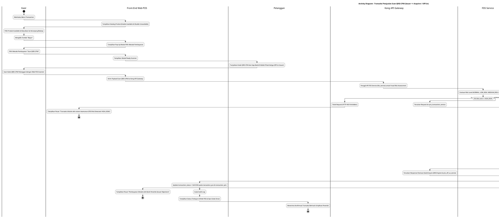
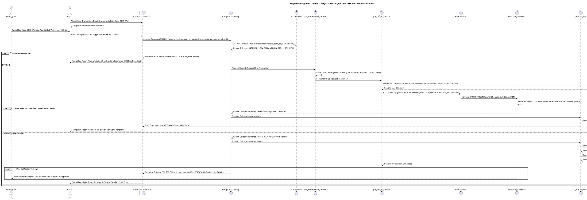

# 1 Deskripsi Use Case

**Tabel 1: Deskripsi Use Case Transaksi Penjualan Scan QRIS CPM (Issuer <> Acquirer / Off-Us)**

| Elemen Spesifikasi | Deskripsi Detail |
| --- | --- |
| ID Use Case | UC-WPOS-011 |
| Nama Use Case | Transaksi Penjualan Scan QRIS CPM (Issuer <> Acquirer / Off-Us) |
| Penjelasan Singkat | Fitur Aplikasi Web POS yang memfasilitasi Kasir untuk mengeksekusi transaksi penjualan dengan metode QRIS CPM (*Customer Presented Mode*), di mana Kasir memindai (*scan*) kode QRIS CPM dari aplikasi instrumen bank/e-wallet lain pada ponsel pelanggan, `qris_transaction_service` mengidentifikasi transaksi bersifat **Off-Us** (Issuer berbeda dengan Acquirer / Bank Hibank), meneruskan routing ke `qris_off_us_service`, meneruskan instruksi pembayaran via SOA Service (`soa_service`) ke Lembaga Switching (Artajasa/PTEN), menerima respons balasan pembayaran dari Switching melalui Kong API Gateway yang dikirimkan ke QRIS Engine, memperbarui status transaksi menjadi `SUCCESS` pada Web POS, serta mengonfirmasi notifikasi berhasil ke ponsel pelanggan. |
| Aktor Utama | Kasir |
| Aktor Pendukung | Pelanggan (*Customer*), API Gateway (Kong Gateway), FDS Service (`fds_service`), QRIS Transaction Service (`qris_transaction_service`), QRIS Off-Us Service (`qris_off_us_service`), SOA Service (`soa_service`), Switching Network (Artajasa/PTEN), QRIS Engine |
| Deskripsi Singkat | Kasir melakukan otentikasi login ke Aplikasi Web POS dan mengakses menu **Transaction**. Sistem menampilkan katalog produk terdaftar dari `mst_merchant_products`. Kasir memilih satu atau beberapa produk berstatus `product_availability = 'AVAILABLE'`, menentukan kuantitas beli, dan memasukkannya ke keranjang belanja. Kasir mengklik tombol **"Bayar"**. Sistem menampilkan pop-up modal pilihan metode pembayaran. Kasir memilih metode **Scan QRIS CPM**. Pelanggan menunjukkan Kode QRIS CPM dinamis pada aplikasi *m-banking/e-wallet* pihak ketiga (misal: BCA, Mandiri, GoPay, OVO, dll.). Kasir memindai Kode QRIS CPM tersebut menggunakan scanner Web POS. Front-End memvalidasi isi keranjang dan mengirimkan request payload scan QRIS CPM ke **Kong API Gateway**. Kong API Gateway melakukan penilaian risiko keamanan awal ke **FDS Service** (`fds_service`). Apabila *risk level* aman (`NORMAL`, `LOW_RISK`, `MEDIUM_RISK`), Kong API Gateway meneruskan request ke **`qris_transaction_service`**. `qris_transaction_service` mengevaluasi IIN (*Issuer Identification Number*) pada payload QRIS. Karena kode Issuer berbeda dengan Acquirer (Bank Hibank / **Off-Us**), `qris_transaction_service` me-routingkan request ke **`qris_off_us_service`**. `qris_off_us_service` menyisipkan record transaksi ke `transaction_pos` dan `transaction_qris` dengan status awal `transaction_status = 'IN_PROGRESS'`, lalu mengirimkan request pembayaran ke **SOA Service** (`soa_service`). SOA Service me-routingkan transaksi pesan finansial ke jaringan **Lembaga Switching** (Artajasa/PTEN) untuk diotorisasi oleh Bank Issuer pelanggan. Lembaga Switching memproses pesan dan mengirimkan response otorisasi kembali melalui **Kong API Gateway**, yang kemudian diteruskan ke **QRIS Engine** dan `qris_off_us_service`. Setelah menerima konfirmasi sukses, `qris_off_us_service` memperbarui status transaksi menjadi **`transaction_status = 'SUCCESS'`** pada `transaction_pos` dan `transaction_qris`. Sistem menampilkan status pembayaran terbayar/berhasil pada layar Web POS Kasir (untuk cetak struk) dan respons pembayaran berhasil diterima di sisi aplikasi pelanggan. |
| Pre-condition | 1. Perangkat Web POS telah ter-binding aktif dan terhubung dengan alat pemindai (*scanner*). 2. Kasir telah berhasil login ke Aplikasi Web POS. 3. Pelanggan menunjukkan Kode QRIS CPM aktif dari penerbit instrumen pihak ketiga (Off-Us Issuer). |
| Post-condition | 1. `qris_transaction_service` sukses mengidentifikasi transaksi bersifat Off-Us (Issuer <> Acquirer). 2. Lembaga Switching & Kong API Gateway sukses menyalurkan otorisasi pesan transaksi dari Issuer ke QRIS Engine. 3. Status transaksi pada tabel `transaction_pos` dan `transaction_qris` diperbarui menjadi `transaction_status = 'SUCCESS'`. 4. Status pembayaran terbayar ditampilkan pada Web POS Kasir dan konfirmasi sukses diterima pelanggan. |
| Trigger | Kasir memilih produk ke keranjang pada menu Transaction, memilih metode **Scan QRIS CPM**, dan memindai kode QRIS pelanggan dari Issuer lain. |
| Nama Tabel | transaction_pos, transaction_pos_details, transaction_qris, mst_merchant_products, audit_logs |
| Integrasi | 1. **Web POS Front-End App & Scanner:** Antarmuka Web POS dan alat pemindai kode QRIS CPM pelanggan. 2. **Kong API Gateway & FDS Service:** Ingress gateway otorisasi, penangan routing respons callback, dan modul penilaian risiko FDS. 3. **QRIS Transaction Service (`qris_transaction_service`):** Core routing engine penentu jalur On-Us vs Off-Us. 4. **QRIS Off-Us Service (`qris_off_us_service`):** Microservice backend penanganan protokol transaksi inter-bank QRIS. 5. **SOA Service (`soa_service`):** Core Banking SOA engine perantara pesan finansial ke jaringan switching eksternal. 6. **Switching Network (Artajasa / PTEN):** Switching hub nasional pemroses otorisasi transaksi QRIS antar-lembaga. 7. **QRIS Engine:** Backend core penangkap callback respons otorisasi akhir dan pembaharu status database. |
| Asumsi | 1. Kode QRIS CPM yang ditunjukkan pelanggan merupakan kode QRIS standar ASPI yang diterbitkan oleh Bank/Penerbit lain (Issuer <> Acquirer / Off-Us). 2. Komunikasi antarmuka antara Switching Network dan internal bank melewati perantara terenkripsi **Kong API Gateway**. |
| Keterbatasan | 1. Apabila transaksi ditolak oleh Bank Issuer pelanggan pada jaringan Switching, Switching akan mengembalikan response code error otorisasi. 2. Transaksi berstatus `HIGH_RISK` pada FDS Service akan langsung ditolak oleh Kong API Gateway. |
| Aturan Bisnis/Sistem | 1. **Routing Off-Us Standard:** `qris_transaction_service` WAJIB memeriksa IIN/Issuer Code pada payload QRIS CPM. Apabila kode mengidentifikasi Issuer berbeda dari Bank Hibank (Issuer <> Acquirer), request WAJIB diroutingkan ke **`qris_off_us_service`**. 2. **Switching & Gateway Routing Standard:** `qris_off_us_service` mengirimkan instruksi pembayaran via **SOA Service** ke jaringan **Switching** (Artajasa/PTEN). Respons jawaban otorisasi dari Switching WAJIB disalurkan kembali melalui **Kong API Gateway** untuk diteruskan ke **QRIS Engine**. 3. **Product Availability Standard (No Inventory Quantity Management):** Transaksi HANYA mengevaluasi ketersediaan produk pada `mst_merchant_products` (`product_availability = 'AVAILABLE'`). Produk `UNAVAILABLE` DILARANG ditransaksikan. 4. **Success Status Standard:** Setelah QRIS Engine menerima konfirmasi respons sukses dari Kong API Gateway / Switching, status transaksi pada tabel **`transaction_pos`** DAN **`transaction_qris`** WAJIB diperbarui menjadi **`transaction_status = 'SUCCESS'`**. 5. **Dual Notification Confirmation Standard:** Tampilan antarmuka Web POS Kasir WAJIB memperbarui status menjadi terbayar (*SUCCESS*) untuk memicu opsi cetak struk, dan respons otorisasi berhasil disajikan pada antarmuka transaksi pelanggan. 6. **Audit Trail Standard:** Setiap transaksi QRIS CPM Off-Us mencatat `transaction_pos_id`, `qris_id`, `merchant_id`, Issuer IIN, Switching Ref No, FDS Risk Level, dan timestamp pada `audit_logs`. 10. **Web POS Request Signature Verification Standard:** Selain permintaan Aktivasi (UC-WPOS-001), seluruh permintaan API yang dikirimkan oleh peramban Web POS WAJIB ditandatangani secara digital (*digital signature* - header X-Signature) menggunakan Private Key yang tersimpan pada *Local Device Storage* peramban (*IndexedDB / Hardware TPM*). API Gateway WAJIB memverifikasi signature tersebut menggunakan web_pos_public_key yang tersimpan pada tabel mst_merchant_terminals (atau Redis Cache). Apabila signature tidak valid, kedaluwarsa, atau missing, API Gateway WAJIB menolak request secara langsung (HTTP Status 401 INVALID_DEVICE_SIGNATURE).  |

# 2 Main Flow

**Tabel 2: Main Flow Transaksi Penjualan Scan QRIS CPM (Issuer <> Acquirer / Off-Us)**

| No. | Aktivitas | Deskripsi |
| ---: | --- | --- |
| 1 | Membuka Menu Transaction | Kasir melakukan login dan mengklik menu **Transaction** pada navigasi Web POS. |
| 2 | Menampilkan Katalog Produk | Sistem menampilkan halaman katalog produk dari `mst_merchant_products` (Produk `AVAILABLE` aktif, Produk `UNAVAILABLE` ter-disable). |
| 3 | Memilih Produk & Keranjang | Kasir memilih produk berstatus `AVAILABLE`, menentukan kuantitas beli, dan memasukkannya ke keranjang belanja. |
| 4 | Mengklik Tombol Bayar | Kasir mengklik tombol **"Bayar"** pada panel keranjang belanja. |
| 5 | Menampilkan Pop-Up Metode Pembayaran | Sistem menampilkan pop-up modal pilihan metode pembayaran. |
| 6 | Memilih Metode Scan QRIS CPM | Kasir memilih metode pembayaran **Scan QRIS CPM**. |
| 7 | Memindai Kode QRIS CPM Pelanggan | Pelanggan menunjukkan Kode QRIS CPM dari aplikasi bank/e-wallet lain (Off-Us Issuer), dan Kasir memindai kode tersebut dengan scanner Web POS. |
| 8 | Executing FDS Check via Kong Gateway | Front-End mengirim request payload scan ke Kong API Gateway. Kong Gateway memanggil FDS Service (`fds_service`). FDS Service mengembalikan *risk level* aman (`NORMAL`, `LOW_RISK`, `MEDIUM_RISK`). Kong Gateway meneruskan request ke `qris_transaction_service`. |
| 9 | Routing Decision (Issuer <> Acquirer) | `qris_transaction_service` menganalisis payload QRIS CPM, mengidentifikasi transaksi bersifat **Off-Us** (Issuer <> Acquirer), dan mengarahkan routing ke `qris_off_us_service`. |
| 10 | Save Record & Forward to SOA | `qris_off_us_service` menyimpan record ke `transaction_pos` & `transaction_qris` (`transaction_status = 'IN_PROGRESS'`), lalu mengirimkan request pembayaran ke **SOA Service** (`soa_service`). |
| 11 | Routing Payment to Switching Network | SOA Service me-routingkan pesan instruksi pembayaran ke jaringan **Switching** (Artajasa/PTEN) untuk mintakan otorisasi ke Bank Issuer pelanggan. |
| 12 | Switching Response via Kong to QRIS Engine | Lembaga Switching memproses otorisasi dengan Bank Issuer dan mengembalikan respons transaksi berhasil melalui **Kong API Gateway**, yang kemudian diteruskan ke **QRIS Engine** dan `qris_off_us_service`. |
| 13 | Update Success Status & POS Screen | `qris_off_us_service` memperbarui status transaksi menjadi **`transaction_status = 'SUCCESS'`** pada `transaction_pos` & `transaction_qris`. Web POS Kasir menampilkan status terbayar (pemicu cetak struk) dan konfirmasi berhasil disajikan di pelanggan. |
| 14 | Use Case Selesai | Proses transaksi penjualan scan QRIS CPM Off-Us selesai dilaksanakan. |

# 3 Alternative Flow

**Tabel 3: Alternative Flow Transaksi Penjualan Scan QRIS CPM (Issuer <> Acquirer / Off-Us)**

| Kode | Alternative Flow | Deskripsi |
| --- | --- | --- |
| AF-01 | Keranjang Belanja Kosong | Pada langkah 4 atau 8, apabila keranjang belanja kosong, Front-End menolak request dan menampilkan `Keranjang belanja masih kosong`. |
| AF-02 | FDS Flagging HIGH_RISK | Pada langkah 8, apabila FDS Service mendeteksi transaksi berisiko tinggi (*HIGH_RISK*), Kong Gateway menolak transaksi dan Front-End menampilkan `Transaksi ditolak oleh sistem keamanan (FDS Risk Detected: HIGH_RISK)`. |
| AF-03 | Otorisasi Ditolak oleh Bank Issuer | Pada langkah 11-12, apabila Bank Issuer pelanggan menolak transaksi (misal: Saldo Kurang / Account Blocked), Switching mengembalikan response code error melalui Kong Gateway ke QRIS Engine. Status di-update menjadi `FAILED` dan Front-End menampilkan `Pembayaran ditolak oleh Bank Penerbit (Issuer Rejection)`. |
| AF-04 | Switching Network Timeout | Pada langkah 11, apabila jaringan Switching mengalami kendala koneksi atau timeout, QRIS Engine memperbarui status menjadi `FAILED` dan Front-End menampilkan `Gagal terhubung ke jaringan Switching (Timeout)`. |
| AF-05 | Gagal Terhubung ke Database Server | Pada langkah 10 atau 13, apabila koneksi database terputus total, Sistem mengembalikan HTTP status 500 dan Front-End menampilkan `Terjadi kendala internal pada server`. |

# 4 Status Front-End

**Tabel 4: Status Front-End Transaksi Penjualan Scan QRIS CPM (Issuer <> Acquirer / Off-Us)**

| No. | Nama Status | Deskripsi Tampilan Front-End |
| ---: | --- | --- |
| 1 | CART_IDLE | Halaman Transaction menyajikan katalog produk dan panel keranjang belanja terisi. |
| 2 | PAYMENT_METHOD_MODAL | Pop-up modal pilihan metode pembayaran disajikan di layar. |
| 3 | WAITING_SCAN_CPM | Modal dialog aktif meminta Kasir mengarahkan scanner ke Kode QRIS CPM di ponsel pelanggan. |
| 4 | PROCESSING_SWITCHING | Indikator memuat (*spinner*) ditampilkan saat request sedang diroutingkan via FDS, Off-Us Service, SOA, dan Switching Network. |
| 5 | SUCCESS_PAYMENT | Modal konfirmasi pembayaran terbayar ditampilkan di Web POS beserta tombol Cetak Struk. Konfirmasi berhasil disajikan ke pelanggan. |
| 6 | ERROR | Pesan kesalahan ditampilkan pada UI akibat FDS HIGH_RISK, penolakan Bank Issuer, timeout Switching, atau kendala server. |

# 5 Activity Diagram Transaksi Penjualan Scan QRIS CPM (Issuer <> Acquirer / Off-Us)

# 6 Sequence Diagram Transaksi Penjualan Scan QRIS CPM (Issuer <> Acquirer / Off-Us)

# 7 Response Code

**Tabel 5: Response Code Transaksi Penjualan Scan QRIS CPM (Issuer <> Acquirer / Off-Us)**

| No. | HTTP Status | Response Code | Nama Response | Deskripsi | Respons Front-End |
| ---: | ---: | --- | --- | --- | --- |
| 1 | 200 | 200XX00 | SUCCESS_CPM_OFFUS_PAYMENT | Transaksi QRIS CPM Off-Us berhasil diotorisasi oleh Switching & Bank Issuer, status di POS `SUCCESS` (Terbayar), dan konfirmasi pelanggan berhasil. | Menampilkan modal konfirmasi status terbayar dan opsi cetak struk. |
| 2 | 400 | 400XX00 | INVALID_CPM_QR_PAYLOAD | Kode QRIS CPM pelanggan tidak valid atau format payload salah. | Menampilkan pesan kesalahan `Kode QRIS CPM tidak valid`. |
| 3 | 400 | 400XX01 | ISSUER_AUTHORIZATION_REJECTED | Otorisasi pembayaran ditolak oleh Bank Issuer pelanggan via Lembaga Switching. | Menampilkan pesan kesalahan `Pembayaran ditolak oleh Bank Penerbit (Issuer Rejection)`. |
| 4 | 403 | 403XX00 | FDS_HIGH_RISK_DETECTED | Transaksi ditolak oleh FDS Service karena terindikasi berisiko tinggi (`HIGH_RISK`). | Menampilkan pesan kesalahan `Transaksi ditolak oleh sistem keamanan (FDS Risk Detected: HIGH_RISK)`. |
| 5 | 504 | 504XX00 | SWITCHING_NETWORK_TIMEOUT | Waktu tunggu respons otorisasi dari Lembaga Switching / Issuer habis (timeout). | Menampilkan pesan kesalahan `Gagal terhubung ke jaringan Switching (Timeout)`. |
| 6 | 500 | 500XX01 | SYSTEM_INTERNAL_ERROR | Terjadi kegagalan internal server saat mengeksekusi transaksi Off-Us. | Menampilkan pesan kesalahan `Terjadi kendala internal pada server`. |

| 99 | 401 | 401XX01 | INVALID_DEVICE_SIGNATURE | Signature digital request Web POS (header X-Signature) tidak valid atau tidak cocok dengan web_pos_public_key pada mst_merchant_terminals. | Menampilkan pesan kesalahan Signature digital perangkat Web POS tidak valid atau tidak terverifikasi. |

# 8 Desain Antarmuka

**Tabel 6: Desain Antarmuka Transaksi Penjualan Scan QRIS CPM (Issuer <> Acquirer / Off-Us)**

| Halaman | Komponen dan State Utama |
| --- | --- |
| Layar Utama Transaksi Web POS | 1. **Katalog Produk:** Grid item barang dengan gambar S3, Nama, SKU, dan Tombol Tambah. 2. **Panel Keranjang Belanja:** Rincian item terpilih, Pengatur Qty Beli, Subtotal, dan Tombol **"Bayar"** (Primary Button). |
| Pop-Up Pilih Metode Pembayaran | 1. **Header:** Rincian Total Tagihan Pembayaran. 2. **Pilihan Metode:** Opsi **Scan QRIS CPM** (Active Selection), QRIS MPM, Tunai, Debit, dll. 3. **Tombol Aksi:** Tombol **"Lanjutkan Pembayaran"** (Primary) dan **"Batal"** (Secondary). |
| Modal Scan & Switching Processing | 1. **Instruksi Scan:** Teks instruksi "Arahkan Scanner ke Kode QRIS CPM di Ponsel Pelanggan". 2. **Indikator Switching Processing:** State memuat saat FDS, Off-Us Service, SOA, dan Lembaga Switching sedang memproses otorisasi inter-bank. |
| Modal Status Terbayar (Web POS) | 1. **Header Sukses:** Ikon Centang Hijau & Notifikasi Status "Terbayar / Success". 2. **Rincian Transaksi:** Total Nominal, No. Resi, Waktu, Nama Issuer, dan Ref No Switching. 3. **Tombol Aksi:** Tombol **"Cetak Struk"** (Primary Button) dan **"Transaksi Baru"** (Secondary). |
