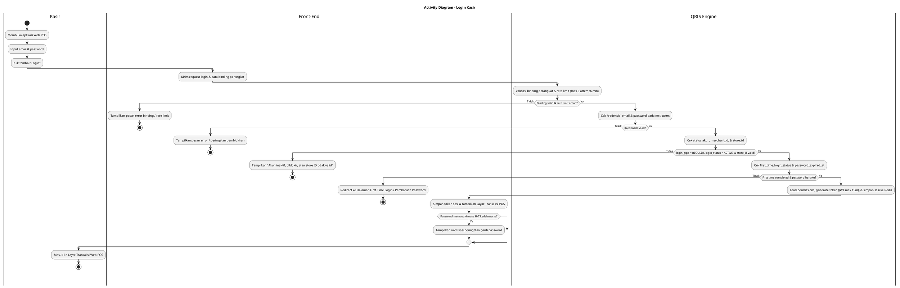
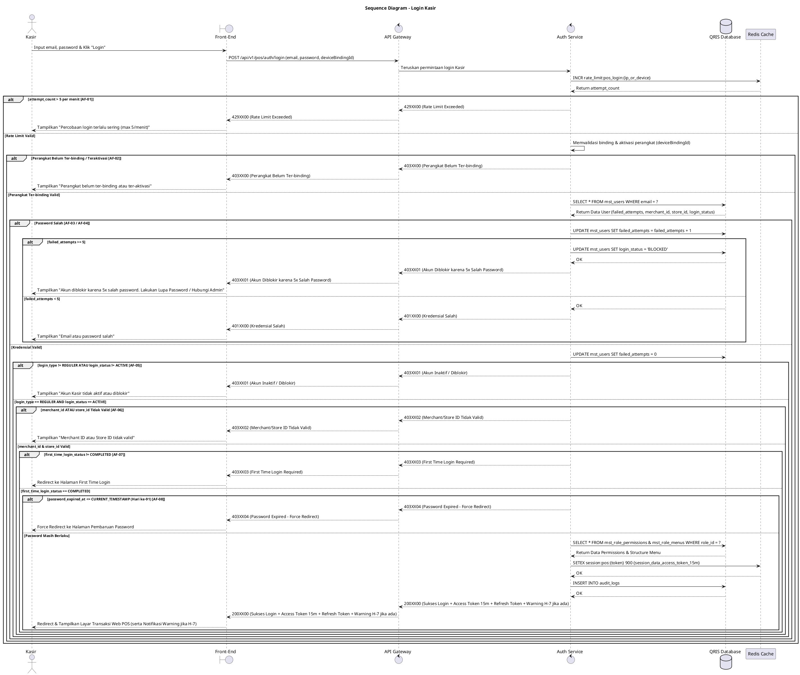

# 1 Deskripsi Use Case

**Tabel 1: Deskripsi Use Case Login Kasir**

| Elemen Spesifikasi | Deskripsi Detail |
| --- | --- |
| ID Use Case | UC-WPOS-002 |
| Nama Use Case | Login Kasir |
| Penjelasan Singkat | Proses autentikasi standar yang dilakukan oleh Kasir untuk mengakses aplikasi Web POS pada toko/outlet yang telah ter-binding dan ter-aktivasi. |
| Aktor Utama | Kasir |
| Aktor Pendukung | - |
| Deskripsi Singkat | Kasir menginput kredensial (email dan password) pada Halaman Login Web POS. Sistem memvalidasi status binding perangkat, mengecek *rate limit* login (max 5 attempt/menit), mencocokkan kredensial, memverifikasi `login_type = 'REGULER'`, `login_status = 'ACTIVE'`, keabsahan `merchant_id` & `store_id`, `first_time_login_status = 'COMPLETED'`, serta siklus `password_expired_at` (maksimal 90 hari dengan warning H-7), lalu memuat `mst_role_permissions` dan `mst_role_menus` sebelum menyimpan sesi ke Redis Cache dan memberikan Access Token (maks 15 menit) & Refresh Token. |
| Pre-condition | 1. Aplikasi dan perangkat Web POS telah ter-binding serta ter-aktivasi pada toko/outlet (`store_id`) terkait. 2. Akun Kasir telah terdaftar pada tabel `mst_users` dengan `login_type = 'REGULER'`, serta memiliki asosiasi `merchant_id` dan `store_id` yang valid. 3. Akun Kasir berstatus `ACTIVE` (`login_status = 'ACTIVE'`) dan telah menyelesaikan First Time Login (`first_time_login_status = 'COMPLETED'`). 4. Password akun Kasir belum kedaluwarsa (`password_expired_at` masih berlaku). |
| Post-condition | 1. Kasir berhasil diautentikasi, data sesi disimpan pada Redis Cache, dan menerima Access Token (JWT 15 menit) & Refresh Token yang memuat `merchant_id`, `store_id`, `role_id`, hak akses, dan struktur menu. 2. Front-End Web POS menampilkan Halaman Transaksi Kasir (POS Main Screen) sesuai toko (`store_id`) dan hak akses `role_id` Kasir (serta notifikasi peringatan jika password memasuki H-7 kedaluwarsa). |
| Trigger | Kasir memasukkan kredensial dan menekan tombol "Login". |
| Nama Tabel | mst_users, mst_role_permissions, mst_role_menus, audit_logs |
| Integrasi | 1. **Redis Cache:** Penyimpanan data sesi Kasir (session token, user context, merchant_id, store_id, permissions, menus, & rate limit counter) berbasis in-memory. |
| Asumsi | 1. Perangkat Web POS terhubung ke koneksi internet yang stabil dan memiliki status binding yang sah. 2. Kasir mengingat email dan password yang terdaftar dengan benar. |
| Keterbatasan | 1. Login Kasir hanya dapat dilakukan pada perangkat Web POS yang sudah berstatus ter-binding dan ter-aktivasi. 2. Pengguna tanpa atribut `store_id` dan `merchant_id` yang valid tidak dapat membuka halaman transaksi POS. |
| Aturan Bisnis/Sistem | 1. **Device Binding & Activation Requirement:** Aplikasi Web POS wajib memastikan perangkat telah ter-binding dan ter-aktivasi untuk `store_id` terkait sebelum memproses autentikasi. 2. **Reguler Login Verification:** Autentikasi dilakukan dengan memverifikasi kombinasi email dan hash password pada `mst_users` untuk pengguna dengan `login_type = 'REGULER'`. 3. **Kriteria & Kompleksitas Password:** &nbsp;&nbsp;- Panjang minimal 8 karakter. &nbsp;&nbsp;- Wajib memuat kombinasi minimal 3 dari 4 kriteria: Karakter Spesial (Wajib, mis: @, #, $), Huruf Besar (A-Z), Huruf Kecil (a-z), Angka (0-9). &nbsp;&nbsp;- Tidak boleh mengandung User ID, Nama Depan, atau Nama Belakang. &nbsp;&nbsp;- Riwayat Password: Sistem menyimpan 10 password terakhir. Tidak boleh menggunakan password yang sama dengan 10 riwayat tersebut. 4. **Siklus Ganti Password:** &nbsp;&nbsp;- Durasi Kedaluwarsa: Maksimal 90 hari. &nbsp;&nbsp;- Warning Notification: Notifikasi peringatan muncul saat login mulai dari H-7 sebelum kedaluwarsa. &nbsp;&nbsp;- Pemblokiran / Force Redirect: Pada hari ke-91 (`password_expired_at <= CURRENT_TIMESTAMP`), akses ditahan (*force redirect*) untuk wajib mengubah password. 5. **Penalti Login Gagal & Pemblokiran:** &nbsp;&nbsp;- Batas Percobaan: Maksimal 5 kali percobaan gagal berturut-turut. &nbsp;&nbsp;- Status Terkunci (BLOCKED): Apabila gagal 5 kali berturut-turut, sistem mengubah `login_status = 'BLOCKED'`. Pembukaan kembali akun hanya dapat dilakukan melalui fitur Lupa Password atau dipulihkan oleh Admin. 6. **Manajemen Token API:** Durasi Access Token (API) diset sangat singkat, maksimal 15 menit, dan wajib menggunakan Refresh Token untuk perpanjangan sesi. 7. **Rate Limit Login:** Permintaan pada endpoint login dibatasi maksimal 5 kali percobaan (*attempt*) per menit per IP/perangkat. 8. **Merchant & Store Association:** Kasir wajib terasosiasi dengan `merchant_id` dan `store_id` yang valid dan aktif pada `mst_users`. 9. **Role Access & Menu Mapping:** Sistem memuat daftar hak akses (`mst_role_permissions`) dan menu POS (`mst_role_menus`) berdasarkan `role_id` milik Kasir. 10. **Web POS Request Signature Verification Standard:** Selain permintaan Aktivasi, seluruh permintaan API yang dikirimkan oleh peramban Web POS WAJIB ditandatangani secara digital (*digital signature*) menggunakan Private Key lokal peramban (header `X-Signature`). API Gateway WAJIB memverifikasi signature tersebut menggunakan `web_pos_public_key` yang tersimpan pada `mst_merchant_terminals` atau Redis Cache. Apabila signature tidak valid atau missing, API Gateway WAJIB menolak request secara langsung (HTTP Status 401 `INVALID_DEVICE_SIGNATURE`). |

# 2 Main Flow

**Tabel 2: Main Flow Login Kasir**

| No. | Aktivitas | Deskripsi |
| ---: | --- | --- |
| 1 | Membuka Aplikasi Web POS | Kasir membuka halaman login Web POS pada perangkat yang sudah ter-binding dan ter-aktivasi. |
| 2 | Memasukkan Kredensial | Kasir menginput email dan password pada form login Kasir. |
| 3 | Mengirim Permintaan Login | Kasir menekan tombol "Login", Front-End Web POS mengolah data, menandatangani request menggunakan Private Key lokal peramban (header `X-Signature`), dan mengirimkan request autentikasi ke Auth Service melalui API Gateway. |
| 4 | Memvalidasi Signature & Rate Limit | API Gateway memverifikasi `X-Signature` dengan `web_pos_public_key` dari `mst_merchant_terminals` / Redis Cache. Setelah signature valid, Auth Service memvalidasi status binding perangkat serta mengecek *rate limit* endpoint login (maksimal 5 kali percobaan per menit via Redis Cache). |
| 5 | Memverifikasi Kredensial Kasir | Auth Service mencocokkan email dan hash password pada tabel `mst_users`. Jika salah, counter kegagalan bertambah (gagal 5x berturut-turut mengubah `login_status = 'BLOCKED'`). |
| 6 | Memvalidasi Tipe Login & Status | Auth Service mengecek `login_type = 'REGULER'` dan `login_status = 'ACTIVE'` pada `mst_users`. |
| 7 | Memvalidasi Merchant & Store ID | Auth Service memverifikasi bahwa akun Kasir terasosiasi dengan `merchant_id` dan `store_id` yang valid. |
| 8 | Memvalidasi First Time Login | Auth Service memverifikasi bahwa `first_time_login_status = 'COMPLETED'`. |
| 9 | Memvalidasi Siklus Password | Auth Service memverifikasi `password_expired_at`. Jika berada pada H-7 s/d H-90, sistem menyiapkan flag *warning notification*. Jika H-91/expired (`<= CURRENT_TIMESTAMP`), sistem menahan akses (*force redirect*). |
| 10 | Memuat Hak Akses & Menu POS | Auth Service memuat daftar hak akses dari `mst_role_permissions` dan struktur menu POS dari `mst_role_menus` berdasarkan `role_id`. |
| 11 | Membuat Sesi di Redis Cache | Auth Service membuat Access Token (durasi maks 15 menit) & Refresh Token dinamis, menyimpan data sesi ke **Redis Cache**, mencatat audit log pada `audit_logs`, lalu mengembalikan respons sukses ke Front-End. |
| 12 | Use Case Selesai | Front-End Web POS menyimpan token sesi dan menampilkan Halaman Utama Transaksi (POS Main Screen) kepada Kasir (serta notifikasi peringatan ganti password jika memasuki H-7). |

# 3 Alternative Flow

**Tabel 3: Alternative Flow Login Kasir**

| Kode | Alternative Flow | Deskripsi |
| --- | --- | --- |
| AF-01 | Rate Limit Login Terlampaui | Pada langkah 4, apabila percobaan login melebihi batas 5 kali per menit, Sistem menolak permintaan dan Front-End menampilkan `Percobaan login terlalu sering (maksimal 5 kali per menit). Silakan tunggu beberapa saat.`. |
| AF-02 | Perangkat Belum Ter-binding / Teraktivasi | Pada langkah 4, apabila perangkat Web POS belum ter-binding atau belum ter-aktivasi, Sistem menolak akses dan Front-End menampilkan `Perangkat Web POS belum ter-binding atau ter-aktivasi. Hubungi Admin.`. |
| AF-03 | Kredensial Tidak Valid | Pada langkah 5, apabila email tidak ditemukan atau password salah, Sistem menambah counter gagal login dan Front-End menampilkan `Email atau password yang Anda masukkan salah.`. |
| AF-04 | Akun Terkunci akibat 5x Gagal Login | Pada langkah 5, apabila percobaan login gagal mencapai 5 kali berturut-turut, Sistem otomatis mengubah `login_status = 'BLOCKED'` dan Front-End menampilkan `Akun Anda diblokir karena 5 kali salah password. Silakan lakukan Lupa Password atau hubungi Admin.`. |
| AF-05 | Status Akun Inaktif atau Diblokir | Pada langkah 6, apabila `login_status` bernilai `INACTIVE` atau `BLOCKED`, Sistem menolak login dan Front-End menampilkan `Akun Kasir tidak aktif atau diblokir. Hubungi Supervisor/Admin.`. |
| AF-06 | Merchant ID / Store ID Tidak Valid | Pada langkah 7, apabila `merchant_id` atau `store_id` Kasir tidak terdaftar atau tidak sesuai, Sistem menolak login dan Front-End menampilkan `Data Merchant ID atau Store ID Kasir tidak valid.`. |
| AF-07 | First Time Login Belum Selesai | Pada langkah 8, apabila `first_time_login_status` belum `COMPLETED`, Sistem menolak login reguler dan Front-End mengarahkan Kasir ke `Halaman First Time Login`. |
| AF-08 | Password Kedaluwarsa (Hari ke-91) | Pada langkah 9, apabila `password_expired_at` telah terlampaui (`<= CURRENT_TIMESTAMP`), Sistem menolak login dan Front-End melakukan *force redirect* ke `Halaman Pembaruan Password`. |
| AF-09 | Signature Digital Perangkat Web POS Tidak Valid | Pada langkah 4, apabila header `X-Signature` tidak valid, kedaluwarsa, atau tidak cocok dengan `web_pos_public_key` pada `mst_merchant_terminals` / Redis Cache, API Gateway menolak request dan Front-End menampilkan `Signature digital perangkat Web POS tidak valid atau tidak terverifikasi.`. |

# 4 Status Front-End

**Tabel 4: Status Front-End Login Kasir**

| No. | Nama Status | Deskripsi Tampilan Front-End |
| ---: | --- | --- |
| 1 | IDLE | Tampilan default halaman login Web POS dengan form input kredensial dan info toko/store ter-binding. |
| 2 | LOADING | Tampilan indikator memuat (spinner) pada tombol login saat verifikasi kredensial dan binding berlangsung. |
| 3 | SUCCESS | Status sukses autentikasi sebelum halaman dialihkan secara otomatis ke Layar Transaksi POS (menampilkan banner notifikasi jika password memasuki H-7 kedaluwarsa). |
| 4 | ERROR | Tampilan pesan kesalahan (alert banner/toast) saat terjadi kesalahan kredensial, rate limit, binding, atau status akun. |
| 5 | BLOCKED | Tampilan blokir akses saat akun Kasir terkunci (`BLOCKED`) akibat 5 kali salah password berturut-turut. |
| 6 | REDIRECT | Tampilan instruksi pengalihan halaman ketika Kasir harus menyelesaikan First Time Login atau Pembaruan Password (H-91). |

# 5 Activity Diagram Login Kasir

# 6 Sequence Diagram Login Kasir

# 7 Response Code

**Tabel 5: Response Code Login Kasir**

| No. | HTTP Status | Response Code | Nama Response | Deskripsi | Respons Front-End |
| ---: | ---: | --- | --- | --- | --- |
| 1 | 200 | 200XX00 | POS_LOGIN_SUCCESS | Autentikasi login reguler Kasir Web POS berhasil, Access Token (15 menit) & Refresh Token dibuat dan sesi disimpan di Redis Cache. | Menyimpan token sesi JWT dan mengarahkan ke Layar Transaksi POS (menampilkan warning jika password memasuki H-7 kedaluwarsa). |
| 2 | 400 | 400XX00 | INVALID_INPUT_FORMAT | Parameter email atau password kosong atau format tidak sesuai kriteria. | Menampilkan pesan error validasi input pada form login. |
| 3 | 401 | 401XX00 | INVALID_CREDENTIALS | Kombinasi email atau password yang dimasukkan salah. | Menampilkan pesan kredensial tidak valid dan informasi sisa percobaan login. |
| 4 | 403 | 403XX00 | DEVICE_NOT_BOUND | Perangkat Web POS belum ter-binding atau ter-aktivasi untuk store_id terkait. | Menampilkan pesan error status binding perangkat. |
| 5 | 403 | 403XX01 | USER_INACTIVE_OR_BLOCKED | Akun Kasir berstatus `INACTIVE` atau `BLOCKED` (termasuk akibat 5x salah password). | Menampilkan pesan akun tidak aktif/diblokir dan mengarahkan ke Lupa Password / Admin. |
| 6 | 403 | 403XX02 | INVALID_STORE_CONTEXT | Data `merchant_id` atau `store_id` Kasir tidak ditemukan atau tidak valid. | Menampilkan pesan error konteks toko/merchant. |
| 7 | 403 | 403XX03 | FIRST_TIME_LOGIN_REQUIRED | Akun belum menyelesaikan proses First Time Login (`first_time_login_status != COMPLETED`). | Mengarahkan Kasir ke Halaman First Time Login. |
| 8 | 403 | 403XX04 | PASSWORD_EXPIRED | Masa berlaku password telah habis (`password_expired_at <= CURRENT_TIMESTAMP` / Hari ke-91). | Menahan akses (*force redirect*) ke Halaman Pembaruan Password. |
| 9 | 429 | 429XX00 | LOGIN_RATE_LIMIT_EXCEEDED | Percobaan login melebihi batas 5 kali per menit untuk endpoint autentikasi. | Menampilkan pesan peringatan rate limit dan meminta menunggu beberapa saat. |
| 10 | 401 | 401XX01 | INVALID_DEVICE_SIGNATURE | Signature digital request Web POS (header `X-Signature`) tidak valid atau tidak cocok dengan `web_pos_public_key` pada `mst_merchant_terminals`. | Menampilkan pesan kesalahan `Signature digital perangkat Web POS tidak valid atau tidak terverifikasi`. |
| 10 | 500 | 500XX00 | INTERNAL_AUTH_ERROR | Gangguan internal pada layanan autentikasi Back Office / Web POS. | Menampilkan pesan kesalahan sistem internal. |

# 8 Desain Antarmuka

**Tabel 6: Desain Antarmuka Login Kasir**

| Halaman | Komponen dan State Utama |
| --- | --- |
| Halaman Login Web POS | - Label **Nama Store / Outlet & Device ID** (Binding Info). - Form Input **Email** & **Password** (`IDLE` / `ERROR`). - Tombol **"Login"** (`IDLE` / `LOADING`). - Alert Banner Pesan Error (`ERROR` / `BLOCKED` / `RATE_LIMIT`). |
| Layar Utama Transaksi Web POS | - Header Info Kasir & Store (Menampilkan Nama Kasir, Email, `store_id`, `merchant_id`, & `role_id`). - Banner Notifikasi Peringatan (Tampil jika password memasuki H-7 s/d H-90 kedaluwarsa). - Menu & Fitur Transaksi Kasir (Dikelola berdasarkan `mst_role_menus` dan `mst_role_permissions`). |
