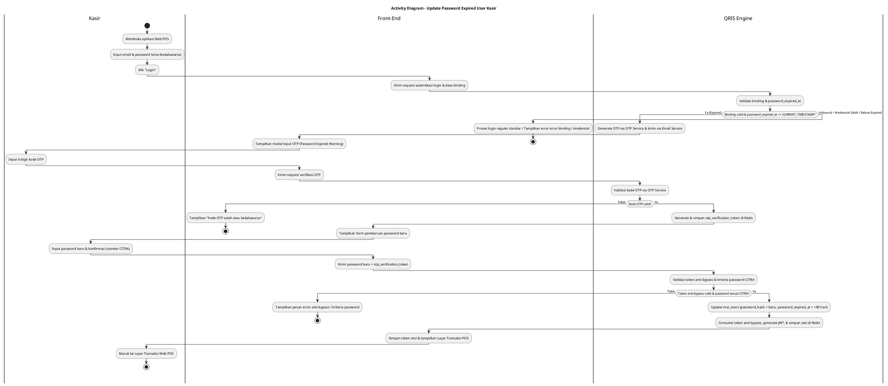
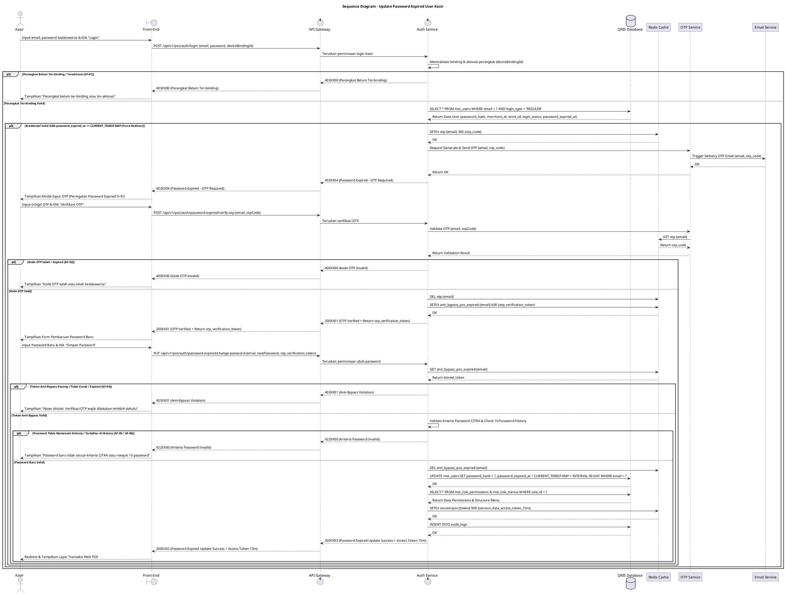

# 1 Deskripsi Use Case

**Tabel 1: Deskripsi Use Case Update Password Expired User Kasir**

| Elemen Spesifikasi | Deskripsi Detail |
| --- | --- |
| ID Use Case | UC-WPOS-005 |
| Nama Use Case | Update Password Expired User Kasir |
| Penjelasan Singkat | Proses pembaruan kata sandi (*force redirect*) yang wajib dilakukan oleh Kasir saat login reguler Web POS mendeteksi kata sandi telah kedaluwarsa (`password_expired_at <= CURRENT_TIMESTAMP`), melalui verifikasi OTP email via OTP Service hingga pembuatan password baru sesuai kriteria standar CITRA dengan perlindungan anti-bypass. |
| Aktor Utama | Kasir |
| Aktor Pendukung | OTP Service, Email Service |
| Deskripsi Singkat | Kasir memasukkan email dan password lama pada Halaman Login Web POS. Auth Service memvalidasi status binding perangkat dan mendeteksi bahwa kata sandi telah kedaluwarsa (`password_expired_at <= CURRENT_TIMESTAMP`), menolak login reguler (*force redirect*), dan memicu OTP Service untuk mengirimkan kode OTP ke email terdaftar. Kasir menginputkan kode OTP, Auth Service memverifikasi OTP dan membuat `otp_verification_token` anti-bypass di Redis Cache, lalu menampilkan form pembuatan password baru. Kasir menginput password baru sesuai kriteria standar CITRA. Auth Service memvalidasi token anti-bypass, kriteria CITRA, serta 10 riwayat password terakhir sebelum menyimpan password baru, memperbarui `password_expired_at = CURRENT_TIMESTAMP + 90 hari`, dan memberikan token sesi. |
| Pre-condition | 1. Aplikasi dan perangkat Web POS telah ter-binding serta ter-aktivasi pada toko/outlet (`store_id`) terkait. 2. Akun Kasir telah terdaftar di `mst_users` dengan `login_type = 'REGULER'`, `login_status = 'ACTIVE'`, `first_time_login_status = 'COMPLETED'`, serta terasosiasi dengan `merchant_id` dan `store_id`. 3. Kata sandi akun Kasir telah kedaluwarsa (`password_expired_at <= CURRENT_TIMESTAMP` / Hari ke-91). |
| Post-condition | 1. Password lama berhasil diganti dengan password baru yang memenuhi kriteria standar CITRA. 2. Tanggal kedaluwarsa kata sandi pada `mst_users` diperbarui menjadi `password_expired_at = CURRENT_TIMESTAMP + 90 hari`. 3. Sesi pengguna disimpan pada Redis Cache, dan Front-End Web POS mengarahkan Kasir ke Layar Utama Transaksi (POS Main Screen) sesuai `store_id` dan hak akses `role_id`. |
| Trigger | Kasir memasukkan kredensial saat login reguler dan sistem mendeteksi `password_expired_at` telah lewat (`<= CURRENT_TIMESTAMP`). |
| Nama Tabel | mst_users, mst_role_permissions, mst_role_menus, audit_logs |
| Integrasi | 1. **Redis Cache:** Penyimpanan temporary OTP, token anti-bypass (`otp_verification_token`), rate limit counter, dan session token. 2. **OTP Service:** Layanan pembuatan, validasi, dan manajemen siklus hidup kode OTP. 3. **Email Service:** Layanan pengiriman fisik email kode OTP ke alamat email terdaftar Kasir. |
| Asumsi | 1. Perangkat Web POS terhubung ke koneksi internet yang stabil dan memiliki status binding yang sah. 2. Kasir mengingat kredensial email dan password yang kedaluwarsa. 3. Kasir memiliki akses aktif ke alamat email terdaftar pada `mst_users`. 4. Layanan OTP Service, Email Service, dan Redis Cache beroperasi dengan stabil. |
| Keterbatasan | 1. Pembaruan kata sandi kedaluwarsa Kasir hanya dapat dilakukan pada perangkat Web POS yang sudah berstatus ter-binding dan ter-aktivasi. 2. Kasir tidak dapat melewati (*bypass*) alur pembaruan kata sandi untuk mengakses Layar Transaksi POS apabila `password_expired_at` telah kedaluwarsa. 3. Pembaruan password baru tidak dapat diproses tanpa memverifikasi kode OTP dan menyertakan `otp_verification_token` anti-bypass yang valid. |
| Aturan Bisnis/Sistem | 1. **Device Binding & Activation Requirement:** Aplikasi Web POS wajib memastikan perangkat telah ter-binding dan ter-aktivasi untuk `store_id` terkait sebelum memproses autentikasi. 2. **Expired Password Detection & Force Redirect:** Pada saat login reguler, apabila `password_expired_at <= CURRENT_TIMESTAMP`, sistem langsung menahan akses (*force redirect*) ke alur Pembaruan Password Kedaluwarsa. 3. **Automatic OTP Trigger:** Setelah deteksi password kedaluwarsa, Auth Service otomatis memicu **OTP Service** untuk mengirimkan 6-digit kode OTP dinamis (masa berlaku 5 menit) ke email terdaftar via Email Service. 4. **OTP Rate Limit & Attempt Penalty:** Pengiriman OTP dibatasi maksimal 3 kali per menit. Percobaan verifikasi OTP salah maksimal 3 kali berturut-turut sebelum OTP terblokir/hangus. 5. **Anti-Bypass OTP Token Mechanism:** Setelah verifikasi OTP berhasil, Auth Service menerbitkan `otp_verification_token` sekali pakai (*single-use*) yang disimpan pada **Redis Cache** (TTL 10 menit). Endpoint pembaruan password WAJIB memverifikasi dan mengonsumsi token ini. Request pembaruan password tanpa `otp_verification_token` yang sah akan ditolak (`403XX01 - Anti-Bypass Violation`). 6. **Standar Kriteria Password CITRA:** &nbsp;&nbsp;- Panjang minimal 8 karakter. &nbsp;&nbsp;- Wajib memuat kombinasi minimal 3 dari 4 kriteria: Karakter Spesial (Wajib, mis: `@, #, $`), Huruf Besar (`A-Z`), Huruf Kecil (`a-z`), dan Angka (`0-9`). &nbsp;&nbsp;- Dilarang mengandung User ID, Nama Depan, atau Nama Belakang. &nbsp;&nbsp;- Riwayat Password: Password baru tidak boleh sama dengan 10 riwayat password terakhir. 7. **Password Expiry Renewal:** Setelah pembaruan password sukses, sistem mengisi `password_expired_at = CURRENT_TIMESTAMP + 90 hari`, memuat `mst_role_permissions` & `mst_role_menus`, serta membuat sesi di Redis Cache. 10. **Web POS Request Signature Verification Standard:** Selain permintaan Aktivasi (UC-WPOS-001), seluruh permintaan API yang dikirimkan oleh peramban Web POS WAJIB ditandatangani secara digital (*digital signature* - header X-Signature) menggunakan Private Key yang tersimpan pada *Local Device Storage* peramban (*IndexedDB / Hardware TPM*). API Gateway WAJIB memverifikasi signature tersebut menggunakan web_pos_public_key yang tersimpan pada tabel mst_merchant_terminals (atau Redis Cache). Apabila signature tidak valid, kedaluwarsa, atau missing, API Gateway WAJIB menolak request secara langsung (HTTP Status 401 INVALID_DEVICE_SIGNATURE).  |
| Expired Sesi OTP | 5 Menit |

# 2 Main Flow

**Tabel 2: Main Flow Update Password Expired User Kasir**

| No. | Aktivitas | Deskripsi |
| ---: | --- | --- |
| 1 | Membuka Aplikasi Web POS | Kasir membuka halaman login Web POS pada perangkat yang sudah ter-binding dan ter-aktivasi. |
| 2 | Memasukkan Kredensial Reguler | Kasir menginput email dan password yang telah kedaluwarsa. |
| 3 | Mengirim Permintaan Login | Kasir menekan tombol "Login", Front-End mengolah data dan mengirim request autentikasi ke Auth Service via API Gateway. |
| 4 | Memvalidasi Binding & Expired Password | Auth Service memverifikasi binding perangkat, mencocokkan email & password pada `mst_users`, dan menemukan `password_expired_at <= CURRENT_TIMESTAMP`. |
| 5 | Pengiriman OTP & Force Redirect | Auth Service menolak login reguler, memicu OTP Service untuk membuat & mengirimkan kode OTP 6-digit ke email Kasir via Email Service, dan Front-End menampilkan modal/form masukan OTP. |
| 6 | Memasukkan Kode OTP | Kasir menerima email, lalu menginput 6-digit kode OTP pada form verifikasi Front-End. |
| 7 | Verifikasi OTP & Generasi Token Anti-Bypass | Auth Service memvalidasi kode OTP melalui OTP Service. Setelah cocok, Auth Service membuat `otp_verification_token` dinamis di Redis Cache (TTL 10m) dan mengembalikannya ke Front-End. |
| 8 | Memasukkan Password Baru | Front-End menampilkan form pembuatan password baru. Kasir menginput password baru dan konfirmasi password sesuai kriteria standar CITRA. |
| 9 | Memvalidasi Password & Token Anti-Bypass | Front-End mengirimkan password baru beserta `otp_verification_token`. Auth Service memverifikasi keabsahan token anti-bypass di Redis Cache (lalu mengonsumsi/menghapusnya), serta menguji kriteria password CITRA dan riwayat 10 password terakhir. |
| 10 | Memperbarui Expiry & Sesi | Auth Service memperbarui `mst_users` (`password_hash = hash_baru`, `password_expired_at = CURRENT_TIMESTAMP + 90 hari`), memuat `mst_role_permissions` & `mst_role_menus`, membuat token sesi (JWT) di Redis Cache, serta mencatat `audit_logs`. |
| 11 | Use Case Selesai | Front-End Web POS menyimpan token sesi dan menampilkan Layar Utama Transaksi (POS Main Screen) kepada Kasir. |

# 3 Alternative Flow

**Tabel 3: Alternative Flow Update Password Expired User Kasir**

| Kode | Alternative Flow | Deskripsi |
| --- | --- | --- |
| AF-01 | Perangkat Belum Ter-binding / Teraktivasi | Pada langkah 4, apabila perangkat Web POS belum ter-binding atau belum ter-aktivasi, Sistem menolak akses dan Front-End menampilkan `Perangkat Web POS belum ter-binding atau ter-aktivasi. Hubungi Admin.`. |
| AF-02 | Kode OTP Salah / Kadaluarsa | Pada langkah 7, apabila kode OTP yang diinput salah atau telah melewati batas 5 menit, OTP Service menolak verifikasi dan Front-End menampilkan `Kode OTP yang Anda masukkan salah atau telah kedaluwarsa.`. |
| AF-03 | Rate Limit Request OTP Terlampaui | Pada langkah 5, apabila permintaan ulang OTP melebihi 3 kali per menit, OTP Service menolak pengiriman dan Front-End menampilkan `Batas permintaan OTP terlampaui (maksimal 3 kali per menit). Silakan tunggu beberapa saat.`. |
| AF-04 | Indikasi Bypass OTP (Token Anti-Bypass Tidak Valid / Expired) | Pada langkah 9, apabila request pembaruan password dikirimkan tanpa `otp_verification_token` atau menggunakan token yang kadaluarsa/sudah terpakai, Sistem menolak permintaan dan Front-End menampilkan `Akses ditolak. Verifikasi OTP wajib dilakukan terlebih dahulu (Anti-Bypass Violation).`. |
| AF-05 | Password Baru Tidak Memenuhi Kriteria CITRA | Pada langkah 9, apabila password baru kurang dari 8 karakter, tidak memenuhi 3/4 kombinasi (karakter spesial wajib), atau mengandung nama/ID, Sistem menolak dan Front-End menampilkan `Password baru harus minimal 8 karakter dan memuat kombinasi kriteria CITRA.`. |
| AF-06 | Password Baru Sama dengan Riwayat 10 Password Terakhir | Pada langkah 9, apabila password baru pernah digunakan dalam 10 riwayat password terakhir, Sistem menolak dan Front-End menampilkan `Password baru tidak boleh sama dengan 10 riwayat password terakhir.`. |

# 4 Status Front-End

**Tabel 4: Status Front-End Update Password Expired User Kasir**

| No. | Nama Status | Deskripsi Tampilan Front-End |
| ---: | --- | --- |
| 1 | IDLE | Tampilan default form login reguler Kasir. |
| 2 | OTP_VERIFICATION | Tampilan modal/form masukan 6-digit kode OTP dengan banner "Password Kasir Anda telah kedaluwarsa (Hari ke-91). Masukkan OTP untuk memperbarui password." beserta countdown timer. |
| 3 | CHANGE_PASSWORD | Tampilan form input password baru dan konfirmasi password dilengkapi indikator kekuatan password standar CITRA. |
| 4 | LOADING | Tampilan indikator memuat (spinner) saat verifikasi kredensial, OTP, atau pembaruan password. |
| 5 | SUCCESS | Status sukses pembaruan password sebelum halaman dialihkan ke Layar Transaksi POS. |
| 6 | ERROR | Tampilan pesan kesalahan (alert banner/toast) saat terjadi binding invalid, OTP salah, pelanggaran anti-bypass, atau password tidak sesuai kriteria CITRA. |

# 5 Activity Diagram Update Password Expired User Kasir

# 6 Sequence Diagram Update Password Expired User Kasir

# 7 Response Code

**Tabel 5: Response Code Update Password Expired User Kasir**

| No. | HTTP Status | Response Code | Nama Response | Deskripsi | Respons Front-End |
| ---: | ---: | --- | --- | --- | --- |
| 1 | 200 | 200XX01 | POS_OTP_VERIFIED_SUCCESS | Verifikasi kode OTP berhasil melalui OTP Service dan token anti-bypass (`otp_verification_token`) diterbitkan. | Menampilkan form pengisian password baru. |
| 2 | 200 | 200XX02 | POS_PASSWORD_EXPIRED_UPDATE_SUCCESS | Pembaruan password kedaluwarsa sukses, `password_expired_at` diperbarui 90 hari, dan token sesi dibuat di Redis Cache. | Mengarahkan Kasir ke Layar Transaksi Web POS. |
| 3 | 400 | 400XX00 | INVALID_OTP_CODE | Kode OTP yang dimasukkan tidak cocok atau masa berlaku 5 menit telah kedaluwarsa pada OTP Service. | Menampilkan pesan kesalahan OTP tidak valid. |
| 4 | 403 | 403XX00 | DEVICE_NOT_BOUND | Perangkat Web POS belum ter-binding atau ter-aktivasi untuk store_id terkait. | Menampilkan pesan error status binding perangkat. |
| 5 | 403 | 403XX01 | ANTI_BYPASS_VIOLATION | Permintaan pembaruan password dikirim tanpa `otp_verification_token` yang sah/terverifikasi. | Menampilkan pesan akses ditolak dan mewajibkan verifikasi OTP ulang. |
| 6 | 403 | 403XX04 | PASSWORD_EXPIRED_OTP_REQUIRED | Password Kasir telah kedaluwarsa (`password_expired_at <= CURRENT_TIMESTAMP`), sistem mengirimkan OTP ke email. | Mengarahkan Front-End ke modal verifikasi OTP. |
| 7 | 422 | 422XX00 | PASSWORD_CRITERIA_INVALID | Password baru tidak memenuhi kriteria standar CITRA (min 8 karakter, 3/4 kombinasi dengan karakter spesial wajib, dilarang mengandung ID/nama). | Menampilkan pesan error kriteria password. |
| 8 | 422 | 422XX01 | PASSWORD_HISTORY_VIOLATION | Password baru yang dimasukkan sama dengan salah satu dari 10 riwayat password terakhir. | Menampilkan pesan error riwayat password. |
| 9 | 429 | 429XX00 | OTP_RATE_LIMIT_EXCEEDED | Permintaan pengiriman ulang OTP melebihi batas 3 kali per menit pada OTP Service. | Menampilkan pesan peringatan rate limit OTP. |
| 10 | 500 | 500XX00 | INTERNAL_AUTH_ERROR | Gangguan internal pada layanan autentikasi / OTP Service / Email Service. | Menampilkan pesan kesalahan sistem internal. |

| 99 | 401 | 401XX01 | INVALID_DEVICE_SIGNATURE | Signature digital request Web POS (header X-Signature) tidak valid atau tidak cocok dengan web_pos_public_key pada mst_merchant_terminals. | Menampilkan pesan kesalahan Signature digital perangkat Web POS tidak valid atau tidak terverifikasi. |

# 8 Desain Antarmuka

**Tabel 6: Desain Antarmuka Update Password Expired User Kasir**

| Halaman | Komponen dan State Utama |
| --- | --- |
| Halaman Login Web POS | - Label **Nama Store / Outlet & Device ID** (Binding Info). - Form Input **Email** & **Password Lama** (`IDLE` / `LOADING`). - Tombol Utama **"Login"** (`IDLE` / `LOADING`). |
| Modal Verifikasi OTP Password Expired | - Banner Peringatan Red: **"Password Kasir Anda telah kedaluwarsa (Hari ke-91). Masukkan kode OTP yang dikirim ke email."**. - Form Input 6-Digit **Kode OTP** (`OTP_VERIFICATION` / `ERROR`). - Tombol **"Verifikasi OTP"** & Link **"Kirim Ulang OTP"** (dengan Countdown Timer). |
| Form Pembaruan Password Baru | - Form Input **Password Baru** & **Konfirmasi Password** (`CHANGE_PASSWORD`). - Checklist Indikator Kriteria Password Standar CITRA. - Tombol **"Simpan Password Baru"** (`IDLE` / `LOADING`). |
| Layar Utama Transaksi Web POS | - Header Info Kasir & Store (Menampilkan Nama Kasir, Email, `store_id`, `merchant_id`, & `role_id`). - Menu & Fitur Transaksi Kasir (Dikelola berdasarkan `mst_role_menus` dan `mst_role_permissions`). |
