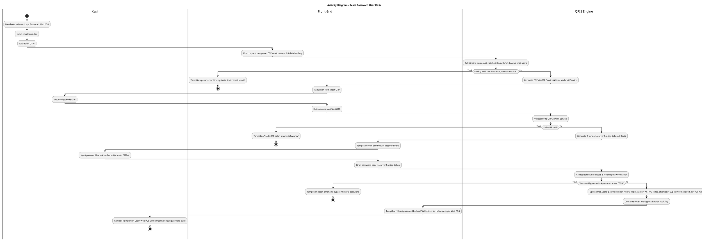
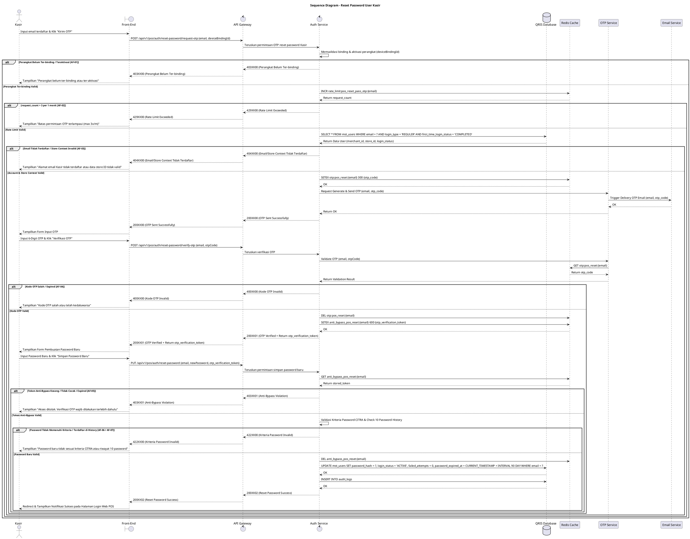

# 1 Deskripsi Use Case

**Tabel 1: Deskripsi Use Case Reset Password User Kasir**

| Elemen Spesifikasi | Deskripsi Detail |
| --- | --- |
| ID Use Case | UC-WPOS-006 |
| Nama Use Case | Reset Password User Kasir |
| Penjelasan Singkat | Proses pemulihan kata sandi (Lupa Password) yang dilakukan oleh Kasir untuk membuat kata sandi baru melalui verifikasi kode OTP email via OTP Service pada perangkat Web POS yang ter-binding dengan perlindungan anti-bypass. |
| Aktor Utama | Kasir |
| Aktor Pendukung | OTP Service, Email Service |
| Deskripsi Singkat | Kasir memilih opsi "Lupa Password?" pada Halaman Login Web POS dan menginput email terdaftar. Auth Service memvalidasi status binding perangkat dan memverifikasi akun pada `mst_users` (`login_type = 'REGULER'`, `login_status = 'ACTIVE'` / `BLOCKED`, `first_time_login_status = 'COMPLETED'`, `merchant_id` & `store_id` valid), memicu OTP Service untuk membuat & mengirimkan 6-digit kode OTP ke email via Email Service (max 3 request/menit). Kasir memasukkan kode OTP, OTP Service memvalidasi OTP, dan Auth Service menerbitkan `otp_verification_token` anti-bypass di Redis Cache. Kasir menginput password baru sesuai kriteria standar CITRA. Auth Service memvalidasi token anti-bypass, kriteria CITRA, serta 10 riwayat password terakhir sebelum meng-update password hash, mereset counter gagal login, memulihkan status akun menjadi `login_status = 'ACTIVE'`, dan memperbarui `password_expired_at = CURRENT_TIMESTAMP + 90 hari`. |
| Pre-condition | 1. Aplikasi dan perangkat Web POS telah ter-binding serta ter-aktivasi pada toko/outlet (`store_id`) terkait. 2. Akun Kasir telah terdaftar di `mst_users` dengan `login_type = 'REGULER'`, `first_time_login_status = 'COMPLETED'`, berstatus `ACTIVE` atau `BLOCKED` (akibat penalti 5x salah password), serta terasosiasi dengan `merchant_id` dan `store_id`. 3. Kasir memiliki akses aktif ke email terdaftar di sistem. |
| Post-condition | 1. Password baru yang memenuhi kriteria standar CITRA berhasil disimpan pada tabel `mst_users`. 2. Counter gagal login di-reset (`failed_attempts = 0`) dan status akun dipulihkan menjadi `login_status = 'ACTIVE'`. 3. Masa berlaku kata sandi diperbarui menjadi `password_expired_at = CURRENT_TIMESTAMP + 90 hari`. 4. Front-End Web POS menampilkan notifikasi sukses dan mengarahkan Kasir kembali ke Halaman Login Web POS untuk melakukan login menggunakan password baru. |
| Trigger | Kasir menekan tombol/link "Lupa Password?" pada Halaman Login Web POS. |
| Nama Tabel | mst_users, audit_logs |
| Integrasi | 1. **Redis Cache:** Penyimpanan temporary OTP, token anti-bypass (`otp_verification_token`), dan rate limit counter (max 3 request/menit). 2. **OTP Service:** Layanan pembuatan, validasi, dan manajemen siklus hidup kode OTP. 3. **Email Service:** Layanan pengiriman fisik email kode OTP ke alamat email terdaftar Kasir. |
| Asumsi | 1. Perangkat Web POS terhubung ke koneksi internet yang stabil dan memiliki status binding yang sah. 2. Kasir memiliki akses ke email terdaftar di sistem. 3. Layanan OTP Service, Email Service, dan Redis Cache beroperasi dengan stabil. |
| Keterbatasan | 1. Reset Password Kasir hanya dapat dilakukan pada perangkat Web POS yang sudah berstatus ter-binding dan ter-aktivasi. 2. Fitur Reset Password hanya berlaku bagi akun dengan `login_type = 'REGULER'` yang telah menyelesaikan First Time Login (`first_time_login_status = 'COMPLETED'`). 3. Pembaruan password baru tidak dapat diproses tanpa memverifikasi kode OTP dan menyertakan `otp_verification_token` anti-bypass yang valid. |
| Aturan Bisnis/Sistem | 1. **Device Binding & Activation Requirement:** Aplikasi Web POS wajib memastikan perangkat telah ter-binding dan ter-aktivasi untuk `store_id` terkait sebelum memproses permintaan reset password. 2. **Reset Password Eligibility:** Pengajuan Reset Password diperuntukkan bagi akun Kasir pada `mst_users` dengan `login_type = 'REGULER'`, `first_time_login_status = 'COMPLETED'`, serta terasosiasi dengan `merchant_id` dan `store_id` yang valid. Pengajuan diizinkan baik untuk akun berstatus `ACTIVE` maupun `BLOCKED` (akibat penalti 5x salah password). 3. **Sensitive Endpoint Rate Limiting:** Permintaan pengiriman OTP pada endpoint Reset Password dibatasi maksimal **3 kali per menit** per alamat email (`rate_limit:pos_reset_pass_otp:{email}`). 4. **OTP Email Verification:** Setelah email dan binding terverifikasi valid, Auth Service berintegrasi dengan **OTP Service** untuk memproduksi dan mengirimkan kode OTP dinamis (6 digit, masa berlaku 5 menit) ke email terdaftar via Email Service. 5. **Anti-Bypass OTP Token Mechanism:** Setelah verifikasi OTP berhasil melalui OTP Service, Auth Service menerbitkan `otp_verification_token` sekali pakai (*single-use*) yang disimpan pada **Redis Cache** (TTL 10 menit). Endpoint reset password WAJIB memverifikasi dan mengonsumsi token ini. Request reset password tanpa `otp_verification_token` yang sah akan ditolak (`403XX01 - Anti-Bypass Violation`). 6. **Standar Kriteria Password CITRA:** &nbsp;&nbsp;- Panjang minimal 8 karakter. &nbsp;&nbsp;- Wajib memuat kombinasi minimal 3 dari 4 kriteria: Karakter Spesial (Wajib, mis: `@, #, $`), Huruf Besar (`A-Z`), Huruf Kecil (`a-z`), dan Angka (`0-9`). &nbsp;&nbsp;- Dilarang mengandung User ID, Nama Depan, atau Nama Belakang. &nbsp;&nbsp;- Riwayat Password: Password baru tidak boleh sama dengan 10 riwayat password terakhir. 7. **Account Restoration & Password Expiry Reset:** Setelah reset password sukses, sistem mereset `failed_attempts = 0`, memulihkan status akun menjadi `login_status = 'ACTIVE'`, meng-update `password_expired_at = CURRENT_TIMESTAMP + 90 hari`, serta mengonsumsi `otp_verification_token`. 10. **Web POS Request Signature Verification Standard:** Selain permintaan Aktivasi (UC-WPOS-001), seluruh permintaan API yang dikirimkan oleh peramban Web POS WAJIB ditandatangani secara digital (*digital signature* - header X-Signature) menggunakan Private Key yang tersimpan pada *Local Device Storage* peramban (*IndexedDB / Hardware TPM*). API Gateway WAJIB memverifikasi signature tersebut menggunakan web_pos_public_key yang tersimpan pada tabel mst_merchant_terminals (atau Redis Cache). Apabila signature tidak valid, kedaluwarsa, atau missing, API Gateway WAJIB menolak request secara langsung (HTTP Status 401 INVALID_DEVICE_SIGNATURE).  |
| Expired Sesi OTP | 5 Menit |

# 2 Main Flow

**Tabel 2: Main Flow Reset Password User Kasir**

| No. | Aktivitas | Deskripsi |
| ---: | --- | --- |
| 1 | Membuka Halaman Lupa Password | Kasir mengklik link "Lupa Password?" pada Halaman Login Web POS. |
| 2 | Memasukkan Email Terdaftar | Kasir menginput alamat email yang terdaftar pada form Lupa Password. |
| 3 | Mengirim Permintaan OTP | Kasir menekan tombol "Kirim OTP", Front-End Web POS mengolah data dan mengirim request pengajuan OTP reset password beserta data binding perangkat ke Auth Service via API Gateway. |
| 4 | Memvalidasi Binding, Rate Limit & Email | Auth Service memverifikasi status binding perangkat, mengecek rate limit (max 3x/menit via Redis Cache), dan memvalidasi keberadaan akun Kasir pada `mst_users` (`login_type = 'REGULER'`, `first_time_login_status = 'COMPLETED'`, `merchant_id` & `store_id` valid). |
| 5 | Pengiriman OTP via OTP Service | Auth Service memicu OTP Service untuk membuat 6-digit kode OTP dinamis (disimpan di Redis Cache) dan mengirimkannya ke email Kasir via Email Service. |
| 6 | Memasukkan Kode OTP | Kasir menerima email, lalu menginput 6-digit kode OTP pada form verifikasi Front-End Web POS. |
| 7 | Verifikasi OTP & Generasi Token Anti-Bypass | Auth Service memvalidasi kode OTP melalui OTP Service. Setelah cocok, Auth Service membuat `otp_verification_token` dinamis di Redis Cache (TTL 10m) dan mengembalikannya ke Front-End. |
| 8 | Memasukkan Password Baru | Front-End menampilkan form pembuatan password baru. Kasir menginput password baru dan konfirmasi password sesuai kriteria standar CITRA. |
| 9 | Memvalidasi Password & Token Anti-Bypass | Front-End mengirimkan password baru beserta `otp_verification_token`. Auth Service memverifikasi keabsahan token anti-bypass di Redis Cache (lalu mengonsumsi/menghapusnya), serta menguji kriteria password CITRA dan riwayat 10 password terakhir. |
| 10 | Memperbarui Password & Status Akun | Auth Service memperbarui `mst_users` (`password_hash = hash_baru`, `login_status = 'ACTIVE'`, `failed_attempts = 0`, `password_expired_at = CURRENT_TIMESTAMP + 90 hari`) dan mencatat `audit_logs`. |
| 11 | Use Case Selesai | Auth Service mengembalikan respons sukses, dan Front-End Web POS menampilkan notifikasi `Reset password berhasil. Silakan login menggunakan password baru Anda.` lalu mengarahkan Kasir ke Halaman Login Web POS. |

# 3 Alternative Flow

**Tabel 3: Alternative Flow Reset Password User Kasir**

| Kode | Alternative Flow | Deskripsi |
| --- | --- | --- |
| AF-01 | Perangkat Belum Ter-binding / Teraktivasi | Pada langkah 4, apabila perangkat Web POS belum ter-binding atau belum ter-aktivasi, Sistem menolak akses dan Front-End menampilkan `Perangkat Web POS belum ter-binding atau ter-aktivasi. Hubungi Admin.`. |
| AF-02 | Rate Limit Pengiriman OTP Terlampaui | Pada langkah 4, apabila permintaan OTP melebihi 3 kali per menit, OTP Service menolak pengiriman dan Front-End menampilkan `Batas permintaan OTP terlampaui (maksimal 3 kali per menit). Silakan tunggu beberapa saat.`. |
| AF-03 | Email Tidak Terdaftar / Status Akun Invalid | Pada langkah 4, apabila email tidak ditemukan di `mst_users`, `first_time_login_status != 'COMPLETED'`, atau `store_id` tidak sesuai, Sistem menolak pengajuan dan Front-End menampilkan `Alamat email Kasir tidak terdaftar atau akun belum menyelesaikan aktivasi awal.`. |
| AF-04 | Kode OTP Salah / Kadaluarsa | Pada langkah 7, apabila kode OTP yang diinput salah atau telah melewati batas 5 menit, OTP Service menolak verifikasi dan Front-End menampilkan `Kode OTP yang Anda masukkan salah atau telah kedaluwarsa.`. |
| AF-05 | Indikasi Bypass OTP (Token Anti-Bypass Tidak Valid / Expired) | Pada langkah 9, apabila request reset password dikirimkan tanpa `otp_verification_token` atau menggunakan token yang kadaluarsa/sudah terpakai, Sistem menolak permintaan dan Front-End menampilkan `Akses ditolak. Verifikasi OTP wajib dilakukan terlebih dahulu (Anti-Bypass Violation).`. |
| AF-06 | Password Baru Tidak Memenuhi Kriteria CITRA | Pada langkah 9, apabila password baru kurang dari 8 karakter, tidak memenuhi 3/4 kombinasi (karakter spesial wajib), atau mengandung nama/ID, Sistem menolak dan Front-End menampilkan `Password baru harus minimal 8 karakter dan memuat kombinasi kriteria CITRA.`. |
| AF-07 | Password Baru Sama dengan Riwayat 10 Password Terakhir | Pada langkah 9, apabila password baru pernah digunakan dalam 10 riwayat password terakhir, Sistem menolak dan Front-End menampilkan `Password baru tidak boleh sama dengan 10 riwayat password terakhir.`. |

# 4 Status Front-End

**Tabel 4: Status Front-End Reset Password User Kasir**

| No. | Nama Status | Deskripsi Tampilan Front-End |
| ---: | --- | --- |
| 1 | IDLE | Form masukan email pada halaman Lupa Password Web POS dalam kondisi default. |
| 2 | OTP_VERIFICATION | Form/modal masukan 6-digit kode OTP dilengkapi countdown timer dan tombol resend OTP. |
| 3 | CHANGE_PASSWORD | Form masukan password baru dan konfirmasi password dilengkapi indikator kekuatan password standar CITRA. |
| 4 | LOADING | Indikator memuat (spinner) saat pengiriman OTP, verifikasi OTP, atau reset password. |
| 5 | SUCCESS | Tampilan banner notifikasi sukses berwarna hijau memberitahukan bahwa reset password berhasil. |
| 6 | ERROR | Tampilan pesan kesalahan (alert banner/toast) saat terjadi binding invalid, email invalid, rate limit terlampaui, OTP salah, pelanggaran anti-bypass, atau password tidak sesuai kriteria CITRA. |

# 5 Activity Diagram Reset Password User Kasir

# 6 Sequence Diagram Reset Password User Kasir

# 7 Response Code

**Tabel 5: Response Code Reset Password User Kasir**

| No. | HTTP Status | Response Code | Nama Response | Deskripsi | Respons Front-End |
| ---: | ---: | --- | --- | --- | --- |
| 1 | 200 | 200XX00 | POS_RESET_OTP_SENT_SUCCESS | Email terdaftar Kasir valid dan kode OTP reset password berhasil dikirimkan via OTP Service. | Menampilkan form masukan 6-digit kode OTP. |
| 2 | 200 | 200XX01 | POS_RESET_OTP_VERIFIED_SUCCESS | Verifikasi kode OTP berhasil melalui OTP Service dan token anti-bypass (`otp_verification_token`) diterbitkan. | Menampilkan form pengisian password baru. |
| 3 | 200 | 200XX02 | POS_RESET_PASSWORD_SUCCESS | Reset password Kasir sukses, akun berstatus `ACTIVE`, `failed_attempts` di-reset, dan `password_expired_at` diisi 90 hari. | Mengarahkan Kasir ke Halaman Login Web POS dengan pesan sukses. |
| 4 | 400 | 400XX00 | INVALID_OTP_CODE | Kode OTP yang dimasukkan tidak cocok atau masa berlaku 5 menit telah kedaluwarsa pada OTP Service. | Menampilkan pesan kesalahan OTP tidak valid. |
| 5 | 403 | 403XX00 | DEVICE_NOT_BOUND | Perangkat Web POS belum ter-binding atau ter-aktivasi untuk store_id terkait. | Menampilkan pesan error status binding perangkat. |
| 6 | 403 | 403XX01 | ANTI_BYPASS_VIOLATION | Permintaan reset password dikirim tanpa `otp_verification_token` yang sah/terverifikasi. | Menampilkan pesan akses ditolak dan mewajibkan verifikasi OTP ulang. |
| 7 | 404 | 404XX00 | EMAIL_NOT_FOUND | Alamat email Kasir yang dimasukkan tidak terdaftar di `mst_users` atau `store_id` tidak sesuai. | Menampilkan pesan error email tidak terdaftar. |
| 8 | 422 | 422XX00 | PASSWORD_CRITERIA_INVALID | Password baru tidak memenuhi kriteria standar CITRA (min 8 karakter, 3/4 kombinasi dengan karakter spesial wajib, dilarang mengandung ID/nama). | Menampilkan pesan error kriteria password. |
| 9 | 422 | 422XX01 | PASSWORD_HISTORY_VIOLATION | Password baru yang dimasukkan sama dengan salah satu dari 10 riwayat password terakhir. | Menampilkan pesan error riwayat password. |
| 10 | 429 | 429XX00 | RESET_OTP_RATE_LIMIT_EXCEEDED | Permintaan pengiriman OTP reset password melebihi batas 3 kali per menit pada OTP Service. | Menampilkan pesan peringatan rate limit OTP. |
| 11 | 500 | 500XX00 | INTERNAL_AUTH_ERROR | Gangguan internal pada layanan autentikasi / OTP Service / Email Service. | Menampilkan pesan kesalahan sistem internal. |

| 99 | 401 | 401XX01 | INVALID_DEVICE_SIGNATURE | Signature digital request Web POS (header X-Signature) tidak valid atau tidak cocok dengan web_pos_public_key pada mst_merchant_terminals. | Menampilkan pesan kesalahan Signature digital perangkat Web POS tidak valid atau tidak terverifikasi. |

# 8 Desain Antarmuka

**Tabel 6: Desain Antarmuka Reset Password User Kasir**

| Halaman | Komponen dan State Utama |
| --- | --- |
| Halaman Lupa Password Web POS | - Label **Nama Store / Outlet & Device ID** (Binding Info). - Form Input **Email Terdaftar** (`IDLE` / `ERROR`). - Tombol **"Kirim OTP"** (`IDLE` / `LOADING`). |
| Modal Verifikasi OTP Reset Password | - Form Input 6-Digit **Kode OTP** (`OTP_VERIFICATION` / `ERROR`). - Tombol **"Verifikasi OTP"** & Link **"Kirim Ulang OTP"** (dengan Countdown Timer). |
| Form Pembuatan Password Baru | - Form Input **Password Baru** & **Konfirmasi Password** (`CHANGE_PASSWORD`). - Checklist Indikator Kriteria Password Standar CITRA. - Tombol **"Simpan Password Baru"** (`IDLE` / `LOADING`). |
| Halaman Login Web POS (Post Reset) | - Banner Notification Green (`SUCCESS`): Pesan **"Reset password berhasil. Silakan login menggunakan password baru Anda."**. - Form Input Email & Password Baru (`IDLE`). |
