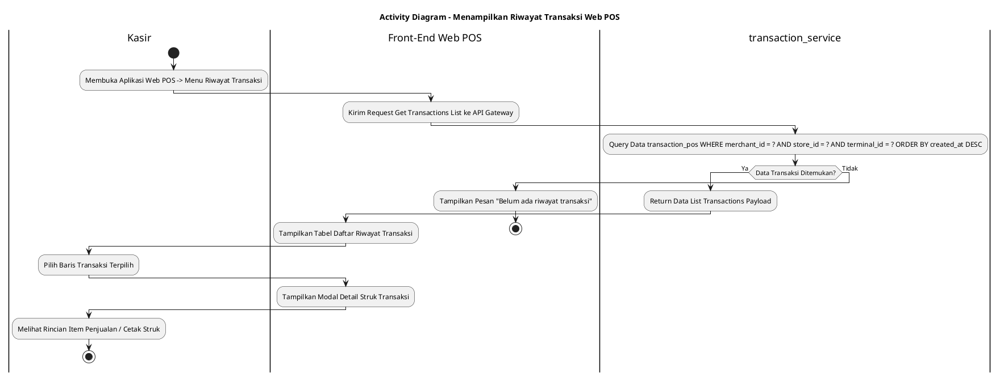
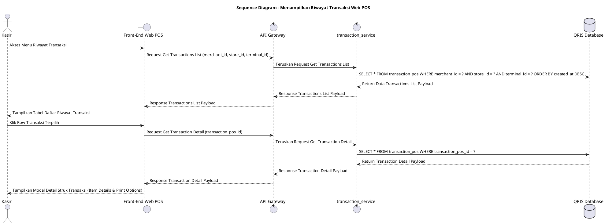

# 1 Deskripsi Use Case

**Tabel 1: Deskripsi Use Case Menampilkan Riwayat Transaksi Web POS**

| Elemen Spesifikasi | Deskripsi Detail |
| --- | --- |
| ID Use Case | UC-WPOS-008 |
| Nama Use Case | Menampilkan Riwayat Transaksi Web POS |
| Penjelasan Singkat | Fitur Aplikasi Web POS yang memfasilitasi Kasir untuk melihat daftar seluruh riwayat transaksi penjualan yang telah dibuat/diproses pada perangkat terminal Web POS dari tabel `transaction_pos` melalui `transaction_service`. |
| Aktor Utama | Kasir |
| Aktor Pendukung | Transaction Service (`transaction_service`) |
| Deskripsi Singkat | Kasir melakukan otentikasi login ke Aplikasi Web POS. Pada halaman utama navigasi Web POS, Kasir mengklik menu **Riwayat Transaksi** (atau Transaction History). Sistem menampilkan halaman riwayat transaksi yang memuat daftar seluruh transaksi penjualan kasir dari tabel **`transaction_pos`**. Kasir dapat menyaring riwayat berdasarkan rentang tanggal (*date range*), status transaksi (`SUCCESS`, `FAILED`, `CANCELLED`, `PENDING`), atau mencari berdasarkan Nomor Resi / ID Transaksi. Front-End Web POS mengirim request kueri ke API Gateway. **`transaction_service`** mengambil daftar data transaksi dari tabel **`transaction_pos`** yang diisolasi khusus untuk entitas merchant (`merchant_id`), toko (`store_id`), dan terminal Web POS (`terminal_id`) terkait. Sistem menampilkan daftar transaksi secara terurut (*latest first*) yang memuat Nomor Resi, Tanggal & Waktu, Metode Pembayaran (QRIS, Tunai, dll.), Total Nominal, dan Status Badge. Kasir dapat mengklik salah satu baris transaksi untuk melihat rincian detail struk/penjualan. |
| Pre-condition | 1. Perangkat Web POS telah ter-binding dan berstatus aktif. 2. Kasir telah berhasil login ke Aplikasi Web POS dengan status akun aktif (`login_status = 'ACTIVE'`). |
| Post-condition | 1. Sistem menyajikan daftar lengkap riwayat transaksi kasir dari tabel `transaction_pos` secara akurat. 2. Kasir dapat melihat rincian detail struk penjualan untuk setiap transaksi yang dipilih. |
| Trigger | Kasir mengklik menu **Riwayat Transaksi** pada aplikasi Web POS. |
| Nama Tabel | transaction_pos, audit_logs |
| Integrasi | 1. **Web POS Front-End App:** Antarmuka aplikasi kasir POS, menu Riwayat Transaksi, pencarian resi, dan modal detail struk. 2. **Transaction Service (`transaction_service`):** Microservice backend pengelola kueri riwayat transaksi POS, otorisasi sesi kasir, dan isolasi data per toko/terminal. |
| Asumsi | 1. Setiap transaksi yang berhasil dieksekusi oleh kasir tersimpan pada tabel `transaction_pos` dengan terasosiasi pada `merchant_id`, `store_id`, dan `terminal_id`. 2. Kasir hanya dapat melihat riwayat transaksi sesuai toko/terminal tempat kasir bertugas atau sesuai wewenang akun kasir. |
| Keterbatasan | 1. Fitur ini bersifat *read-only* untuk kebutuhan pemantauan dan pencetakan ulang struk transaksi. 2. Kueri data riwayat transaksi secara otomatis dibatasi pada entitas merchant dan toko terkait. |
| Aturan Bisnis/Sistem | 1. **Terminal Data Isolation Standard:** Kueri prapemrosesan riwayat transaksi WAJIB mengisolasi data transaksi dari tabel `transaction_pos` berdasarkan `merchant_id`, `store_id`, dan `terminal_id` kasir yang sedang login. 2. **Default Sorting Standard:** Daftar riwayat transaksi WAJIB disajikan secara terurut berdasarkan waktu transaksi terbaru (*ORDER BY created_at DESC*). 3. **Supported Transaction Status:** Status transaksi yang ditampilkan pada daftar meliputi **SUCCESS**, **PENDING**, **FAILED**, dan **CANCELLED**. 4. **Audit Trail Standard:** Setiap pengaksesan menu riwayat transaksi mencatat `user_id`, `terminal_id`, `store_id`, dan timestamp pada `audit_logs`. 10. **Web POS Request Signature Verification Standard:** Selain permintaan Aktivasi (UC-WPOS-001), seluruh permintaan API yang dikirimkan oleh peramban Web POS WAJIB ditandatangani secara digital (*digital signature* - header X-Signature) menggunakan Private Key yang tersimpan pada *Local Device Storage* peramban (*IndexedDB / Hardware TPM*). API Gateway WAJIB memverifikasi signature tersebut menggunakan web_pos_public_key yang tersimpan pada tabel mst_merchant_terminals (atau Redis Cache). Apabila signature tidak valid, kedaluwarsa, atau missing, API Gateway WAJIB menolak request secara langsung (HTTP Status 401 INVALID_DEVICE_SIGNATURE).  |

# 2 Main Flow

**Tabel 2: Main Flow Menampilkan Riwayat Transaksi Web POS**

| No. | Aktivitas | Deskripsi |
| ---: | --- | --- |
| 1 | Membuka Menu Riwayat Transaksi | Kasir melakukan login dan mengklik menu **Riwayat Transaksi** pada navigasi Web POS. |
| 2 | Menampilkan Daftar Riwayat Transaksi | Front-End mengirim request pengambilan data ke API Gateway. `transaction_service` mengambil daftar transaksi dari `transaction_pos` dan mengembalikannya ke Front-End. |
| 3 | Menyajikan Tabel Riwayat | Sistem menampilkan daftar riwayat transaksi yang memuat Nomor Resi, Tanggal/Waktu, Metode Pembayaran, Nominal Total, dan Status Badge. |
| 4 | Memfilter / Mencari Transaksi (Opsional) | Kasir memasukkan kata kunci Nomor Resi atau memilih filter rentang tanggal/status transaksi. |
| 5 | Memilih Baris Transaksi | Kasir mengklik salah satu baris transaksi untuk melihat rincian detail. |
| 6 | Menampilkan Detail Struk Transaksi | Sistem menampilkan modal detail transaksi yang memuat rincian item barang, harga, metode pembayaran, nominal bayar, kembalian, dan tombol Cetak Struk. |
| 7 | Use Case Selesai | Proses menampilkan riwayat transaksi kasir selesai dilaksanakan. |

# 3 Alternative Flow

**Tabel 3: Alternative Flow Menampilkan Riwayat Transaksi Web POS**

| Kode | Alternative Flow | Deskripsi |
| --- | --- | --- |
| AF-01 | Riwayat Transaksi Kosong | Pada langkah 2-3, apabila belum ada transaksi yang dilakukan pada terminal tersebut, Sistem menampilkan pesan `Belum ada riwayat transaksi`. |
| AF-02 | Hasil Pencarian Resi Tidak Ditemukan | Pada langkah 4, apabila Nomor Resi / ID Transaksi yang dicari tidak ditemukan, Sistem menampilkan pesan `Transaksi tidak ditemukan`. |
| AF-03 | Gagal Terhubung ke Database Server | Pada langkah 2, apabila koneksi ke database terputus total, Sistem mengembalikan HTTP status 500 dan Front-End menampilkan `Terjadi kendala internal pada server`. |

# 4 Status Front-End

**Tabel 4: Status Front-End Menampilkan Riwayat Transaksi Web POS**

| No. | Nama Status | Deskripsi Tampilan Front-End |
| ---: | --- | --- |
| 1 | IDLE | Halaman Riwayat Transaksi menyajikan daftar transaksi kasir terurut terbaru. |
| 2 | LOADING | Indikator memuat (*spinner*) ditampilkan saat data riwayat transaksi sedang diunduh dari `transaction_service`. |
| 3 | SUCCESS | Antarmuka menampilkan tabel daftar riwayat transaksi dan modal rincian detail struk secara lengkap. |
| 4 | ERROR | Pesan kesalahan ditampilkan pada UI akibat kendala jaringan atau server. |

# 5 Activity Diagram Menampilkan Riwayat Transaksi Web POS

# 6 Sequence Diagram Menampilkan Riwayat Transaksi Web POS

# 7 Response Code

**Tabel 5: Response Code Menampilkan Riwayat Transaksi Web POS**

| No. | HTTP Status | Response Code | Nama Response | Deskripsi | Respons Front-End |
| ---: | ---: | --- | --- | --- | --- |
| 1 | 200 | 200XX00 | SUCCESS_GET_TRANSACTION_HISTORY | Daftar riwayat transaksi kasir berhasil diambil dari tabel `transaction_pos`. | Menampilkan tabel daftar riwayat transaksi kasir. |
| 2 | 200 | 200XX01 | SUCCESS_GET_TRANSACTION_DETAIL | Rincian detail transaksi kasir berhasil diambil dari tabel `transaction_pos`. | Menampilkan modal rincian detail struk transaksi. |
| 3 | 404 | 404XX00 | TRANSACTION_NOT_FOUND | Data riwayat transaksi tidak ditemukan pada database `transaction_pos`. | Menampilkan pesan kesalahan `Transaksi tidak ditemukan`. |
| 4 | 500 | 500XX00 | SYSTEM_INTERNAL_ERROR | Terjadi kegagalan internal server saat mengeksekusi kueri riwayat transaksi. | Menampilkan pesan kesalahan `Terjadi kendala internal pada server`. |

| 99 | 401 | 401XX01 | INVALID_DEVICE_SIGNATURE | Signature digital request Web POS (header X-Signature) tidak valid atau tidak cocok dengan web_pos_public_key pada mst_merchant_terminals. | Menampilkan pesan kesalahan Signature digital perangkat Web POS tidak valid atau tidak terverifikasi. |

# 8 Desain Antarmuka

**Tabel 6: Desain Antarmuka Menampilkan Riwayat Transaksi Web POS**

| Halaman | Komponen dan State Utama |
| --- | --- |
| Halaman Riwayat Transaksi Web POS | 1. **Field Search & Filter:** Input pencarian No. Resi, Filter Tanggal, Filter Status (`SUCCESS`, `PENDING`, `FAILED`). 2. **Tabel Riwayat Transaksi:** Kolom No, Waktu Transaksi, No. Resi, Metode Pembayaran, Total Nominal, Status Badge (`SUCCESS`), dan Tombol Aksi Detail. 3. **Navigasi Pagination:** Paginasi halaman daftar riwayat. |
| Modal Detail Struk Transaksi | 1. **Header Struk:** Nama Merchant, Nama Store, Alamat Store, No. Resi, Kasir Bertugas. 2. **Daftar Item Barang:** Nama Produk, Qty, Harga Satuan, Total Harga Item. 3. **Rincian Pembayaran:** Subtotal, Diskon/Pajak, Total Bayar, Metode Pembayaran, Cash/Nominal Diterima, Kembalian. 4. **Tombol Aksi:** Tombol **"Cetak Struk"** (Primary Button) dan **"Tutup"** (Secondary). |
