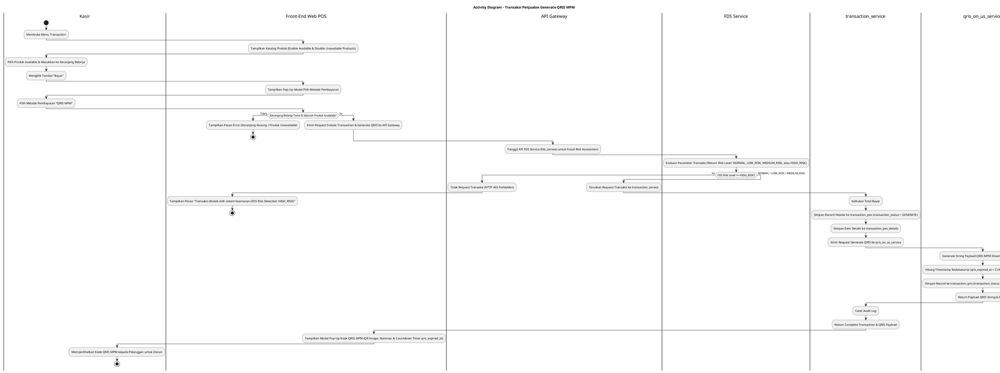
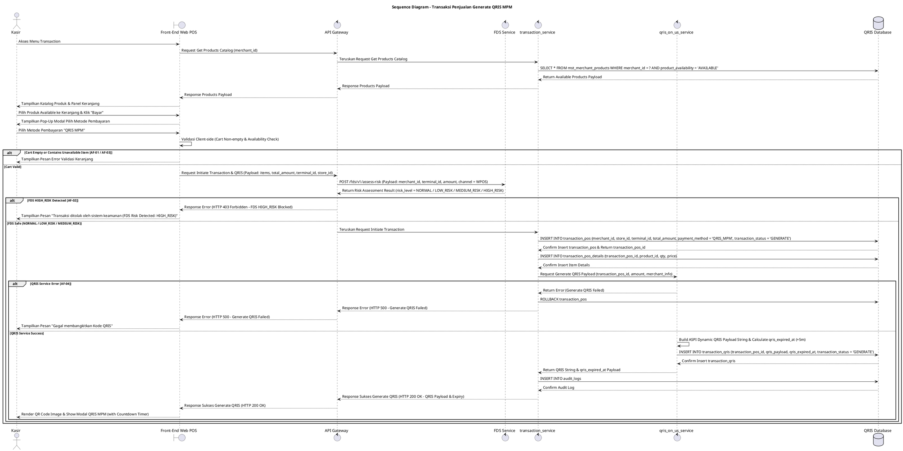

# 1 Deskripsi Use Case

**Tabel 1: Deskripsi Use Case Transaksi Penjualan Generate QRIS MPM**

| Elemen Spesifikasi | Deskripsi Detail |
| --- | --- |
| ID Use Case | UC-WPOS-009 |
| Nama Use Case | Transaksi Penjualan Generate QRIS MPM |
| Penjelasan Singkat | Fitur Aplikasi Web POS yang memfasilitasi Kasir untuk mengeksekusi transaksi penjualan dengan memilih produk berstatus tersedia (`product_availability = 'AVAILABLE'`) ke keranjang belanja, memilih metode pembayaran QRIS MPM (*Merchant Presented Mode*), melakukan verifikasi awal potensi kecurangan (*fraud check*) oleh API Gateway ke FDS Service (`fds_service`) berdasarkan 4 tingkat risiko baku (`NORMAL`, `LOW_RISK`, `MEDIUM_RISK`, `HIGH_RISK`), menyimpan record awal pada tabel `transaction_pos` dan `transaction_qris` dengan status awal `transaction_status = 'GENERATE'`, menetapkan batas waktu kedaluwarsa QRIS (`qris_expired_at`), serta memicu penjanaan string/image QRIS melalui Transaction Service (`transaction_service`) dan QRIS On-Us Service (`qris_on_us_service`). |
| Aktor Utama | Kasir |
| Aktor Pendukung | API Gateway, FDS Service (`fds_service`), Transaction Service (`transaction_service`), QRIS On-Us Service (`qris_on_us_service`) |
| Deskripsi Singkat | Kasir melakukan otentikasi login ke Aplikasi Web POS dan mengakses menu **Transaction** (POS Main Screen). Sistem menampilkan katalog produk terdaftar dari `mst_merchant_products`. Kasir memilih satu atau beberapa produk berstatus tersedia (`product_availability = 'AVAILABLE'`), menentukan jumlah kuantitas beli, dan memasukkannya ke keranjang belanja (*shopping cart*). Produk yang berstatus tidak tersedia (`product_availability = 'UNAVAILABLE'`) secara otomatis dinonaktifkan dari pilihan. Kasir mengklik tombol **"Bayar"**. Sistem menampilkan pop-up modal pilihan metode pembayaran. Kasir memilih metode pembayaran **QRIS MPM** (*Merchant Presented Mode*). Front-End memvalidasi isi keranjang dan mengirimkan request inisiasi transaksi ke **API Gateway**. API Gateway terlebih dahulu mengeksekusi pemeriksaan keamanan dan penilaian risiko transaksi (*fraud risk assessment*) dengan memanggil API **FDS Service** (`fds_service`). FDS Service mengevaluasi parameter transaksi dan mengembalikan salah satu dari 4 klasifikasi *risk level* baku: **`NORMAL`**, **`LOW_RISK`**, **`MEDIUM_RISK`**, atau **`HIGH_RISK`**. Apabila transaksi terdeteksi berisiko tinggi (**`HIGH_RISK`**), API Gateway langsung menolak transaksi dan mengembalikan error `FDS Risk Detected`. Apabila transaksi terverifikasi aman (**`NORMAL`**, **`LOW_RISK`**, atau **`MEDIUM_RISK`**), API Gateway meneruskan request transaksi ke **`transaction_service`**. `transaction_service` memvalidasi status ketersediaan produk, menghitung total bayar, mencatat record transaksi POS ke tabel **`transaction_pos`** dengan status awal **`transaction_status = 'GENERATE'`**, serta menyisipkan rincian item barang ke `transaction_pos_details`. Selanjutnya, `transaction_service` berintegrasi dengan **`qris_on_us_service`** untuk memproses pembentukan string kode QRIS dinamis (*dynamic QRIS payload*) dan menentukan timestamp kedaluwarsa QRIS (**`qris_expired_at`** = `CURRENT_TIMESTAMP + 5 Menit`). Record data QRIS disimpan ke tabel **`transaction_qris`** dengan status awal **`transaction_status = 'GENERATE'`**. Front-End Web POS menampilkan modal pop-up Kode QRIS MPM (QR Code image & string payload) beserta hitung mundur (*countdown timer*) waktu kedaluwarsa QRIS kepada pelanggan untuk discan. |
| Pre-condition | 1. Perangkat Web POS telah ter-binding secara sah (`terminal_status = 'ACTIVE'`). 2. Kasir telah berhasil login ke Aplikasi Web POS. 3. Katalog produk terdaftar aktif pada `mst_merchant_products` dengan status ketersediaan `product_availability = 'AVAILABLE'`. |
| Post-condition | 1. API Gateway sukses memverifikasi parameter transaksi pada FDS Service dengan hasil *risk level* aman (`NORMAL`, `LOW_RISK`, atau `MEDIUM_RISK`). 2. Record transaksi POS baru tersimpan pada tabel `transaction_pos` dan `transaction_pos_details` dengan `transaction_status = 'GENERATE'`. 3. Record QRIS baru tersimpan pada tabel `transaction_qris` dengan `transaction_status = 'GENERATE'` dan `qris_expired_at` terisi (5 menit). 4. Gambar/string Kode QRIS MPM ditampilkan pada layar Web POS siap discan pelanggan. |
| Trigger | Kasir memilih produk tersedia ke keranjang pada menu Transaction, mengklik **"Bayar"**, dan memilih metode pembayaran **QRIS MPM**. |
| Nama Tabel | transaction_pos, transaction_pos_details, transaction_qris, mst_merchant_products, audit_logs |
| Integrasi | 1. **Web POS Front-End App:** Antarmuka aplikasi kasir POS, katalog produk, keranjang belanja, pop-up metode pembayaran, dan modal display Kode QRIS MPM. 2. **API Gateway:** Gateway infrastruktur yang memvalidasi otorisasi dan menangani pemanggilan awal FDS Fraud Check. 3. **FDS Service (`fds_service`):** Service backend Fraud Detection System penguji skor risiko transaksi, blacklist/whitelist, dan limit transaksi mengacu pada 4 status risk level baku (`NORMAL`, `LOW_RISK`, `MEDIUM_RISK`, `HIGH_RISK`). 4. **Transaction Service (`transaction_service`):** Microservice backend pengelola pembuatan transaksi POS, kalkulasi harga, dan pengikatan header transaksi. 5. **QRIS On-Us Service (`qris_on_us_service`):** Service core QRIS pengolah spesifikasi ASPI QRIS MPM, pembentukan payload string QRIS, dan penetapan timestamp `qris_expired_at`. |
| Asumsi | 1. Sistem TIDAK MENGELOLA jumlah angka kuantitas stok barang (*No Inventory Management*). Status produk hanya dibedakan berdasarkan penanda ketersediaan **`AVAILABLE`** (Tersedia) dan **`UNAVAILABLE`** (Tidak Tersedia). 2. Pengecekan FDS oleh API Gateway berlangsung secara *real-time* sebelum pembuatan transaksi di database untuk mencegah beban eksekusi transaksi terindikasi fraud. 3. Status FDS *Risk Level* baku yang digunakan diklasifikasikan ke dalam 4 nilai: `NORMAL`, `LOW_RISK`, `MEDIUM_RISK`, dan `HIGH_RISK`. 4. Kode QRIS MPM bersifat dinamis (*Dynamic QRIS*) yang terikat spesifik pada ID Transaksi dan nominal pembayaran tersebut. 5. Batas waktu kedaluwarsa Kode QRIS MPM diset secara standar selama 5 (lima) menit demi keamanan transaksi. |
| Keterbatasan | 1. Produk yang berstatus **`UNAVAILABLE`** DILARANG dan TIDAK DAPAT dimasukkan ke dalam keranjang belanja. 2. Transaksi yang terdeteksi berisiko tinggi (**`HIGH_RISK`**) oleh FDS Service akan langsung ditolak oleh API Gateway tanpa membuat record transaksi. 3. Pemilihan produk ke keranjang belanja wajib minimal 1 (satu) item barang dengan qty > 0. |
| Aturan Bisnis/Sistem | 1. **Product Availability Standard (No Inventory Quantity Management):** Sistem POS TIDAK MELAKUKAN manajemen/pemotongan jumlah kuantitas stok barang. Transaksi HANYA mengevaluasi status ketersediaan produk pada `mst_merchant_products` (`product_availability = 'AVAILABLE'`). Produk yang berstatus `UNAVAILABLE` DILARANG ditransaksikan. 2. **API Gateway Pre-FDS Verification Standard:** Sebelum meneruskan request transaksi ke backend service, API Gateway WAJIB memanggil endpoint API **FDS Service** (`fds_service`) untuk memverifikasi parameter transaksi (Merchant ID, POS ID, Nominal Limit, & Risk Score). Request HANYA diteruskan ke `transaction_service` jika *risk level* FDS bernilai **`NORMAL`**, **`LOW_RISK`**, atau **`MEDIUM_RISK`**. 3. **FDS High-Risk Rejection Standard:** Apabila FDS Service mengembalikan *risk level* berisiko tinggi (**`HIGH_RISK`**), API Gateway WAJIB membatalkan transaksi secara instan dan mengembalikan HTTP Status 403 Forbidden (*Transaction Blocked by FDS - HIGH_RISK*). 4. **Initial Status Standard:** Pembuatan transaksi penjualan QRIS MPM WAJIB menginisialisasi kolom status transaksi pada tabel **`transaction_pos`** DAN **`transaction_qris`** sebagai **`transaction_status = 'GENERATE'`**. 5. **QRIS Expiry Timestamp Standard:** Pembentukan record pada tabel `transaction_qris` WAJIB mengisikan kolom **`qris_expired_at`** dengan timestamp waktu kedaluwarsa baku (5 menit dari waktu penjanaan / `CURRENT_TIMESTAMP + 5 Minutes`). 6. **Service Responsibility Standard:** &nbsp;&nbsp;- **`API Gateway` & `fds_service`**: Bertanggung jawab melakukan penapisan risiko keamanan fraud awal. &nbsp;&nbsp;- **`transaction_service`**: Bertanggung jawab mengelola header transaksi POS (`transaction_pos`) dan item detail (`transaction_pos_details`). &nbsp;&nbsp;- **`qris_on_us_service`**: Bertanggung jawab membangkitkan payload string QRIS standar ASPI/BI dan menginsert record ke `transaction_qris`. 7. **Audit Trail Standard:** Setiap penjanaan transaksi QRIS MPM mencatat `transaction_pos_id`, `qris_id`, `merchant_id`, `store_id`, `terminal_id`, `user_id` (Kasir), nominal, FDS Risk Level (`NORMAL`/`LOW_RISK`/`MEDIUM_RISK`/`HIGH_RISK`), dan timestamp pada `audit_logs`. 10. **Web POS Request Signature Verification Standard:** Selain permintaan Aktivasi (UC-WPOS-001), seluruh permintaan API yang dikirimkan oleh peramban Web POS WAJIB ditandatangani secara digital (*digital signature* - header X-Signature) menggunakan Private Key yang tersimpan pada *Local Device Storage* peramban (*IndexedDB / Hardware TPM*). API Gateway WAJIB memverifikasi signature tersebut menggunakan web_pos_public_key yang tersimpan pada tabel mst_merchant_terminals (atau Redis Cache). Apabila signature tidak valid, kedaluwarsa, atau missing, API Gateway WAJIB menolak request secara langsung (HTTP Status 401 INVALID_DEVICE_SIGNATURE).  |

# 2 Main Flow

**Tabel 2: Main Flow Transaksi Penjualan Generate QRIS MPM**

| No. | Aktivitas | Deskripsi |
| ---: | --- | --- |
| 1 | Membuka Menu Transaction | Kasir melakukan login dan mengklik menu **Transaction** pada navigasi Web POS. |
| 2 | Menampilkan Katalog Produk | Sistem menampilkan halaman katalog produk dari `mst_merchant_products` (Produk `AVAILABLE` aktif, Produk `UNAVAILABLE` ter-disable). |
| 3 | Memilih Produk & Keranjang | Kasir memilih satu atau beberapa produk berstatus `AVAILABLE`, menentukan kuantitas beli, dan memasukkannya ke keranjang belanja. |
| 4 | Mengklik Tombol Bayar | Kasir mengklik tombol **"Bayar"** pada panel keranjang belanja. |
| 5 | Menampilkan Pop-Up Metode Pembayaran | Sistem menampilkan pop-up modal pilihan metode pembayaran (Tunai, QRIS MPM, dll.). |
| 6 | Memilih Metode QRIS MPM | Kasir mengklik pilihan metode **QRIS MPM**. |
| 7 | Memvalidasi Keranjang Client-side | Front-End memvalidasi isi keranjang (minimal 1 item) dan mengirimkan request inisiasi transaksi ke API Gateway. |
| 8 | Executing FDS Check via API Gateway | API Gateway memanggil FDS Service (`fds_service`) untuk menguji parameter transaksi. FDS Service mengembalikan *risk level* (`NORMAL`, `LOW_RISK`, `MEDIUM_RISK`). Karena tidak `HIGH_RISK`, API Gateway meneruskan request ke `transaction_service`. |
| 9 | Save Header POS (`GENERATE`) | `transaction_service` menghitung total nominal, menyisipkan record ke tabel **`transaction_pos`** dengan **`transaction_status = 'GENERATE'`**, dan menyimpan rincian ke `transaction_pos_details`. |
| 10 | Inisiasi QRIS & Set Expiry Timestamp | `transaction_service` memicu `qris_on_us_service` untuk membangkitkan string QRIS MPM, menetapkan timestamp **`qris_expired_at`** (5 menit), dan menyimpan record ke tabel **`transaction_qris`** dengan **`transaction_status = 'GENERATE'`**. |
| 11 | Menampilkan Kode QRIS MPM | Front-End menyajikan modal pop-up Kode QRIS MPM (QR image & payload string) beserta hitung mundur (*countdown timer*) waktu kedaluwarsa. |
| 12 | Use Case Selesai | Proses penjanaan Kode QRIS MPM selesai dilaksanakan dan sistem menunggu pembayaran dari pelanggan. |

# 3 Alternative Flow

**Tabel 3: Alternative Flow Transaksi Penjualan Generate QRIS MPM**

| Kode | Alternative Flow | Deskripsi |
| --- | --- | --- |
| AF-01 | Keranjang Belanja Kosong | Pada langkah 4 atau 7, apabila keranjang belanja kosong, Front-End menolak request dan menampilkan `Keranjang belanja masih kosong`. |
| AF-02 | FDS Flagging HIGH_RISK | Pada langkah 8, apabila FDS Service mendeteksi transaksi berisiko tinggi (*risk_level = 'HIGH_RISK'*), API Gateway menolak transaksi dan Front-End menampilkan `Transaksi ditolak oleh sistem keamanan (FDS Risk Detected: HIGH_RISK)`. |
| AF-03 | Produk Berstatus Unavailable | Pada langkah 3 atau 9, apabila salah satu produk berstatus `product_availability = 'UNAVAILABLE'`, Sistem menolak transaksi dan Front-End menampilkan `Produk [Nama Produk] sedang tidak tersedia (UNAVAILABLE)`. |
| AF-04 | QRIS On-Us Service Error / Timeout | Pada langkah 10, apabila `qris_on_us_service` mengalami kendala penjanaan QRIS, `transaction_service` me-rollback transaksi `transaction_pos` dan Front-End menampilkan `Gagal membangkitkan Kode QRIS. Silakan coba kembali`. |
| AF-05 | Gagal Terhubung ke Database Server | Pada langkah 9 atau 10, apabila koneksi database terputus total, Sistem mengembalikan HTTP status 500 dan Front-End menampilkan `Terjadi kendala internal pada server`. |

# 4 Status Front-End

**Tabel 4: Status Front-End Transaksi Penjualan Generate QRIS MPM**

| No. | Nama Status | Deskripsi Tampilan Front-End |
| ---: | --- | --- |
| 1 | CART_IDLE | Halaman Transaction menyajikan katalog produk (Produk `AVAILABLE` aktif & `UNAVAILABLE` disabled) dan panel keranjang belanja terisi. |
| 2 | PAYMENT_METHOD_MODAL | Pop-up modal pilihan metode pembayaran disajikan di layar. |
| 3 | FDS_VERIFYING | Indikator memuat (*spinner*) ditampilkan saat API Gateway sedang mengeksekusi pemeriksaan FDS Fraud Check. |
| 4 | GENERATING_QRIS | Indikator memuat (*spinner*) ditampilkan saat `transaction_service` & `qris_on_us_service` sedang memproses transaksi dan QRIS. |
| 5 | DISPLAY_QRIS_MODAL | Pop-up modal menampilkan Kode QRIS MPM (QR Code image), total nominal, dan *countdown timer* `qris_expired_at`. |
| 6 | ERROR | Pesan kesalahan ditampilkan pada UI akibat keranjang kosong, FDS HIGH_RISK rejection, produk `UNAVAILABLE`, kendala `qris_on_us_service`, atau eror server. |

# 5 Activity Diagram Transaksi Penjualan Generate QRIS MPM

# 6 Sequence Diagram Transaksi Penjualan Generate QRIS MPM

# 7 Response Code

**Tabel 5: Response Code Transaksi Penjualan Generate QRIS MPM**

| No. | HTTP Status | Response Code | Nama Response | Deskripsi | Respons Front-End |
| ---: | ---: | --- | --- | --- | --- |
| 1 | 200 | 200XX00 | SUCCESS_GENERATE_QRIS_TRANSACTION | Inisiasi transaksi POS dan Kode QRIS MPM berhasil (`transaction_status = 'GENERATE'`) setelah lulus pengecekan FDS (`NORMAL`, `LOW_RISK`, `MEDIUM_RISK`) dan `qris_expired_at` terisi. | Menampilkan pop-up modal Kode QRIS MPM beserta countdown timer kedaluwarsa. |
| 2 | 400 | 400XX00 | EMPTY_CART_INPUT | Keranjang belanja kosong saat mengajukan pembayaran. | Menampilkan pesan kesalahan `Keranjang belanja masih kosong`. |
| 3 | 400 | 400XX01 | PRODUCT_UNAVAILABLE | Salah satu produk di keranjang berstatus tidak tersedia (`product_availability = 'UNAVAILABLE'`). | Menampilkan pesan kesalahan `Produk sedang tidak tersedia (UNAVAILABLE)`. |
| 4 | 403 | 403XX00 | FDS_HIGH_RISK_DETECTED | Transaksi ditolak oleh FDS Service karena terindikasi berisiko tinggi (`HIGH_RISK`). | Menampilkan pesan kesalahan `Transaksi ditolak oleh sistem keamanan (FDS Risk Detected: HIGH_RISK)`. |
| 5 | 500 | 500XX00 | QRIS_GENERATION_FAILED | Terjadi kendala teknis pada `qris_on_us_service` saat membangkitkan payload QRIS. | Menampilkan pesan kesalahan `Gagal membangkitkan Kode QRIS`. |
| 6 | 500 | 500XX01 | SYSTEM_INTERNAL_ERROR | Terjadi kegagalan internal server saat mengeksekusi inisiasi transaksi. | Menampilkan pesan kesalahan `Terjadi kendala internal pada server`. |

| 99 | 401 | 401XX01 | INVALID_DEVICE_SIGNATURE | Signature digital request Web POS (header X-Signature) tidak valid atau tidak cocok dengan web_pos_public_key pada mst_merchant_terminals. | Menampilkan pesan kesalahan Signature digital perangkat Web POS tidak valid atau tidak terverifikasi. |

# 8 Desain Antarmuka

**Tabel 6: Desain Antarmuka Transaksi Penjualan Generate QRIS MPM**

| Halaman | Komponen dan State Utama |
| --- | --- |
| Layar Utama Transaksi Web POS | 1. **Katalog Produk:** Grid item barang dengan gambar S3, Nama, SKU, Badge Ketersediaan (`AVAILABLE`/`UNAVAILABLE`), dan Tombol Tambah. 2. **Panel Keranjang Belanja:** Rincian item terpilih, Pengatur Qty Beli, Subtotal, dan Tombol **"Bayar"** (Primary Button). |
| Pop-Up Pilih Metode Pembayaran | 1. **Header:** Rincian Total Tagihan Pembayaran. 2. **Pilihan Metode:** Opsi **QRIS MPM** (Active Selection), Tunai, Debit, dll. 3. **Tombol Aksi:** Tombol **"Lanjutkan Pembayaran"** (Primary) dan **"Batal"** (Secondary). |
| Modal Pop-Up Kode QRIS MPM | 1. **Display QR Code:** Gambar QR Code MPM hasil generasi `qris_on_us_service`. 2. **Informasi Tagihan:** Rincian Nominal Total & ID Transaksi. 3. **Countdown Timer (`qris_expired_at`):** Indikator waktu mundur kedaluwarsa QRIS (5 Menit). 4. **Tombol Aksi:** Tombol **"Cetak QRIS"** (Secondary) dan **"Batal / Tutup"** (Secondary). |
